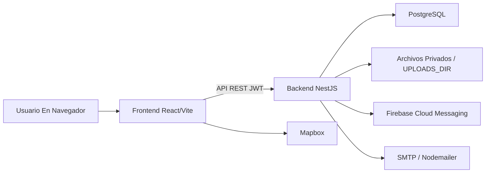

# Contexto Técnico Del Proyecto Escuela Pass

**Proyecto:** Escuela Pass — Administración y Seguridad Escolar  
**Autor:** Jhon Kevin Murillo Martínez  
**Tipo de documento:** Base interna de comprensión técnica para TDG y anexos  
**Versión:** 1.0  
**Estado:** Documento de trabajo para trazabilidad y redacción académica

## 1. Propósito

Este documento sintetiza el conocimiento técnico del repositorio Escuela Pass antes de redactar
entregables, anexos o capítulos del trabajo de grado. Su función es mantener una base común de
arquitectura, módulos, flujos, decisiones técnicas y evidencias verificables, de manera que la
documentación académica no dependa de suposiciones ni de descripciones genéricas.

## 2. Arquitectura General

Escuela Pass está estructurado como una aplicación web cliente-servidor. El backend está en la raíz
del proyecto y utiliza NestJS, TypeORM y PostgreSQL. El frontend está en `frontend/` y utiliza React,
Vite, TypeScript y Tailwind. La comunicación principal se realiza mediante una API REST protegida
con JWT, roles y reglas de alcance institucional.

## 3. Backend

El módulo raíz `src/app.module.ts` registra los bounded contexts de la API. La configuración global
incluye `ConfigModule`, TypeORM, `ScheduleModule`, rate limiting con `ThrottlerGuard`, validación
de entorno y módulos por dominio.

### 3.1 Contextos Principales

| Contexto | Módulos / rutas fuente | Responsabilidad documental |
| --- | --- | --- |
| Autenticación y seguridad | `auth`, `jwt.strategy`, guards, roles | Login, refresh, logout, estado de usuario, control por rol y protección de rutas. |
| Accesos | `access` | Escaneo QR/NFC, credenciales, registro de entrada/salida y sincronización con asistencia. |
| Circuito de recogida | `circuit`, `vehicles`, `departure-consent` | Solicitudes de recogida, GPS, estados, autorización de salida y confirmación de entrega. |
| Gestión escolar | `school`, `schools`, `settings` | Escuelas, usuarios, grupos, estudiantes, docentes, padres, asignaciones e institución. |
| Académico | `attendance`, `class-attendance`, `class-sessions`, `academic-periods`, `activities`, `report-cards`, `documents` | Asistencia general y por clase, actividades, notas, periodos, boletines y PDF. |
| Finanzas | `payments`, `uploads`, `files` | Conceptos, deudas, comprobantes, verificación, rechazos y acceso privado a archivos. |
| Comunicación | `notices`, `notifications`, `fcm`, `mail`, `meetings`, `external-visits`, `attention-notes` | Avisos, bandeja, push web, correo, reuniones, visitas y anotaciones. |
| Reportes y operación | `reports`, `exports`, `dashboard`, `dashboards`, schedulers | Indicadores, Excel, paneles, cierres automáticos y tareas programadas. |
| Cumplimiento | `privacy`, `audit`, `files` | Aceptación de políticas, auditoría, retención y archivos privados. |

### 3.2 Seguridad Transversal

La seguridad se apoya en varias capas:

- `ValidationPipe` global con `whitelist`, `forbidNonWhitelisted` y `transform`.
- `helmet` y CORS configurado por entorno.
- JWT con `JwtAuthGuard`, roles y `schoolId` para aislamiento multiinstitución.
- `RolesGuard` para controlar acceso por rol.
- Validación de `user.status` en `JwtStrategy`, lo que invalida cuentas inactivas aunque el token
  aún no haya expirado.
- Hash de contraseñas con bcrypt.
- Rate limiting global y throttling específico en endpoints sensibles de autenticación.
- Acceso a archivos privados por endpoint autenticado `/files/:bucket/:filename`.

## 4. Frontend

El frontend organiza navegación por rutas protegidas y roles. `frontend/src/App.tsx` define rutas
públicas de inicio, login y recuperación de contraseña, además de rutas autenticadas bajo `/app`.
`frontend/src/navigation/navConfig.ts` define el menú lateral por rol.

### 4.1 Pantallas Relevantes Para Manual Y UI/UX

| Área | Pantallas / componentes |
| --- | --- |
| Autenticación | `LoginPage`, `ForgotPasswordPage`, `ResetPasswordPage`, `ProtectedRoute`, `AuthProvider`. |
| Inicio y navegación | `AppHomePage`, `HomePage`, `AppShell`, `NotificationsBadge`, `PrivacyGate`. |
| Perfil | `PerfilPage`, QR del usuario, datos personales y acciones de cuenta. |
| Circuito | `CircuitPadrePage`, `CircuitTodayPage`, `CircuitDetailPage`, `ParentTrackingMap`, `CircuitArrivalMap`. |
| Acceso | `EscanerAccesoPage`, `QrScanResultModal`. |
| Académico | `CalificacionesDocentePage`, `MisCalificacionesPage`, `BoletinesPage`, `PeriodosAcademicosPage`, `ScheduleHubPage`. |
| Gestión escolar | `SchoolRosterPage`, `SchoolsAdminPage`, `ImportExportPage`, `InstitutionPage`. |
| Comunicación | `ReunionesPage`, `VisitasPage`, `AnotacionesDocentePage`. |
| Finanzas | `FinanzasPage`, `FinanzasStaffTools`. |

## 5. Base De Datos

La persistencia se modela con entidades TypeORM, migraciones y SQL de referencia. Existen entidades
para usuarios, roles, escuelas, grupos, estudiantes, padres, docentes, asistencias, sesiones de clase,
periodos académicos, actividades, notas, boletines, pagos, circuito, vehículos, visitas, reuniones,
notificaciones, privacidad, auditoría y archivos vinculados.

El repositorio documenta dos rutas de preparación:

- Esquema de referencia v4 para entornos greenfield.
- Cadena de migraciones TypeORM para ambientes controlados y despliegue.

## 6. Flujos Críticos

### 6.1 Autenticación Y Acceso Por Rol

1. El usuario ingresa credenciales en el frontend.
2. El backend valida contraseña, estado de cuenta y rol.
3. Se emiten `accessToken` y `refreshToken`.
4. Las rutas protegidas usan JWT y gates de rol en backend y frontend.
5. La privacidad se atiende mediante `PrivacyGate` y módulo `privacy`.

### 6.2 Control De Acceso QR/NFC

1. Un operador autorizado escanea QR/NFC.
2. `access` valida credencial activa, usuario y escuela del operador.
3. Se previenen duplicados recientes.
4. Se registra evento de acceso y, para alumnos, se puede sincronizar asistencia.

### 6.3 Circuito De Recogida

1. El padre o tutor crea la solicitud para un estudiante autorizado.
2. Se valida que el estudiante esté activo, que el circuito esté habilitado y que no exista una
   solicitud abierta para el mismo día.
3. El padre puede enviar GPS y avanzar el estado permitido.
4. Docentes o administración gestionan el avance operativo.
5. La entrega se confirma cuando el menor está en el estado operativo correspondiente.

RF3 debe documentarse como circuito conducido por padres/tutores, no como flota o conductor
institucional independiente.

### 6.4 Académico

El flujo académico integra asistencia general, asistencia por clase, periodos académicos, actividades,
calificaciones, boletines y documentos PDF. Las reglas de periodo cerrado impiden modificaciones
ordinarias, salvo operaciones autorizadas con `force` y auditoría donde aplica.

### 6.5 Pagos Y Archivos Privados

Administración crea conceptos y deudas; el padre sube comprobante; administración verifica o rechaza.
Los comprobantes se protegen con `/files/comprobantes/:filename`, validando relación padre-estudiante,
escuela o rol administrativo. Las evidencias y reportes usan buckets privados con validación de ruta,
extensión y permisos.

## 7. Pruebas Y Evidencia

Las pruebas E2E principales están en `test/app.e2e-spec.ts` y `test/phase7-closure.e2e-spec.ts`.
Validan autenticación, refresh/logout, asistencia, calendario, acceso QR, circuito, pagos, dashboards,
privacidad, archivos privados, lifecycle, boletines y flujos extendidos de Fase 7. El test de throttle
IP está separado en `test/auth-throttle-ip.e2e-spec.ts` y requiere configuración estricta.

## 8. Decisiones Técnicas Documentables

- Railway y Vercel/hosting estático sustituyen la expectativa inicial de cPanel por facilidad de
  despliegue, variables de entorno y PostgreSQL administrado.
- Mapbox se usa para mapas del circuito; Haversine actúa como fallback de distancia.
- `html5-qrcode` y `qrcode.react` reemplazan menciones genéricas a bibliotecas QR.
- El sistema se extendió más allá de la propuesta con privacidad, auditoría, archivos privados,
  boletines, visitas, reuniones, lifecycle, dashboards y pruebas E2E ampliadas.

## 9. Uso En Documentación

Este documento alimenta los anexos técnicos, la matriz de trazabilidad, el manual técnico, la
documentación API, el manual de usuario, el informe de pruebas y los capítulos de desarrollo del TDG.
Cada afirmación técnica debe mantenerse vinculada a rutas reales del repositorio y no convertirse en
una descripción inventada o meramente aspiracional.
