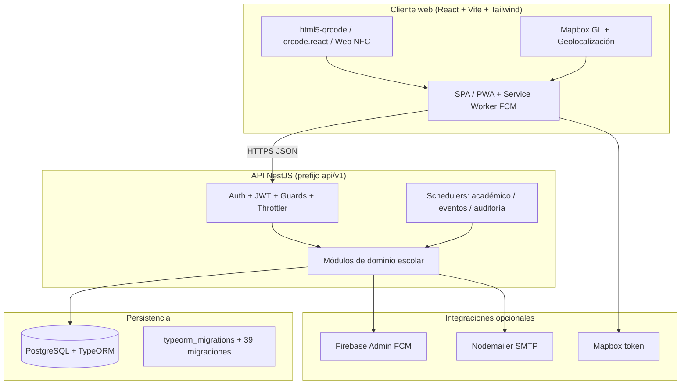
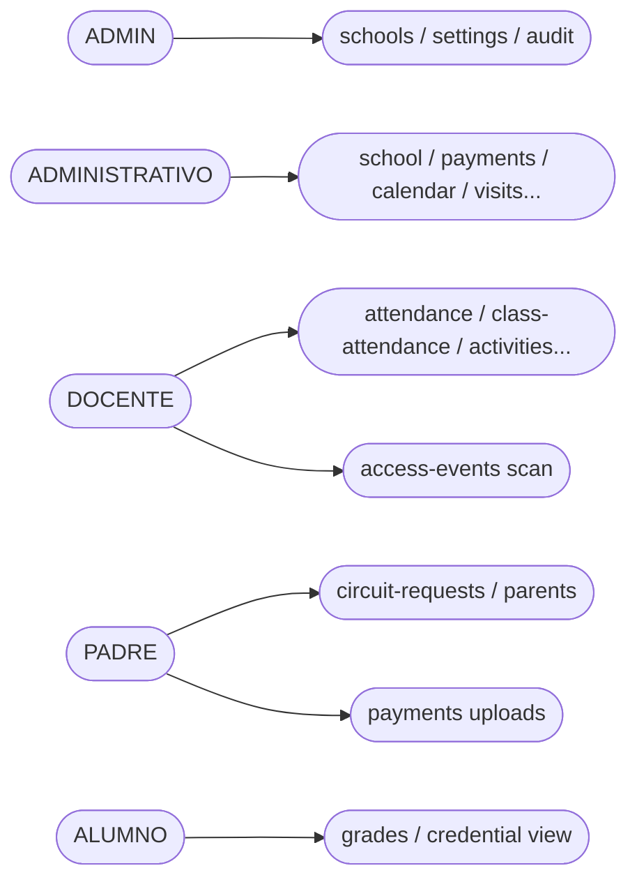
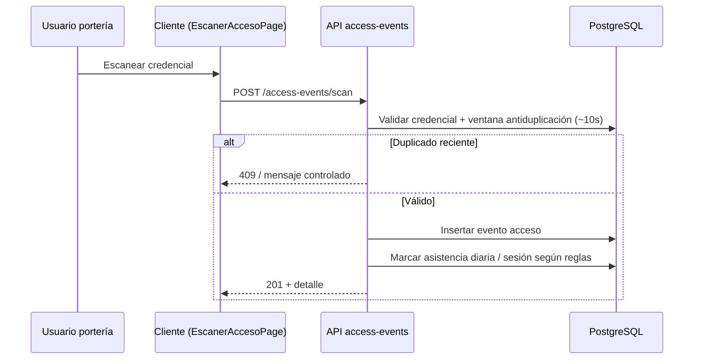
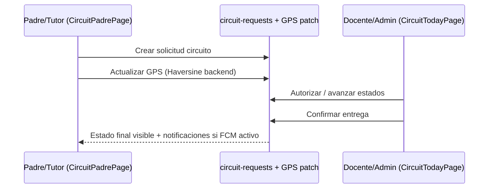

# Desarrollo de aplicación web de AlfaNetworks con NestJS, PostgreSQL, tecnologías NFC y QR para la administración y seguridad escolar: Escuela Pass

## TRABAJO DE GRADO

**Autor:** MURILLO MARTÍNEZ JHON KEVIN

**Área de Trabajos de Grado – Programas Informáticos**
**Facultad de Ingenierías**

**Modalidad:** Ingeniería Informática — trabajo presentado como requisito para optar al título de **INGENIERO INFORMÁTICO**

**Asesor:** Alirio Antonio Gutiérrez Quintero

**Empresa vinculada al caso de estudio:** AlfaNetworks

**Institución:** Politécnico Colombiano Jaime Isaza Cadavid
**Sede:** Apartadó
**Fecha:** mayo de 2026

> **Versión documental:** TDG‑2 maestro consolidado — mayo de 2026. Los **anexos 00–10** concentran inventarios y evidencias técnicas de soporte.

---

**[Figura 1. Portada del trabajo de grado según instructivo del Área APIT y plantilla institucional.]**

**[Figura 2. Contraportada del trabajo de grado según instructivo del Área APIT y plantilla institucional.]**

---

## DEDICATORIA Y AGRADECIMIENTOS

*Apartados opcionales conforme al instructivo del programa. En la versión impresa institucional se incorpora el texto de dedicatoria y agradecimientos según la normativa del Área APIT.*

---

## RESUMEN

Las instituciones educativas privadas en México articulan seguridad física, tratamiento de datos sensibles —particularmente de niñas, niños y adolescentes— y administración escolar ante la digitalización y el cumplimiento normativo, en un panorama donde informes sobre el sistema escolar, agendas de transparencia en gestión educativa y estudios sobre madurez digital en redes institucionales convergen en describir presiones concurrentes sobre infraestructura, datos y rendición de cuentas (UNESCO, 2024; CONEVAL, 2024; MEN, 2024; MetaRed, 2024). La fragmentación entre herramientas dispersas dificulta auditoría, coordinación con familias y gobernanza de datos personales alineada con la **Ley Federal de Protección de Datos Personales en Posesión de los Particulares** (LFPDPPP) y los lineamientos del **Instituto Nacional de Transparencia, Acceso a la Información y Protección de Datos Personales** (INAI) (Cámara de Diputados, 2010; INAI, s. f.).

Este trabajo de grado desarrolla **Escuela Pass**, aplicación web de **AlfaNetworks** con servicio **NestJS** (NestJS Team, s. f.) y **PostgreSQL** (PostgreSQL Global Development Group, s. f.) vía **TypeORM** (TypeORM, s. f.), y cliente **React 18** (React Team, s. f.) con **Vite 6** (Vite Team, s. f.) y **Tailwind CSS**. El producto entregado —verificable en el repositorio— concentra **37 módulos** en la raíz del servicio, **32 controladores** HTTP, **241 operaciones** REST versionadas bajo `api/v1` (**Anexo 08**), **49 entidades** TypeORM (más la tabla de control de migraciones), **39 migraciones** versionadas, **47 casos** de prueba **E2E** repartidos en **tres especificaciones Jest** (desglose en **Anexo 10**), y **cinco roles** (`ADMIN`, `ADMINISTRATIVO`, `DOCENTE`, `PADRE`, `ALUMNO`). El control de acceso combina **QR** (*html5-qrcode*, *qrcode.react*) y **Web NFC API** donde el navegador lo permite; el circuito de recogida incluye **Mapbox GL** y **geolocalización del navegador**, con **cálculo Haversine en el servidor** para actualizaciones de posición del circuito cuando el dominio lo requiere. Las integraciones **FCM**, **SMTP** y **Mapbox** degradan con elegancia si faltan credenciales.

El objetivo general de la **Ficha de Trabajo de Grado** (FTG) se atiende en su integridad. Metodológicamente se aplicó **Scrum** semanal (Schwaber & Sutherland, 2020; Drumond, 2026); las **siete fases** enunciadas en la propuesta (incluidas despliegue y evaluación) se mapean explícitamente a los **cinco objetivos específicos** en el capítulo 2, de modo que no exista ambigüedad de “ciclo acortado”. Las **cifras de impacto** que la propuesta planteó en justificación económica y operativa (p. ej. reducción porcentual de tiempos, horas-hombre, papelería o errores, y horizonte de **ROI**) se **recuperan como hipótesis** en el capítulo 1 y se enlazan con el **plan de medición** del Anexo 10: **no se afirman como resultados medidos** en este TDG. Las condiciones de validación automática incluyen **integración continua** del servicio con base **PostgreSQL 16** como dependencia de entorno (**Anexo 07**).

Quedan explícitas como **limitaciones honestas**: almacenamiento de **JWT** y *refresh* en almacenamiento del navegador, sesgo de pruebas hacia E2E frente a unitarias en dominios sensibles, ausencia de **integración continua de compilación y revisión estática del cliente web** en el flujo actual, y mediciones SUS / desempeño bajo carga real pendientes de piloto institucional (Brooke, 1996). Se concluye que Escuela Pass constituye un entregable **técnicamente demostrable y documentalmente trazable** para administración y seguridad escolar en México, sin sustituir políticas internas ni asesoría jurídica.

**Palabras clave:** seguridad escolar; protección de datos personales; circuito de recogida familiar; códigos QR; comunicación NFC; aplicación web; NestJS; PostgreSQL; React; instituciones educativas privadas; México.

---

## ABSTRACT

Private educational institutions in Mexico are integrating physical security, the handling of sensitive data—particularly that of children and adolescents—and school administration in the face of digitalization and regulatory compliance. This occurs within a landscape where reports on the school system, transparency agendas in educational management, and studies on digital maturity in institutional networks converge to describe concurrent pressures on infrastructure, data, and accountability (UNESCO, 2024; CONEVAL, 2024; MEN, 2024; MetaRed, 2024). The fragmentation among disparate tools hinders auditing, coordination with families, and governance of personal data aligned with the Federal Law on the Protection of Personal Data Held by Private Parties (LFPDPPP) and the guidelines of the National Institute for Transparency, Access to Information and Protection of Personal Data (INAI) (Chamber of Deputies, 2010; INAI, n.d.).

This thesis delivers **Escuela Pass**, a production-grade case study developed with **AlfaNetworks**: a **NestJS** (NestJS Team, n.d.) service on **PostgreSQL** (PostgreSQL Global Development Group, n.d.) using **TypeORM** (TypeORM, n.d.), and a **React 18** single-page application built with **Vite 6** and **Tailwind CSS**. The repository-backed footprint includes **37 NestJS modules**, **32 HTTP controllers**, **241 REST operations** under `api/v1` (**Annex 8**), **49 TypeORM entities** (plus the migration bookkeeping table), **39 migrations**, and **47 automated end-to-end tests** across three Jest specifications—the breakdown appears in **Annex 10**. Five institutional roles drive authorization: `ADMIN`, `ADMINISTRATIVO`, `DOCENTE`, `PADRE`, and `ALUMNO`. Access control combines camera-based QR scanning (**html5-qrcode**), QR rendering (**qrcode.react**), and the **Web NFC API** where supported. The family pick-up flow integrates **Mapbox GL**, browser geolocation, and **Haversine distance checks on the server** for geolocation updates in the circuit domain. Optional integrations—**Firebase Cloud Messaging**, **SMTP** via Nodemailer, and Mapbox—**fail gracefully** when credentials are absent, preserving core school operations.

The general objective approved in the formal thesis statement (FTG) is fully addressed. Methodologically, weekly **Scrum** (Schwaber & Sutherland, 2020) structured delivery; the **seven** lifecycle phases named in the original proposal—including **deployment** and **evaluation**—are explicitly cross-mapped to the **five** approved specific objectives (Chapter 2), clarifying that no methodological “phase removal” occurred. **Quantitative impact claims** embedded in the original justification (e.g., expected percentage reductions in delivery time, administrative hours, paperwork, error rates, and ROI horizons) are **reframed as testable hypotheses** linked to the measurement plan in **Annex 10**; they are **not reported here as measured outcomes**. Continuous integration exercises the backend service against **PostgreSQL 16** as a dependency (**Annex 7**).

Transparent limitations remain: bearer tokens persisted in **browser storage** (a documented trade-off versus httpOnly cookie patterns), predominantly **E2E** verification rather than exhaustive unit coverage in sensitive domains, **no frontend build/lint gate** yet in CI, and **SUS-based usability / load performance characterization** slated for a pilot institution. The conclusion is affirmative but bounded: Escuela Pass is a **demonstrable, audit-friendly** engineering response to integrated school administration and physical security for private schools in Mexico, complementing—not replacing—institutional policy and counsel.

**Keywords:** school safety; personal data protection; family pick-up circuit; QR codes; NFC communication; web application; NestJS; PostgreSQL; React; private educational institutions; Mexico.

---

## TABLA DE CONTENIDO

*La siguiente lista resume la jerarquía del documento (elementos preliminares, Introducción sin numerar de capítulo y ocho capítulos numerados antes de referencias, glosario y anexos).*

Resumen · Abstract · Tabla de contenido · Lista de figuras y tablas

Introducción (*Panel de hechos del producto*, sin numeración de capítulo)
1. Presentación del trabajo — planteamiento (incl. la sección 1.1.6 delimitación México–Colombia), justificación (incl. la sección 1.2.6 hipótesis FTG), objetivos
2. Diseño metodológico — la sección 2.3 mapeo **7 fases FTG ↔ 5 OE**, la sección 2.4 *stack* nominal
3. Marco referencial — la sección 3.1 incluye diagrama **Mermaid** de arquitectura por capas
4. Desarrollo del trabajo de grado — las secciones 4.1 a 4.5 con secuencias **Mermaid** (QR/NFC, circuito)
5. Resultados y discusión — la sección 5.3 estado de hipótesis cuantitativas FTG
6. Conclusiones
7. Recomendaciones y trabajos futuros — CI frontend, artefactos OpenAPI firmados
8. Licencia del proyecto
Referencias (APA 7, incluye Manciu, 2025)
Glosario de acrónimos
Anexos 00–10 (sección final del documento)

---

## LISTA DE FIGURAS Y TABLAS

| Id | Descripción |
| --- | --- |
| Figura 1 | Portada institucional según el instructivo del Área APIT. |
| Figura 2 | Contraportada institucional según el instructivo del Área APIT. |
| Figura 3 | Diagrama orientativo del orden del documento y sus anexos (sección 2.6). |
| Figura 4 | Cronograma Gantt del proyecto (24/02/2026 – 21/06/2026) (sección 2.7). |
| Figura M1 | Diagrama textual **Mermaid** — arquitectura por capas (sección 3.1; complementa Figura 5). |
| Figura 5 | Arquitectura general por capas del sistema Escuela Pass (sección 3.1); ilustración conforme material gráfico institucional y **Anexo 03**. |
| Figura M2 | Diagrama textual **Mermaid** — actores ↔ dominios (sección 4.1). |
| Figura M3 | Diagrama textual **Mermaid** — secuencia escaneo QR/NFC y asistencia (sección 4.3). |
| Figura M4 | Diagrama textual **Mermaid** — secuencia circuito padre/tutor ↔ personal (secciones 4.3 a 4.4). |
| Figura 6 | Modelo entidad–relación resumido por dominios funcionales (sección 3.1). |
| Figura 7 | Diagrama UML de casos de uso por actor institucional (sección 4.1). |
| Figura 8 | Diagrama UML de secuencia del circuito de recogida familiar (sección 4.3). |
| Figura 9 | Diagrama UML de secuencia del escaneo de credencial QR/NFC (sección 4.3). |
| Figura 10 | Licencia del proyecto Escuela Pass conforme instructivo institucional y acuerdo empresa–institución (sección 8). |

| Tabla | Contenido |
| --- | --- |
| Tabla 1 | Problemática: causas y consecuencias (sección 1.1.3, alineada a la FTG) |
| Tabla 2 | Fases metodológicas y resultados esperados (capítulo 2 — diseño metodológico) |
| Tabla 2b | Mapeo explícito — siete fases del discurso FTG ↔ cinco objetivos específicos (sección 2.3) |
| Tabla 3 | Limitaciones de antecedentes (capítulo 3 — marco referencial) |
| Tabla 4 | Inclusiones del alcance (capítulo 3 — marco referencial) |
| Tabla 5 | Exclusiones del alcance (capítulo 3 — marco referencial) |
| Tabla 6 | Actores y responsabilidades macroscópicas (capítulo 4 — desarrollo) |
| Tabla 7 | *Panel de hechos del producto* — métricas del repositorio (subsección *Panel de hechos del producto*) |
| Tabla A | Hipótesis cuantitativas FTG — estado de medición (sección 1.2.6; no son resultados ejecutados) |

---

## INTRODUCCIÓN

Las instituciones educativas gestionan en paralelo formación, convivencia, seguridad en el plantel y relación con familias que demandan información oportuna por canales confiables. La digitalización puede concentrar parte de esa complejidad si se respetan límites legales y pedagógicos: tratamiento de datos personales, especialmente de menores; proporcionalidad de la recolección; y separación entre lo que el software automatiza y lo que permanece como decisión humana de la institución (UNESCO, 2024). En conjunto, el diagnóstico sobre infraestructura y acceso en el sistema educativo (**Consejo Nacional de Evaluación de la Política de Desarrollo Social**, CONEVAL, 2024), los informes sobre transparencia y gestión en política educativa (**Ministerio de Educación Nacional**, MEN, 2024) y el trabajo de redes sobre madurez digital institucional (MetaRed, 2024) refuerzan la misma idea: las escuelas operan bajo presión simultánea por rendición de cuentas, modernización de procesos y coordinación con las familias, con riesgos claros cuando la información queda dispersa o mediatizada por canales opacos.

El **ámbito de aplicación** del producto aquí desarrollado son las **instituciones educativas privadas en México**, donde esa tensión se cruza con el marco de protección de datos personales y con la operación cotidiana de ingreso, permanencia y salida del plantel. Resultó **necesario** abordar el proyecto porque la fragmentación entre hojas de cálculo, mensajería informal y sistemas inconexos dificulta auditar hechos, homogenizar evidencia y responder con diligencia a reclamos, en contraste con lo que una plataforma integrada y trazable puede aportar a administración y seguridad escolar. Desde la formación en Ingeniería Informática, el trabajo aporta además un caso completo de especificación, arquitectura e implementación verificable frente al código; a nivel **social y profesional**, los resultados se orientan a instituciones que requieren un canal único con roles diferenciados, sin sustituir políticas internas ni asesoría jurídica.

**Escuela Pass** se presenta como producto de trabajo de grado desarrollado con **AlfaNetworks**. Integra un servicio web construido con **NestJS** (NestJS Team, s. f.) y **TypeScript** sobre **PostgreSQL** (PostgreSQL Global Development Group, s. f.) —gestionada mediante un **ORM** (Object-Relational Mapper) (Elmasri & Navathe, 2016)—, y un cliente web con **React** (React Team, s. f.), **Vite** (Vite Team, s. f.) y estilos responsivos, en configuración compatible con despliegue sobre infraestructura tipo **PaaS** (Platform as a Service) para el servicio y la base de datos, y alojamiento estático para el cliente. Los dominios —identidad, acceso físico, circuito familiar, nómina, finanzas escolares, comunicación y analítica— se organizan en módulos cohesionados expuestos a través de una interfaz **HTTP** (Hypertext Transfer Protocol) versionada por configuración, siguiendo el estilo arquitectónico **REST** (Representational State Transfer) propuesto por Fielding (2000). Los **beneficios esperados** incluyen reducir fricción operativa en portería y en la relación con familias, centralizar evidencia académica y financiera con revisión humana donde corresponde, y ofrecer un repositorio de conocimiento técnico reutilizable en despliegues posteriores o en nuevas iteraciones del producto.

El cuerpo del documento articula el qué y el porqué académico; los anexos numerados concentran inventarios técnicos (catálogo de operaciones HTTP, modelo relacional, diagramas, manuales y plan de pruebas). Esta división atiende la extensión máxima del texto principal y permite contrastar afirmaciones con evidencia tabular sin transcribir cada operación REST en el capítulo central.

La línea argumental reconoce un **alcance ampliado** respecto del texto mínimo histórico de la propuesta —multiinstitución, visitas, reuniones, anotaciones, privacidad y auditoría—. Esas capacidades complementan los requerimientos funcionales y no funcionales aprobados sin sustituirlos, y se tabulan de forma consistente en los anexos del trabajo.

### Contribución documental y técnica

La contribución combina **(a)** especificación trazable de requerimientos institucionales en línea con la práctica recomendada por la **IEEE Std 830-1998** (IEEE, 1998), **(b)** arquitectura modular acorde a dominios escolares y **(c)** evidencia de validación reproducible mediante compilación, pruebas extremo a extremo (E2E, *end-to-end*) con PostgreSQL e **integración continua** (CI, Continuous Integration) en el repositorio (GitHub, s. f.). Desde ingeniería de software (Pressman & Maxim, 2020), el producto contextualiza patrones habituales —**JWT** (JSON Web Token; IETF, 2015), validación declarativa, ORM, tareas programadas y auditoría— en un dominio donde la población incluye menores y la trazabilidad de actos sensibles forma parte del valor entregado.

### Organización del documento

Tras los elementos preliminares (resumen, *abstract*, tabla de contenido e índices auxiliares), la introducción contextualiza el trabajo; el **capítulo 1** integra planteamiento del problema, justificación por impactos y objetivos; el **capítulo 2** desarrolla el diseño metodológico apoyado en el marco Scrum (Schwaber & Sutherland, 2020); el **capítulo 3** presenta el marco referencial y el alcance; el **capítulo 4** detalla el desarrollo por objetivo específico; el **capítulo 5** consolida resultados y discusión frente a la pregunta de investigación. Cierran las conclusiones (**6**), las recomendaciones y trabajos futuros (**7**), la licencia del proyecto (**8**), las referencias, el glosario de acrónimos y los anexos numerados.

### Panel de hechos del producto (magnitud del entregable)

La siguiente tabla sintetiza el alcance técnico **medido desde el código** al cierre documental del repositorio; permite al lector dimensionar la magnitud del entregable antes de recurrir al detalle tabular de los anexos.

**Tabla 7. Escuela Pass — hechos cuantificables verificables en el repositorio**

| Métrica | Valor | Fuente / método |
| --- | --- | --- |
| Módulos NestJS importados en raíz (`AppModule`) | 37 | Anexo 03 — composición modular del servicio |
| Controladores `@Controller` | 32 | Anexo 08 — inventario derivado del contrato HTTP |
| Operaciones HTTP (métodos expuestos) | 241 | Anexo 08 — catálogo REST (`api/v1`); método de recuento en Anexo 03 |
| Entidades persistidas (`*.entity.ts`) | 49 | Anexo 04 — modelo entidad–relación y listado de entidades |
| Tabla de control de versiones del esquema | `typeorm_migrations` | Anexo 04 — migraciones TypeORM |
| Archivos de migración versionados | 39 | Anexo 04 |
| Casos de prueba E2E ejecutables (Jest) | 47 | Anexo 10 — plan de pruebas y desglose por especificación |
| Roles de aplicación | 5 (`ADMIN`, `ADMINISTRATIVO`, `DOCENTE`, `PADRE`, `ALUMNO`) | Anexo 03 — autorización y gates de rol |
| Vistas React principales del cliente web | 26 (~26 pantallas de rol) | Anexo 06 — cliente y navegación |
| Integraciones opcionales con degradación elegante | 3 categorías — FCM, Mapbox/SMTP asociadas | Anexo 03 y Anexo 07 — servicios y variables |
| CI backend (build + E2E) | PostgreSQL 16 como servicio | Anexo 07 — integración continua y entorno |

---

## 1. PRESENTACIÓN DEL TRABAJO

El presente trabajo de grado se centra en el diseño y desarrollo de **Escuela Pass**, aplicación web integral para la **administración escolar** y la **seguridad física del plantel**, en instituciones educativas privadas de **México**, desarrollada con **AlfaNetworks**, con el objetivo de integrar identidad y acceso (**QR/NFC**), gestión institucional, comunicación con familias y apoyos prácticos al tratamiento de datos personales conforme la normativa aplicable al caso.

### 1.1. Planteamiento del problema

#### 1.1.1. Contexto

En instituciones educativas privadas en México, la expectativa de calidad y transparencia convive con obligaciones en materia de protección de datos personales y con la necesidad de protocolos claros de seguridad física en ingreso, permanencia y salida coordinada con familias. Los estudios revisados sobre el sistema educativo y la política escolar coinciden en señalar presiones concurrentes sobre infraestructura, información y gestión institucional (CONEVAL, 2024; MEN, 2024; MetaRed, 2024). A escala urbana, estudios sobre movilidad y transporte escolar describen trayectos prolongados y variabilidad temporal que aumentan la carga de coordinación entre escuela y hogar en horarios críticos (OnTrack School, 2024), lo que converge con la necesidad de protocolos claros y medios digitales ordenados para la salida coordinada de estudiantes. Cuando procesos críticos dependen de canales informales o de archivos no integrados, crecen errores operativos, demoras informativas y dificultad para reconstruir hechos ante incidentes o reclamos, además de tensiones con el cumplimiento de los principios de licitud, información y responsabilidad establecidos en la LFPDPPP (Cámara de Diputados, 2010).

#### 1.1.2. Identificación del PIN (Problema, Idea o Necesidad)

**Problema:** fragmentación operativa entre control de acceso al plantel, coordinación de salida con familias, gestión académico–administrativa y comunicación institucional, con riesgos de gobernanza débil sobre datos personales sensibles, particularmente cuando la población titular incluye niñas, niños y adolescentes.

**Idea / necesidad:** disponer de una aplicación web integrada, desarrollada con AlfaNetworks, basada en arquitecturas escalables (NestJS, PostgreSQL), credenciales QR y NFC, y trazabilidad documental, que permita optimizar esos procesos y alinear prácticas con los estándares normativos de protección de datos personales aplicables al caso (Cámara de Diputados, 2010; INAI, s. f.). Plataformas comerciales como Skolable (2026) y revisiones del sector como Santhosh (2025) y Manciu (2025) muestran la conveniencia de integrar control de accesos, comunicación familiar y gestión de salidas en una sola aplicación, motivo por el cual se propone una solución que retoma esos principios y los adapta al alcance acordado con la empresa.

#### 1.1.3. Análisis del problema

Dos vectores explican la persistencia del problema. **Operativamente**, la ausencia de un núcleo único de políticas y registros —identidad, accesos, circuito, académico–financiero— favorece duplicidad de datos y lagunas de auditoría. **Normativamente**, el tratamiento de datos de estudiantes y familias exige mecanismos de transparencia, minimización y control de acceso; un sistema que sólo resuelva pantallas sin gobernanza documentada reproduce riesgos de incumplimiento reputacional y legal, bajo asesoría institucional correspondiente (Cámara de Diputados, 2010).

**Tabla 1. Problemática: causas y consecuencias (según formulación aprobada en la FTG: seis pares causa–consecuencia)**

| Causa | Consecuencia |
| --- | --- |
| Dispersión de registros y canales (hojas de cálculo, mensajería informal, sistemas inconexos). | Errores humanos, demoras, dificultad de auditoría y reconstrucción de hechos. |
| Control de acceso basado sólo en credenciales frágiles o procedimientos no correlacionados con identidad digital. | Mayor riesgo de incidentes en portería y disputas con familias. |
| Tratamiento de datos personales sin flujos explícitos de consentimiento, minimización y trazabilidad institucional. | Riesgos de incumplimiento normativo (México) y pérdida de confianza de familias. |
| Desalineación entre operación diaria (salidas, comunicación, cartera) y evidencia digital homogénea. | Sobrecarga administrativa, reclamos y opacidad frente a supervisiones internas. |
| Comunicación con familias mediada por canales informales no auditables (mensajes personales, grupos no institucionales). | Retrasos, ambigüedades y mayor exposición de datos sensibles de menores fuera de políticas institucionales. |
| Decisiones operativas (seguridad física, académico y cartera) sustentadas en fuentes de verdad distintas sin correlación sistemática. | Inconsistencias en cobros y autorizaciones, duplicidad de solicitudes y dificultad para demostrar diligencia ante reclamos o auditorías. |

Escuela Pass plantea una plataforma única con autorización coherente en servidor y trazas persistidas. No sustituye el criterio pedagógico ni la interpretación jurídica definitiva; instrumenta protocolos definidos por la institución y declara límites operativos —cobros sin pasarela bancaria automática, degradación controlada de servicios externos opcionales como notificaciones, mapas o correo cuando faltan credenciales— sin atribuirse capacidades que no entrega.

#### 1.1.4. Formulación del problema — pregunta de investigación

Con la problemática resumida en la **Tabla 1**, la pregunta que orienta el trabajo de grado —en los términos aprobados en la propuesta— es la siguiente:

> ¿Cómo el desarrollo de una aplicación web de AlfaNetworks basada en arquitecturas escalables con NestJS, PostgreSQL, tecnologías NFC y QR puede optimizar los procesos de seguridad física, protección de datos sensibles y administración escolar en instituciones educativas privadas de México, cumpliendo con los estándares normativos de protección de datos personales?

#### 1.1.5. Alcances excluidos o diferidos (síntesis)

Quedan fuera del núcleo problemático central, salvo notas en anexos: pasarelas bancarias automáticas, biometría de alta seguridad en torniquetes, análisis forense avanzado de dispositivos y certificación formal de centros de datos. La interpretación legal definitiva sobre tratamiento transfronterizo o normativa sectorial específica corresponde a la institución y asesoría jurídica, no al software aisladamente.

#### 1.1.6. Delimitación geográfica: México prioritario y marco latinoamericano (Colombia)

La institución educativa del autor y la empresa vinculada orientan este TDG como **caso México–primero**, donde el problema operativo de portería, circuito familiar y LFPDPPP constituye el núcleo de validación práctica del producto **Escuela Pass**. Sin embargo, la **propuesta original** mencionaba cobertura analítica y perspectivas comparativas con **América Latina**, incluyendo referencias regulatorias como la **Ley 1581 de 2012** de Colombia sobre protección de datos personales (*Habeas Data* aplicable al sector privado). Esa mención **no contradice** el foco mexicano: el software se documenta ante la **LFPDPPP** (Cámara de Diputados, 2010) y lineamientos del **INAI** (INAI, s. f.) como ordenamiento aplicable al despliegue descrito.

**Motivo.** Conservar idioma institucional y citas multinacionales de la FTG fortalece el posicionamiento académico **sin dispersar obligaciones jurídicas**: Colombia queda como **evolución de producto / documentación jurídica localizada** cuando un cliente institucional exija soporte Ley 1581; el núcleo de ingeniería (RBAC, privacidad versionada, auditoría, minimización por rol) es **compatible** con ambos marcos a nivel de buenas prácticas, siempre pendiente la **adaptación textual** del aviso de privacidad y del responsable del tratamiento ante abogados locales.

### 1.2. Justificación

La digitalización responsable de procesos escolares en México converge en la necesidad de plataformas que integren seguridad física, administración y protección de datos personales sin fragmentar las fuentes de verdad. **Escuela Pass** aporta, en el contexto de su empresa vinculada **AlfaNetworks**, una implementación trazable y un paquete documental que permite evaluar esa convergencia en un caso real, y un ciclo de trabajo iterativo e incremental coherente con tiempo finito de grado. La justificación se desagrega a continuación por tipos de impacto.

#### 1.2.1. Impacto social

Una mejor coordinación entre institución y familias contribuye al bienestar percibido tanto de estudiantes como de adultos responsables: visibilidad ordenada de salidas, autorizaciones explícitas y comunicación institucional reemplazan canales informales donde la privacidad de menores puede verse afectada por difusión accidental (UNESCO, 2024), en tanto que la evidencia cualitativa sobre movilidad y tiempos de traslado en entornos urbanos densos muestra cómo esa coordinación debe sostenerse bajo tensión horaria recurrente entre escuela y hogar (OnTrack School, 2024). El proyecto no resuelve la dimensión humana del cuidado, pero dota a la institución de un canal único con permisos granulares y registros consultables para esas condiciones de operación.

#### 1.2.2. Impacto tecnológico

El trabajo demuestra la viabilidad de integrar identidad, acceso físico mediante credenciales QR y NFC, circuito familiar geolocalizado, operación académico–administrativa, comunicación y cartera en una sola plataforma con servicios web y base de datos relacional, en una arquitectura modular que admite crecimiento sin reescribir el núcleo. Sirve además como referencia educativa de cómo combinar NestJS (NestJS Team, s. f.), PostgreSQL (PostgreSQL Global Development Group, s. f.), React (React Team, s. f.) y herramientas de identificación física en un sector regulado, con pruebas automatizadas y despliegue reproducible en plataformas como servicio (GitHub, s. f.). El estilo arquitectónico REST adoptado para la interfaz HTTP se inspira en Fielding (2000) y se documenta de forma viva mediante la **OpenAPI Specification** versión 3.1.0 (OpenAPI Initiative, 2021).

#### 1.2.3. Impacto económico

La digitalización de bitácoras repetitivas —asistencias, exportaciones de boletines y conciliación de comprobantes— reduce horas de plantilla administrativa y errores de transcripción, en línea con lo observado por el sector en estudios de madurez digital institucional (MetaRed, 2024; Santhosh, 2025). La cuantificación monetaria de ese ahorro requiere muestra longitudinal que el presente proyecto no ejecuta como estudio estadístico de campo. Se entrega, en cambio, un producto y una trazabilidad documental que habilitan estudios económicos posteriores en una institución piloto, sin sustituir esa medición.

#### 1.2.4. Impacto académico

En mi formación como estudiante de Ingeniería Informática, este trabajo articula competencias de modelado relacional (Codd, 1970; Elmasri & Navathe, 2016), ingeniería de requisitos según la práctica recomendada de la IEEE Std 830-1998 (IEEE, 1998), diseño de arquitecturas web modulares (Pressman & Maxim, 2020), seguridad pragmática a nivel de aplicación según el OWASP Top 10 (OWASP Foundation, 2021), integración continua y documentación versionada. Se trata de un caso completo —no un fragmento— en el que cada decisión técnica se expone con justificación, *trade-offs* y **delimitación explícita** de limitaciones, y en el que cifras tomadas del repositorio (cuarenta y nueve entidades del modelo, doscientas cuarenta y una operaciones HTTP del *backend*, cinco roles, cinco fases) permiten contrastar el texto con el código.

#### 1.2.5. Impacto normativo

Las herramientas internas para versionar políticas, registrar aceptaciones con marca temporal y dejar bitácoras de auditoría dotan a la institución de evidencia técnica para acompañar el cumplimiento de la LFPDPPP (Cámara de Diputados, 2010) y los lineamientos del INAI aplicables (INAI, s. f.). El software no sustituye la asesoría jurídica ni la decisión institucional sobre el responsable del tratamiento; sí materializa los apoyos técnicos que un programa de cumplimiento razonable requiere para demostrar diligencia y transparencia ante familias, autoridades educativas y, eventualmente, autoridad competente.

#### 1.2.6. Hipótesis cuantitativas de la propuesta (FTG) y estado metodológico de medición

La justificación económico–operativa de la **propuesta formal** incluía rangos cuantitativos de impacto (p. ej. **−35 % a −40 %** en tiempo de entrega estudiantil, **−60 %** en horas-hombre administrativas, **−15 % a −25 %** en volumen de papelería, **−30 %** en errores de registro y retorno de inversión en **12–18 meses**, según formulación original). Esas cifras **no se omiten** en el TDG-2 v2 porque son parte del expediente académico; se reclasifican como **hipótesis de desempeño organizacional** sujetas a **validación empírica con piloto institucional**, no como resultados ya medidos en el horizonte del grado.

**Tabla A (hipótesis FTG — no confundir con resultados del capítulo 5).** La validación instrumentada, umbrales y responsables de recolección se documentan en el **Anexo 10** (plan de medición, SUS, métricas RNF4/RNF5).

| Hipótesis (síntesis de la propuesta) | Estado en este TDG | Instrumento / evidencia futura |
| --- | --- | --- |
| Reducción del tiempo de entrega / salida coordinada | **No medida** — planificada | Medición de tiempos de cola y ciclo de circuito con muestra piloto; trazas del dominio circuito (**Anexo 04**) |
| Reducción de horas-hombre administrativas | **No medida** — planificada | Registro de actividades antes/después o *time-on-task* con plantilla del Anexo 10 |
| Reducción de papelería y errores de registro | **No medida** — planificada | Conteo de impresos / incidencias de conciliación en cartera y asistencia |
| ROI 12–18 meses | **No calculado** | Modelo económico simple con costos de despliegue y ahorros observados |

### 1.3. Objetivos

#### 1.3.1. Objetivo general

Desarrollar una aplicación web integral de **AlfaNetworks** para la administración y seguridad escolar en instituciones educativas privadas de México, mediante la implementación de tecnologías **NestJS**, **PostgreSQL**, **JavaScript**, **NFC** y **QR**, que optimice los procesos operativos, fortalezca la seguridad estudiantil y garantice la protección de datos personales conforme a la normativa vigente.

#### 1.3.2. Objetivos específicos

Los cinco objetivos específicos siguientes reproducen literalmente el planteo de la propuesta formal aprobada. Los anexos del trabajo desagregan entregables y evidencias bajo estos cinco objetivos.

1. Analizar los requerimientos funcionales y no funcionales del sistema mediante reuniones con los representantes de AlfaNetworks y estudio de campo en instituciones educativas, documentando las especificaciones técnicas que guiarán el desarrollo de la aplicación Escuela Pass.
2. Diseñar la arquitectura del sistema, el modelo de base de datos relacional y las interfaces de usuario aplicando principios de usabilidad y diseño responsive, garantizando una experiencia óptima en escritorio y dispositivos móviles.
3. Implementar el backend de la aplicación utilizando NestJS y PostgreSQL, desarrollando APIs REST para los módulos de autenticación, control de accesos NFC/QR, gestión escolar, circuito vial con integración GPS y administración de pagos.
4. Desarrollar el frontend de la aplicación con JavaScript moderno, implementando interfaces intuitivas para administradores, docentes, padres de familia y personal de seguridad, garantizando la correcta integración con los servicios backend.
5. Validar el funcionamiento del sistema mediante pruebas funcionales, de integración, de usabilidad con usuarios piloto y métricas de rendimiento, verificando el cumplimiento de los objetivos de eficiencia, seguridad y protección de datos establecidos.

---

## 2. DISEÑO METODOLÓGICO

### 2.1. Enfoque general

Se adoptó ingeniería de software iterativa e incremental, alineada con desarrollo de producto en contexto empresa–academia. El marco operativo de referencia fue **Scrum** (Schwaber & Sutherland, 2020; Drumond, 2026), apoyado en literatura general de ingeniería de software (Pressman & Maxim, 2020). Cada incremento cerraba *backlog* con trazabilidad entre requerimientos funcionales y no funcionales, actualización de migraciones cuando el modelo persistido cambiaba y extensión de pruebas extremo a extremo para flujos críticos de seguridad y consistencia académico–financiera, en línea con la **IEEE Std 829-2008** sobre documentación de pruebas (IEEE, 2008).

### 2.2. Fuentes de información y técnicas de verificación

Las **fuentes primarias** del trabajo son la propuesta formal aprobada —con su pregunta de investigación, objetivo general y objetivos específicos— y las sesiones de alineación con representantes de AlfaNetworks sobre prioridades funcionales y operativas. Las **fuentes técnicas** son el repositorio del proyecto, la documentación técnica versionada y la suite de pruebas automatizadas. Como **fuentes secundarias** se utilizaron la documentación oficial de los componentes de la pila tecnológica empleada (NestJS Team, s. f.; PostgreSQL Global Development Group, s. f.; React Team, s. f.; Vite Team, s. f.; TypeORM, s. f.), guías regulatorias mexicanas en materia de protección de datos personales (Cámara de Diputados, 2010; INAI, s. f.) y literatura especializada en ingeniería de software, seguridad de aplicaciones web (OWASP Foundation, 2021) y calidad (ISO, 2011). Las **técnicas de verificación** combinaron revisión de código, ejecución de suites automatizadas extremo a extremo con base de datos real, inspección del contrato HTTP en notación OpenAPI (OpenAPI Initiative, 2021) generado por el servicio, y consolidación documental de actas con la contraparte empresarial.

### 2.3. Fases del trabajo: mapeo de las siete fases de la FTG a los cinco objetivos específicos

La **Ficha de Trabajo de Grado** enuncia un ciclo de **siete fases** habituales en ingeniería de producto: análisis de requerimientos, diseño, implementación backend, implementación frontend, pruebas, despliegue y evaluación con usuarios/métricas. En el texto del TDG se ha venido resumiendo esto en **cinco resultados esperados** alineados **uno a uno** con los **cinco objetivos específicos formales** —lo cual es académicamente correcto, pero puede sugerir erróneamente que “desaparecieron” despliegue y evaluación. **No es el caso:** la fase de **despliegue** se materializa como actividad transversal de **OE3–OE4** (*build*, variables, orquestación PaaS, migraciones, *health checks*) y como entregable del **Anexo 07**; la fase de **evaluación** se concentra formalmente en **OE5** (E2E, CI, planes SUS y métricas RNF4/RNF5 en **Anexo 10**).

En cada fase-agregado pedagógico, el **objetivo específico** se expresa como **resultado esperado**. Las actividades se enuncian como **sustantivos** de trabajo.

**Tabla 2.** Fases, actividades y resultados documentales — **cinco objetivos específicos FTG** (entregables oficiales).

| Fase | Resultado esperado | Actividades principales (sustantivos) | Resultados documentales |
| --- | --- | --- | --- |
| I | Análisis de requerimientos | Entrevistas y acuerdos con la contraparte empresarial; consolidación de requerimientos funcionales y no funcionales; trazabilidad matricial; actas | Documentos de análisis, requerimientos y actas en los anexos correspondientes |
| II | Diseño del sistema (arquitectura, datos, interfaz) | Modelado arquitectónico; modelo entidad–relación; diagramas UML; prototipos de interfaz; bases del manual de usuario | Documento de arquitectura, modelo de datos, diagramas UML, prototipos UI/UX |
| III | Implementación del servicio backend | Diseño modular por dominios; persistencia parametrizada; contratos REST; documentación interactiva mediante OpenAPI; migraciones; *schedulers* | Servicio ejecutable, catálogo HTTP completo en Anexo 08 |
| IV | Desarrollo del cliente web | Aplicación de página única con React y Vite; rutas por rol; integración con API; PWA/FCM donde aplica | Cliente compilable, Anexos 06 y 09 |
| V | Validación y cierre técnico | Pruebas E2E; integración continua; planes de medición desempeño/usabilidad; manual técnico y variables de despliegue | Anexos 07 y 10 |

**Tabla 2b. Correspondencia explícita — siete fases del discurso FTG ↔ cinco objetivos específicos**

| # | Fase en la propuesta (FTG, lectura ampliada del ciclo de vida) | Objetivo específico donde vive | Comentario integrador |
| --- | --- | --- | --- |
| 1 | Análisis de requerimientos | OE1 | Anexos 00, 01, 02 |
| 2 | Diseño (arquitectura, datos, UI) | OE2 | Anexos 03–06 |
| 3 | Backend (API, persistencia, reglas, seguridad) | OE3 | Anexos 03, 04, 08 |
| 4 | Frontend (SPA, integración, QR/NFC/mapa) | OE4 | Anexos 06, 09 |
| 5 | Pruebas (E2E, regresión, humo) | OE5 (núcleo) | Anexo 10 |
| 6 | Despliegue (PaaS, secretos, migraciones, *health*) | OE3–OE4 (transversal) + Anexo 07 | No es un “sexto objetivo formal”; es **condición de entrega** |
| 7 | Evaluación (SUS, métricas, piloto) | OE5 (plan + ejecución futura) | Hipótesis cuantitativas (sección 1.2.6) / Anexo 10 |

### 2.4. Tecnologías y herramientas (visión nominal del *stack* real)

El servicio se implementó con **NestJS**, **TypeScript**, **TypeORM**, **PostgreSQL**, **Passport/JWT**, **bcrypt**, **class-validator**, **Helmet**, **@nestjs/throttler**, **Swagger/OpenAPI 3.1**, **multer**, **magic-bytes.js** (validación de firma binaria en *uploads*), **exceljs** y **pdfkit** en dominios de exportación/documentos, **nodemailer** (SMTP), **firebase-admin** (FCM servidor) y **@nestjs/schedule** para tareas diferidas. El cliente combina **React 18**, **Vite 6**, **react-router-dom** v7, **Tailwind CSS 3**, **Axios** (interceptores de refresco de token), **html5-qrcode**, **qrcode.react**, **Web NFC API** (donde el navegador lo permite), **mapbox-gl**, **Firebase JS SDK** para FCM web, y **navigator.geolocation.watchPosition** en el circuito. La mensajería *push* web incluye *service worker* y canal de navegación entre pestañas; el cableado exacto de compilación y variables figura en los **Anexos 06 y 07**.

### 2.5. Decisiones técnicas adoptadas en la ejecución que no figuraban punto por punto en la propuesta inicial

La propuesta original abría preferencias y mantenía abiertos varios medios técnicos. Durante la ejecución se concretaron decisiones que **no alteran la pregunta de investigación ni los cinco objetivos específicos aprobados** y que se justifican siguiendo la **tríada motivo–problema–beneficio** recomendada por el asesor.

**(a) Despliegue.** Se descartó el alojamiento clásico tipo panel orientado a PHP y se adoptó una combinación habitual para productos con servicio Node.js: el servicio web ejecutándose de forma continua en una plataforma como servicio, base de datos relacional administrada por proveedor externo y cliente estático en CDN. *Por qué se adoptó:* la pila ejecutiva del proyecto difiere de los hospedajes PHP tradicionales y requiere un proceso vivo del servicio. *Problema resuelto:* fricciones operativas de despliegue académico y demostrabilidad institucional con secretos parametrizados. *Beneficio:* mayor probabilidad de un entorno de pruebas realista sin pedir infraestructura física al plantel cliente.

**(b) Geolocalización y mapas.** Se priorizó **Mapbox GL** en el cliente; el cálculo **Haversine** para distancias y validaciones de proximidad del circuito vive en el **backend** (actualización de coordenadas del circuito vía API). Si faltan claves de Mapbox, el **frontend degrada** la experiencia (p. ej. enlace a mapa OSM / mensaje) **sin anular** el flujo de negocio. *Problema resuelto:* incertidumbre de licenciamiento y costo acumulado en etapa académica. *Beneficio:* demostrabilidad y continuidad operativa.

**(c) Bibliotecas de identificación QR.** La propuesta temprana citaba *qrcode.js*; el producto adoptó **html5-qrcode** (cámara) y **qrcode.react** (render de credencial). *Beneficio técnico:* mejor compatibilidad con dispositivos reales heterogéneos en portería y aula.

**(d) Modelo del actor que inicia el circuito.** Se explicitó que el **padre o tutor** responsable inicia la solicitud, coherente con la operación revisada con AlfaNetworks. *Beneficio institucional:* reglas del servicio alineadas a la práctica de retiro familiar en contexto urbano.

**(e) Multi‑institución y módulos auxiliares.** Se incorporaron escuela múltiple y dominios auxiliares (visitas, reuniones, anotaciones, privacidad y auditoría) sin modificar los objetivos específicos. *Beneficio:* caso de estudio más cercano a operación real de software house.

**(f) Almacenamiento de tokens en el navegador.** Se adoptó **JWT** de acceso y *refresh* en **almacenamiento local del navegador**, centralizado en el cliente Axios del *frontend*. *Motivo:* simplicidad de SPA estática y ausencia de BFF en el alcance. *Problema reconocido:* mayor exposición frente a XSS que un esquema de cookies **httpOnly** + **SameSite**. *Línea futura explícita:* capa **BFF** o cookies de sesión endurecidas, CSRF donde aplique, y política CSP reforzada —documentado como deuda técnica honesta, no como omisión.

Cada una de estas decisiones se retoma en los capítulos **4 y 5** (desarrollo y resultados) con la misma tríada cuando corresponde, y se concentra de forma tabular en el anexo de arquitectura.

### 2.6. Estructura del documento (representación gráfica)

*[Figura 3. Diagrama orientativo del orden del documento y su relación con los anexos. Representación conforme **Anexo 02** u organigrama documental equivalente aprobado.]*

### 2.7. Cronograma

El cronograma del proyecto —desde el 24/02/2026 hasta el 21/06/2026— se presenta como diagrama de Gantt elaborado con herramienta de gestión de proyectos.

*[Figura 4. Cronograma Gantt del proyecto Escuela Pass (24/02/2026–21/06/2026). Representación conforme plan de trabajo del **Anexo 01** o figura institucional equivalente.]*

---

## 3. MARCO REFERENCIAL

Los desarrollos instrumentales extensos (catálogo de operaciones HTTP, modelo relacional detallado y plan de pruebas) se amplían en los anexos del trabajo.

### 3.1. Marco conceptual

**Seguridad física y flujos escolares.** La seguridad combina procedimiento humano y tecnología. Las credenciales basadas en códigos QR y comunicación NFC reducen la dependencia de medios fácilmente falsificables, pero introducen riesgos de uso compartido de dispositivo; por ello la validez se ancla en el servidor, en los roles y en el contexto institucional, manteniendo el criterio humano como segundo factor de autoridad ante situaciones excepcionales (Stallings & Brown, 2018).

**Control de acceso QR y NFC.** El código bidimensional impreso o mostrado en pantalla y la lectura de proximidad por chip ofrecen formas estandarizadas de identificación rápida en portería, ya empleadas en transporte público y eventos masivos. La diferencia con esos contextos es el público objetivo —menores— y la sensibilidad de los registros, lo que exige decisiones explícitas sobre minimización, retención y acceso por rol (Cámara de Diputados, 2010).

**Sistemas de información institucionales.** Para Laudon y Laudon (2018), un sistema de información organizacional articula recolección, procesamiento, almacenamiento y distribución de datos para sostener la toma de decisiones. Escuela Pass adopta esa lectura aplicada al dominio escolar, donde la coherencia entre académico, financiero y de seguridad física es condición de auditoría.

**Arquitecturas web cliente–servidor.** Las aplicaciones de una sola página facilitan experiencias responsivas y despliegue estático del cliente. Parte de la superficie de seguridad, no obstante, recae en el navegador del usuario. La elección operativa de Escuela Pass de almacenar credenciales de sesión en el navegador implica un compromiso conocido frente a esquemas más estrictos basados en cookies de solo servidor: se documenta de manera transparente como deuda técnica, con líneas de mejora trazadas hacia trabajo futuro.

**API y documentación.** El estándar OpenAPI (OpenAPI Initiative, 2021) apoya la auditoría de contratos REST (Fielding, 2000). En entornos productivos la documentación interactiva permanece deshabilitada por defecto, salvo configuración explícita por parte de la institución que despliega.

**Ingeniería de requisitos multiactor.** El trabajo prioriza trazabilidad matricial entre requerimientos, dominios y evidencia para limitar la deriva entre la intención de negocio y el comportamiento desplegado, en coherencia con la práctica recomendada de la IEEE Std 830-1998 (IEEE, 1998). Las decisiones técnicas delicadas conservan fuente primaria en el código y en los anexos del trabajo, en coherencia con prácticas modernas de documentación versionada.

**Seguridad de aplicaciones.** Siguiendo las recomendaciones publicadas por la OWASP Foundation (2021) en su Top 10 de riesgos para aplicaciones web, se aplicaron medidas pragmáticas a nivel del servicio web: validación declarativa de entrada, limitación global de tasa de peticiones, cabeceras de seguridad por proxy del propio servicio, control de archivos privados y consultas parametrizadas mediante el mapeador objeto‑relacional. Persisten riesgos teóricos asociados a la persistencia de credenciales en el navegador; un modelo de amenazas simplificado tipo STRIDE —*spoofing, tampering, repudiation, information disclosure, denial of service, elevation of privilege*— orienta lecturas críticas del diseño y se documenta con mayor detalle en los anexos correspondientes.

**Calidad de software.** Bajo la lectura de la ISO/IEC 25010 (ISO, 2011), los atributos de adecuación funcional, fiabilidad, seguridad, mantenibilidad y portabilidad se discuten con base en evidencias del repositorio. Los atributos de eficiencia de desempeño y usabilidad quedan sujetos a un plan de medición que el documento entrega en el anexo de pruebas, con instrumentos como la SUS (Brooke, 1996).

**Bases de datos relacionales.** El trabajo se apoya en el modelo relacional clásico (Codd, 1970) y en su tratamiento contemporáneo (Elmasri & Navathe, 2016) para fundamentar la integridad referencial, la normalización y la separación entre lógica de negocio y persistencia.

**Datos personales en menores y ética del dato escolar.** Más allá del cumplimiento estricto, cada pantalla debe justificar finalidad y proporcionalidad. La presencia de menores como personas titulares hace que las decisiones de minimización y de control de audiencia adquieran un peso ético mayor. La aplicación instrumenta políticas versionadas y registros de aceptación; el texto jurídico y su armonización con la LFPDPPP son responsabilidad de la institución y de su asesoría (Cámara de Diputados, 2010; INAI, s. f.).

**Accesibilidad e inclusión.** No fueron objetivo explícito del producto inicial; se adoptaron prácticas mínimas como contraste razonable, manejo del foco y mensajes textuales. Una auditoría siguiendo las pautas WCAG 2.2 (W3C, 2023) queda como línea futura alineada con la mejora de la usabilidad y los principios de diseño centrado en el usuario (Norman, 2013; Nielsen, 1994).

**Figura M1 (Mermaid) — Arquitectura lógica por capas (complemento textual de la Figura 5).**



*[Figura 5. Arquitectura general por capas del sistema Escuela Pass: cliente web, servicio backend con NestJS, persistencia en PostgreSQL e integraciones externas opcionales (FCM, Mapbox, SMTP). Ilustración conforme **Anexo 03** y el diagrama M1 de este capítulo.]*

*[Figura 6. Modelo entidad–relación resumido por dominios funcionales (núcleo institucional, académico, seguridad física, finanzas, comunicación y agenda). Detalle tabular en **Anexo 04**.]*

### 3.2. Marco legal — México como despliegue de referencia; nota Colombia (Ley 1581 de 2012)

El ordenamiento mexicano en materia de protección de datos personales en posesión de particulares se centra en la **Ley Federal de Protección de Datos Personales en Posesión de los Particulares** (LFPDPPP, 2010) y en la normativa y lineamientos complementarios emitidos por el **Instituto Nacional de Transparencia, Acceso a la Información y Protección de Datos Personales** (INAI). Las instituciones educativas privadas deben definir al **responsable del tratamiento**, las finalidades, los medios de ejercicio de los derechos (**ARCO**), y eventualmente figuras de encargados o prestadores cuando una plataforma como Escuela Pass opere como **herramienta bajo orden del responsable**.

En el tratamiento de datos de **menores**, la titularidad y la representación legal son sensibles: el sistema puede **instrumentar** aceptaciones versionadas de avisos, **bitácoras de auditoría** persistentes y segregación por rol; no puede **substituir** el criterio del responsable del tratamiento ni la revisión jurídica del texto aplicable. El software no sustituye asesoría jurídica.

**Perspectiva colombiana (marco paralelo).** Colombia regula la protección de datos personales mediante la **Ley 1581 de 2012**, reglamentos y jurisprudencia de la autoridad nacional; el principio general de tratamiento licito, proporcional y con finalidad declarada guarda **analogía** con la LFPDPPP para fines de ingeniería (minimización, finalidad, seguridad técnica, conservación limitada). En este TDG, Colombia se documenta como **horizonte de expansión**: el diseño técnico (RBAC, consentimiento versionado, trazabilidad) es **neutral** respecto del país una vez definidos textualmente los avisos locales; cualquier cliente colombiano requeriría **pack legal** institucional y eventual ajuste de políticas sin reescritura obligatoria del núcleo de código descrito aquí.

### 3.3. Antecedentes

En los últimos cinco años la literatura y la industria convergen en plataformas de gestión escolar, comunicación institucional y analíticas parciales, con **costos ocultos** cuando no existe trazabilidad entre lo que ocurre en portería, lo financiero y lo comunicacional (Martínez et al., 2025; UNESCO, 2024).

Comparativamente, **Skolable** presenta narrativa integrada de comunicación familiar y operación institucional (Skolable, 2026) —útil como referencia de mercado mexicano pero opaca para auditoría de código en un trabajo de grado ingenieril. El análisis de **Kinderpedia** disponible públicamente permite contrastar modelo SaaS europeo enfocado en preescolar/primaria y mensajería con familias (Manciu, 2025). **Cloudi5** clasifica ERP escolares y recalca la dispersión histórica de ERP + control de acceso + mensajería (Santhosh, 2025).

En el orden regional, estudios tipo **MetaRed** (2024) y reportes de política educativa (**CONEVAL**, 2024; **MEN**, 2024) alimentan la justificación societal de digitalización ordenada más que la especificación técnica. **OnTrack School** funciona como ancla cualitativa de movilidad y coordinación tiempo–espacio familia–escuela (2024).

**Escuela Pass** replica la **orientación integral** observada en plataformas comerciales, pero con tres diferencias declaradas: (**1**) **contrato técnico explícito** (`241` operaciones REST documentadas frente al *black-box* SaaS cerrado); (**2)** **circuito físico QR/NFC/Web NFC** enlazado a asistencias y registros institucionales; (**3)** **evidencia académica reproducible** (migraciones, E2E, CI). Esta triada permite contrastar ingeniería con artefactos versionados sin sustituir el análisis cualitativo del sector.

### 3.4. Limitaciones de los antecedentes y de la literatura revisada

**Tabla 3.** Limitaciones identificadas en antecedentes seleccionados.

| Enfoque o familia de solución | Limitación práctica para el proyecto |
| --- | --- |
| Plataformas comerciales cerradas de gestión escolar | Auditoría académica limitada por opacidad del código y los contratos. |
| Trabajos académicos sectoriales centrados en un único flujo | Replicabilidad parcial de la integración cruzada que aquí se busca. |
| Mensajería genérica fuera de política institucional | No sustituye el control de acceso ni provee gobernanza de datos. |
| Documentación técnica oficial de pilas tecnológicas | Cambia con frecuencia y exige citas con fecha de recuperación. |

---

### 3.5. Alcance

#### 3.5.1. Inclusiones

**Tabla 4.** Inclusiones principales del alcance.

| Ámbito | Inclusión |
| --- | --- |
| Identidad y seguridad | Autenticación con tokens portadores y roles; acceso físico mediante QR y NFC con eventos persistidos; limitación global de tasa de peticiones. |
| Circuito familiar | Flujo iniciado por padre o tutor con apoyo de mapa y tiempo estimado; transiciones institucionales explícitas y consentimientos donde aplica. |
| Gestión escolar y académica | Nómina escolar, grupos, asistencia, actividades y calificaciones, periodos académicos con cierre, boletines y calendario institucional. |
| Finanzas | Cartera, registro de comprobantes y verificación humana de pagos (sin pasarela bancaria automática). |
| Comunicación y tableros | Avisos, notificaciones, paneles y exportaciones; servicios externos opcionales con degradación elegante. |
| Operación multiinstitución | Soporte para múltiples escuelas en una misma instancia, conforme al diseño multi‑institucional. |
| Privacidad y auditoría | Políticas versionadas, registros de aceptación y trazas de auditoría según dominios implementados. |

#### 3.5.2. Exclusiones y supuestos

**Tabla 5.** Exclusiones explícitas del alcance.

| Exclusión | Comentario |
| --- | --- |
| Pasarela bancaria automática | El cobro se cierra con revisión humana de comprobantes; no se integra débito automatizado. |
| Biometría de alta seguridad | No se incluye reconocimiento biométrico ni hardware especializado de control. |
| Certificación formal del centro de datos | Fuera del alcance académico; se entrega trazabilidad mínima de salud del servicio. |
| Interpretación jurídica sustitutiva | El texto legal definitivo es responsabilidad del responsable del tratamiento y su asesoría. |
| Cobertura plena del catálogo HTTP en pruebas extremo a extremo | Alcance efectivo mediante subconjunto representativo automatizado, explícito en el anexo de pruebas. |

**Supuestos.** La institución define políticas internas de salida, autorizaciones y reglas financieras; las familias disponen de dispositivos modernos compatibles con cámara y permisos de geolocalización donde el flujo lo requiere; el equipo institucional asignará al representante legal de la empresa para las firmas finales del paquete documental.

---

## 4. DESARROLLO DEL TRABAJO DE GRADO

Este capítulo desarrolla, en orden ascendente por objetivo específico, la narrativa ejecutiva del producto **Escuela Pass**. El nivel de detalle prioriza la síntesis en el cuerpo del texto; los inventarios exhaustivos —operaciones HTTP, columnas de base de datos, flujos por pantalla— se concentran en los anexos.

### 4.1. Análisis de requerimientos (objetivo específico 1)

Las conversaciones con la contraparte empresarial consensuaron cinco grandes familias usuarias: el **administrador de plataforma**, con alcance multi‑institución; el **personal administrativo** de cada escuela; el **docente**; el **padre o tutor**; y el **alumno**. La **Tabla 6** resume responsabilidades macroscópicas.

> **Caja de reinterpretación operativa del RF3 (circuito “vial” en la FTG).** La propuesta formal enfatizaba un **conductor** y un circuito vial institucional. En la práctica negociada con AlfaNetworks y el modelo de datos, el **operador móvil del circuito** es el **padre o tutor** que inicia la solicitud, comparte ubicación cuando aplica y completa el flujo con el personal escolar. **Motivo:** alinear el software con el patrón predominante de retiro familiar en instituciones privadas urbanas. **Problema resuelto:** evitar un módulo de flota y choferes internos no contratados en el alcance. **Beneficio:** reglas ejecutables únicas sobre **solicitudes de circuito**, **consentimientos** y **estados explícitos**, verificables mediante las pruebas E2E descritas en el **Anexo 10**.

**Figura M2 (Mermaid) — Actores institucionales ↔ familias de módulos backend (visión ejecutiva).** *Las etiquetas en inglés del diagrama siguen la nomenclatura de los módulos del servicio; la correspondencia con dominios escolares en español se resume en el **Anexo 03**.*



**Tabla 6.** Actores y responsabilidades macroscópicas.

| Actor | Responsabilidades macroscópicas |
| --- | --- |
| Administrador de plataforma | Operación multi‑institución, alta de escuelas y administradores; **excepción documentada del guardián de roles** para soporte técnico (véase la sección 4.3). |
| Personal administrativo | Nómina, finanzas, calendario, reportes, visitas externas, agenda institucional y operación del circuito en portería. |
| Docente | Asistencia diaria y por sesión de clase, actividades, calificaciones, anotaciones, escaneo de credencial QR/NFC/Web NFC y apoyo al circuito. |
| Padre o tutor | **Inicia** circuito, vehículos, consentimientos, consultas académicas/finanzas/comunicaciones. |
| Alumno | Consultas autorizadas sobre horario, calificaciones, boletines y credencial. |

Las reglas de negocio publicadas incluyen ventana antiduplicación breve entre escaneos equivalentes el mismo día, **una solicitud activa de circuito por estudiante por día**, **verificación humana** de pagos sin pasarela, y transiciones **lifecycle** de personas con efecto sobre sesiones (Anexo 01, sección 7).

*[Figura 7. Diagrama UML de casos de uso del sistema Escuela Pass agrupado por los cinco actores institucionales, conforme a la notación UML 2.5.1 (OMG, 2017). Representación conforme **Anexo 05**.]*

### 4.2. Diseño del sistema, datos e interfaz (objetivo específico 2)

La arquitectura lógica separa el servicio NestJS —autenticado por JWT (RFC 7519; IETF, 2015)— del cliente SPA que consume HTTPS y JSON. El modelo persistente cuenta **49 entidades TypeORM**, materializadas en el código fuente como archivos de entidad dedicados, más la tabla que registra las **39 migraciones** versionadas (**Anexo 04**).

**Nota metodológica sobre las cifras 49 / 241.** Los recuentos se obtienen del inventario descrito en los **Anexos 03 y 08**: conciliación entre catálogo REST y contrato OpenAPI en tiempo de ejecución cuando existan diferencias por prefijos o rutas dinámicas.

La UX prioriza ergonomía diferenciada (Nielsen, 1994; Norman, 2013): alta densidad tabular para docentes; **toques mínimos** en flujos móviles de padres. Decisiones delicadas —**tokens en almacenamiento del navegador** (véase la sección 2.5 (**f**)), exposición Swagger sólo fuera de producción endurecida, endurecimiento BFF pendiente— se tabulan también en **Anexo 03, sección 12**.

### 4.3. Implementación del backend (objetivo específico 3)

El servicio se construyó con **NestJS** (NestJS Team, s. f.; OpenJS Foundation, s. f.), **TypeORM** parametrizado y **PostgreSQL**. En el arranque aplica prefijo configurable `api/v1`, ejecuta migraciones transaccionales y un saneo **idempotente** del esquema frente a despliegues en PaaS (coherencia esquema–código documentada en Anexo 03).

El inventario ejecutable resume: **37** módulos en la composición raíz del servicio, **32** controladores y **241** operaciones REST. Conviven (**a**) **asistencia diaria por grupo** y (**b**) **asistencia por sesión de clase** con parámetro de negocio `ATTENDANCE_ENTRY_GRACE_MINUTES`. Los **imports Excel** (grupos, alumnos, docentes, asignaciones y vínculos) persisten estado en tabla `import_jobs`. El servicio expone **salud del servicio** y **salud de almacenamiento** (esta última restringida a **ADMIN**) para supervisión operativa mínima.

#### 4.3.1. Seguridad pragmática del producto (síntesis)

El endurecimiento sigue líneas OWASP habituales a nivel aplicación: **cabeceras HTTP** endurecidas, **CORS** parametrizado por entorno, **limitación global de tasa** de peticiones con reglas adicionales en rutas sensibles de autenticación, **validación estricta** de objetos de entrada, **hash bcrypt** de contraseñas, **JWT de acceso y *refresh*** con política de rotación acorde al servicio de autenticación y consulta del estado del usuario en cada solicitud autenticada, **bloqueo temporal por intentos fallidos** de inicio de sesión (en memoria del proceso), **validación binaria** de archivos subidos más controles de tamaño y tipo declarado, **separación entre buckets públicos y privados** con descarga autenticada del contenido sensible, **política declarada de soporte** para el rol plataforma **ADMIN** que atraviesa listas de roles de escuela —sin ocultar el riesgo operativo— y **respuestas HTTP coherentes** alineadas con *Problem Details* donde aplica. El detalle por artefacto, variables y rutas figura en **Anexo 03 sección 4.1** y enlaces al contrato en **Anexo 08**.

#### 4.3.2. Persistencia, migraciones y *schedulers*

Operan **39** migraciones TypeORM con sincronización automática del esquema **desactivada** en ambientes productivos. Conviven *schedulers* de dominio escolar —cierre académico y recordatorios, cadencia de eventos con notificaciones, recordatorios SLA en reportes administrativos— y una política de **retención** sobre bitácoras de auditoría parametrizada por entorno (**Anexo 03**). Las integraciones **FCM**, **SMTP** y **Mapbox** quedan encapsuladas de modo que **no impiden el arranque** del servicio cuando faltan credenciales opcionales.

**Figura M3 (Mermaid) — Secuencia simplificada: escaneo QR/NFC, antiduplicación y asistencia.**



**Figura M4 (Mermaid) — Secuencia circuito familiar (padre/tutor → personal).**



*[Figura 8. Diagrama UML de secuencia del circuito de recogida familiar — versión gráfica complementaria del diagrama M4. Representación conforme **Anexo 05**.]*

*[Figura 9. Diagrama UML de secuencia del escaneo QR/NFC — versión gráfica complementaria del diagrama M3. Representación conforme **Anexo 05**.]*

### 4.4. Desarrollo del frontend (objetivo específico 4)

El cliente es una **SPA** con **React 18**, **Vite 6**, **Tailwind CSS 3**, **React Router DOM v7**, **Axios** con interceptores JWT y refresco silencioso, y estado de sesión centralizado en almacenamiento del navegador. La navegación autenticada aplica **control de políticas de privacidad** obligatorio y **filtros de interfaz por rol** coherentes con la lista permitida en servidor; la **autorización real** permanece en los guardias JWT y de roles del backend.

Las capacidades físicas combinadas incluyen captura por **cámara** para QR, render de credencial QR, **Web NFC** en navegadores compatibles (principalmente Chromium/Android; iOS limitado frente a Core NFC nativo), **mapas Mapbox** con variables `VITE_*` tipadas en compilación, y **FCM web** mediante *service worker* y canal entre pestañas para coordinar navegación tras una notificación.

El modo **PWA** (*service worker* FCM) se documenta técnico como extensión, no como certificación oficial de instalabilidad institucional. Los flujos de circuito utilizan **geolocalización continua del navegador** cuando el usuario otorga permiso.

Las extensiones multi‑institución, visitas, reuniones y anotaciones amplían alcance ejecutado conforme a la sección 3.5 sin alterar objetivos FTG formales. El inventario de pantallas, scripts y variables del cliente figura en los **Anexos 06 y 07**.

### 4.5. Validación y cierre técnico (objetivo específico 5)

Se instrumentaron **47** casos **E2E** con **Jest** y **PostgreSQL** real repartidos en **tres especificaciones** (desglose y umbrales en **Anexo 10**).

La **integración continua del backend** instala dependencias, compila el servicio y ejecuta la suite E2E contra **PostgreSQL 16** (**Anexo 07**). **No** existe aún una puerta equivalente de compilación y revisión estática del **cliente web** —brecha reconocida y priorizada en capítulo 7.

La medición SUS, métricas de latencia bajo carga real e instrumentación de las hipótesis de la sección 1.2.6 quedan como **plan de medición** detallado en **Anexo 10** (no como resultados cuantitativos cerrados en este TDG).

---

## 5. RESULTADOS Y DISCUSIÓN

### 5.1. Síntesis frente a la pregunta de investigación

La pregunta de la sección 1.1.4 interrogó cómo una aplicación AlfaNetworks sobre **NestJS**, **PostgreSQL**, **QR/NFC/Web NFC** puede **optimizar** seguridad física, datos personales y administración escolar privada en México, en marco LFPDPPP/INAI. La respuesta de este capítulo afirma, con soporte documental–repositorio, que **Escuela Pass materializa ese “cómo” en un caso verificable**: **241 rutas REST**, **49 entidades**, **47 E2E** y **cartera de controles** resumida en la sección 4.3.1. La contribución ingenieril no es sólo pantallas sino **trazabilidad** —matriz RF/RNF (Anexo 00), obligación de aceptación de políticas de privacidad en cliente, auditoría con retención y dominios institucionalmente típicos (asistencias duales, importaciones Excel, SLA en reportes). El límite explícito: la **optimización económico–operativa** prometida en porcentajes de la propuesta inicial **no se declara cerrada**, sino **hipotecada** por pilotaje (secciones 1.2.6 y 5.3; Anexo 10).

### 5.2. Cumplimiento por objetivo específico (lectura narrada)

Los cinco objetivos FTG funcionan como capas acumulativas más que como episodios aislados. **OE1** ancló lenguaje de negocio y reglas públicas ante familias y docentes; sin esa capa, el resto sería especulación. **OE2** transmutó actores y RF en modelos contrastables con evidencias del repositorio: ER de 49 tablas, UML y recorrido de interfaz alineados a rutas reales. **OE3** consolidó el corazón transaccional: NestJS modular, migraciones, *schedulers* y mitigaciones OWASP alineadas (Top 10 web 2021 + API Top 10 2023). **OE4** produjo un cliente coherente con la realidad móvil escolar (cámara, geolocalización, Mapbox degradable, FCM opcional). **OE5** selló el argumento con **integración continua** y **E2E** numéricamente acotados, sin confundir automatización con validación humana de usabilidad.

### 5.3. Hipótesis cuantitativas de la FTG: estado al cierre académico

Las **Tabla A** de la sección 1.2.6 resume expectativas de la propuesta. Al cierre documental:

- **Ninguna** hipótese de porcentajes (tiempos, horas-hombre, papelería, errores o ROI) posee muestra institucional analizada dentro del tiempo del grado.
- El **instrumento** candidato será combinación de trazas operativas y de auditoría, encuestas SUS por rol y hojas de registro piloto definidas en el **Anexo 10 — sección 9.1** (*Hipótesis económico‑operativas de la FTG ↔ instrumentación ↔ entorno*).
- El **contraste honesto**: el proyecto **cumple OE5** mediante prueba técnica automatizada —no mediante evidencia contable de −35 % o ROI a 12 meses.

### 5.4. Límites de la evidencia de medición

Las pruebas E2E prueban **correctitud contractual** sobre PostgreSQL típico de integración continua —no **stress** multisitio ni patrones XSS en producción endurecida. El *lockout* en memoria y la excepción declarada para el rol **ADMIN** de plataforma son decisiones válidas pero imponen supuestos de despliegue (réplicas frente a instancia única, confianza operativa del rol ADMIN). Finalmente, **métricas de productividad institucional** dependen del contexto organizacional ajeno al repositorio versionado.

### 5.5. Papel de las decisiones técnicas evolutivas

Las trayectorias **Railway**, **Mapbox** con validación **Haversine** en servidor, bibliotecas QR adoptadas y **padre/tutor como operador RF3** no son improvisaciones tardías: cerraron fricciones reales (**motivo–problema–beneficio**, la sección 2.5). Su efecto observable es una **demostrabilidad** mayor del producto **sin erosionar la pregunta de investigación** —que permanece nominalmente centrada en México y tratamiento LFPDPPP, con Colombia según la sección 1.1.6 como extensión documentada no ejecutada aquí.

---

## 6. CONCLUSIONES

Escuela Pass demuestra, al término de este trabajo de grado, que es posible **integrar de forma ingenieril** —en una única aplicación producto SPA + API modular— seguridad física por credenciales, circuito familia–portería con geodatos tratados de forma consciente, gobierno académico–financiero y cumplimiento **asistido** mediante privacidad versionada y auditoría. La conclusión no es ornamental: el **paso decisivo** fue **exigir correspondencia texto–código** (numeración estable de entidades, rutas REST y lista E2E) que permite una **auditoría fundamentada** sin invocación retórica.

Respecto a los objetivos específicos, puede afirmarse con confianza académica que **OE1–OE4 están satisfechos en entregables** coherentes con la FTG, y que **OE5 está satisfecho como validación automatizada reproducible más plan de campo futuro**. La **literatura económico–operativa proyectada en la FTG permanece pendiente**, y ello **no debilita** la tesis sino que **demarca con transparencia** la frontera entre **ingeniería de software probada mediante integración continua versionada** y **consultoría de optimización institucional medida a escala de años**.

Frente a la pregunta de investigación, la síntesis final es afirmativa con matices: **sí existe un camino técnico** —desarrollado aquí— para mejorar seguridad física **y** soporte a la LFPDPPP vía proceso; **esa mejora cuantitativa global** debe probarse después con pilotos estadísticos y no puede adjudicársele valor todavía sin mediciones.

---

## 7. RECOMENDACIONES Y TRABAJOS FUTUROS

Las recomendaciones se priorizan por **retorno esperado ante riesgo residual** para el producto AlfaNetworks/Escuela Pass:

1. **Integración continua del cliente web.** Incorporar un flujo paralelo que compile el *frontend*, ejecute revisión estática y verificación de tipos, de modo que regresiones de empaquetado no dependan sólo de las pruebas E2E del servicio (pasos operativos en **Anexo 07**).

2. **OpenAPI archivada por lanzamiento.** Exportar artefacto OpenAPI (YAML/JSON) desde cada *release* junto con su *checksum*, y archivarlo con el estado de migraciones aplicadas como **bloque modelo–contrato–código** para auditorías externas (precedencia: documentación Swagger en tiempo de ejecución sólo donde política institucional lo permita; regeneración del catálogo del **Anexo 08** según procedimiento del **Anexo 07**).

3. **Sesión endurecida.** Evaluar cookies **httpOnly**, **SameSite**, capa **BFF** para no exponer el *refresh* en el navegador y CSP estrictas —mitigación explícita frente al riesgo **XSS** asociado al almacenamiento local de tokens.

4. **Pruebas unitarias focalizadas.** Complementar E2E con pruebas unitarias de cartera y conciliaciones, máquinas de estado del circuito y reglas de importación desde Excel para aislar regresiones sin el costo temporal de levantar PostgreSQL completo en cada cambio versionado.

5. **Piloto medido.** Ejecutar en el terreno la matriz hipótesis FTG del **Anexo 10** en al menos dos instituciones de tamaño medio y cerrar un modelo económico simple de ROI.

---

## 8. LICENCIA DEL PROYECTO ESCUELA PASS

*[Figura 10. Licencia del proyecto Escuela Pass — representación conforme instructivo institucional y acuerdo empresa–institución tras homologación con AlfaNetworks.]*

---

## REFERENCIAS

*Formato APA séptima edición con sangría colgante de 0.5 pulgadas. Las fechas de recuperación de fuentes electrónicas se verifican al cierre editorial del documento.*

Booch, G., Rumbaugh, J., & Jacobson, I. (2007). *El lenguaje unificado de modelado: guía del usuario* (2.ª ed.). Addison‑Wesley.

Brooke, J. (1996). SUS: A quick and dirty usability scale. En P. W. Jordan, B. Thomas, B. A. Weerdmeester & I. L. McClelland (Eds.), *Usability evaluation in industry* (pp. 189–194). Taylor & Francis.

Cámara de Diputados del H. Congreso de la Unión. (2010, 5 de julio). *Ley Federal de Protección de Datos Personales en Posesión de los Particulares*. Diario Oficial de la Federación. https://www.diputados.gob.mx/LeyesBiblio/pdf/LFPDPPP.pdf

Congreso de la República de Colombia. (2012, 25 de octubre). *Ley 1581 de 2012 — Por la cual se dictan disposiciones generales para la protección de datos personales*. Diario Oficial de Colombia. https://www.funcionpublica.gov.co/eva/gestornormativo/norma.php?i=41188

Codd, E. F. (1970). A relational model of data for large shared data banks. *Communications of the ACM*, *13*(6), 377–387. https://doi.org/10.1145/362384.362685

Consejo Nacional de Evaluación de la Política de Desarrollo Social. (2024). *Estudio diagnóstico del derecho a la educación 2024*. CONEVAL. https://www.coneval.org.mx (consultar en el sitio oficial la ficha o PDF específico del estudio y actualizar el enlace definitivo en la versión para entrega)

Drumond, C. (2026). *Scrum: ¿qué es Scrum?*. Atlassian. https://www.atlassian.com/es/agile/scrum

Elmasri, R., & Navathe, S. B. (2016). *Fundamentals of database systems* (7.ª ed.). Pearson.

Fielding, R. T. (2000). *Architectural styles and the design of network‑based software architectures* [Tesis doctoral, University of California, Irvine]. https://www.ics.uci.edu/~fielding/pubs/dissertation/top.htm

Firebase. (s. f.). *Firebase Cloud Messaging — Admin SDK documentation*. Google. Consultado el 14 de mayo de 2026, en https://firebase.google.com/docs/cloud-messaging

GitHub. (s. f.). *GitHub Actions documentation*. Consultado el 14 de mayo de 2026, en https://docs.github.com/actions

Institute of Electrical and Electronics Engineers. (1998). *IEEE Std 830‑1998: Recommended practice for software requirements specifications*. IEEE.

Institute of Electrical and Electronics Engineers. (2008). *IEEE Std 829‑2008: Standard for software and system test documentation*. IEEE.

Instituto Nacional de Transparencia, Acceso a la Información y Protección de Datos Personales. (s. f.). *Normativa y guías en materia de protección de datos personales*. Gobierno de México. Consultado el 14 de mayo de 2026, en https://home.inai.org.mx

International Organization for Standardization. (2011). *ISO/IEC 25010:2011 — Systems and software engineering — Systems and software Quality Requirements and Evaluation (SQuaRE) — System and software quality models*. ISO. https://www.iso.org/standard/35733.html

Internet Engineering Task Force. (2015). *RFC 7519: JSON Web Token (JWT)* (M. Jones, J. Bradley, & N. Sakimura, Autores). IETF. https://datatracker.ietf.org/doc/html/rfc7519

Internet Engineering Task Force. (2016). *RFC 7807: Problem Details for HTTP APIs* (M. Nottingham & E. Wilde, Autores). IETF. https://datatracker.ietf.org/doc/html/rfc7807

Krug, S. (2014). *Don't make me think, revisited: A common sense approach to web usability* (3.ª ed.). New Riders.

Laudon, K. C., & Laudon, J. P. (2018). *Sistemas de información gerencial* (15.ª ed.). Pearson Educación.

Lewis, J. R., & Sauro, J. (2018). Item benchmarks for the System Usability Scale. *Journal of Usability Studies*, *13*(3), 158–167.

Mapbox. (s. f.). *Mapbox GL JS documentation*. Consultado el 14 de mayo de 2026, en https://docs.mapbox.com/mapbox-gl-js

Manciu, A.-M. (2025, marzo 11). Kinderpedia: An all-in-one school management software for daycares and preschools parents will love — review. Kinderpedia. Consultado el 18 de mayo de 2026, en https://www.kinderpedia.co/blog/the-best-all-in-one-tool-for-modern-day-care-and-after-school-programs-parents-review

Martínez Reyes, Á., Rivera López, M., González Pineda, S., & Torres Ramírez, L. E. (2025). Competencias digitales docentes en escuelas privadas mexicanas en el contexto post pandémico. *Revista de Innovación Educativa*, *22*(42), 1–24.

MetaRed. (2024). *Madurez digital de las instituciones de educación superior en Iberoamérica*. Universia. https://www.metared.org

Ministerio de Educación Nacional de Colombia. (2024). *Informe de gestión 2024*. MEN. https://www.mineducacion.gov.co

NestJS Team. (s. f.). *NestJS documentation*. Consultado el 14 de mayo de 2026, en https://docs.nestjs.com

Nielsen, J. (1994). *Usability engineering*. Academic Press.

Norman, D. A. (2013). *The design of everyday things* (Edición revisada y ampliada). Basic Books.

Object Management Group. (2017). *OMG Unified Modeling Language (UML) — Version 2.5.1*. OMG. https://www.omg.org/spec/UML/2.5.1

OnTrack School. (2024). *Informe sobre rutas escolares en Bogotá (Colombia)*. OnTrack School. https://www.ontrackschool.com (sitio del producto; localizar informe o comunicado específico citado y sustituir URL al cierre editorial)

OpenAPI Initiative. (2021). *OpenAPI Specification version 3.1.0*. Linux Foundation. https://spec.openapis.org/oas/v3.1.0

OpenJS Foundation. (s. f.). *Node.js documentation*. Consultado el 14 de mayo de 2026, en https://nodejs.org/en/docs

Organización de las Naciones Unidas para la Educación, la Ciencia y la Cultura. (2024). *Transformación digital de la educación: guías y perspectivas*. UNESCO. https://unesdoc.unesco.org

OWASP Foundation. (2021). *OWASP Top 10: 2021 — Web application security risks*. https://owasp.org/Top10

OWASP Foundation. (2023). *OWASP API Security Top 10*. https://owasp.org/API-Security

PostgreSQL Global Development Group. (s. f.). *PostgreSQL documentation*. Consultado el 14 de mayo de 2026, en https://www.postgresql.org/docs

Pressman, R. S., & Maxim, B. R. (2020). *Ingeniería del software: un enfoque práctico* (9.ª ed.). McGraw‑Hill.

React Team. (s. f.). *React documentation*. Meta Open Source. Consultado el 14 de mayo de 2026, en https://react.dev

Santhosh, K. (2025). *Best school management software in 2025*. Cloudi5 Technologies. https://www.cloudi5.com

Schwaber, K., & Sutherland, J. (2020). *The Scrum Guide* (Versión noviembre 2020). https://scrumguides.org/scrum-guide.html

Skolable. (2026). *Plataforma integral para gestión escolar*. https://www.skolable.com

Stallings, W., & Brown, L. (2018). *Computer security: Principles and practice* (4th ed.). Pearson.

TypeORM. (s. f.). *TypeORM documentation*. Consultado el 14 de mayo de 2026, en https://typeorm.io

Vite Team. (s. f.). *Vite documentation*. Consultado el 14 de mayo de 2026, en https://vitejs.dev

World Wide Web Consortium. (2023). *Web Content Accessibility Guidelines (WCAG) 2.2*. W3C. https://www.w3.org/TR/WCAG22

---

## GLOSARIO DE ACRÓNIMOS

*Las siglas se introducen en el documento mediante la convención **expansión (sigla)** la primera vez que aparecen en cada capítulo o anexo. El glosario consolidado se ofrece a continuación para consulta rápida.*

| Sigla | Expansión |
| --- | --- |
| API | Application Programming Interface (interfaz de programación de aplicaciones). |
| APA 7 | American Psychological Association, séptima edición del manual de estilo. |
| ARCO | Derechos de Acceso, Rectificación, Cancelación y Oposición al tratamiento de datos personales. |
| APIT | Programas Informáticos y Telecomunicaciones (área curricular del programa de Ingeniería Informática). |
| BFF | Backend for Frontend (capa intermedia entre el cliente y el servicio). |
| CDN | Content Delivery Network (red de distribución de contenidos). |
| CI | Continuous Integration (integración continua). |
| CSP | Content Security Policy (política de seguridad de contenidos). |
| DDL | Data Definition Language (lenguaje de definición de datos). |
| DOF | Diario Oficial de la Federación (México). |
| ER | Entity-Relationship (modelo entidad-relación). |
| FCM | Firebase Cloud Messaging (mensajería en la nube de Firebase). |
| FTG | Ficha de Trabajo de Grado. |
| GPS | Global Positioning System (sistema de posicionamiento global). |
| HTTP / HTTPS | Hypertext Transfer Protocol / Secure (protocolo de transferencia de hipertexto, seguro). |
| INAI | Instituto Nacional de Transparencia, Acceso a la Información y Protección de Datos Personales. |
| ISO/IEC | International Organization for Standardization / International Electrotechnical Commission. |
| IEEE | Institute of Electrical and Electronics Engineers. |
| JWT | JSON Web Token (norma RFC 7519). |
| LFPDPPP | Ley Federal de Protección de Datos Personales en Posesión de los Particulares (México, 2010). |
| MVP | Minimum Viable Product (producto mínimo viable). |
| NFC | Near Field Communication (comunicación de campo cercano). |
| ORM | Object-Relational Mapper (mapeador objeto-relacional). |
| OWASP | Open Worldwide Application Security Project. |
| PaaS | Platform as a Service (plataforma como servicio). |
| QR | Quick Response (código de respuesta rápida). |
| REST | Representational State Transfer (transferencia de estado representacional). |
| RFC | Request for Comments (estándares publicados por la IETF). |
| SLA | Service Level Agreement (acuerdo de nivel de servicio). |
| SPA | Single-Page Application (aplicación de página única). |
| SQL | Structured Query Language (lenguaje estructurado de consultas). |
| STRIDE | Spoofing, Tampering, Repudiation, Information disclosure, Denial of service, Elevation of privilege (modelo de amenazas). |
| SUS | System Usability Scale (escala de usabilidad de sistemas, Brooke 1996). |
| TDG | Trabajo de Grado. |
| UI / UX | User Interface / User Experience (interfaz y experiencia de usuario). |
| UML | Unified Modeling Language (lenguaje unificado de modelado). |
| WCAG | Web Content Accessibility Guidelines (pautas de accesibilidad para el contenido web). |

---

## ANEXOS

En esta sección se incorporan los anexos numerados **00 a 10** del trabajo de grado en el orden académico establecido. Cada anexo se presenta de forma continua como **documentación técnica de soporte** al cuerpo principal: inventarios, diagramas, manuales y planes que permiten contrastar las afirmaciones del texto central sin convertir la Introducción ni los capítulos numerados 1–8 en manual de implementación.

---

## ANEXO 00 — Matriz de trazabilidad TDG Escuela Pass

---

# ESCUELA PASS — Administración y seguridad escolar

## 00. Matriz de trazabilidad TDG Escuela Pass

**Jhon Kevin Murillo Martínez**  
Ingeniería Informática — Área de Programas Informáticos y Telecomunicaciones (APIT)  
Facultad de Ingenierías — Politécnico Colombiano Jaime Isaza Cadavid  

**Tipo de documento:** Anexo documental del trabajo de grado  
**Versión:** 1.0 documental  
**Año:** 2026  

---

**Proyecto:** Escuela Pass — Administración y seguridad escolar  
**Autor:** Jhon Kevin Murillo Martínez  
**Programa:** Ingeniería Informática — Área de Programas Informáticos y Telecomunicaciones  
**Tipo de documento:** Matriz de control y trazabilidad  
**Versión:** 1.0 documental  

---

## 1. Propósito

Esta matriz documenta la relación entre la propuesta aceptada, la implementación en el repositorio, las operaciones de la interfaz **REST** (Representational State Transfer; Fielding, 2000) sobre el prefijo documental `api/v1`, configurable mediante la variable de entorno `API_PREFIX`, las pantallas del cliente web y los entregables del trabajo de grado. La traza sigue el espíritu de la práctica recomendada de la **IEEE Std 830-1998** sobre especificación de requerimientos (IEEE, 1998) y se complementa con la documentación viva del contrato HTTP en formato **OpenAPI** 3.1.0 (OpenAPI Initiative, 2021), de forma que cada requerimiento quede vinculado a artefactos concretos del repositorio y del cliente.

**Nota de acrónimos.** Para evitar repetir definiciones, este anexo emplea las siglas **RF** (requerimiento funcional), **RNF** (requerimiento no funcional), **API** (Application Programming Interface), **REST**, **JWT** (JSON Web Token; IETF, 2015), **QR** (Quick Response), **NFC** (Near Field Communication), **GPS** (Global Positioning System), **FCM** (Firebase Cloud Messaging), **SMTP** (Simple Mail Transfer Protocol), **CI** (Continuous Integration), **E2E** (*end-to-end*), **DDL** (Data Definition Language), **LFPDPPP** (Cámara de Diputados, 2010) e **INAI** (INAI, s. f.). El glosario consolidado se encuentra al **final del texto principal** del TDG (entrada **Glosario de acrónimos**, tras **Referencias**).

El detalle exhaustivo de la API REST se presenta en el **Anexo 08 — Documentación de la API**. La matriz siguiente consolida la trazabilidad por requerimiento y amplía la cobertura respecto de funcionalidades incorporadas durante el desarrollo que exceden el texto mínimo de la propuesta. La especificación normativa de requerimientos (RF/RNF, reglas de negocio y criterios de aceptación medibles) se concentra en el **Anexo 01 — Documento de requerimientos**, complementario a esta matriz. El **Anexo 03** sintetiza la **arquitectura de software** (vistas lógica y de despliegue, módulos, integraciones, riesgos mitigados y **sección 12** sobre limitaciones residuales y líneas de mejora). El **Anexo 04** documenta el **modelo entidad-relación** y el inventario de tablas frente a las **cuarenta y nueve** entidades TypeORM registradas en `buildTypeOrmConfig()`. El **Anexo 05** presenta **diagramas UML** (casos de uso, secuencia del circuito, clases de contexto) y la **relación con pruebas de extremo a extremo** en `test/app.e2e-spec.ts`. El **Anexo 06** consolida **prototipos UI/UX**, inventario de pantallas y **rutas del cliente** en `frontend/src/App.tsx`. El **Anexo 07** reúne **instalación**, **configuración**, **despliegue** y **mantenimiento** del monorepo con remisión a `docs/technical-setup.md` y *runbooks*. El **Anexo 08** consolida el **catálogo REST** (resumen por dominio y **241** rutas inferidas del código, coherente con Swagger `/docs`). El **Anexo 09** documenta el **manual de usuario** por rol, **flujos operativos** y **rutas del cliente** bajo `/app/...`. El **Anexo 10** consolida el **informe de pruebas y métricas** (E2E, CI, riesgos de cobertura, **sección 13** de mejora del plan de validación y registro para **RNF4/RNF5**). El **Anexo 02** registra las **actas de reunión** entre el autor del trabajo de grado y **AlfaNetworks** como contraparte funcional del producto Escuela Pass.

---

## 2. Matriz RF/RNF — implementación — evidencia

*Convención:* Las rutas API se indican como recursos bajo el prefijo global `api/v1`. Las pantallas corresponden a rutas y componentes del frontend React (aplicación bajo `/app/...` salvo rutas públicas de acceso e identidad).

| Código | Requerimiento | Módulos y evidencia en backend | Rutas API representativas | Pantallas y componentes principales | Estado |
| --- | --- | --- | --- | --- | --- |
| RF1 | Autenticación con roles y *tokens* JWT | `auth`, estrategia JWT, *guards* por rol; flujo de recuperación y restablecimiento de contraseña con envío de correo (SMTP); aceptación de avisos de privacidad y registro de auditoría donde aplica | `POST api/v1/auth/login`, `POST api/v1/auth/refresh`, `POST api/v1/auth/logout`, `POST api/v1/auth/forgot-password`, `POST api/v1/auth/reset-password`; `GET api/v1/privacy/current-policy`, aceptaciones de privacidad | `LoginPage`, `ForgotPasswordPage`, `ResetPasswordPage`, `AuthProvider`, `ProtectedRoute`, `PrivacyGate` | Cumplido |
| RF2 | Control de accesos por código QR y NFC | `access-events`, credenciales (`QR` y `NFC`), registro de eventos de acceso con método de lectura; asignación de UID NFC a usuario | `POST api/v1/access-events/scan`, `POST api/v1/access-events/credentials/nfc`, consultas de credenciales y eventos | `EscanerAccesoPage`, modales de resultado de lectura | Cumplido |
| RF3 | Circuito de recogida con apoyo de geolocalización | `circuit-requests`, `parents/vehicles`, `departure-consent`, notificaciones; la recogida es operada por **padres o tutores**, no por un conductor institucional | `api/v1/circuit-requests` (creación y ciclo de estados), actualización de ubicación y estados operativos; consentimientos de salida | `CircuitPadrePage`, `CircuitTodayPage`, `CircuitDetailPage`, mapas y seguimiento | Cumplido con precisión de negocio: operador del circuito familiar es padre/tutor |
| RF4 | Gestión escolar institucional | `school`, `schools`, `uploads`, `settings`, importación y catálogos; persistencia de trabajos de importación (`import_job`); en alcance ampliado: multiinstitución y configuración | `api/v1/school/...`, `api/v1/schools/...`, `api/v1/uploads/...`, `api/v1/settings/...` | `SchoolRosterPage`, `SchoolsAdminPage`, `InstitutionPage`, `ImportExportPage` | Cumplido y ampliado |
| RF5 | Asistencia, actividades y calificaciones; boletines | `attendance`, `class-attendance`, `activities`, `academic-periods`, `report-cards`, `documents`, `exports`, `class-sessions`, `schedules` | `api/v1/attendance/...`, `api/v1/class-attendance/...`, `api/v1/activities/...`, `api/v1/report-cards/...`, exportaciones | `CalificacionesDocentePage`, `MisCalificacionesPage`, `BoletinesPage`, `PeriodosAcademicosPage`, `ScheduleHubPage` | Cumplido y ampliado |
| RF6 | Pagos y gestión de colegiaturas (sin pasarela bancaria automática en el alcance documentado) | `payments`, `uploads`, `files`, reportes de cartera; modelo de datos: deudas, pagos, conceptos y ajustes (tablas en el Anexo 04) | `api/v1/payments/...`, carga de comprobantes y archivos privados | `FinanzasPage`, `FinanzasStaffTools` | Cumplido en los términos de la propuesta |
| RF7 | Avisos y notificaciones *push* | `notices`, `notifications`, integración FCM; correo transaccional vía `mail` donde otros módulos lo requieren | `api/v1/notices`, `api/v1/notifications/...`, registro de *tokens* | `NotificationsBadge`, `FcmBootstrap`, bandejas y listados de avisos | Cumplido |
| RF8 | Panel y reportes para la gestión | `dashboard` (resumen institucional), `dashboards` (paneles por rol u homólogos de *home*), `reports`, `exports` | `api/v1/dashboard/...`, `api/v1/dashboards/...`, `api/v1/reports/...`, `api/v1/exports/...` | `AppHomePage`, paneles por rol, exportaciones | Cumplido y ampliado |
| RNF1 | Backend NestJS y persistencia PostgreSQL con TypeORM | `AppModule`, configuración TypeORM, migraciones bajo `src/database/` | `GET api/v1/health` como señal de servicio; configuración desplegada según `railway.toml` y variables de entorno | No aplica pantalla específica | Cumplido |
| RNF2 | Interfaz *responsive* | Frontend React, Vite, diseño por componentes y *shell* de aplicación | Consumo de API desde cliente bajo mismos contratos | `AppShell`, páginas por rol y flujos móviles | Cumplido |
| RNF3 | Seguridad: hash de contraseñas, JWT, validación de entrada, acceso a datos parametrizado, límite de tasa (*rate limiting*) | `auth`, *pipes* globales de validación, políticas de archivos privados; `ThrottlerModule` y `ThrottlerGuard` globales (p. ej. TTL y umbral vía variables de entorno) | Endpoints protegidos con *Bearer* JWT; rutas públicas acotadas | Flujos de login y controles de rol en rutas | Cumplido; uso de HTTPS conforme al despliegue |
| RNF4 | Tiempos de respuesta razonables en operaciones principales | Índices y consultas en reportes y panel; medición dependiente del entorno y carga | Reportes y *dashboard* bajo `reports`, `dashboard` | Paneles y listas en frontend | Caracterización con criterios y resultados en el **Anexo 10** |
| RNF5 | Interfaz comprensible para usuarios institucionales | Navegación por rol, formularios y retroalimentación de error | — | Rutas bajo `/app/modulos/...` y demás secciones | **Anexo 09** (manual por rol); criterios y validación con usuarios en el **Anexo 10** |
| RNF6 | Infraestructura de despliegue | Backend y base en Railway; frontend estático (p. ej. Vercel u homólogo); volumen para archivos según documentación técnica | — | — | Ajustado frente a la mención de *cPanel* en la propuesta inicial; se justifica por compatibilidad con Node.js y PostgreSQL |

**Modelo de datos y anexos relacionados.** La correspondencia entre entidades de persistencia (TypeORM), las tablas en PostgreSQL y las relaciones del dominio se documenta en el **Anexo 04 — Modelo entidad-relación** (agrupación, relaciones clave, **sección 8**, inventario tabla–archivo, y **sección 9**, listado de referencia en despliegue). En código, **cuarenta y nueve** archivos `*.entity.ts` bajo `src/database/entities/` coinciden con el arreglo `entities` de `buildTypeOrmConfig()` y constituyen el modelo persistido operativo. Esta matriz y el **Anexo 01** permanecen alineados con ese criterio de recuento. Los contratos de la API REST se detallan en el **Anexo 08**; las vistas de arquitectura y el apartado de **limitaciones y mejoras** (Anexo 03, sección 12), en el **Anexo 03**; el **manual de usuario** operativo, en el **Anexo 09**; las pruebas, criterios de usabilidad amplios y métricas, en el **Anexo 10**, según corresponda.

### 2.1 Alcance ampliado respecto del texto base de la propuesta

Las siguientes capacidades se implementan en el repositorio y se vinculan con la trazabilidad técnica del producto; se relacionan con objetivos de administración y seguridad escolar sin sustituir la enumeración RF1–RF8 de la FTG. La misma relación se reproduce en el **Anexo 01** (sección 3.2) para mantener una única fuente operativa entre anexos.

| Área | Módulos backend (NestJS) | Rutas API (prefijo `api/v1`) | Superficie frontend (ilustrativa) |
| --- | --- | --- | --- |
| Multiinstitución y plataforma | `schools` | `schools/...` | `SchoolsAdminPage`, selección de contexto institucional |
| Calendario escolar y días no lectivos | `school-calendar` | `calendar/...` | Módulos académicos y agenda institucional |
| Visitas externas | `external-visits` | `external-visits/...` | `VisitasPage` |
| Reuniones | `meetings` | `meetings/...` | `ReunionesPage` |
| Notas de atención al estudiante | `attention-notes` | `attention-notes/...` | `AnotacionesDocentePage` |
| Privacidad y políticas | `privacy` | `privacy/...` | `PrivacyGate`, flujos de aceptación |
| Auditoría | `audit` | `audit/...` | Consultas para personal autorizado |
| Archivos privados y entrega controlada | `files`, `uploads` | `files/...`, `uploads/...` | Componentes de descarga/visualización con autorización |
| Documentación institucional / generación de documentos | `documents` | `documents/...` | Flujos ligados a documentos y reportes |
| Programación de eventos y horarios | `schedules`, `class-sessions`, `event-scheduler` | `schedules/...`, `class-sessions/...` | `ScheduleHubPage`, vistas de sesión y horario |
| **Ciclo de vida personas** (alumnos / docentes / estados cuenta) | `school`, `auth` *(JWT + validación `user.status`)* | Endpoints PATCH de desactivación / historial lifecycle | Paneles roster, import/export |
| **Importaciones Excel y bitácora** | Dominios catálogo + jobs | Rutas homólogas de importación masiva (`import_jobs`) | `ImportExportPage` |
| **Tareas programadas en servidor** | `AcademicSchedulerModule`, `EventSchedulerModule`, `ScheduleModule`, `audit` *(retention)* | Cron / jobs (`AUDIT_RETENTION_MONTHS`, cierres académicos, recordatorios de eventos, SLA admin-reports) | — *(no tiene pantalla dedicada)* |
| Recuperación de contraseña y correo | `auth` (forgot/reset, envío SMTP), `mail` (`MailService` para otros módulos) | `auth/forgot-password`, `auth/reset-password`; uso interno de correo desde dominio de eventos y afines | `ForgotPasswordPage`, `ResetPasswordPage` (`/recuperar-contrasena`, `/restablecer-contrasena`) |
| Límite global de peticiones | `ThrottlerModule`, `ThrottlerGuard` (aplicación global) | Configuración vía `THROTTLE_TTL`, `THROTTLE_LIMIT` | — |
| Monitoreo de servicio | `health` | `health`, `health/storage` *(ADMIN)* | — |

---

## 3. Mapa hacia objetivos específicos del trabajo de grado

Este mapa se alinea con las **cinco** fases del **Diseño metodológico** y con el capítulo **Desarrollo del trabajo de grado** del TDG, según los **objetivos específicos aprobados en la FTG** (sin objetivos adicionales formales).

| Objetivo específico (síntesis) | Evidencia principal | Entregables relacionados |
| --- | --- | --- |
| Análisis de requerimientos | RF/RNF, actores, reglas de negocio y esta matriz | Anexos 00, 01, 02 |
| Diseño de arquitectura, datos e interfaz | Diagramas, modelo entidad-relación, UML, prototipos | Anexos 03, 04, 05, 06 |
| Implementación del backend | Módulos NestJS, TypeORM, migraciones, documentación OpenAPI en tiempo de ejecución | Anexos 03 y 08 |
| Desarrollo del frontend | React, rutas por rol, integración con API | Anexos 06, 09 |
| Validación y documentación técnica de despliegue | Pruebas E2E, CI, métricas; entorno reproducible | Anexos 10, 07; `technical-setup.md` |

---

## 4. Inconsistencias entre propuesta y desarrollo — justificación técnica

- **Mapas:** La propuesta menciona Google Maps o Mapbox; la implementación utiliza **Mapbox** y, para cálculos de distancia sin mapa interactivo, aproximación **Haversine** donde aplica el dominio del circuito.
- **Generación y lectura de QR:** La propuesta alude a *qrcode.js*; el producto emplea **html5-qrcode** para escaneo en dispositivo y **qrcode.react** para representación visual de códigos, manteniendo el cometido funcional.
- **Infraestructura:** La propuesta refería *cPanel*; el despliegue efectivo utiliza **Railway** para API y PostgreSQL (y volumen para persistencia de archivos según configuración) y alojamiento estático para el frontend (p. ej. **Vercel** u equivalente), lo cual se fundamenta por compatibilidad con el *stack* Node.js y la base de datos relacional.
- **Circuito vial:** Puede registrarse automáticamente la proximidad (*NOTIFICADO_LLEGADA* u homólogo); la **autorización de salida**, el avance operativo y la **confirmación de entrega** permanecen como acciones explícitas de los actores autorizados. Respecto del texto de la **FTG** que enfatiza el conductor y transporte escolar institucional, el producto documentado interpreta el **RF3** como circuito operado desde la aplicación por **padre o tutor**, sin flota escolar administrada por la institución en el sentido original; la justificación académica figura en el **Anexo 01** y en el cuerpo del TDG (capítulo **2** — diseño metodológico, subsección de decisiones evolutivas; y capítulo **4** — desarrollo, secciones de análisis y de implementación).
- **Alcance funcional:** Se incorporan los módulos y flujos listados en la sección 2.1, alineados con administración, comunicación, privacidad y trazabilidad institucional, **incluidos** correo transaccional, programación de tareas en servidor y *rate limiting* global.
- **Transparencia arquitectónica:** Las **limitaciones residuales** (sesión JWT en almacenamiento web, convivencia migraciones / saneo de esquema en arranque, estrategia de pruebas e2e predominante, integraciones opcionales) y las **líneas de mejora** profesional se sistematizan en el **Anexo 03, sección 12**.
- **`ADMIN` bypass (RolesGuard):** El rol **`ADMIN`** (plataforma) **atraviesa** la lista positiva de roles en determinadas rutas del `RolesGuard` para permitir soporte transversal multi‑institución. Es una **capacidad privilegiada** documentada conscientemente —no una brecha inadvertida— y debe administrarse mediante gobierno interno AlfaNetworks (**TDG**, sección 4.3).

---

## 5. Trazabilidad por flujos operativos

Las validaciones de la última columna se apoyan, cuando corresponde, en las especificaciones *end-to-end* del repositorio (carpeta `test/`), en particular `app.e2e-spec.ts`, `phase7-closure.e2e-spec.ts` y `auth-throttle-ip.e2e-spec.ts`, entre otras. El plan de pruebas, criterios ampliados y resultados se exponen en el **Anexo 10**.

| Flujo | Actores | Evidencia backend | Evidencia frontend | Validación |
| --- | --- | --- | --- | --- |
| Identificación y sesión | Todos los roles | `auth`, validación JWT, renovación y cierre de sesión; recuperación y restablecimiento de contraseña | `LoginPage`, `ForgotPasswordPage`, `ResetPasswordPage`, `AuthProvider`, `ProtectedRoute` | `test/app.e2e-spec.ts`; límites de petición en `test/auth-throttle-ip.e2e-spec.ts` |
| Escaneo de acceso institucional | ADMIN, ADMINISTRATIVO, DOCENTE | `access-events`, credenciales QR y NFC, persistencia de eventos | `EscanerAccesoPage`, retroalimentación de lectura | `test/app.e2e-spec.ts` (escaneo y vínculo con asistencia); `test/phase7-closure.e2e-spec.ts` (deduplicación de escaneos y credenciales) |
| Circuito de recogida familiar | PADRE, DOCENTE, ADMINISTRATIVO | `circuit-requests`, `parents/vehicles`, `departure-consent`, notificaciones | `CircuitPadrePage`, `CircuitTodayPage`, `CircuitDetailPage` | Escenarios de circuito en `test/app.e2e-spec.ts` |
| Asistencia diaria y por clase | DOCENTE, ADMINISTRATIVO, padres/alumnos según pantalla | `attendance`, `class-attendance`, reportes de asistencia | Vinculadas a módulos académicos y reportes | `test/app.e2e-spec.ts` |
| Calificaciones, actividades y boletines | DOCENTE, ALUMNO, PADRE, administración | `activities`, `report-cards`, `documents`, `exports` | `CalificacionesDocentePage`, `MisCalificacionesPage`, `BoletinesPage` | `test/app.e2e-spec.ts` |
| Pagos y comprobantes | PADRE, ADMINISTRATIVO | `payments`, `uploads`, `files` | `FinanzasPage`, `FinanzasStaffTools` | `test/app.e2e-spec.ts` |
| Comunicación, avisos y *push* | Según rol | `notices`, `notifications`, FCM en cliente | Bandejas, *badge* de notificaciones | `test/app.e2e-spec.ts` y pruebas según entorno (Anexo 10) |
| Visitas y reuniones | Personal autorizado | `external-visits`, `meetings` | `VisitasPage`, `ReunionesPage` | `test/app.e2e-spec.ts` (visitas, reuniones y flujos relacionados) |
| Privacidad y cumplimiento de aceptación | Todos / personal de tratamiento | `privacy`, `audit` | `PrivacyGate`, flujos de política | `test/phase7-closure.e2e-spec.ts` |
| Calendario y periodos | Administración, docentes | `school-calendar`, `academic-periods` | `PeriodosAcademicosPage`, integración en módulos | `test/app.e2e-spec.ts` |
| Multiinstitución | ADMIN de plataforma | `schools` | `SchoolsAdminPage` | `test/app.e2e-spec.ts` |

---

## 6. Alcance de este anexo respecto del texto desarrollado

Este anexo concentra la **trazabilidad detallada** entre requerimientos, implementación, rutas de API, interfaz y pruebas y se articula con el texto principal según las normas institucionales de extensión, citación y anexos. La matriz admite uso como **evidencia tabular** cuando baste con remisión cruzada sin transcribir filas completas en el cuerpo del trabajo.

---

*Fin del anexo 00 — Matriz de trazabilidad.*


## ANEXO 01 — Documento de requerimientos

---

# ESCUELA PASS — Administración y seguridad escolar

## 01. Documento de requerimientos Escuela Pass

**Jhon Kevin Murillo Martínez**  
Ingeniería Informática — Área de Programas Informáticos y Telecomunicaciones (APIT)  
Facultad de Ingenierías — Politécnico Colombiano Jaime Isaza Cadavid  

**Tipo de documento:** Anexo documental del trabajo de grado  
**Año:** 2026  

---

**Proyecto:** Escuela Pass — Administración y seguridad escolar  
**Autor:** Jhon Kevin Murillo Martínez  
**Programa:** Ingeniería Informática — Área de Programas Informáticos y Telecomunicaciones  
**Tipo de documento:** Especificación funcional y no funcional  
**Versión:** 1.0 documental  

---

## 1. Introducción

Este anexo se redacta siguiendo el espíritu de la práctica recomendada de la **IEEE Std 830-1998** para especificaciones de requerimientos de software (IEEE, 1998), con criterios de calidad alineados con la **ISO/IEC 25010:2011** (ISO, 2011) y referencias normativas de protección de datos personales en México (Cámara de Diputados, 2010; INAI, s. f.). Las siglas usadas a continuación se definen en su primera mención y se consolidan en el glosario del cuerpo principal: **RF** (requerimiento funcional), **RNF** (requerimiento no funcional), **API** (Application Programming Interface), **REST** (Representational State Transfer; Fielding, 2000), **JWT** (JSON Web Token; IETF, 2015), **QR** (Quick Response), **NFC** (Near Field Communication), **GPS** (Global Positioning System), **SPA** (Single-Page Application), **FCM** (Firebase Cloud Messaging), **SMTP** (Simple Mail Transfer Protocol), **DDL** (Data Definition Language), **LFPDPPP** (Ley Federal de Protección de Datos Personales en Posesión de los Particulares).

**Escuela Pass** es una aplicación web institucional de AlfaNetworks orientada a la administración y seguridad escolar. La solución combina una API construida con NestJS (NestJS Team, s. f.) sobre PostgreSQL (PostgreSQL Global Development Group, s. f.), una SPA con React (React Team, s. f.) y Vite (Vite Team, s. f.), control de acceso por QR y NFC, circuito de recogida iniciado por padres o tutores con apoyo de GPS, comunicación por avisos y notificaciones, gestión académica, pagos con verificación humana, reportes y despliegue en plataforma como servicio.

La interpretación oficial del RF3 es que los padres o tutores actúan como conductores del circuito de recogida desde la aplicación web móvil; no se trata de una flota independiente de vehículos escolares administrada por terceros. La geolocalización se usa como apoyo informativo para el mapa y la estimación de llegada y puede registrar automáticamente la llegada al radio del plantel; las autorizaciones institucionales y la confirmación final continúan siendo acciones explícitas.

La enumeración RF1–RF8 y RNF1–RNF6 de la FTG se expresa aquí en términos de negocio y de aceptación. La **matriz de trazabilidad (Anexo 00)** vincula estos requerimientos con módulos, rutas y pruebas del repositorio; el **modelo entidad–relación (Anexo 04)** documenta **cuarenta y nueve** entidades TypeORM en `buildTypeOrmConfig()`, con definición en igual número de archivos `*.entity.ts` bajo `src/database/entities/`. El **Anexo 03, sección 12** registra **limitaciones técnicas residuales** y supuestos (p. ej. sesión en cliente, integraciones opcionales, estrategia de pruebas) que acotan la lectura del cumplimiento sin contradicción con los RF/RNF. Este anexo prioriza el *qué* y el *bajo qué condiciones*, sin sustituir los inventarios técnicos de los anexos posteriores.

### 1.1. Pregunta de investigación (texto de la propuesta)

La propuesta formal plantea la siguiente pregunta, la cual orienta el alcance y la argumentación del trabajo de grado en su conjunto (cuerpo principal y anexos):

> ¿Cómo el desarrollo de una aplicación web de AlfaNetworks basada en arquitecturas escalables con NestJS, PostgreSQL, tecnologías NFC y QR puede optimizar los procesos de seguridad física, protección de datos sensibles y administración escolar en instituciones educativas privadas de México, cumpliendo con los estándares normativos de protección de datos personales?

Los requerimientos RF/RNF y las reglas de este documento constituyen la operacionalización técnica y documental de esa pregunta; el marco legal aplicable al tratamiento de datos en el caso mexicano se desarrolla en el **capítulo de Marco referencial** del texto principal del TDG (LFPDPPP y normativa conexa). Los **cinco objetivos específicos** aprobados en la **FTG** se desarrollan en el TDG sin añadir objetivos formales adicionales; los anexos son **entregables** bajo esos cinco objetivos.

---

## 2. Actores del sistema

| Actor | Rol técnico | Responsabilidades principales |
| --- | --- | --- |
| Administrador de plataforma | ADMIN | Configuración transversal, gestión de escuelas, usuarios administrativos y auditoría. |
| Personal administrativo | ADMINISTRATIVO | Gestión escolar, pagos, calendario, reportes, visitas y operación institucional. |
| Docente | DOCENTE | Registro de asistencia, actividades, calificaciones, anotaciones, horarios y apoyo al circuito. |
| Padre o tutor | PADRE | Circuito de recogida, consulta académica de hijos, pagos, reuniones, visitas y notificaciones. |
| Alumno | ALUMNO | Consulta de horario, boletines, actividades y credenciales de acceso cuando aplica. |

*Matiz institucional:* el rol `ADMIN` incluye el administrador de **plataforma** con alcance **multi-escuela** cuando, en el modelo de datos, el usuario no está acotado a una única institución (`school_id` nulo según diseño). Los roles `ADMINISTRATIVO`, `DOCENTE`, `PADRE` y `ALUMNO` operan, en la generalidad de los flujos, **vinculados a una escuela** y a sus relaciones de grupo, hijo o asignación docente, salvo rutas explícitas de plataforma documentadas en el **Anexo 08**.

---

## 3. Requerimientos funcionales

| Código | Descripción | Estado |
| --- | --- | --- |
| RF1 | Autenticación con roles JWT | Cumplido |
| RF2 | Control de accesos QR/NFC | Cumplido |
| RF3 | Circuito de recogida con GPS | Cumplido con ajuste: conductor = padre/tutor |
| RF4 | Gestión escolar | Ampliado |
| RF5 | Asistencia y calificaciones | Ampliado |
| RF6 | Pagos y colegiaturas | Cumplido sin pasarela automática |
| RF7 | Avisos y notificaciones | Cumplido |
| RF8 | Panel y reportes administrativos | Ampliado |

### 3.1 Reglas transversales

- Todo flujo protegido requiere autenticación JWT mediante *header* `Authorization: Bearer`, salvo rutas públicas explícitas: `POST` *login*, *refresh*, *logout*, *forgot-password*, *reset-password*, verificación de salud (`GET` *health*) y recursos públicos documentados (p. ej. logos donde aplica).
- Los permisos se definen por rol; `ADMIN` tiene alcance global y los demás roles se restringen por escuela, grupo, hijo o asignación docente.
- La información académica y financiera se consulta según pertenencia institucional y relaciones padre–estudiante.
- Las operaciones de archivo se limitan a tipos y tamaños permitidos; las cargas se almacenan en volumen persistente o carpeta local según despliegue.
- Ante exceso de peticiones según límite global configurado, la API puede responder `429 Too Many Requests` (*rate limiting* documentado en implementación).

### 3.2 Alcance ampliado respecto del texto base de la propuesta

Las capacidades siguientes **complementan** la FTG sin sustituir la numeración RF1–RF8: delimitan expectativas de producto frente al repositorio. La tabla siguiente replica la del **Anexo 00, sección 2.1** para mantener una sola **fuente operativa** entre ambos anexos del paquete del trabajo de grado.

| Área | Módulos backend (NestJS) | Rutas API (prefijo `api/v1`) | Superficie frontend (ilustrativa) |
| --- | --- | --- | --- |
| Multiinstitución y plataforma | `schools` | `schools/...` | `SchoolsAdminPage`, selección de contexto institucional |
| Calendario escolar y días no lectivos | `school-calendar` | `calendar/...` | Módulos académicos y agenda institucional |
| Visitas externas | `external-visits` | `external-visits/...` | `VisitasPage` |
| Reuniones | `meetings` | `meetings/...` | `ReunionesPage` |
| Notas de atención al estudiante | `attention-notes` | `attention-notes/...` | `AnotacionesDocentePage` |
| Privacidad y políticas | `privacy` | `privacy/...` | `PrivacyGate`, flujos de aceptación |
| Auditoría | `audit` | `audit/...` | Consultas para personal autorizado |
| Archivos privados y entrega controlada | `files`, `uploads` | `files/...`, `uploads/...` | Componentes de descarga/visualización con autorización |
| Documentación institucional / generación de documentos | `documents` | `documents/...` | Flujos ligados a documentos y reportes |
| Programación de eventos y horarios | `schedules`, `class-sessions`, `event-scheduler` | `schedules/...`, `class-sessions/...` | `ScheduleHubPage`, vistas de sesión y horario |
| **Ciclo de vida personas** (alumnos / docentes / estados cuenta) | `school`, `auth` *(JWT + validación `user.status`)* | Endpoints PATCH de desactivación / historial lifecycle | Paneles roster, import/export |
| **Importaciones Excel y bitácora** | Dominios catálogo + jobs | Rutas homólogas de importación masiva (`import_jobs`) | `ImportExportPage` |
| **Tareas programadas en servidor** | `AcademicSchedulerModule`, `EventSchedulerModule`, `ScheduleModule`, `audit` *(retention)* | Cron / jobs (`AUDIT_RETENTION_MONTHS`, cierres académicos, recordatorios de eventos, SLA admin-reports) | — *(no tiene pantalla dedicada)* |
| Recuperación de contraseña y correo | `auth` (forgot/reset, envío SMTP), `mail` (`MailService` para otros módulos) | `auth/forgot-password`, `auth/reset-password`; uso interno de correo desde dominio de eventos y afines | `ForgotPasswordPage`, `ResetPasswordPage` (`/recuperar-contrasena`, `/restablecer-contrasena`) |
| Límite global de peticiones | `ThrottlerModule`, `ThrottlerGuard` (aplicación global) | Configuración vía `THROTTLE_TTL`, `THROTTLE_LIMIT` | — |
| Monitoreo de servicio | `health` | `health`, `health/storage` *(ADMIN)* | — |

---

## 4. Requerimientos no funcionales

| Código | Descripción | Estado |
| --- | --- | --- |
| RNF1 | NestJS y PostgreSQL | Cumplido |
| RNF2 | Diseño *responsive* | Cumplido |
| RNF3 | Seguridad: hash de contraseñas, JWT, validación de entrada, consultas parametrizadas, límite de tasa | Cumplido; HTTPS conforme al despliegue |
| RNF4 | Tiempos de respuesta razonables en operaciones principales | Caracterización con criterios y mediciones en el **Anexo 10** |
| RNF5 | Interfaz comprensible | Manual de usuario (**Anexo 09**) y criterios / validación con usuarios en el **Anexo 10** |
| RNF6 | *Hosting* proporcionado | Ajustado frente a *cPanel* propuesto (despliegue compatible con Node.js y PostgreSQL) |

La **especificación ejecutable** de la API REST se expone además en **OpenAPI/Swagger** (`GET /docs` cuando está habilitado en el despliegue), la cual complementa el catálogo del **Anexo 08** y debe prevalecer ante discrepancias menores de redacción en texto estático.

---

## 5. Criterios de aceptación por requerimiento

| Código | Criterio de aceptación (síntesis funcional) |
| --- | --- |
| RF1 | Un usuario válido inicia sesión, recibe *tokens*, accede al perfil autenticado y no puede operar rutas fuera de su rol; recuperación de contraseña completa el flujo acordado cuando el correo está configurado. |
| RF2 | Un escaneo QR o NFC válido registra entrada o salida y deja traza; credenciales inválidas o ajenas al contexto institucional son rechazadas. |
| RF3 | Un padre o tutor crea solicitud, actualiza avance y ubicación cuando aplica; el personal visualiza el estado y se confirma o cancela según reglas de negocio. |
| RF4 | La administración crea y actualiza grupos, materias, estudiantes, docentes, padres y asignaciones dentro de los límites de su rol e institución; los flujos de importación masiva dejan trazabilidad de trabajo en persistencia (`import_job` / Anexo 04). |
| RF5 | Docente o administración registra asistencia y calificaciones; padre o alumno consultan información autorizada. |
| RF6 | La administración gestiona deudas y conceptos; el padre o tutor autorizado carga comprobante; la administración verifica o rechaza sin pasarela bancaria automática. |
| RF7 | Un aviso institucional genera consulta en bandeja; si el cliente registra *token* FCM, puede recibir notificación *push* según configuración; el personal autorizado puede gestionar **reportes administrativos** ligados a la comunicación institucional. |
| RF8 | Panel y reportes entregan indicadores operativos y exportaciones permitidas al rol. |

### 5.1 Criterios medibles y trazabilidad técnica (Anexos 03, 06 y 08)

Los **módulos backend** citados corresponden a los *bounded contexts* registrados en `AppModule`, exhaustivos en el **Anexo 03** del paquete TDG. Las **rutas HTTP** se consignan con el prefijo documental global **`api/v1`** (variable `API_PREFIX`) y se detallan en el **Anexo 08** y en la especificación viva Swagger (`GET /docs`). Las **rutas de interfaz** corresponden al **Anexo 06** (árbol en `frontend/src/App.tsx`); aquí se expresan con prefijo `/app/...` salvo páginas públicas. Las **vistas de arquitectura** (lógica, despliegue, persistencia) se exponen en el **Anexo 03**, sin duplicar aquí diagramas extensos.

| Código | Criterio medible (HTTP / regla) | Módulos backend (Anexo 03) | Rutas API representativas (Anexo 08) | Rutas y pantallas UI (Anexo 06) |
| --- | --- | --- | --- | --- |
| RF1 | `POST .../auth/login` responde **200** con *tokens* ante credenciales válidas; **401** ante credenciales inválidas o cuenta inactiva. `GET .../auth/me` con *Bearer* válido responde **200**. `POST .../auth/forgot-password` y `POST .../auth/reset-password` completan el flujo documentado. Aceptación de políticas bajo `.../privacy/*`. | `AuthModule`, `PrivacyModule`, `AuditModule` (donde aplica registro) | `auth/login`, `auth/me`, `auth/refresh`, `auth/logout`, `auth/forgot-password`, `auth/reset-password`, `privacy/*` | `/login`, `/recuperar-contrasena`, `/restablecer-contrasena`, `/app`, `/app/perfil`; `PrivacyGate` en aplicación autenticada |
| RF2 | `POST .../access-events/scan` responde **201** ante credencial y método válidos; **400**/**403**/**404** según DTO, rol o credencial; un segundo escaneo equivalente en ventana breve puede responder con indicación de duplicado sin crear evento repetido (regla en servicio de acceso). Asignación NFC: `POST .../access-events/credentials/nfc` (roles administrativos). | `AccessModule` | `access-events/scan`, `access-events/my-qr`, `access-events/credentials/nfc`, consultas de credenciales y eventos | `/app/acceso/escaner` (`EscanerAccesoPage`) |
| RF3 | Creación y ciclo de solicitud bajo `.../circuit-requests` con **201** en creación válida; actualización de GPS, avance de padre, señal docente y cambios de estado según implementación; confirmación de entrega explícita. Reglas: una solicitud operacional abierta por estudiante y día; operador familiar es padre/tutor. Los avisos en bandeja asociados al flujo se materializan según la implementación del dominio de circuito (persistencia de notificaciones). | `CircuitModule`, `VehiclesModule`, `DepartureConsentModule` | `circuit-requests`, `circuit-requests/today`, `circuit-requests/:id/map`, `circuit-requests/:id/gps`, `circuit-requests/:id/parent-progress`, `circuit-requests/:id/status`, `circuit-requests/:id/confirm-delivered`, `departure-consent/*` según dominio | `/app/circuito` (`CircuitPadrePage`), `/app/circuito/hoy` (`CircuitTodayPage`), `/app/circuito/:id` (`CircuitDetailPage`) |
| RF4 | Operaciones CRUD y consultas institucionales bajo `school/*` y `schools/*` retornan **200**/**201** según caso; **403** ante cruces de institución o rol. Importaciones y cargas acotadas a roles autorizados; entrega controlada de archivos con `files/*` cuando aplique. | `SchoolModule`, `SchoolsModule`, `SettingsModule`, `UploadsModule`, `FilesModule` | `school/*`, `schools/*`, `settings/*`, `uploads/*`, `files/*` | `/app/gestion-escolar`, `/app/escuelas`, `/app/institucion`, `/app/importaciones` |
| RF5 | Registro y consultas de asistencia, actividades y calificaciones con respuestas coherentes (**200**/**201**); boletines y documentos bajo rutas académicas; periodos cerrados aplican reglas de negocio (**400** cuando corresponda). | `AttendanceModule`, `ClassAttendanceModule`, `ActivitiesModule`, `AcademicPeriodsModule`, `ReportCardsModule`, `DocumentsModule`, `SchedulesModule`, `ClassSessionsModule`, `SchoolCalendarModule`, `ExportsModule` | `attendance/*`, `class-attendance/*`, `activities/*`, `academic-periods/*`, `report-cards/*`, `documents/*`, `schedules/*`, `class-sessions/*`, `calendar/*` | `/app/horario`, `/app/modulos/academico`, `/app/modulos/calificaciones-docente`, `/app/modulos/mis-calificaciones`, `/app/modulos/boletines`, `/app/modulos/periodos-academicos` |
| RF6 | Creación y consulta de deudas y registros de pago; carga de comprobante con **201**/**200** según endpoint; verificación o rechazo por personal autorizado; archivos sensibles vía `files/*` autenticado. Sin integración de pasarela automática. | `PaymentsModule`, `UploadsModule`, `FilesModule` | `payments/*`, `uploads/*`, `files/*` | `/app/modulos/finanzas` (`FinanzasPage`, herramientas de personal) |
| RF7 | Publicación y consulta de avisos; bandeja de notificaciones; registro de *token* FCM; flujos de **reportes administrativos** bajo `notifications/admin-reports/*` (roles según Anexo 08); correo transaccional desde dominios que consumen `MailModule` cuando está configurado. | `NoticesModule`, `MailModule` | `notices`, `notifications/*`, `notifications/admin-reports/*`, registro FCM | `/app/modulos/comunicacion`, componentes de avisos en `/app` |
| RF8 | Indicadores en `dashboard/*` y `dashboards/*`; reportes y exportaciones (`reports/*`, `exports/*`) con tipos MIME documentados; **403** ante rol insuficiente. | `DashboardModule`, `ReportsModule`, `ExportsModule` | `dashboard/*`, `dashboards/*`, `reports/*`, `exports/*` | `/app` (`AppHomePage`, paneles por rol), secciones de administración según navegación |

**Contratos de error generales (verificación):** **400** datos o estado inválido; **401** no autenticado o sesión inválida; **403** permisos insuficientes; **404** recurso ausente; **429** límite de peticiones.

---

## 6. Fuera de alcance del MVP

- Aplicaciones móviles nativas Android/iOS.
- Pasarela de pagos automática.
- Reconocimiento facial.
- Soporte multiidioma.
- Analítica avanzada con inteligencia artificial.

---

## 7. Reglas de negocio prioritarias

| Área | Regla |
| --- | --- |
| Autenticación | Un usuario **inactivo o desactivado** no debe operar el sistema aunque conserve un *token* previamente emitido —la **JwtStrategy** valida `user.status` en cada petición autenticada, rechazando el acceso en la primera solicitud posterior al cambio (**E2E-P-06/12 lifecycle**). |
| Autenticación | Tras un umbral de intentos fallidos de inicio de sesión, la cuenta puede quedar temporalmente bloqueada; la ventana y el umbral son los definidos en implementación (*lockout* en servicio de autenticación). |
| Autenticación | La renovación de sesión (`refresh`) mantiene una política de **un *refresh* activo por usuario** con rotación al renovar, simplificando revocación y coherencia de sesión en el MVP. |
| Multiinstitución | Los usuarios no globales solo pueden operar datos de su escuela, grupo, hijo o asignación. |
| Acceso (QR/NFC) | Un segundo registro de escaneo equivalente dentro de una **ventana breve** (orden de diez segundos en la implementación actual) se trata como duplicado y no debe generar un nuevo evento de acceso idéntico. |
| Credenciales | Solo puede existir **una** credencial NFC activa por usuario; un UID NFC activo no puede reasignarse a otro usuario sin revocar la asignación previa. |
| Circuito | Un estudiante solo puede tener una solicitud operacional abierta por día. |
| Circuito | El padre o tutor solicitante es quien opera el avance familiar; el personal escolar opera la salida institucional. |
| Asistencia | Los días no lectivos bloquean registros ordinarios según calendario institucional. |
| Académico | Un periodo cerrado restringe registros académicos, salvo acciones autorizadas y auditadas. |
| Pagos | Un padre solo puede cargar comprobantes de deudas asociadas a sus hijos. |
| Pagos | Tras **tres rechazos** consecutivos de comprobantes de un mismo pago, **el cuarto intento de carga** queda bloqueado por regla antiabuso hasta intervención administrativa (**E2E-P-05**). |
| Archivos | Comprobantes, excusas y evidencias sensibles se sirven por endpoint autenticado, no como públicos. |
| Privacidad | La aceptación de políticas debe registrarse y consultarse por usuario. |

---

## 8. Criterios de priorización

La prioridad de implementación se define por impacto institucional, seguridad del estudiante, dependencia entre módulos y relación con el alcance aprobado. Autenticación, control de acceso, gestión escolar y circuito se consideran críticos porque soportan la operación básica del sistema. Pagos, avisos, reportes y paneles complementan la administración y generan valor operativo, pero dependen de que los datos base y permisos estén correctamente configurados.

---

## 9. Criterios de no ambigüedad

- RF3 se interpreta como recogida realizada por padres o tutores; no existe conductor institucional independiente ni flota administrada por la escuela en el sentido de la FTG.
- RF6 no incluye pasarela de pagos; el alcance se limita a deuda, comprobante y verificación manual.
- RNF6 se ajusta técnicamente a despliegue en nube (p. ej. Railway para API y base, alojamiento estático para el cliente), por compatibilidad con Node.js, PostgreSQL y volumen persistente para archivos.
- **RNF4:** Si la FTG o la propuesta histórica citan umbrales fijos (p. ej. dos segundos), su cumplimiento **no se asume** sin medición: criterios, entorno y resultados se acreditan en el **Anexo 10** (o instrumento equivalente).
- Las métricas de rendimiento y usabilidad se fundamentan con evidencia en el **Anexo 10**; el plan de medición pertinente forma parte de ese anexo o del instrumento que lo sustituya.
- **Privacidad y normativa de datos personales:** el fundamento legal y la redacción del aviso de privacidad presentados al usuario deben alinearse con la **LFPDPPP** y normativa conexa en México, con el **responsable del tratamiento** y las **finalidades** definidos por la institución cliente de AlfaNetworks (el software provee mecanismos técnicos de aceptación y auditoría; no sustituye el dictamen jurídico). Los flujos técnicos de consentimiento y registro se describen en el **Anexo 03** (sección 4, sección 12.5) y en las reglas de este anexo (sección 7).

---

## 10. Relación con otros anexos del TDG

| Anexo | Contenido que sustenta este documento |
| --- | --- |
| 00 | Matriz de trazabilidad RF/RNF frente a implementación, alcance ampliado (sección 2.1) y pruebas. |
| 02 | Actas de reunión con AlfaNetworks (constancia de acuerdos funcionales y técnicos). |
| 03 | Documento de arquitectura: vistas lógica y de despliegue, lista de *bounded contexts* en `AppModule`, persistencia, seguridad, integraciones, riesgos mitigados (sección 10) y limitaciones residuales (sección 12). |
| 04 | Modelo entidad–relación: agrupación por dominio, relaciones clave, observaciones sobre despliegue, inventario **sección 8** (49 tablas ↔ entidad TypeORM) y listado **sección 9**. |
| 05 | Diagramas UML (actores, casos de uso por RF1–RF8, secuencia del circuito RF3, clases de contexto NestJS) y trazabilidad con pruebas E2E (**sección 8**). |
| 06 | Prototipos UI/UX: criterios, inventario de pantallas (**sección 3**), rutas y `RoleGate` (**secciones 9 a 10**), figuras y evaluación (**secciones 4 a 7**). |
| 07 | Manual técnico: requisitos, instalación API/cliente, base de datos, despliegue, variables críticas, *release*, incidentes, documentación en repo (**sección 12**) y **líneas de mejora** (**sección 13**). |
| 08 | Documentación API: resumen por dominio, seguridad, errores HTTP, RF (**sección 7**), catálogo **241** rutas (**sección 10**), Swagger `/docs` como fuente viva, **líneas de mejora contractuales y documentales** (**sección 12**) y relación con otros anexos (**sección 13**). |
| 09 | Manual de usuario: acceso, funciones por rol (**secciones 4 a 8**), flujos (**secciones 10 a 12**), situaciones frecuentes (**sección 13**), capturas (**sección 14**), rutas UI (**sección 15**), **líneas de mejora** (**sección 16** con **secciones 16.1 a 16.10**). |
| 10 | Informe de pruebas y métricas: estrategia (**sección 4**), E2E (**sección 8**), matriz RF (**sección 9**), entrega (**secciones 10 a 11**), CI (**sección 12**), mejoras (**sección 13**), patrones HTTP E2E (**sección 14**). |

---

*Fin del anexo 01 — Documento de requerimientos.*


## ANEXO 02 — Actas de reuniones AlfaNetworks Escuela Pass

---

# ESCUELA PASS — Administración y seguridad escolar

## 02. Actas de reuniones AlfaNetworks Escuela Pass

**Jhon Kevin Murillo Martínez**  
Ingeniería Informática — Área de Programas Informáticos y Telecomunicaciones (APIT)  
Facultad de Ingenierías — Politécnico Colombiano Jaime Isaza Cadavid  

**Tipo de documento:** Anexo documental del trabajo de grado  
**Año:** 2026  

---

**Proyecto:** Escuela Pass — Administración y seguridad escolar  
**Autor:** Jhon Kevin Murillo Martínez  
**Programa:** Ingeniería Informática — Área de Programas Informáticos y Telecomunicaciones  
**Contraparte funcional:** AlfaNetworks  
**Tipo de documento:** Actas de reunión (constancia de acuerdos)  
**Versión:** 1.0 documental  

---

## ACTA ÚNICA CONSOLIDADA DE REUNIONES — PROYECTO ESCUELA PASS

### 1. Objeto

Dejar constancia formal y firmada de los acuerdos alcanzados entre el **Politécnico Colombiano Jaime Isaza Cadavid** —representado por el autor del trabajo de grado— y **AlfaNetworks** —empresa promotora del producto—, durante el ciclo de definición, diseño, implementación, validación y cierre del sistema **Escuela Pass**. La presente acta unifica en un solo documento institucional los hechos y compromisos de las sesiones de trabajo realizadas durante el proyecto, desde su levantamiento de necesidades hasta su preparación de entrega académica.

El marco normativo y técnico de referencia para los acuerdos abarca la **Ley Federal de Protección de Datos Personales en Posesión de los Particulares** (LFPDPPP) (Cámara de Diputados, 2010), las guías del **Instituto Nacional de Transparencia, Acceso a la Información y Protección de Datos Personales** (INAI, s. f.), la práctica recomendada de la IEEE Std 830-1998 sobre especificación de requerimientos (IEEE, 1998), el modelo de calidad ISO/IEC 25010:2011 (ISO, 2011) y el marco de gestión iterativa Scrum (Schwaber & Sutherland, 2020). Las siglas API (Application Programming Interface), REST (Representational State Transfer), JWT (JSON Web Token), QR (Quick Response), NFC (Near Field Communication), GPS (Global Positioning System), FCM (Firebase Cloud Messaging) y SMTP (Simple Mail Transfer Protocol) se interpretan en el sentido del glosario consolidado del cuerpo principal del trabajo de grado.

### 2. Antecedentes

El proyecto **Escuela Pass** se desarrolla como trabajo de grado en el marco del programa de **Ingeniería Informática** del **Área de Programas Informáticos y Telecomunicaciones (APIT)**, con base en una **Ficha de Trabajo de Grado (FTG)** previamente aprobada que establece la pregunta de investigación, el objetivo general, los cinco objetivos específicos y los requerimientos funcionales y no funcionales del sistema. La empresa **AlfaNetworks** actúa como contraparte funcional del producto y aporta lineamientos de negocio, contexto institucional sobre el sector de escuelas privadas en México y validación práctica del alcance entregable.

### 3. Asistentes

| Rol | Identidad |
| --- | --- |
| Autor del trabajo de grado (Politécnico Colombiano Jaime Isaza Cadavid) | **Jhon Kevin Murillo Martínez** — Ingeniería Informática, APIT |
| Representante de **AlfaNetworks** | _____________________________________________ (nombre completo y cargo) |
| Asesor académico del trabajo de grado (cuando corresponde) | **Alirio Antonio Gutiérrez Quintero** |

### 4. Agenda consolidada

La presente acta unifica las temáticas tratadas durante el ciclo de proyecto:

1. Levantamiento de necesidades institucionales y definición de roles del producto.
2. Acuerdo sobre los requerimientos funcionales y no funcionales del sistema.
3. Decisiones arquitectónicas y tecnológicas del producto.
4. Estrategia de validación y de pruebas automatizadas reproducibles.
5. Cierre académico, organización de entregables y firma del paquete documental.

### 5. Acuerdos por temática

#### 5.1. Alcance, actores y necesidades institucionales

Las partes acuerdan que **Escuela Pass** se desarrolla como aplicación web responsiva, dirigida a instituciones educativas privadas de México, sin aplicaciones móviles nativas en el alcance del proyecto académico. Se priorizan cuatro pilares: seguridad escolar, administración académica, comunicación institucional y control de accesos al plantel. Se definen cinco roles de uso: administrador de plataforma con alcance multi‑institución, personal administrativo de cada escuela, docente con vínculos de asignatura y grupo, padre o tutor responsable, y alumno con consultas autorizadas. El tratamiento de datos personales de menores y de la comunidad escolar se aborda con flujos de privacidad versionada y registros de aceptación, sin que ello sustituya las responsabilidades jurídicas que recaen en la institución cliente conforme a la legislación mexicana aplicable.

#### 5.2. Requerimientos funcionales y no funcionales

Las partes ratifican el conjunto de requerimientos funcionales y no funcionales aprobados en la propuesta formal y, sobre esa base, acuerdan precisiones operativas relevantes para el producto: el **circuito de recogida** se implementa como flujo iniciado y operado por padres o tutores desde la aplicación, sin flota institucional independiente; la **gestión de pagos** se cierra mediante deuda, carga de comprobante por la familia y verificación humana del comprobante por personal autorizado, sin pasarela bancaria automática en el alcance del proyecto; las **notificaciones** combinan bandeja interna en la aplicación y, opcionalmente, notificaciones a navegadores cuando el despliegue lo configura; el **control de acceso** combina credenciales QR y NFC con reglas explícitas para el manejo de lecturas duplicadas en ventana breve; los **flujos de identidad** incluyen recuperación y restablecimiento de contraseña cuando el entorno de correo está disponible.

#### 5.3. Decisiones arquitectónicas y tecnológicas

Las partes acuerdan la pila tecnológica y el esquema de despliegue del producto: el servicio web se construye con **NestJS** y **TypeScript** sobre **PostgreSQL**, gestionada mediante un mapeador objeto‑relacional con migraciones versionadas; el cliente web se construye con **React**, **Vite** y utilidades de estilo responsivo. El despliegue del servicio y de la base de datos es compatible con plataformas como servicio modernas; el alojamiento del cliente puede realizarse en proveedores estáticos. Para mapas y estimaciones del circuito se adopta un proveedor lado cliente con **degradación elegante** cuando faltan credenciales y cálculo geodésico Haversine como apoyo. La seguridad de la interfaz HTTP incluye limitación global de tasa de peticiones, conjunto acotado de rutas públicas y verificación de tokens portadores con vencimiento configurable. Estas decisiones, en cuanto refinan medios técnicos no detallados punto por punto en la propuesta inicial, se justifican en el cuerpo del trabajo de grado y en el anexo de arquitectura siguiendo la tríada motivación, problema concreto resuelto y beneficio observado, sin alterar la pregunta de investigación ni los cinco objetivos específicos aprobados.

#### 5.4. Validación, pruebas y reproducibilidad

Las partes acuerdan que la documentación interactiva en formato **OpenAPI** generada por el servicio se utiliza como referencia viva de contratos en entornos no productivos. La estrategia de validación se centra en pruebas extremo a extremo del servicio contra una base de datos real, con pruebas de humo combinadas e integración continua reproducible sobre la infraestructura del repositorio. Las mediciones de desempeño y la evaluación de usabilidad con usuarios piloto quedan **formalmente planificadas** y fuera del alcance de estudios estadísticos de campo dentro del horizonte académico del proyecto; la metodología prevista para ejecutarlas se consigna en los anexos de pruebas.

#### 5.5. Cierre académico, organización de entregables y firma

Las partes acuerdan que la organización del texto desarrollado y de los anexos del trabajo de grado atenderá las directrices de extensión, citación, estilo, originalidad y formato del programa académico. Las figuras y capturas que acrediten acuerdos técnicos se fundan en evidencia reproducible desde el producto y el repositorio. Las diferencias entre el texto original de la propuesta y el producto efectivamente entregado se documentan como evoluciones justificadas en el cuerpo del trabajo y en el anexo de arquitectura, conforme al criterio del asesor.

### 6. Compromisos

Como compromisos formales derivados de los acuerdos precedentes:

- **El autor del trabajo de grado** se compromete a entregar el producto, su documentación académica y el paquete de anexos conforme al alcance acordado, manteniendo el repositorio como fuente única de verdad técnica para evaluación académica.
- **AlfaNetworks** se compromete a acompañar el cierre académico del proyecto y a facilitar, dentro del alcance del trabajo de grado, los lineamientos de negocio y la retroalimentación operativa requerida para refinar la documentación.
- **El asesor académico**, cuando corresponda, acompaña la coherencia entre la propuesta aprobada, la ejecución y el documento final, sin asumir compromisos jurídicos por parte de la empresa o de la institución cliente.

### 7. Observaciones

El presente documento concentra el contenido formal de las sesiones realizadas durante el ciclo del proyecto y reemplaza, para efectos de constancia ante el programa académico, cualquier acta parcial previa. Los datos administrativos de fecha y lugar de suscripción se completan al momento de la firma; cualquier modificación posterior a esos datos se entiende como corrección administrativa que no altera el contenido sustantivo de los acuerdos.

### 8. Constancia de conformidad y firma

\*Los campos de **fecha**, **lugar o modalidad** y **firmas institucionales** en la tabla siguiente quedan **pendientes de diligenciar al cierre académico** y no deben interpretarse como omisión involuntaria: se completan cuando el programa oficialice la suscripción física o digital.*

Las partes manifiestan estar conformes con el contenido íntegro de la presente acta consolidada, una vez completados los datos de **fecha** y **lugar o modalidad** indicados al pie. Suscriben en señal de aceptación.

**Lugar y fecha de suscripción:** ____________________________________________________________

**Modalidad de la suscripción (presencial o remota):** _________________________________________

| Rol | Nombre completo | Firma |
| --- | --- | --- |
| Autor del trabajo de grado | **Jhon Kevin Murillo Martínez** | ____________________________________ |
| Representante de AlfaNetworks | _________________________________________ | ____________________________________ |
| Asesor académico (firma opcional) | **Alirio Antonio Gutiérrez Quintero** | ____________________________________ |

---

*Fin del Anexo 02 — Acta única consolidada de reuniones del proyecto Escuela Pass.*


## ANEXO 03 — Documento de arquitectura

---

# ESCUELA PASS — Administración y seguridad escolar

## 03. Documento de arquitectura Escuela Pass

**Jhon Kevin Murillo Martínez**  
Ingeniería Informática — Área de Programas Informáticos y Telecomunicaciones (APIT)  
Facultad de Ingenierías — Politécnico Colombiano Jaime Isaza Cadavid  

**Tipo de documento:** Anexo documental del trabajo de grado  
**Versión:** 1.0 documental  
**Año:** 2026  

---

**Proyecto:** Escuela Pass — Administración y seguridad escolar  
**Autor:** Jhon Kevin Murillo Martínez  
**Programa:** Ingeniería Informática — Área de Programas Informáticos y Telecomunicaciones  
**Tipo de documento:** Arquitectura de software  
**Versión:** 1.0 documental  

---

## 1. Visión arquitectónica

**Nota de acrónimos del anexo.** **API** (Application Programming Interface), **REST** (Representational State Transfer; Fielding, 2000), **SPA** (Single-Page Application), **JWT** (JSON Web Token; IETF, 2015), **JSON** (JavaScript Object Notation), **CORS** (Cross-Origin Resource Sharing), **CSP** (Content Security Policy), **CSRF** (Cross-Site Request Forgery), **BFF** (Backend for Frontend), **PaaS** (Platform as a Service), **CDN** (Content Delivery Network), **ORM** (Object-Relational Mapper), **DDL** (Data Definition Language), **TLS** (Transport Layer Security), **HTTPS** (Hypertext Transfer Protocol Secure), **QR** (Quick Response), **NFC** (Near Field Communication), **GPS** (Global Positioning System), **FCM** (Firebase Cloud Messaging), **SMTP** (Simple Mail Transfer Protocol), **STRIDE** (Spoofing, Tampering, Repudiation, Information disclosure, Denial of service, Elevation of privilege).

Escuela Pass es una aplicación web institucional de AlfaNetworks orientada a la administración y seguridad escolar. La solución combina una API construida con NestJS (NestJS Team, s. f.) sobre PostgreSQL (PostgreSQL Global Development Group, s. f.), una SPA con React (React Team, s. f.) y Vite (Vite Team, s. f.), control de acceso por QR y NFC, circuito de recogida iniciado por padres o tutores con apoyo de GPS, comunicación por avisos y notificaciones, gestión académica, pagos, reportes y despliegue en infraestructura PaaS. El estilo arquitectónico REST adoptado para los contratos HTTP sigue la propuesta de Fielding (2000) y se documenta de forma viva mediante OpenAPI 3.1.0 (OpenAPI Initiative, 2021).

La interpretación oficial del RF3 es que los padres o tutores actúan como conductores del circuito de recogida desde la aplicación web móvil; no se trata de una flota independiente de vehículos escolares administrada por terceros. La geolocalización se usa como apoyo informativo para el mapa y la estimación de tiempo de llegada (ETA), y puede registrar automáticamente la llegada al radio del plantel; las autorizaciones institucionales y la confirmación final continúan siendo acciones explícitas.

La arquitectura sigue una separación cliente-servidor: una SPA React/Vite consume una API REST NestJS (JSON, cabecera `Authorization: Bearer` con token JWT) bajo un prefijo global configurable (`API_PREFIX`, documentalmente `api/v1`). PostgreSQL concentra la persistencia mediante un ORM (TypeORM, s. f.; Elmasri & Navathe, 2016), mientras Firebase Cloud Messaging (Firebase, s. f.), SMTP, Mapbox (Mapbox, s. f.) y el almacenamiento de archivos actúan como servicios complementarios con degradación elegante cuando faltan credenciales. La política de seguridad pragmática se inspira en el OWASP Top 10 (OWASP Foundation, 2021).

## 2. Vista lógica

El backend registra los *bounded contexts* de dominio en `src/app.module.ts`, en este orden de importación: `HealthModule`, `MailModule`, `AuthModule`, `AccessModule`, `CircuitModule`, `ClassAttendanceModule`, `ClassSessionsModule`, `NoticesModule`, `PaymentsModule`, `AttendanceModule`, `ActivitiesModule`, `AttentionNotesModule`, `AcademicPeriodsModule`, `ReportCardsModule`, `AcademicSchedulerModule`, `ReportsModule`, `SchoolModule`, `ExportsModule`, `DashboardModule`, `SchedulesModule`, `SchoolCalendarModule`, `SettingsModule`, `VehiclesModule`, `DocumentsModule`, `AuditModule`, `PrivacyModule`, `SchoolsModule`, `UploadsModule`, `FilesModule`, `DepartureConsentModule`, `EventSchedulerModule`, `ExternalVisitsModule`.

Además, el módulo raíz configura de forma transversal `ConfigModule` (variables de entorno), `TypeOrmModule` (PostgreSQL), `ThrottlerModule` con `ThrottlerGuard` global (*rate limiting*) y `ScheduleModule` (tareas programadas en servidor).

**Módulos anidados (no listados como import directo en `AppModule` pero parte del árbol de la aplicación):** `MeetingsModule` se importa desde `DashboardModule`; `AcademicNotificationsModule` y `EventsCoreModule` aparecen como dependencias de módulos académicos, de eventos, visitas o reuniones según el grafo de importaciones del código fuente.

El frontend en `frontend/src` organiza páginas por rol y dominio: autenticación, inicio, escáner, circuito, gestión escolar, visitas, reuniones, boletines, calificaciones, periodos académicos, horarios, institución, perfil y panel administrativo.

[Figura 1. Arquitectura lógica y de contexto del sistema Escuela Pass]

## 3. Vista de despliegue

| Componente | Tecnología | Evidencia |
| --- | --- | --- |
| Cliente web | React 18 + Vite + Tailwind | `frontend/package.json`, `frontend/src` |
| API | NestJS 10 + TypeORM | `package.json`, `src/main.ts`, `src/app.module.ts` |
| Superficie HTTP | Prefijo REST acotado (`API_PREFIX`), `GET .../health` | `src/main.ts`, `HealthModule`; convención documental alineada al **Anexo 00** |
| Base de datos | PostgreSQL | `src/database/entities`, migraciones y scripts SQL del repositorio |
| Backend cloud | Railway | `railway.toml` |
| Frontend cloud | Vercel u hosting estático | `frontend/vercel.json` |
| Push | Firebase Cloud Messaging | `src/modules/fcm`, `POST api/v1/notifications/fcm/register` (prefijo global configurable) |
| Correo | SMTP / Nodemailer | `src/modules/mail`, recuperación de contraseña |
| Archivos | Volumen `UPLOADS_DIR` | `src/lib/uploads-path.ts`, ruta `/uploads` y módulos `uploads` / `files` |

[Figura 2. Vista de despliegue: Railway, PostgreSQL, API NestJS y cliente web estático]

## 4. Seguridad

- `helmet` para cabeceras HTTP.
- CORS parametrizado con `CORS_ORIGIN`.
- `ValidationPipe` global con *whitelist* y bloqueo de propiedades no permitidas.
- `ThrottlerGuard` global para límite de tasa de peticiones.
- Hash de contraseñas con bcrypt.
- JWT con roles y `schoolId` para filtrado multiinstitución.
- TypeORM reduce riesgo de inyección SQL en consultas parametrizadas.
- Los logos institucionales bajo `uploads/school-logos` pueden exponerse como estáticos públicos; el resto de archivos sensibles se entrega con autenticación vía `/files/...` (y rutas homólogas documentadas en el **Anexo 08**).

El almacenamiento de *tokens* en el cliente y el modelo de amenaza asociado se explicitan en la **sección 12.2**, sin contradecir las medidas anteriores.

### 4.1. Tabla resumen — seguridad pragmática (réplica del TDG, sección 4.3.1)

| # | Control | Evidencia principal |
| --- | --- | --- |
| H1 | Cabeceras endurecidas (`helmet`), CORS parametrizado | `main.ts` |
| H2 | *Rate limiting* global + *throttle* en `auth` | `ThrottlerModule`, `authThrottleConfig()` |
| H3 | DTO *whitelist* / *forbidNonWhitelisted* | `ValidationPipe` global |
| H4 | bcrypt cost **10**, lockout login, rotación *refresh* | `auth.service.ts` |
| H5 | JWT + **consulta `user.status` por request** | `jwt.strategy.ts` |
| H6 | Firma binaria archivos | `magic-bytes.js` |
| H7 | Archivos sensibles `GET /files/...` autenticado vs logos públicos `uploads/` | `files` / `uploads` modules |
| H8 | Bypass documentado rol **ADMIN** | `roles.guard.ts` |

## 5. Persistencia

### 5.1. *Schedulers* y tareas programadas en servidor

Además del CRUD cotidiano vía REST, el backend ejecuta tareas **`@Cron`** / diferidas mediante `@nestjs/schedule`: **recordatorios de cierre académico** y calendarios (`AcademicSchedulerModule`), **cadencia de eventos** y comunicaciones relacionadas (`EventSchedulerModule`, `EventsCoreModule`), **recordatorios SLA** ligados a *admin-reports*, y **retención automática de `audit_logs`** (`audit-retention.scheduler.ts`, configurable con `AUDIT_RETENTION_MONTHS`). Estos componentes explican por qué el producto puede afirmar “automatización de recordatorios y gobernanza” sin recurrir a *workers* externos en el alcance documentado.

### 5.2. Modelo relacional y alineación de esquema

La persistencia se modela con entidades TypeORM y migraciones versionadas (véase tabla `typeorm_migrations`, Anexo 04). En tiempo de arranque, la aplicación ejecuta `runMigrations` y opcionalmente un saneo idempotente `ensureRuntimeSchema`; la convivencia de ambos mecanismos y su interpretación como supuesto de despliegue se precisan en la **sección 12.1**. La base incluye usuarios, roles, escuelas, grupos, estudiantes, docentes, padres, asistencias (**dual** día + clase), trabajos de importación Excel, pagos, circuito, visitas, reuniones, notificaciones, privacidad y auditoría, entre otras entidades del **Anexo 04**.

## 6. Integraciones externas

- **FCM:** envío de *push* web si hay token y credencial de cuenta de servicio.
- **Mapbox:** mapa y ETA del circuito; *fallback* por distancia Haversine si no hay token.
- **SMTP:** restablecimiento de contraseña y correos de agenda si se configura el host.
- **Uploads:** comprobantes, avatares, logos, evidencias y excusas en volumen persistente.

## 7. Decisiones y desviaciones justificadas frente al texto de la propuesta inicial

La presente sección consolida las desviaciones técnicas adoptadas durante la ejecución frente al texto inicial de la propuesta formal. Cada decisión se documenta siguiendo la **tríada motivo–problema–beneficio** recomendada por el asesor, y se enlaza con el cuerpo del trabajo de grado (capítulo **2** — diseño metodológico, subsección 2.5; capítulo **4** — desarrollo, secciones 4.1 a 4.5; capítulo **5** — resultados y discusión, sección **5.5** — papel de las decisiones técnicas evolutivas). Estas desviaciones **no alteran la pregunta de investigación ni los cinco objetivos específicos aprobados**: refinan medios técnicos del alcance ya trazado.

| Punto | Texto inicial de la propuesta (síntesis) | Decisión de implementación | Por qué se adoptó | Problema concreto resuelto | Beneficio observado |
| --- | --- | --- | --- | --- | --- |
| Despliegue del servicio web | Hospedaje clásico tipo cPanel | Plataforma como servicio para Node.js (Railway) y base PostgreSQL administrada por proveedor externo; cliente estático en CDN compatible con Vite | El stack ejecutivo del producto es Node.js continuo, no un sitio PHP de petición y respuesta sin proceso vivo | Fricciones operativas y de demostrabilidad académica del despliegue tradicional | Despliegue reproducible con secretos parametrizados, base administrada y ciclo de demostración rápido para evaluación |
| Geolocalización y mapas | Google Maps o Mapbox | Mapbox lado cliente con fallback de cálculo Haversine cuando faltan tokens | Reducir incertidumbre de costo y licenciamiento, y ofrecer degradación elegante | Posibles bloqueos del flujo del circuito ante ausencia de credencial | Producto demostrable sin claves comerciales y resiliente a fallos de configuración |
| Identificación QR | Biblioteca QR genérica mencionada en la propuesta | Bibliotecas concretas para escaneo de cámara y generación de credenciales en el navegador, con compatibilidad amplia | Madurez del ecosistema y heterogeneidad real del hardware móvil estudiantil | Lecturas inestables o limitadas a navegadores específicos | Cobertura más amplia y experiencia consistente entre dispositivos |
| Modelo del actor que conduce el circuito | Texto histórico ambiguo entre transporte institucional y retiro parental | Padre o tutor como conductor que inicia y opera la solicitud de salida desde la aplicación | Coherencia con la práctica empresa–cliente revisada y contexto urbano mexicano | Inconsistencia operativa en portería con la realidad de retiro parental | Reglas del servicio alineadas con la operación real de las instituciones cliente |
| Ámbito multi‑institución | Producto concebido para una institución | Soporte multi‑institución desde el diseño relacional y el modelo de roles | La empresa promotora opera con varias escuelas | Riesgo de tener que reescribir el modelo si se agrega una segunda institución | Producto con valor comercial inmediato sin reescritura del núcleo |
| Documentación interactiva en producción | No definido en la propuesta | OpenAPI/Swagger deshabilitada por defecto en producción y opcionalmente protegida con autenticación básica | Reducir superficie de ataque por exposición innecesaria del contrato HTTP | Riesgo reputacional y operativo de exponer Swagger sin control | Buen comportamiento por defecto y trazabilidad de la decisión |
| Almacenamiento de archivos en cloud | No definido en la propuesta | Volumen persistente para subidas y separación entre archivos públicos y privados servidos por endpoint autenticado | Soportar comprobantes y evidencias sensibles preservando control de acceso | Mezcla riesgosa de archivos sensibles con recursos públicos | Política de archivos consistente con la sensibilidad del dominio escolar |

El detalle de las **limitaciones residuales** ligadas a estas decisiones —almacenamiento de tokens en el cliente, convivencia migraciones más saneo de esquema, cobertura de pruebas centrada en pruebas extremo a extremo— se sistematiza en la sección 12 de este anexo, en línea con la regla del plan que articula desviaciones de propuesta con limitaciones residuales y líneas de mejora.

## 8. Representación gráfica de la arquitectura

Las figuras 1 y 2 complementan las secciones anteriores: la primera sintetiza la vista lógica y el flujo entre usuario, aplicación cliente, API, base de datos y servicios periféricos; la segunda, la distribución en infraestructura de despliegue (cliente estático, servicio de API, PostgreSQL y dependencias externas) coherente con la tabla de la sección 3.

## 9. Vista de módulos por dominio

| Dominio | Módulos (*responsabilidad resumida*) | Responsabilidad |
| --- | --- | --- |
| Identidad | `auth`, `privacy`, `audit` | Sesión, estado de cuenta, aceptación de políticas y trazabilidad. |
| Seguridad física | `access`, `circuit`, `vehicles`, `departure-consent` | Entrada/salida, QR/NFC, circuito de recogida y vehículos familiares. |
| Académico | `attendance`, `class-attendance`, `activities`, `academic-periods`, `report-cards`, `documents` | Asistencia, clases, notas, periodos, boletines y documentos PDF. |
| Gestión escolar | `school`, `schools`, `settings`, `class-sessions`, `schedules` | Escuelas, grupos, personas, horarios y configuración institucional. |
| Administración | `payments`, `reports`, `exports`, `dashboard` | Pagos, reportes, indicadores y exportables. |
| Comunicación | `notices` (incluye rutas de notificaciones), `meetings` (vía `dashboard`), `external-visits`, `attention-notes`, `mail`, FCM | Avisos, reuniones, visitas, anotaciones, correo y *push*. |

## 10. Riesgos arquitectónicos y mitigaciones

| Riesgo | Mitigación implementada |
| --- | --- |
| Acceso indebido a archivos sensibles | Endpoint `/files` con autenticación, validación de *bucket*, nombre seguro y reglas por relación. |
| Operación multiinstitución incorrecta | Uso de `schoolId`, roles y consultas restringidas por escuela o relación. |
| Token válido de usuario inactivo | `JwtStrategy` consulta estado del usuario en cada petición protegida. |
| Datos inválidos en DTO | `ValidationPipe` global y DTOs con `class-validator`. |
| Exposición de Swagger en producción | OpenAPI en `/docs` deshabilitada por defecto en producción salvo `ENABLE_SWAGGER=true` (comentarios en código sugieren además protección básica opcional con `SWAGGER_USER` / `SWAGGER_PASSWORD`). |
| Falta de persistencia de uploads en cloud | Uso de `UPLOADS_DIR` y volumen persistente documentado para Railway. |

---

## 11. Relación con otros anexos del TDG

| Anexo | Contenido vinculado a este documento |
| --- | --- |
| 00 | Matriz RF/RNF—implementación—evidencia; referencia explícita a módulos y rutas. |
| 01 | Requerimientos RF/RNF y sección 4.1 con criterios medibles alineados a `AppModule`. |
| 02 | Actas con AlfaNetworks que fijan interpretación funcional (p. ej. circuito familiar). |
| 04 | Modelo entidad–relación; **49** entidades TypeORM en `buildTypeOrmConfig()`; inventario **sección 8** y despliegue **sección 9**. |
| 05 | Diagramas UML (casos de uso, secuencia, clases de contexto), figuras Mermaid/Lucidchart y lista de escenarios E2E en `test/app.e2e-spec.ts`. |
| 06 | Inventario de pantallas, rutas en `frontend/src/App.tsx`, prototipos y criterios UX (**Anexo 06**). |
| 07 | Manual técnico: instalación, variables, migraciones, Railway, mantenimiento y **sección 13** (mejoras y auditoría). |
| 08 | Catálogo REST alineado a controladores (**Anexo 08**); OpenAPI en `/docs`. |
| 09 | Manual de usuario: operación del cliente frente a la API documentada. |
| 10 | Informe de pruebas y métricas (**Anexo 10**): E2E, CI y registro de **RNF4/RNF5** (**sección 4**, **secciones 6 a 8**, **sección 13**). |

Las **limitaciones residuales** y las **líneas de mejora** profesional vinculadas a esta vista, complementarias a la enumeración RF/RNF del **Anexo 01**, se desarrollan en la **sección 12**.

---

## 12. Limitaciones residuales, supuestos y líneas de mejora

Este apartado acota la lectura del producto en conjunto con la matriz del **Anexo 00**: no amplía la FTG ni sustituye los requerimientos del **Anexo 01**; registra supuestos técnicos, riesgos residuales admitidos y trabajo futuro profesional, enlazado con los **Anexos 04** (datos), **08** (contratos HTTP) y **10** (pruebas y mediciones).

### 12.1 Persistencia y evolución del esquema

La **fuente de verificación versionada** del modelo relacional es la cadena de migraciones TypeORM bajo `src/database/migrations/`. Paralelamente, el arranque puede aplicar `ensureRuntimeSchema` (sentencias SQL idempotentes) para alinear entornos donde la CLI de migraciones no corre fuera del proceso de despliegue. La correspondencia entidad–tabla y reglas de integridad se documentan en el **Anexo 04** (véase allí la sección 1, sección 4 y sección 8). En evoluciones del producto, la cadena de migraciones y el saneo de esquema deben mantenerse **coherentes entre sí** y reflejados en la documentación de datos, de modo que inventario documentado y esquema desplegado no diverjan sin registro explícito. La **política operativa** (“migración + entidad + actualización del Anexo 04”, usos de SQL v4 y límites de `ensureRuntimeSchema`) está tabulada en **`docs/technical-setup.md`** (*Política de cambios de esquema*); el **Anexo 07**, sección 13.1, contextualiza riesgos y prioridades para el mantenimiento documental alineado al producto.

### 12.2 Cliente web y sesión JWT

El *frontend* conserva *tokens* de acceso y de renovación en **almacenamiento del navegador** (`localStorage`, véase `frontend/src/lib/storage.ts`), coherente con una SPA que envía `Authorization: Bearer`. Eso implica una superficie de riesgo ante scripts de terceros mayor que la de cookies `httpOnly`. Las mitigaciones vigentes incluyen validación y autorización en servidor, HTTPS en producción, *rate limiting* y controles de archivos; una **línea de mejora** documental y técnica es evaluar *Backend-for-Frontend*, cookies con políticas `SameSite` acordes o endurecimiento adicional (p. ej. política de contenidos) según el marco de amenazas institucional.

### 12.3 Integraciones opcionales

**FCM**, **SMTP** y **Mapbox** dependen de variables y credenciales. Si faltan, el sistema preserva el núcleo institucional con **degradación controlada** (sin *push*, sin correo transaccional o con mapa/ETA simplificados mediante *fallback* ya previsto en dominio, según configuración). Esto es coherente con los criterios del **Anexo 01** para RF1, RF3 y RF7.

### 12.4 Pruebas automatizadas

La verificación reproducible en repositorio combina pruebas **e2e** en `test/` (p. ej. `app.e2e-spec.ts`, `phase7-closure.e2e-spec.ts`, `auth-throttle-ip.e2e-spec.ts`) y scripts de *smoke*; la cobertura **unitaria** sobre servicios aislados es acotada. La **matriz de flujos** (**Anexo 00**, sección 5) y el **plan de validación** (**Anexo 10**) declaran la estrategia de pruebas y los riesgos residuales asociados a esa estrategia.

### 12.5 Privacidad y marco normativo

Los flujos de aceptación de políticas, registro de versiones y auditoría asociada están implementados. El **texto jurídico** del aviso debe alinear el **LFPDPPP**, la normativa conexa aplicable en México y los lineamientos del **INAI** cuando correspondan con el tratamiento efectivo declarado por la institución cliente; ese contenido ha de estar consolidado en el cuerpo del trabajo o en anexo jurídico explícito, no sustituido por comentarios genéricos dispersos sólo en el código fuente. Las reglas de negocio de privacidad del **Anexo 01** (sección 7) permanecen como referencia funcional.

### 12.6 Mantenibilidad del código de dominio

Algunos servicios concentran reglas de negocio y consultas SQL explícitas extensas. Una línea de mejora profesional es extraer *repositories*, reducir duplicación y acotar archivos de servicio **sin alterar** las rutas públicas documentadas en el **Anexo 08**.

---

*Fin del anexo 03 — Documento de arquitectura.*


## ANEXO 04 — Modelo entidad–relación

---

# ESCUELA PASS — Administración y seguridad escolar

## 04. Modelo entidad-relación Escuela Pass

**Jhon Kevin Murillo Martínez**  
Ingeniería Informática — Área de Programas Informáticos y Telecomunicaciones (APIT)  
Facultad de Ingenierías — Politécnico Colombiano Jaime Isaza Cadavid  

**Tipo de documento:** Anexo documental del trabajo de grado  
**Versión:** 1.0 documental  
**Año:** 2026  

---

**Proyecto:** Escuela Pass — Administración y seguridad escolar  
**Autor:** Jhon Kevin Murillo Martínez  
**Programa:** Ingeniería Informática — Área de Programas Informáticos y Telecomunicaciones  
**Tipo de documento:** Modelo de datos  
**Versión:** 1.0 documental  

---

## 1. Propósito

**Nota de acrónimos del anexo.** **ER** (Entity-Relationship), **DDL** (Data Definition Language), **DML** (Data Manipulation Language), **PK** (Primary Key, llave primaria), **FK** (Foreign Key, llave foránea), **UUID** (Universally Unique Identifier), **ORM** (Object-Relational Mapper), **SQL** (Structured Query Language), **JSONB** (JavaScript Object Notation Binary), **CRUD** (Create, Read, Update, Delete).

El modelo entidad-relación organiza la información crítica de Escuela Pass en dominios institucionales, académicos, financieros, de seguridad física y comunicación, siguiendo los principios del modelo relacional propuesto por Codd (1970) y formalizado en la literatura contemporánea sobre fundamentos de bases de datos (Elmasri & Navathe, 2016). La persistencia se materializa en PostgreSQL (PostgreSQL Global Development Group, s. f.) y se gestiona desde el servicio mediante TypeORM (TypeORM, s. f.). La fuente primaria de nombres de tabla y relaciones son las cuarenta y nueve entidades TypeORM registradas en `buildTypeOrmConfig()` (`src/config/typeorm.config.ts`), con definición en archivos bajo `src/database/entities/`, aplicadas mediante la cadena de migraciones en `src/database/migrations/` y la política de alineación descrita en el **Anexo 03** (persistencia y sección 12.1).

---

## 2. Agrupación de entidades

| Dominio | Entidades principales (tabla PostgreSQL) | Finalidad |
| --- | --- | --- |
| Identidad | `users`, `refresh_tokens`, `privacy_policies`, `user_privacy_acceptances`, `audit_logs` | Autenticación, privacidad y trazabilidad |
| Institución | `schools`, `institution_settings`, `administrative_staff`, `import_jobs` | Multiinstitución, perfil y operación de importación |
| Acceso físico (QR/NFC) | `access_credentials`, `access_events` | Credenciales y eventos de entrada o salida |
| Académico núcleo | `groups`, `subjects`, `students`, `teachers`, `student_parents`, `teacher_groups`, `teacher_subjects` | Gestión escolar; en `student_parents`, el atributo `can_pickup` autoriza recogida para RF3 |
| Asistencia | `attendance_records`, `class_attendance_records`, `school_non_instructional_days` | Asistencia diaria, por clase y calendario |
| Evaluación | `academic_periods`, `activities`, `activity_grades`, `report_cards`, `report_card_subjects` | Calificaciones y boletines |
| Seguimiento | `student_attention_notes`, `student_lifecycle_events`, `teacher_lifecycle_events` | Anotaciones de atención e hitos de ciclo de vida |
| Circuito | `circuit_requests`, `vehicles`, `student_departure_consents` | Recogida familiar, vehículos y consentimientos de salida (autorización padre–estudiante: sección 3 y `can_pickup`) |
| Finanzas | `payment_concepts`, `debts`, `payments`, `debt_adjustments` | Cartera, comprobantes y ajustes |
| Comunicación | `notices`, `notifications`, `user_fcm_tokens`, `admin_reports`, `admin_report_comments` | Avisos, *push* e informes administrativos |
| Agenda | `meetings`, `meeting_participants`, `external_visits`, `external_visit_students`, `external_visit_groups` | Reuniones y visitas |
| Horarios | `class_sessions`, `class_schedule_slots` | Sesiones y franjas por grupo |

El inventario tabla–archivo de esas entidades se consigna en la **sección 8** y está alineado con la **matriz (Anexo 00)** y los **requerimientos (Anexo 01)**.

---

## 3. Relaciones clave

- Una **escuela** concentra usuarios, grupos, asignaturas, estudiantes, docentes, personal administrativo y configuraciones asociadas.
- Un **estudiante** pertenece a una escuela y a un grupo; se vincula a uno o más padres o tutores mediante `student_parents`, relación que incluye **`can_pickup`** para indicar si ese vínculo padre–estudiante habilita la recogida en el circuito (RF3).
- Un **docente** se relaciona con grupos (`teacher_groups`) y con materias (`teacher_subjects`) según la implementación del dominio.
- Las **asistencias** se registran por estudiante y contexto temporal; operan en conjunto con **días no lectivos** institucionales.
- Las **actividades** se vinculan a grupo, periodo académico y materia; las calificaciones en `activity_grades` alimentan la consolidación en **report cards**.
- Las **deudas** se asocian a estudiantes y conceptos; los movimientos de pago en la tabla **`payments`** y los **ajustes** en `debt_adjustments` actualizan el estado de cartera.
- Las **solicitudes de circuito** relacionan estudiante, padre solicitante, estados operativos y datos de ubicación o consentimiento según el flujo documentado en el **Anexo 01** (RF3).
- Las **notificaciones** tienen destinatario en `users` y pueden asociarse a *tokens* FCM en `user_fcm_tokens`.

*[Figura 1. Modelo ER núcleo multi-institución: `schools`, `users`, `groups`, `subjects`, `students`, `teachers`, `parents`, `student_parents`, `teacher_groups`, `teacher_subjects`, `academic_periods`. Recomendado: Lucidchart con asistencia de Lucid AI.]*

*[Figura 2. Modelo ER académico extendido: `class_sessions`, `class_schedule_slots`, `attendance_records`, `class_attendance_records`, `school_non_instructional_days`, `activities`, `activity_grades`, `report_cards`, `report_card_subjects`. Recomendado: Lucidchart con Lucid AI.]*

*[Figura 3. Modelo ER de seguridad física: `access_credentials`, `access_events`, `circuit_requests`, `vehicles`, `student_departure_consents`, `student_lifecycle_events`, `teacher_lifecycle_events`. Recomendado: Lucidchart con Lucid AI.]*

*[Figura 4. Modelo ER de finanzas y cartera: `payment_concepts`, `debts`, `payments`, `debt_adjustments`, vínculos a `students` y a `administrative_staff`. Recomendado: Lucidchart con Lucid AI.]*

*[Figura 5. Modelo ER de comunicación, agenda, privacidad y auditoría: `notices`, `notifications`, `user_fcm_tokens`, `admin_reports`, `admin_report_comments`, `meetings`, `meeting_participants`, `external_visits`, `external_visit_groups`, `external_visit_students`, `student_attention_notes`, `privacy_policies`, `user_privacy_acceptances`, `audit_logs`, `refresh_tokens`, `import_jobs`, `institution_settings`. Recomendado: Lucidchart con Lucid AI.]*

---

## 4. Observaciones técnicas

- **`payments`:** el registro de pagos en base de datos usa el nombre de tabla **`payments`** (`payment-record.entity.ts`), no el término genérico “payment_records”.
- **`typeorm_migrations`:** tabla de control generada por TypeORM para versionar el esquema; no constituye entidad de dominio de aplicación. Su presencia en el esquema **public** es esperable en entornos donde se ejecuta la herramienta de migraciones.
- La coherencia entre scripts históricos, migraciones y el saneo de arranque (`ensureRuntimeSchema`, **Anexo 03**) condiciona que el modelo académico reproduzca fielmente el esquema en producción; el detalle procedimental se cruza con el **Anexo 08** solo en la medida en que los contratos HTTP materializan operaciones sobre estas tablas.

---

## 5. Representación gráfica del modelo

Las **figuras 1 y 2** visualizan, respectivamente, el núcleo multiinstitución y el modelo extendido en los dominios académico, financiero, de circuito y comunicación, en correspondencia con la agrupación de la sección 2 y las relaciones de la sección 3.

---

## 6. Reglas de lectura del modelo

El modelo se interpreta como **multiinstitución**: la escuela define el alcance institucional y las relaciones usuario–escuela, padre–estudiante y docente–grupo condicionan los permisos expuestos en la API (**Anexo 08**) y en la interfaz (**Anexo 06**). Las entidades de **auditoría** y **privacidad** no son accesorias: respaldan el tratamiento responsable de datos personales, en particular por la presencia de menores de edad, en articulación con el **Anexo 01** (reglas de negocio) y el **Anexo 03** (sección 4 y sección 12.5).

---

## 7. Relación con otros anexos del TDG

| Anexo | Contenido vinculado a este documento |
| --- | --- |
| 00 | Matriz RF/RNF—implementación—evidencia; **cuarenta y nueve** entidades TypeORM y trazabilidad a tablas. |
| 01 | Requerimientos y reglas de negocio que el modelo materializa (RF4–RF8 y alcance ampliado). |
| 02 | Actas con AlfaNetworks que fijan interpretación funcional que el modelo de datos respalda (p. ej. circuito familiar). |
| 03 | Arquitectura de persistencia, migraciones, `ensureRuntimeSchema` y limitaciones (sección 12.1). |
| 05 | Diagramas de secuencia y casos de uso que referencian entidades y relaciones descritas en este anexo. |
| 06 | Rutas, prototipos y criterios UX que presentan los datos descritos en este anexo. |
| 07 | Manual técnico, despliegue y **gobernanza de esquema** (`docs/technical-setup.md`, *Política de cambios de esquema*; Anexo 07 sección 13.1). |
| 08 | Contratos REST: dominios (**Anexo 08**, sección 3), RF (**sección 7**), catálogo (**sección 10**); operaciones sobre las tablas inventariadas. |
| 09 | Manual de usuario: formularios y flujos que presentan datos de este modelo (**Anexo 09**). |
| 10 | Informe de pruebas y métricas: validación sobre el esquema persistido (**Anexo 10**). |

---

## 8. Inventario tabla PostgreSQL — entidad TypeORM

Las **cuarenta y nueve** entidades del servicio están registradas en el arreglo `entities` de `buildTypeOrmConfig()` en `src/config/typeorm.config.ts` y conforman el mapa objeto–relacional de la API NestJS. A continuación, la correspondencia `tabla ↔ archivo` en orden alfabético por nombre de tabla.

Mapeo `@Entity({ name: '…' })` — archivo fuente.

| Tabla PostgreSQL | Archivo entidad |
| --- | --- |
| academic_periods | `src/database/entities/academic-period.entity.ts` |
| access_credentials | `src/database/entities/access-credential.entity.ts` |
| access_events | `src/database/entities/access-event.entity.ts` |
| activities | `src/database/entities/activity.entity.ts` |
| activity_grades | `src/database/entities/activity-grade.entity.ts` |
| admin_report_comments | `src/database/entities/admin-report-comment.entity.ts` |
| admin_reports | `src/database/entities/admin-report.entity.ts` |
| administrative_staff | `src/database/entities/administrative-staff.entity.ts` |
| attendance_records | `src/database/entities/attendance-record.entity.ts` |
| audit_logs | `src/database/entities/audit-log.entity.ts` |
| circuit_requests | `src/database/entities/circuit-request.entity.ts` |
| class_attendance_records | `src/database/entities/class-attendance-record.entity.ts` |
| class_schedule_slots | `src/database/entities/class-schedule-slot.entity.ts` |
| class_sessions | `src/database/entities/class-session.entity.ts` |
| debt_adjustments | `src/database/entities/debt-adjustment.entity.ts` |
| debts | `src/database/entities/debt.entity.ts` |
| external_visit_groups | `src/database/entities/external-visit-group.entity.ts` |
| external_visit_students | `src/database/entities/external-visit-student.entity.ts` |
| external_visits | `src/database/entities/external-visit.entity.ts` |
| groups | `src/database/entities/group.entity.ts` |
| import_jobs | `src/database/entities/import-job.entity.ts` |
| institution_settings | `src/database/entities/institution-setting.entity.ts` |
| meeting_participants | `src/database/entities/meeting-participant.entity.ts` |
| meetings | `src/database/entities/meeting.entity.ts` |
| notices | `src/database/entities/notice.entity.ts` |
| notifications | `src/database/entities/notification.entity.ts` |
| parents | `src/database/entities/parent.entity.ts` |
| payment_concepts | `src/database/entities/payment-concept.entity.ts` |
| payments | `src/database/entities/payment-record.entity.ts` |
| privacy_policies | `src/database/entities/privacy-policy.entity.ts` |
| refresh_tokens | `src/database/entities/refresh-token.entity.ts` |
| report_card_subjects | `src/database/entities/report-card-subject.entity.ts` |
| report_cards | `src/database/entities/report-card.entity.ts` |
| school_non_instructional_days | `src/database/entities/school-non-instructional-day.entity.ts` |
| schools | `src/database/entities/school.entity.ts` |
| student_attention_notes | `src/database/entities/student-attention-note.entity.ts` |
| student_departure_consents | `src/database/entities/student-departure-consent.entity.ts` |
| student_lifecycle_events | `src/database/entities/student-lifecycle-event.entity.ts` |
| student_parents | `src/database/entities/student-parent.entity.ts` |
| students | `src/database/entities/student.entity.ts` |
| subjects | `src/database/entities/subject.entity.ts` |
| teacher_groups | `src/database/entities/teacher-group.entity.ts` |
| teacher_lifecycle_events | `src/database/entities/teacher-lifecycle-event.entity.ts` |
| teacher_subjects | `src/database/entities/teacher-subject.entity.ts` |
| teachers | `src/database/entities/teacher.entity.ts` |
| user_fcm_tokens | `src/database/entities/user-fcm-token.entity.ts` |
| user_privacy_acceptances | `src/database/entities/user-privacy-acceptance.entity.ts` |
| users | `src/database/entities/user.entity.ts` |
| vehicles | `src/database/entities/vehicle.entity.ts` |

---

## 9. Esquema de referencia en despliegue (PostgreSQL)

A continuación se lista el conjunto de tablas de dominio observadas en un despliegue de referencia sobre PostgreSQL, más la tabla de control de migraciones.

| Tabla |
| --- |
| academic_periods |
| access_credentials |
| access_events |
| activities |
| activity_grades |
| admin_report_comments |
| admin_reports |
| administrative_staff |
| attendance_records |
| audit_logs |
| circuit_requests |
| class_attendance_records |
| class_schedule_slots |
| class_sessions |
| debt_adjustments |
| debts |
| external_visit_groups |
| external_visit_students |
| external_visits |
| groups |
| import_jobs |
| institution_settings |
| meeting_participants |
| meetings |
| notices |
| notifications |
| parents |
| payment_concepts |
| payments |
| privacy_policies |
| refresh_tokens |
| report_card_subjects |
| report_cards |
| school_non_instructional_days |
| schools |
| student_attention_notes |
| student_departure_consents |
| student_lifecycle_events |
| student_parents |
| students |
| subjects |
| teacher_groups |
| teacher_lifecycle_events |
| teacher_subjects |
| teachers |
| typeorm_migrations |
| user_fcm_tokens |
| user_privacy_acceptances |
| users |
| vehicles |

---

*Fin del anexo 04 — Modelo entidad-relación.*


## ANEXO 05 — Diagramas UML

---

# ESCUELA PASS — Administración y seguridad escolar

## 05. Diagramas UML Escuela Pass

**Jhon Kevin Murillo Martínez**  
Ingeniería Informática — Área de Programas Informáticos y Telecomunicaciones (APIT)  
Facultad de Ingenierías — Politécnico Colombiano Jaime Isaza Cadavid  

**Tipo de documento:** Anexo documental del trabajo de grado  
**Versión:** 1.0 documental  
**Año:** 2026  

---

**Proyecto:** Escuela Pass — Administración y seguridad escolar  
**Autor:** Jhon Kevin Murillo Martínez  
**Programa:** Ingeniería Informática — Área de Programas Informáticos y Telecomunicaciones  
**Tipo de documento:** Casos de uso, secuencia y clases de contexto  
**Versión:** 1.0 documental  

---

## 1. Propósito

**Nota de acrónimos del anexo.** **UML** (Unified Modeling Language; OMG, 2017), **OMG** (Object Management Group), **API** (Application Programming Interface), **REST** (Representational State Transfer; Fielding, 2000), **JWT** (JSON Web Token), **QR** (Quick Response), **NFC** (Near Field Communication), **FCM** (Firebase Cloud Messaging), **GPS** (Global Positioning System), **E2E** (*end-to-end*).

Este anexo agrupa los diagramas UML que explican el comportamiento del sistema a nivel de actores, flujos críticos y organización del backend. Sigue la notación normativa **UML 2.5.1** publicada por la **Object Management Group** (OMG, 2017) y se apoya en literatura aplicada a la modelación orientada a objetos (Booch et al., 2007; Pressman & Maxim, 2020). Complementa los requerimientos del **Anexo 01**, la arquitectura del **Anexo 03**, el modelo de datos del **Anexo 04**, el inventario de interfaz del **Anexo 06** y el **informe de pruebas** del **Anexo 10**, sin sustituir el código ni los contratos HTTP del **Anexo 08**.

---

## 2. Casos de uso por actor (exhaustivos)

Los casos de uso se enumeran por actor cubriendo todos los flujos accesibles a cada rol. Esta lista se sincroniza con el inventario de pantallas del **Anexo 06** y con el catálogo HTTP del **Anexo 08**.

### 2.1. Administrador de plataforma

| Caso de uso | Notas |
| --- | --- |
| Iniciar y cerrar sesión, recuperar contraseña, renovar token | Flujo de identidad común a todos los roles. |
| Aceptar políticas de privacidad y consultar políticas vigentes | Aceptación con marca temporal. |
| Crear, listar, editar e inactivar instituciones (escuelas) | Operación multi‑institución. |
| Asignar usuarios a una institución y reasignar contextos | Solo desde el rol de plataforma. |
| Restablecer contraseñas de usuarios institucionales | Acción administrativa. |
| Configurar parámetros institucionales y del circuito | Habilitación o deshabilitación del flujo de salida. |
| Consultar tableros y reportes consolidados de plataforma | Indicadores agregados. |
| Exportar reportes financieros, de asistencia, de calificaciones y de boletines | Formato Excel y PDF. |
| Consultar bitácora de auditoría | Rastreabilidad institucional. |
| Gestionar políticas de privacidad versionadas | Publicación y consulta de la última política. |
| Configurar credenciales NFC para usuarios | Asignación y revocación. |

### 2.2. Personal administrativo de una escuela

| Caso de uso | Notas |
| --- | --- |
| Iniciar y cerrar sesión, recuperar contraseña, renovar token | Flujo de identidad. |
| Aceptar políticas de privacidad | Marca temporal. |
| Crear, listar, editar e inactivar grupos, materias, estudiantes, docentes y padres | Núcleo de gestión escolar. |
| Vincular y desvincular relaciones padre–estudiante con autorización de recogida | Habilita el circuito familiar. |
| Importar nóminas, grupos, asignaciones y vínculos vía archivos Excel con plantillas | Flujo masivo con bitácora. |
| Consultar historial de importaciones | Auditoría operativa. |
| Configurar periodos académicos, abrirlos, cerrarlos y reabrirlos | Reglas de cierre. |
| Generar boletines del periodo y consolidar boletines finales | Documentos PDF. |
| Configurar calendario institucional y días no lectivos | Bloqueos automáticos en asistencia. |
| Gestionar horarios y franjas por grupo | Insumo del docente. |
| Registrar visitas externas, agendarlas, cancelarlas, reagendarlas, cerrarlas como realizadas | Agenda institucional. |
| Crear y gestionar reuniones con respuestas confirmadas | Convocatoria y RSVP. |
| Verificar o rechazar comprobantes de pago, gestionar conceptos, deudas y arreglos | Cartera con revisión humana. |
| Ejecutar políticas automatizadas de cartera | Trabajos programados. |
| Recibir y atender reportes administrativos con seguimiento por SLA | Tickets internos. |
| Consultar tablero institucional, reportes operativos y exportaciones | Indicadores y descargas. |
| Operar el circuito desde el lado institucional (autorizar salida, confirmar entrega, cancelar) | RF3 lado escuela. |
| Subir logos institucionales y administrar archivos | Recursos visuales y documentales. |

### 2.3. Docente

| Caso de uso | Notas |
| --- | --- |
| Iniciar y cerrar sesión | Identidad. |
| Aceptar políticas de privacidad | Marca temporal. |
| Consultar sus asignaciones (grupos y materias) y horario | Configurado por administración. |
| Registrar asistencia diaria por grupo (individual y masiva) | Reglas de día no lectivo. |
| Registrar asistencia por sesión de clase (individual y masiva) | Soporte para tardanzas. |
| Crear, editar y cerrar actividades académicas | Cierre con reglas de periodo. |
| Registrar y editar calificaciones por actividad | Validación por escala. |
| Reabrir una actividad cerrada con justificación | Acción auditada. |
| Registrar anotaciones de atención al estudiante | Seguimiento socioafectivo. |
| Operar el escáner de credencial QR/NFC en clase | Asistencia automática. |
| Apoyar el circuito desde el aula (señal docente al circuito activo) | Coordinación con portería. |
| Consultar avisos institucionales y notificaciones personales | Bandeja por usuario. |
| Generar reportes de asistencia y calificaciones de sus grupos | Exportación Excel/PDF. |

### 2.4. Padre o tutor

| Caso de uso | Notas |
| --- | --- |
| Iniciar y cerrar sesión, recuperar contraseña, renovar token | Identidad. |
| Aceptar políticas de privacidad | Obligatoria al primer ingreso. |
| Consultar el listado de hijos vinculados con autorización de recogida | Visibilidad limitada por relación. |
| Iniciar una solicitud de circuito por hijo y por día | Una sola activa por estudiante por día. |
| Actualizar la ubicación geográfica del trayecto | Si el dispositivo lo permite. |
| Avanzar manualmente el estado del circuito (en camino, llegando, en plantel) | Coordinación con portería. |
| Confirmar entrega del estudiante | Cierre del flujo familiar. |
| Cancelar la solicitud del circuito | Antes de la entrega. |
| Registrar y administrar vehículos familiares | Información para portería. |
| Registrar consentimiento de salida diario | Habilita la entrega. |
| Justificar inasistencia con excusa y archivo adjunto | Evidencia subida controladamente. |
| Consultar la asistencia, calificaciones, boletines, horario y calendario del hijo | Visibilidad académica. |
| Cargar comprobantes de pago y consultar el estado de la deuda | Sin pasarela bancaria automática. |
| Recibir avisos institucionales y notificaciones personales | Push opcional. |
| Solicitar reuniones o visitas y responder a convocatorias | RSVP. |
| Consultar anotaciones de atención del hijo | Seguimiento socioafectivo. |

### 2.5. Alumno

| Caso de uso | Notas |
| --- | --- |
| Iniciar y cerrar sesión | Identidad. |
| Aceptar políticas de privacidad | Marca temporal. |
| Consultar su credencial de acceso QR personal | Para presentación en portería. |
| Consultar su horario y calendario académico | Lecturas autorizadas. |
| Consultar sus calificaciones por actividad y boletines | Solo del propio alumno. |
| Consultar su asistencia diaria y por clase | Solo del propio alumno. |
| Consultar avisos institucionales que le aplican | Bandeja personal. |
| Recibir notificaciones personales | Push opcional. |
| Consultar consentimiento de salida del día | Si la institución lo expone. |

*[Figura 1. Diagrama UML de casos de uso Escuela Pass agrupado por los cinco actores y los paquetes funcionales del producto. Recomendado: Lucidchart con Lucid AI.]*

---

## 3. Secuencias clave

### 3.1. Secuencia del circuito de recogida familiar

1. El padre o tutor inicia sesión y selecciona al hijo correspondiente con vínculo de recogida autorizado.
2. Solicita iniciar el circuito del día; el servicio valida la relación familiar, el estado del circuito (habilitado por la institución), la asistencia del estudiante y la unicidad de solicitud por día.
3. El servicio persiste la solicitud y emite notificación al personal docente o administrativo del grupo afectado.
4. El padre o tutor actualiza opcionalmente la geolocalización; si entra al radio del plantel, el servicio puede transitar automáticamente a estado de notificación de llegada.
5. El docente o administrativo señala que el estudiante está listo para salir; el padre confirma la entrega o, en su caso, la operación se cancela según las reglas del dominio.

*[Figura 2. Diagrama de secuencia del circuito de recogida desde el cliente del padre o tutor hasta los actores institucionales. Recomendado: Lucidchart con Lucid AI.]*

### 3.2. Secuencia de escaneo QR de credencial estudiantil

1. El docente o el personal de seguridad opera el escáner del cliente web sobre la cámara del dispositivo.
2. El cliente decodifica la credencial QR y envía la lectura al servicio.
3. El servicio valida la credencial, el contexto institucional (escuela, grupo si aplica) y aplica la regla de ventana de duplicidad: dentro de los segundos posteriores a una lectura idéntica, no se genera un nuevo evento.
4. El servicio persiste el evento de acceso y, cuando corresponde, marca asistencia diaria automáticamente o registra tardanza si la lectura ocurre fuera del horario tolerado.
5. El cliente muestra al operador un mensaje de confirmación o alerta según el resultado.

*[Figura 3. Diagrama de secuencia del escaneo QR de credencial con regla antiduplicación y marcado automático de asistencia. Recomendado: Lucidchart con Lucid AI.]*

### 3.3. Secuencia de pago con comprobante (revisión humana)

1. El padre o tutor consulta sus deudas filtradas por hijo y selecciona la deuda a pagar.
2. Adjunta la imagen o PDF del comprobante bancario y describe los datos requeridos (referencia, fecha, monto pagado).
3. El servicio almacena el comprobante en el área privada de archivos y deja la deuda en estado pendiente de revisión.
4. El personal administrativo accede a la bandeja de revisiones, consulta el comprobante y verifica o rechaza el pago, registrando observaciones.
5. Si verifica, la deuda transita a saldada o parcialmente saldada según el monto; si rechaza, se notifica al padre con el motivo y se permite cargar un comprobante corregido.

*[Figura 4. Diagrama de secuencia de pago con verificación humana de comprobante, sin pasarela bancaria automática. Recomendado: Lucidchart con Lucid AI.]*

### 3.4. Secuencia de cierre de actividad académica con calificaciones

1. El docente accede a una actividad creada por él para un grupo y materia asignados.
2. Registra calificaciones individuales por estudiante y, opcionalmente, comentarios.
3. Cierra la actividad invocando la operación de cierre; el servicio valida que el periodo académico esté abierto y que la actividad cumpla las reglas configuradas.
4. El servicio bloquea ediciones futuras salvo reapertura justificada con auditoría.
5. La consolidación de boletines puede ejecutarse al cierre del periodo, generando documentos PDF por estudiante.

*[Figura 5. Diagrama de secuencia de cierre de actividad con calificaciones y bloqueo posterior. Recomendado: Lucidchart con Lucid AI.]*

---

## 4. Clases / contexto

La vista de clases se presenta como **contexto** controlador–servicio–repositorio–entidad, por dominios NestJS, para evitar un diagrama exhaustivo de todas las entidades TypeORM. El patrón se repite en los *bounded contexts* registrados en `AppModule` (**Anexo 03**), tomando como ejemplos representativos uno o dos módulos por familia (p. ej. circuito, asistencia, autenticación).

[Figura 3. Diagrama de clases de contexto NestJS y persistencia TypeORM]

---

## 5. Evidencia en el repositorio

Base técnica para elaborar o revisar los diagramas:

- Cliente: `frontend/src/App.tsx`, `frontend/src/navigation/navConfig.ts` (navegación por rol y rutas).
- Servidor: `src/app.module.ts`, módulos y controladores bajo `src/modules/`, servicios de dominio y DTOs asociados.
- Persistencia: entidades en `src/database/entities/` y correspondencia tabla–archivo en el **Anexo 04**, sección 8.

Si los diagramas se exportan desde Lucidchart u otra herramienta, deben respetar los **nombres de módulos y rutas reales** del proyecto, no etiquetas genéricas.

---

## 6. Figuras exportadas (referencia Mermaid)

*Casos de uso generales por actor (exportado desde Mermaid).*

[Figura 4. Casos de uso generales por actor]

*Secuencia del circuito de recogida (exportado desde Mermaid).*

[Figura 5. Secuencia del circuito de recogida]

Las figuras 4 y 5 pueden coincidir en contenido con las figuras 1 y 2 cuando se inserte la misma exportación en el documento maquetado. En la redacción del anexo se distinguen la **versión UML orientada al TDG** (figuras 1–3) y las **versiones gráficas listas para impresión** (figuras 4–5) cuando la maquetación institucional lo requiera.

---

## 7. Prompt para Lucidchart

Redactar tres diagramas UML para Escuela Pass:

1. **Casos de uso por actores:** administrador de plataforma, personal administrativo o director, docente, padre o tutor y alumno; agrupar casos según RF1–RF8 y módulos reales del frontend.
2. **Secuencia del circuito de recogida:** desde la solicitud del padre o tutor hasta la confirmación de entrega o cierre equivalente, incluyendo validaciones y notificaciones pertinentes.
3. **Diagrama de componentes o despliegue lógico:** cliente React/Vite, API NestJS, PostgreSQL, almacenamiento privado de archivos (*uploads*), FCM, SMTP y Mapbox (u homólogo de mapas), usando nombres de módulos y artefactos del repositorio.

Mantener los diagramas legibles, con notas breves bajo cada figura si el manual o la plantilla institucional lo requieren.

---

## 8. Escenarios cubiertos en pruebas de extremo a extremo

Cada ítem siguiente refleja **un** caso de **47** del paquete E2E, citado también en **Anexo 10** mediante los prefijos **`E2E-A-NN`**, **`E2E-P-NN`** y **`E2E-T-NN`**. Esta lectura permite alinear diagramas UML de secuencia con **Trayectorias comprobadas** en lugar de sólo especulación gráfica.

El archivo `test/app.e2e-spec.ts` agrupa pruebas bajo el bloque `describe('App (e2e)', …)`. La siguiente lista recoge los identificadores textuales de los casos `it(…)` en el orden en que aparecen en el repositorio; sirve como **trazabilidad** entre rutas HTTP, reglas de negocio y evidencia automática, en articulación con el **Anexo 00** y el **Anexo 10** cuando allí se consolide el plan de pruebas.

- `health (GET)`
- `auth: login -> refresh rotacion -> logout invalida refresh`
- `auth: refresh token invalido y logout invalido responden 401`
- `attendance: admin registra y upsert actualiza`
- `calendario: día sin clases bloquea registro de asistencia y export Excel`
- `access scan: ENTRY de alumno por QR marca asistencia automatica`
- `class-attendance: docente registra asistencia por clase y padre la consulta`
- `access scan: ENTRY tardio marca RETARDO sin pisar asistencia manual`
- `grades: docente registra y padre puede leer`
- `circuit + reports: circuito hoy y reportes responden`
- `circuit: docente solo ve solicitudes de alumnos en su clase actual`
- `circuit: sin registro presente/tardanza hoy bloquea solicitud del padre`
- `authz: padre no puede registrar asistencia (403)`
- `validation: asistencia con studentId invalido responde 400`
- `authz: padre no puede consultar reportes de pagos pendientes (403)`
- `school: administrativo lista grupos`
- `exports: Excel asistencia, calificaciones y boletín consolidado`
- `settings: perfil institucional lectura y actualización admin`
- `settings: circuito deshabilitado bloquea nuevas solicitudes de circuito`
- `circuit: padre actualiza GPS de su solicitud`
- `circuit: padre confirma entrega de su solicitud`
- `dashboard: admin consulta resumen y padre recibe 403`
- `school import: admin carga grupos por Excel y padre no puede`
- `school import: asignaciones por Excel y plantilla xlsx`
- `school import: historial de importaciones disponible para admin`
- `visitas, reuniones y horarios: padre solicita y staff responde`
- `lifecycle: transición alumno/docente con bloqueo operativo e historial`
- `t10/t11: SLA reportes + acuse crítico + recordatorio manual`
- `t12/t13: políticas de cartera + bitácora de ajustes`
- `t14: circuito GPS — auto-transición a NOTIFICADO_LLEGADA al entrar al radio`
- `t15: NFC — asignar, listar y revocar credencial`
- `t16: reuniones, visitas y anotaciones (padre) responden tras restaurar módulos`
- `t17: admin-reports (tickets SLA) están disponibles`

La cobertura funcional alcanzable desde la interfaz y estos escenarios debe mantenerse alineada con la **matriz del Anexo 00** cuando evolucione el repositorio.

---

## 9. Relación con otros anexos del TDG

| Anexo | Contenido vinculado a este documento |
| --- | --- |
| 00 | Matriz RF/RNF—implementación—evidencia; trazabilidad con rutas y pruebas. |
| 01 | Actores, RF1–RF8 y reglas de negocio que los diagramas ilustran. |
| 02 | Actas con AlfaNetworks como referencia funcional (p. ej. circuito familiar). |
| 03 | Módulos NestJS, vista lógica y despliegue que los diagramas de componentes o contexto reflejan. |
| 04 | Entidades y relaciones citadas en secuencia o casos de uso (p. ej. `student_parents`, `circuit_requests`). |
| 06 | Inventario de rutas y prototipos (**sección 3**, **secciones 9 a 10**); bases para figuras de casos de uso. |
| 07 | Entorno local y despliegue para ejecutar cliente y API en pruebas de flujo. |
| 08 | **Anexo 08** (sección 3, sección 7, sección 10): contratos HTTP que concretan mensajes en diagramas de secuencia. |
| 09 | **Anexo 09**: flujos de usuario que materializan actores y pasos descritos en UML. |
| 10 | Informe de pruebas y métricas (**Anexo 10**): plan, E2E (**sección 8**) y matriz RF (**sección 9**). |

---

*Fin del anexo 05 — Diagramas UML.*


## ANEXO 06 — Prototipos UI/UX

---

# ESCUELA PASS — Administración y seguridad escolar

## 06. Prototipos UI/UX Escuela Pass

**Jhon Kevin Murillo Martínez**  
Ingeniería Informática — Área de Programas Informáticos y Telecomunicaciones (APIT)  
Facultad de Ingenierías — Politécnico Colombiano Jaime Isaza Cadavid  

**Tipo de documento:** Anexo documental del trabajo de grado  
**Versión:** 1.0 documental  
**Año:** 2026  

---

**Proyecto:** Escuela Pass — Administración y seguridad escolar  
**Autor:** Jhon Kevin Murillo Martínez  
**Programa:** Ingeniería Informática — Área de Programas Informáticos y Telecomunicaciones  
**Tipo de documento:** Prototipos e inventario de pantallas  
**Versión:** 1.0 documental  

---

## 1. Propósito

**Nota de acrónimos del anexo.** **UI** (User Interface), **UX** (User Experience), **SPA** (Single-Page Application), **WCAG** (Web Content Accessibility Guidelines), **CSS** (Cascading Style Sheets), **DOM** (Document Object Model), **SUS** (System Usability Scale).

Este anexo describe los criterios de interfaz, el inventario de pantallas implementadas en el cliente React (React Team, s. f.) con Vite (Vite Team, s. f.) y el encaminamiento declarado en código. Los criterios UX adoptados se inspiran en las heurísticas de usabilidad clásicas (Nielsen, 1994), los principios de diseño centrado en el usuario (Norman, 2013), las pautas de accesibilidad WCAG 2.2 (W3C, 2023) y el enfoque pragmático de simplicidad propuesto por Krug (2014). La medición de usabilidad planificada se apoya en la SUS (Brooke, 1996) y sus benchmarks contemporáneos (Lewis & Sauro, 2018). Complementa los requerimientos del **Anexo 01**, la arquitectura del **Anexo 03**, los diagramas del **Anexo 05**, los contratos HTTP del **Anexo 08**, el **manual de usuario** del **Anexo 09** y el **informe de pruebas y métricas** del **Anexo 10**.

---

## 2. Criterios de diseño

La interfaz se implementa como **SPA** *responsive*, priorizando **móvil** para padres y tutores y **escritorio** para administración y docentes cuando el flujo lo favorece. Se prioriza **navegación por rol**, formularios comprensibles, **retroalimentación** ante errores y carga, y **consistencia** de componentes dentro del *shell* (`AppShell`, Tailwind).

---

## 3. Inventario de pantallas

| Dominio | Pantallas / flujo | Evidencia en frontend |
| --- | --- | --- |
| Autenticación | Inicio de sesión, recuperación y restablecimiento de contraseña | `LoginPage`, `ForgotPasswordPage`, `ResetPasswordPage` |
| Inicio por rol | Tablero y módulos según contexto | `AppHomePage`, `HomePage`, `navConfig` |
| Acceso físico | Escáner QR/NFC y resultado de lectura | `EscanerAccesoPage`, flujos con modales de resultado |
| Circuito (padre/tutor) | Crear solicitud, seguimiento, mapa informativo | `CircuitPadrePage`; mapa vía `ParentTrackingMap` en flujos de detalle |
| Circuito (personal) | Solicitudes del día, detalle, transiciones | `CircuitTodayPage`, `CircuitDetailPage` |
| Gestión escolar | Nómina, escuelas (plataforma), importación | `SchoolRosterPage`, `SchoolsAdminPage`, `ImportExportPage` |
| Académico | Periodos, calificaciones, boletines, horarios | `PeriodosAcademicosPage`, `CalificacionesDocentePage`, `MisCalificacionesPage`, `BoletinesPage`, `ScheduleHubPage` |
| Finanzas | Cartera, comprobantes y herramientas según rol | `FinanzasPage`, `FinanzasStaffTools` |
| Comunicación | Avisos y notificaciones; registro FCM | `ComunicacionPage`, `NotificationsBadge`, `FcmBootstrap` |
| Agenda | Visitas externas y reuniones | `VisitasPage`, `ReunionesPage` |
| Institución y perfil | Datos institucionales, perfil y credencial | `InstitutionPage`, `PerfilPage` |
| Administración y anotaciones | Módulos operativos de apoyo | `AdministracionPage`, `AnotacionesDocentePage`, `AcademicoPage` |

---

## 4. Prototipos principales por rol y flujo

*[Figura 1. Página de inicio de sesión y recuperación de contraseña Escuela Pass. Recomendado: Figma con Figma AI, o captura del cliente en ejecución con datos sintéticos.]*

*[Figura 2. Tablero del Administrador de plataforma con resumen multi-institución. Recomendado: Figma con Figma AI o captura del cliente en ejecución.]*

*[Figura 3. Tablero del Personal administrativo con accesos a nómina, finanzas, calendario y reportes. Recomendado: Figma con Figma AI o captura del cliente en ejecución.]*

*[Figura 4. Tablero del Docente con asistencia, actividades y calificaciones. Recomendado: Figma con Figma AI o captura del cliente en ejecución.]*

*[Figura 5. Vista del Padre o tutor con circuito de recogida y consultas académicas y financieras de los hijos. Recomendado: Figma con Figma AI o captura del cliente en ejecución.]*

*[Figura 6. Vista del Alumno con horario, calificaciones, boletines y credencial QR personal. Recomendado: Figma con Figma AI o captura del cliente en ejecución.]*

*[Figura 7. Escáner de credenciales QR y NFC en el navegador con retroalimentación de lectura. Recomendado: captura del cliente en ejecución con dispositivo móvil.]*

*[Figura 8. Mapa del circuito de recogida con indicador de proximidad al plantel apoyado en Mapbox. Recomendado: captura del cliente en ejecución sobre dispositivo móvil con datos sintéticos.]*

---

## 5. Evidencia gráfica (Figma o capturas)

Las figuras de la **sección 4** pueden sustentarse con **capturas del frontend en ejecución** o con **tableros en Figma** derivados de esas pantallas. La nomenclatura de rutas y roles en el material gráfico sigue la de las secciones 9 y 10 de este anexo para mantener coherencia con el cuerpo del trabajo y con los anexos relacionados.

---

## 6. Capturas sugeridas para el anexo maquetado

| Pantalla | Contenido esperado | Propósito |
| --- | --- | --- |
| Login | Flujo de acceso e identidad visual | Evidenciar RF1 y primera impresión de marca |
| Inicio por rol | Panel según rol autenticado | Mostrar navegación contextual |
| Perfil | Perfil de usuario y credencial QR | Evidenciar identidad y despliegue de QR |
| Circuito padre (móvil) | Solicitud y seguimiento RF3 | Enfasis en uso móvil del circuito familiar |
| Circuito del día (staff) | Lista y operación institucional | Evidenciar operación diaria del personal |
| Escáner | Lectura QR/NFC | Evidenciar RF2 |
| Gestión escolar | Grupos, estudiantes, docentes y padres | Evidenciar RF4 |
| Calificaciones (docente) | Actividades y registros de notas | Evidenciar RF5 |
| Mis calificaciones | Consulta padre/alumno | Evidenciar consulta autorizada |
| Finanzas | Deudas, comprobantes, herramientas staff | Evidenciar RF6 |
| Boletines | Informes académicos consolidados | Evidenciar reportes académicos |

---

## 7. Criterios de evaluación UX

- **Claridad:** el usuario identifica la acción siguiente sin ambigüedad apreciable.
- **Consistencia:** botones, tarjetas, formularios y modales mantienen patrones visuales y de redacción afines.
- **Accesibilidad básica:** contraste legible, mensajes de error comprensibles y estados de carga visibles.
- **Responsividad:** flujos críticos (padre/tutor, escáner) utilizables en **móvil** y **escritorio** según el caso de uso.
- **Seguridad percibida:** acciones sensibles con confirmación o retroalimentación explícita cuando el producto lo implementa.

---

## 8. Prompt para prototipo en Figma o diagrama auxiliar

Diseñar un conjunto de pantallas UI/UX para Escuela Pass con estilo institucional moderno, *responsive* y sobrio. Incluir: **login**, **panel por rol**, **perfil con QR**, **circuito de recogida móvil** (padre/tutor), **circuito del día** (personal), **escáner QR/NFC**, **gestión escolar**, **calificaciones docente**, **consulta de calificaciones** (padre/alumno), **finanzas con comprobantes** y **boletines**. Usar jerarquía clara, navegación lateral en escritorio y navegación adaptada en móvil, tarjetas de resumen, formularios ordenados y estados de carga y error. **No** inventar funciones que no existan en el repositorio; alinearse a rutas y módulos reales (`navConfig`, páginas citadas en la sección 3).

---

## 9. Rutas declaradas en `frontend/src/App.tsx`

Las rutas **públicas** (sin *shell* autenticado) incluyen: `/`, `/login`, `/recuperar-contrasena`, `/restablecer-contrasena`. La ruta `/panel` **redirige** a `/app`. La ruta comodín `*` muestra página de recurso no encontrado.

Las rutas bajo **`/app`** exigen usuario autenticado (`ProtectedRoute` más *shell* con `PrivacyGate`). Relativo al prefijo `/app`:

| Ruta relativa | Comportamiento o página principal |
| --- | --- |
| *(índice)* | `AppHomePage` |
| `perfil` | `PerfilPage` |
| `horario` | `ScheduleHubPage` |
| `institucion` | `InstitutionPage` |
| `gestion-escolar` | `SchoolRosterPage` |
| `escuelas` | `SchoolsAdminPage` |
| `modulos` | Redirección a `/app` |
| `modulos/comunicacion` | `ComunicacionPage` |
| `modulos/reuniones` | `ReunionesPage` |
| `modulos/visitas-externas` | `VisitasPage` |
| `modulos/anotaciones-docente` | `AnotacionesDocentePage` |
| `modulos/finanzas` | `FinanzasPage` |
| `modulos/academico` | `AcademicoPage` |
| `modulos/calificaciones-docente` | `CalificacionesDocentePage` |
| `modulos/mis-calificaciones` | `MisCalificacionesPage` |
| `modulos/boletines` | `BoletinesPage` |
| `modulos/periodos-academicos` | `PeriodosAcademicosPage` |
| `modulos/administracion` | `AdministracionPage` |
| `modulos/herramientas` | Redirección a `/app/perfil` |
| `importaciones` | `ImportExportPage` |
| `acceso/escaner` | `EscanerAccesoPage` |
| `circuito/hoy` | `CircuitTodayPage` |
| `circuito/:id` | `CircuitDetailPage` |
| `circuito` | `CircuitPadrePage` |

**Trazabilidad selecta — ruta cliente ↔ dominio REST ↔ política servidor.** La enumeración íntegra aparece en el **Anexo 08**; el objetivo de esta tabla es mostrar que el **`RoleGate` del navegador** es **comodidad UX**, no control de seguridad sustitutorio del **`JwtAuthGuard`/`RolesGuard`** del backend.

| Ruta cliente (`/app/…`) | Dominio API principal | Observación |
| --- | --- | --- |
| `acceso/escaner` | `access-events/*` | JWT por rol portería/docente/admin; anti‑duplicación en servicio |
| `circuito`, `circuito/hoy`, `circuito/:id` | `circuit-requests/*`, `parents/*`, `departure-consent/*` | Máquina de estados y pertenencias escolares validadas servidor |
| `modulos/finanzas` | `payments/*`, `uploads/*`, `files/*` | Cartera segregada por tutor; PDF/comprobantes vía rutas privadas |
| `escuelas` | `schools/*` | Operación multi‑institución; uso intensivo rol **ADMIN** |
| `/login` (pública) | `auth/*` | Rutas públicas acotadas; *throttle* configurado |

*Nota:* la **autorización fina** de cada operación sigue dependiendo de la API y de la lógica interna de cada página; esta tabla describe **solo** el encaminamiento y los componentes de página asociados en el cliente.

---

## 10. Restricción por rol (`RoleGate` en `App.tsx`)

Solo las rutas siguientes declaran explícitamente `RoleGate` con lista `allow`. El resto de rutas autenticadas bajo `/app` no tienen esta envoltura en `App.tsx` (pero siguen exigiendo sesión válida).

| Ruta absoluta | Roles permitidos |
| --- | --- |
| `/app/horario` | ALUMNO, DOCENTE, ADMIN, ADMINISTRATIVO |
| `/app/gestion-escolar` | ADMIN, ADMINISTRATIVO |
| `/app/escuelas` | ADMIN |
| `/app/modulos/anotaciones-docente` | ADMIN, ADMINISTRATIVO, DOCENTE |
| `/app/modulos/calificaciones-docente` | ADMIN, ADMINISTRATIVO, DOCENTE |
| `/app/modulos/mis-calificaciones` | ALUMNO, PADRE, ADMIN, ADMINISTRATIVO |
| `/app/modulos/boletines` | ADMIN, ADMINISTRATIVO, DOCENTE, ALUMNO, PADRE |
| `/app/modulos/periodos-academicos` | ADMIN, ADMINISTRATIVO |
| `/app/modulos/administracion` | ADMIN, ADMINISTRATIVO |
| `/app/importaciones` | ADMIN, ADMINISTRATIVO, DOCENTE |
| `/app/acceso/escaner` | ADMIN, ADMINISTRATIVO, DOCENTE |
| `/app/circuito/hoy` | DOCENTE, ADMIN, ADMINISTRATIVO |
| `/app/circuito/:id` | PADRE, DOCENTE, ADMIN, ADMINISTRATIVO |
| `/app/circuito` | PADRE, ADMIN, ADMINISTRATIVO |

---

## 11. Relación con otros anexos del TDG

| Anexo | Contenido vinculado a este documento |
| --- | --- |
| 00 | Matriz RF/RNF—implementación—evidencia; columna de pantallas y rutas. |
| 01 | RF1–RF8 y actores que las pantallas materializan. |
| 03 | Vista lógica, *shell* y despliegue del cliente frente a la API. |
| 04 | Datos mostrados en formularios (entidades y relaciones). |
| 05 | Casos de uso y secuencia que estas pantallas instancian. |
| 07 | Puesta en marcha del stack para capturas y pruebas de interfaz. |
| 08 | Catálogo REST consumido por cada vista (**Anexo 08**, sección 3 y sección 10). |
| 09 | Manual de usuario por rol, flujos y rutas **`/app/...`** (**Anexo 09**, secciones 10 a 15, mejoras **sección 16**). |
| 10 | Informe de pruebas y métricas; evidencia **RNF4/RNF5** (**Anexo 10**, **sección 6**, **sección 10**, **sección 13**). |

---

*Fin del anexo 06 — Prototipos UI/UX.*


## ANEXO 07 — Manual técnico

---

# ESCUELA PASS — Administración y seguridad escolar

## 07. Manual técnico Escuela Pass

**Jhon Kevin Murillo Martínez**  
Ingeniería Informática — Área de Programas Informáticos y Telecomunicaciones (APIT)  
Facultad de Ingenierías — Politécnico Colombiano Jaime Isaza Cadavid  

**Tipo de documento:** Anexo documental del trabajo de grado  
**Versión:** 1.0 documental  
**Año:** 2026  

---

**Proyecto:** Escuela Pass — Administración y seguridad escolar  
**Autor:** Jhon Kevin Murillo Martínez  
**Programa:** Ingeniería Informática — Área de Programas Informáticos y Telecomunicaciones  
**Tipo de documento:** Instalación, configuración y mantenimiento  
**Versión:** 1.0 documental  

---

## 1. Propósito

**Nota de acrónimos del anexo.** **CLI** (Command Line Interface), **ENV** (Environment, variables de entorno), **CI/CD** (Continuous Integration / Continuous Deployment), **DNS** (Domain Name System), **TLS** (Transport Layer Security), **HTTPS** (Hypertext Transfer Protocol Secure), **PaaS** (Platform as a Service), **CDN** (Content Delivery Network), **ORM** (Object-Relational Mapper), **SMTP** (Simple Mail Transfer Protocol), **FCM** (Firebase Cloud Messaging), **JWT** (JSON Web Token).

Este anexo describe requisitos, instalación local, base de datos, despliegue, mantenimiento y variables críticas del monorepo Escuela Pass: API construida con NestJS (NestJS Team, s. f.) sobre Node.js (OpenJS Foundation, s. f.) y PostgreSQL (PostgreSQL Global Development Group, s. f.) con TypeORM (TypeORM, s. f.); cliente con React (React Team, s. f.) y Vite (Vite Team, s. f.). El despliegue de referencia se realiza sobre Railway para servicio y base, con alojamiento estático del cliente en Vercel u homólogo, y la integración continua se automatiza en GitHub Actions (GitHub, s. f.). Profundiza en lo operativo sin duplicar el detalle de módulos y rutas HTTP: ese nivel de referencia vive en `docs/technical-setup.md`, el **Anexo 03** (arquitectura) y el **Anexo 08** (API). El detalle de pantallas y rutas del cliente está en el **Anexo 06**. La sección 13 consolida líneas de mejora profesionales y académicas.

*[Figura 1. Diagrama de despliegue real: API Node.js/NestJS sobre Railway con PostgreSQL administrada y cliente estático en Vercel con CDN, integraciones opcionales (FCM, Mapbox, SMTP). Recomendado: Lucidchart con asistencia de Lucid AI o Eraser AI.]*

*[Figura 2. Flujo de integración continua en GitHub Actions con servicio PostgreSQL del runner, ejecución de `npm run build` y `npm run test:e2e`. Recomendado: Lucidchart con Lucid AI.]*

---

## 2. Requisitos

- **Node.js** 20 o superior (`engines` en `package.json` de la raíz).
- **PostgreSQL** 13 o superior (motores **15–16** en servicios gestionados como Railway son habituales).
- Archivo **`.env`** en la raíz y en `frontend/` a partir de los `.env.example` correspondientes (JWT, base de datos, CORS, servicios opcionales).
- **Firebase** (proyecto y cuenta de servicio o equivalente) si se habilita notificación *push* desde el backend.
- **Mapbox** (*token* de acceso) si se desea mapa y ETA informativos en el circuito.

---

## 3. Instalación del backend

Desde la raíz del repositorio:

```bash
npm install
cp .env.example .env
npm run start:dev
```

Por defecto la API escucha en el puerto definido por `PORT` (**3000** si no se define). Con prefijo global `API_PREFIX` por defecto **`api/v1`**:

- **Salud del servicio:** `http://localhost:3000/api/v1/health` (ajustar puerto y prefijo si se cambian).
- **Swagger (OpenAPI):** `http://localhost:3000/docs` (la documentación interactiva no va bajo el prefijo global; véase `src/main.ts` y **`docs/technical-setup.md`**).

---

## 4. Base de datos

**Opción A — Esquema de referencia (desarrollo *greenfield*):** aplicar el DDL de referencia y flujos documentados; el archivo está en `scripts/database/escuela_pass_schema_v4.sql`. El repositorio expone **`npm run db:apply`** para aplicación asistida del esquema cuando el entorno lo permite (**`docs/technical-setup.md`**).

**Opción B — Cadena TypeORM:** migraciones versionadas en `src/database/migrations/`, ejecutables vía CLI (`npm run migration:run`, etc.) y **también al arranque** del proceso en la configuración actual: si las migraciones fallan, el servicio no debe atender tráfico.

El procedimiento **`ensureRuntimeSchema`** actúa como **red de alineación idempotente** y **no** sustituye las migraciones formales (**Anexo 03**, sección 12.1). La **checklist operativa** para cambios de tablas y columnas (migración + entidad + Anexo 04) está en **`docs/technical-setup.md`**, apartado *Política de cambios de esquema*.

---

## 5. Instalación del frontend

```bash
cd frontend
npm install
cp .env.example .env
npm run dev
```

Variables típicas del cliente (prefijo `VITE_`): **`VITE_API_BASE`**, **`VITE_MAPBOX_ACCESS_TOKEN`**, credenciales y claves **Firebase** / **VAPID** según `frontend/.env.example` y el uso de *push* en el navegador.

En **desarrollo local**, el SPA suele correr en `http://localhost:5173` (Vite); conviene que **`CORS_ORIGIN`** en el `.env` del backend incluya ese origen (junto con la URL pública del API si aplica), o el navegador bloqueará las peticiones aunque la API esté levantada (**`docs/technical-setup.md`**, tabla de variables).

---

## 6. Despliegue

- **API (referencia Railway):** variables como `DATABASE_URL`, `JWT_SECRET`, `JWT_REFRESH_SECRET`, `FRONTEND_URL`, `CORS_ORIGIN`; volumen montado (p. ej. en **`/data`**) con **`UPLOADS_DIR=/data`** para persistir subidas. Comentarios operativos en `railway.toml` y en **`docs/releases/runbook-railway-v1.3.md`**.
- **Frontend:** compilación estática Vite (`npm run build` en `frontend/`) y alojamiento en Vercel u otro *hosting* de archivos estáticos, con `VITE_API_BASE` apuntando al origen público de la API.
- **Integración continua:** el paquete raíz incluye `smoke:ci-local` (`build` + `test:e2e`); la versión concreta de PostgreSQL en *CI* debe alinearse con la documentación del pipeline del repositorio o del entorno institucional.

### 6.1. Variables `VITE_*` declaradas en tipos del cliente (`frontend/src/vite-env.d.ts`)

Las siguientes claves **públicas** se resuelven en tiempo de empaquetado Vite (no deben almacenar secretos de servidor):

| Variable | Finalidad |
| --- | --- |
| `VITE_MAPBOX_ACCESS_TOKEN` | Token **pk.** Mapbox GL en navegador |
| `VITE_MAPBOX_STYLE_URL` | Estilo Mapbox Studio (opcional) |
| `VITE_FIREBASE_API_KEY` … `VITE_FIREBASE_APP_ID` | Configuración web Firebase / FCM |
| `VITE_FIREBASE_MEASUREMENT_ID` | Analytics opcional |
| `VITE_FIREBASE_VAPID_KEY` | Suscripción *push* web |

**Nota:** `VITE_API_BASE` se usa en documentación y en `.env.example` del frontend; conviene **declararla también** en `vite-env.d.ts` como mejora de tipado estricto en futuras iteraciones (actualmente puede inferirse vía `import.meta.env` sin anotación explícita).

---

## 7. Mantenimiento

- Ejecutar pruebas de humo o E2E antes de publicar (p. ej. `npm run smoke:ci-local` en la raíz).
- Revisar **logs** de arranque: migraciones TypeORM y mensajes de `ensureRuntimeSchema`.
- **Respaldar PostgreSQL** antes de cambios de esquema en producción.
- Revisar periódicamente *tokens* **FCM**, credenciales **SMTP** y permisos de escritura en **`UPLOADS_DIR`**.
- Actualizar anexos técnicos cuando cambien prefijos globales, módulos o rutas documentadas.

---

## 8. Variables críticas

| Variable (ejemplos) | Uso |
| --- | --- |
| `DATABASE_URL` o `POSTGRES_URL` | Conexión principal a PostgreSQL (recomendada en nube). |
| `DB_*`, `DB_SSL` | Alternativa por host, puerto, nombre y credenciales cuando no hay URL única. |
| `JWT_SECRET`, `JWT_REFRESH_SECRET` | Firma de *access* y *refresh*; rotación y complejidad son responsabilidad operativa. |
| `API_PREFIX`, `PORT` | Prefijo global de rutas REST y puerto HTTP del proceso. |
| `CORS_ORIGIN` | Orígenes permitidos del cliente web (lista separada por comas). |
| `UPLOADS_DIR` | Directorio persistente de comprobantes, avatares, logos, excusas y demás *uploads* servidos o referenciados por la API. |
| `FRONTEND_URL` | Base del cliente en enlaces por correo u otros flujos que genera el servidor. |
| `MAPBOX_ACCESS_TOKEN`, `SCHOOL_LATITUDE`, `SCHOOL_LONGITUDE`, `CIRCUIT_ARRIVAL_RADIUS_KM` | Mapa y lógica informativa de llegada en circuito. |
| `FIREBASE_SERVICE_ACCOUNT_PATH` / JSON o equivalente | Envío de *push* desde el backend. |
| `SMTP_*` o variables de correo configur en `mail` | Recuperación de contraseña y notificaciones por correo cuando apliquen. |
| `ENABLE_SWAGGER`, `SWAGGER_USER`, `SWAGGER_PASSWORD` | Exposición y protección opcional de `/docs` en producción. |

La tabla ampliada y notas de validación están en **`docs/technical-setup.md`**.

---

## 9. Procedimiento de *release* recomendado

1. Verificar `.env` y variables del proveedor cloud.
2. `npm run build` (raíz).
3. `npm run test:e2e` (o `npm run smoke:ci-local` para *build* + E2E). Los E2E asumen **PostgreSQL** accesible y, según el repo, pueden usar **`.env.e2e`** para `DB_NAME` u otras sobreescrituras; el *pretest* prepara la base de prueba (`pretest:e2e` en `package.json`).
4. `cd frontend && npm run build`.
5. `npm run migration:show` (o equivalente) para revisar migraciones pendientes en el entorno objetivo.
6. Confirmar volumen y **`UPLOADS_DIR`** con permisos de escritura.
7. Desplegar backend; esperar migraciones correctas en arranque.
8. Desplegar frontend con `VITE_API_BASE` acorde al backend público.
9. *Smoke* manual: inicio de sesión, `GET …/health`, flujo de circuito, pagos o archivos privados según rol de prueba, y comprobación CORS.

Lista de comprobación operativa adicional: **`docs/releases/checklist-operativo-post-release-v1.3.md`** (ajustar versión si el repositorio evoluciona).

---

## 10. Manejo de incidentes

| Síntoma | Revisión inicial |
| --- | --- |
| La API no inicia | `DATABASE_URL` / `POSTGRES_*`, errores de migración, `JWT_SECRET` y *logs* del proceso. |
| El frontend no obtiene datos | `VITE_API_BASE`, `CORS_ORIGIN`, certificados y URL pública del backend. |
| Archivos no cargan o 403 inesperado | `UPLOADS_DIR`, rutas `/files` y políticas de rol; existencia física del objeto. |
| *Push* no llega | *Token* FCM del navegador, cuenta de servicio, permisos del usuario. |
| Circuito rechaza operación | Reglas de negocio del día (asistencia), solicitud duplicada, configuración institucional del circuito, vínculo padre–estudiante. |
| *Login* falla tras cambios de ciclo de vida | Estado `user.status` e inactivación; el *backend* puede invalidar sesiones de cuentas inactivas. |

---

## 11. Seguridad operativa

No versionar `.env` con secretos reales, claves privadas de Firebase, contraseñas SMTP ni volcados de base de datos. Los comprobantes y documentos sensibles deben servirse por rutas autenticadas (**Anexo 03**, sección 4). En producción, **Swagger** debe permanecer deshabilitado o acotado con controles adicionales según política institucional.

---

## 12. Documentación complementaria en el repositorio

| Documento | Contenido principal |
| --- | --- |
| `docs/technical-setup.md` | Monorepo, módulos, variables de entorno, arranque, prefijos API, calendario HTTP `calendar`, Swagger; **Política de cambios de esquema** (checklist migración ↔ entidad ↔ Anexo 04). |
| `docs/releases/runbook-railway-v1.3.md` | Runbook de despliegue en Railway y comprobaciones posteriores. |
| `docs/releases/checklist-operativo-post-release-v1.3.md` | Lista de verificación tras publicar versión. |
| `docs/releases/archive/*.md` | Actas de salida/cierre, partes semanales y *backlog* de estabilización (contexto histórico). |

Para exportar diagramas Mermaid a imágenes en flujos de documentación, puede usarse **`@mermaid-js/mermaid-cli`** (`mmdc` vía `npx`) sobre ficheros fuente del TDG; no es obligación del producto en tiempo de ejecución.

---

## 13. Líneas de mejora profesional, académicas y de completitud

Las recomendaciones siguientes agrupan oportunidades de mejora en **operación y mantenimiento**, en la **coherencia del paquete documental** del trabajo de grado y en la **alineación** entre RF/RNF, implementación y anexos, a la luz de la arquitectura del monorepo (NestJS, TypeORM, React/Vite, pruebas, scripts SQL y documentación en `docs/`).

### 13.1 Persistencia y gobernanza del esquema

El proyecto combina **tres mecanismos** que deben mantenerse explícitamente coherentes: cadena **TypeORM** en `src/database/migrations/` (decenas de archivos versionados); **`ensureRuntimeSchema`** (`src/database/ensure-runtime-schema.ts`, SQL idempotente de gran tamaño ejecutado al arranque); y el DDL de referencia **`scripts/database/escuela_pass_schema_v4.sql`** más `npm run db:apply` para entornos *greenfield*. Esa superposición es habitual en evoluciones iterativas, pero genera **riesgo de deriva** si un cambio se refleja solo en uno de los caminos.

- **Política normativa del repositorio:** la tabla de decisiones “qué hacer en cada situación” está en **`docs/technical-setup.md`**, apartado **Política de cambios de esquema**; este manual no la sustituye, la complementa en clave de rigor documental.  
- **Recomendación:** en el día a día, **migración en PR → revisión → despliegue**, usando `ensureRuntimeSchema` como **red** para huecos ya acordados, no como sustituto sistemático de nuevas funcionalidades.  
- **Académico:** el **Anexo 03** (sección 12.1) puede incorporar un párrafo de *trade-off* sobre la coexistencia de migraciones, *runtime* y SQL v4 frente a las restricciones de despliegue en cada entorno.  
- **Operativo:** tras *releases* mayores, contrastar esquema real en PostgreSQL con el inventario del **Anexo 04**.

### 13.2 Pruebas y calidad de software

La base de código concentra **pruebas automatizadas** muy visiblemente en **E2E** (`test/app.e2e-spec.ts`), mientras la **cobertura unitaria** es marginal (pocos `*.spec.ts` en el árbol principal). Los E2E son valiosos como evidencia integral pero son **lentos** y **sensibles** a cambios de contrato o de UI.

- **Profesional:** añadir **tests unitarios o de integración** en servicios de alto riesgo: autenticación y *refresh*, circuito, pagos/comprobantes, archivos privados, límites multiinstitución (`schoolId`).  
- **Profesional:** factorizar **datos de prueba** (fábricas o *fixtures*) compartidos entre E2E y *seeds* controlados.  
- **Académico:** en el **Anexo 10**, relacionar **RF/RNF** con el tipo de prueba que los respalda (*unit*, integración, E2E, manual con usuarios), cerrando el ciclo con el **Anexo 00**.

### 13.3 Integración continua y reproducibilidad

Puede (y conviene) documentarse en el TDG un **pipeline** explícito (*install* → *lint* → *build* → *test:e2e* con servicio PostgreSQL) aunque el repositorio evolucione fuera del alcance del trabajo: los scripts `smoke:ci-local` y `pretest:e2e` ya orientan ese flujo.

- **Recomendación:** versionar la configuración de *CI* y **fijar la versión mayor de PostgreSQL** usada en pruebas, alineada con sección 2 de este anexo.  
- **Académico:** una figura o anexo con el resultado del pipeline refuerza el carácter **ingenieril** del entregable.

### 13.4 Seguridad y cumplimiento en operación

La aplicación adopta buenas prácticas base (Helmet, JWT, *rate limiting*, `ValidationPipe`, rutas de archivos autenticadas), pero el mantenimiento institucional exige procesos, no solo código.

- **Secretos:** procedimiento de **rotación** de `JWT_SECRET` / `JWT_REFRESH_SECRET` y de credenciales Firebase/SMTP sin ventanas de vulnerabilidad innecesarias.  
- **Dependencias:** integrar **auditoría** (`npm audit` u homólogos) en el flujo de release; política frente a *CVE* en dependencias directas.  
- **Cliente:** persistencia de *tokens* en `localStorage` (`frontend/src/lib/storage.ts`) simplifica la SPA pero incrementa superficie ante XSS (**Anexo 03**, sección 12.2); puede proponerse como **línea de mejora** cookies `httpOnly`, CSP o capa BFF, con citas a literatura o OWASP en el marco teórico.  
- **Datos personales:** el dominio incluye **auditoría** (`audit_logs`, uso desde varios servicios); el TDG debe explicitar **qué acciones se auditan**, **retención** y relación con normativa (p. ej. habeas data / tratamiento de datos de menores en el caso de estudio).

### 13.5 Observabilidad y continuidad del servicio

- **Salud:** documentar si el *health check* valida sólo el proceso o también dependencias críticas; valorar comprobación de conexión a BD en entornos que lo permitan.  
- **Logs:** correlación con `requestId` / usuario / escuela acelera la tabla del sección 10.  
- **Backups:** **RPO/RTO** explícitos para PostgreSQL y para el volumen de **`UPLOADS_DIR`** (comprobantes y evidencias no deben quedar solo en el filesystem efímero del contenedor).

### 13.6 Rendimiento (RNF4) y escalabilidad documental

El **Anexo 01** no asume umbrales de tiempo sin medición; para **sustentar** el cumplimiento de **RNF4** resulta pertinente medir al menos un conjunto pequeño de operaciones (exportaciones, reportes, listados paginados) y consignar método, entorno y resultado en el **Anexo 10**. Las migraciones de **índices** en `src/database/migrations/` deben mencionarse al explicar diseño físico junto al **Anexo 04**.

### 13.7 Interfaz, accesibilidad y usabilidad

Completar el **Anexo 06** con **capturas reales** o prototipo Figma ligado a rutas `App.tsx`. Un checklist **WCAG 2.1** nivel mínimo (contraste, foco visible, etiquetas en formularios de autenticación y circuito) encaja en el **Anexo 09** como evidencia de RNF5.

### 13.8 Documentación y trazabilidad interna

- Mantener **`docs/tdg/redaccion-activa/`** como **fuente prioritaria** de anexos numerados; si existe un consolidado extenso, declararlo *snapshot* y evitar divergencias de cifras (rutas, tablas, pruebas).  
- Al añadir variables en `.env.example`, reflejarlas en la **sección 8** de este anexo y en `docs/technical-setup.md`.  
- El script `tdg:enrich` (`package.json`) puede integrarse a un procedimiento de actualización documental si se exige trazabilidad automatizada entre código y anexos.

### 13.9 Alcance explícito frente a expectativas

Recordar en conclusiones o en el **Anexo 01** los **límites** ya asumidos: sin pasarela bancaria automática (**RF6**), circuito familiar (**RF3**), FCM/Mapbox/SMTP **opcionales** según variables. Una demo académica debe **configurar** esas integraciones o justificar su omisión para no crear expectativa de funcionalidad no desplegada.

### 13.10 Priorización sugerida

1. Gobernanza **esquema ↔ entidades ↔ anexo 04** (sección 13.1).  
2. **Pipeline CI** reproducible con E2E (sección 13.3).  
3. Ampliación de **pruebas** bajo la pirámide de pruebas (sección 13.2).  
4. Evidencias **RNF4/RNF5** en anexos 09–10 (secciones 13.6 a 13.7).  
5. **Backups**, rotación de secretos y observabilidad (secciones 13.4 a 13.5).

---

## 14. Relación con otros anexos del TDG

| Anexo | Contenido vinculado a este documento |
| --- | --- |
| 00 | Matriz de trazabilidad; evidencia de despliegue y pruebas alineadas con este manual y con **sección 13.2**. |
| 01 | RNF de infraestructura y supuestos de operación; **secciones 13.6 a 13.9** cierran medición y límites explícitos. |
| 03 | Arquitectura, persistencia, seguridad y limitaciones sección 12; **sección 13.1** (esquema) y **sección 13.4** (operación). |
| 04 | Cadena de migraciones y respaldo del esquema; **sección 13.1** gobernanza frente a la BD real. |
| 05 | E2E y diagramas; **sección 13.2** propone ampliar pirámide de pruebas. |
| 06 | Variables `VITE_*` y construcción del cliente; **sección 13.7** UX y accesibilidad. |
| 08 | Documentación API: dominios, catálogo HTTP (**sección 10**), RF (**sección 7**), mejoras **secciones 12 a 13**; complementa este manual frente a Swagger. |
| 09 | Manual de usuario Escuela Pass: perfiles, flujos, mensajes frecuentes y rutas **`/app/...`**; evidencia **RNF5** junto al **Anexo 10**. |
| 10 | Informe de pruebas y métricas (**Anexo 10**): E2E, CI, registro **RNF4/RNF5**; **secciones 13.1 a 13.7** alineado a **secciones 13.6 a 13.7** aquí. |

---

*Fin del anexo 07 — Manual técnico.*


## ANEXO 08 — Documentación de la API

---

# ESCUELA PASS — Administración y seguridad escolar

## 08. Documentación API Escuela Pass

**Jhon Kevin Murillo Martínez**  
Ingeniería Informática — Área de Programas Informáticos y Telecomunicaciones (APIT)  
Facultad de Ingenierías — Politécnico Colombiano Jaime Isaza Cadavid  

**Tipo de documento:** Anexo documental del trabajo de grado  
**Versión:** 1.0 documental  
**Año:** 2026  

---

**Proyecto:** Escuela Pass — Administración y seguridad escolar  
**Autor:** Jhon Kevin Murillo Martínez  
**Programa:** Ingeniería Informática — Área de Programas Informáticos y Telecomunicaciones  
**Tipo de documento:** Resumen académico de endpoints REST  
**Versión:** 1.0 documental  

---

## 1. Propósito

**Nota de acrónimos del anexo.** **API** (Application Programming Interface), **REST** (Representational State Transfer; Fielding, 2000), **HTTP** (Hypertext Transfer Protocol), **HTTPS** (Hypertext Transfer Protocol Secure), **URI** (Uniform Resource Identifier), **JSON** (JavaScript Object Notation), **MIME** (Multipurpose Internet Mail Extensions), **JWT** (JSON Web Token; IETF, 2015), **CORS** (Cross-Origin Resource Sharing), **DTO** (Data Transfer Object), **OpenAPI** (Open API Initiative, 2021), **PDF** (Portable Document Format), **XLSX** (Office Open XML Spreadsheet), **RFC** (Request for Comments).

Este anexo resume la API REST del backend NestJS para el trabajo de grado: dominios, seguridad, formatos de respuesta, trazabilidad por RF y catálogo de rutas inferidas del código. El estilo arquitectónico REST sigue la propuesta de Fielding (2000); la autenticación adopta el formato JWT especificado en el RFC 7519 (IETF, 2015); la seguridad de la API se alinea con las recomendaciones de la OWASP Foundation (2023) en su API Security Top 10. La especificación viva es OpenAPI 3.1.0 / Swagger en `GET /docs` cuando el despliegue la habilita (OpenAPI Initiative, 2021); ante discrepancias de redacción entre este texto y Swagger, prevalece Swagger. Las rutas del cliente que consumen estos contratos están en el **Anexo 06**; el modelo persistido, en el **Anexo 04**. La sección 12 consolida líneas de mejora profesionales y académicas vinculadas a contratos HTTP y documentación de la API.

*[Figura 2. Captura de Swagger/OpenAPI con todas las etiquetas de dominio expandidas. Recomendado: captura del entorno de desarrollo o staging con datos sintéticos.]*

*[Figura 3. Diagrama de seguridad por capas de la API: validación declarativa, autenticación JWT, autorización por rol, limitación global de tasa de peticiones (*throttling*) y entrega autenticada de archivos privados. Recomendado: Lucidchart con asistencia de Lucid AI.]*

---

## 2. Criterio de documentación

- **Prefijo global documental:** `api/v1` (variable `API_PREFIX`; ajustar ejemplos de URL si cambia).
- **Swagger:** documentación interactiva en `/docs` (no bajo `API_PREFIX`; véase `src/main.ts`).
- Este anexo **agrupa por dominio** y enumera métodos; **no** sustituye DTOs, códigos de error por campo ni ejemplos exhaustivos —para el límite de páginas del TDG se recomienda **exportar OpenAPI** o **capturar** `/docs` en anexo gráfico.

---

## 3. Endpoints por dominio (resumen)

| Dominio | Base path (relativo al prefijo) | Operaciones principales |
| --- | --- | --- |
| Autenticación | `auth` | `login`, `me`, `refresh`, `logout`, recuperación y restablecimiento de contraseña |
| Acceso físico | `access-events` | Credenciales QR/NFC, escaneo, asignación |
| Circuito | `circuit-requests` | Solicitudes, GPS, avance, estados, mapa, confirmación de entrega |
| Vehículos y consentimiento | `parents/vehicles`, `departure-consent` | Vehículos familiares y consentimiento de salida (apoyo RF3) |
| Escuela (nómina) | `school` | Grupos, materias, alumnos, docentes, padres, vínculos, importaciones |
| Plataforma multiescuela | `schools` | Instituciones, administradores escolares, asignación de usuarios |
| Asistencia | `attendance`, `class-attendance` | Registro individual y masivo, excusas, asistencia por clase |
| Actividades | `activities` | Actividades, cierre, reapertura, calificaciones por actividad |
| Académico | `academic-periods`, `report-cards`, `documents` | Periodos, boletines, generación de PDFs |
| Pagos | `payments` | Conceptos, deudas, comprobantes, verificación, arreglos, políticas |
| Comunicación | `notices`, `notifications` | Avisos, bandeja, FCM, informes administrativos y SLA |
| Calendario y horarios | `calendar`, `schedules`, `class-sessions` | Días no lectivos, horarios, sesiones de clase |
| Reportes y exportación | `reports`, `exports`, `dashboard`, `dashboards` | KPIs, reportes operativos, Excel |
| Agenda | `external-visits`, `meetings` | Visitas, reuniones, RSVP y estados |
| Soporte | `uploads`, `files`, `audit`, `privacy`, `settings`, `health` | Subidas, archivos privados, auditoría, privacidad, configuración, salud |

---

## 4. Seguridad de la API

- **Bearer JWT** en rutas protegidas (cabecera `Authorization: Bearer`).
- **Roles** por endpoint (`@Roles`, `RolesGuard`); el rol `ADMIN` de plataforma tiene amplios permisos según implementación (**Anexo 01**).
- **Validación** con `ValidationPipe` global y DTOs.
- **Rate limiting** global con `ThrottlerGuard` (umbrales vía entorno).

---

## 5. Formatos de respuesta

- Predominio de **JSON** en respuestas de negocio.
- **Excel:** `application/vnd.openxmlformats-officedocument.spreadsheetml.sheet` (rutas `exports` y exportaciones en `school`).
- **PDF:** `application/pdf` (documentos y boletines según ruta).
- **Archivos:** logos pueden exponerse de forma pública bajo `/uploads`; comprobantes, excusas y evidencias sensibles se sirven con autenticación (p. ej. `GET files/:bucket/:filename`), coherente con el **Anexo 03**.

---

## 6. Uso del anexo en el TDG

Para no inflar el documento principal: **exportar** la especificación OpenAPI desde `/docs` o adjuntar **capturas** con todas las etiquetas expandidas. Los **DTO** y esquemas detallados permanecen en Swagger o en el JSON exportado.

---

## 7. Rutas críticas para trazabilidad RF

| RF | Rutas representativas | Notas de rol |
| --- | --- | --- |
| RF1 | `POST auth/login`, `GET auth/me`, `POST auth/refresh`, `POST auth/logout` | Autenticación y sesión |
| RF2 | `POST access-events/scan`, `GET access-events/my-qr` | Personal y flujos de credencial |
| RF3 | `POST circuit-requests`, `GET circuit-requests/today`, `PATCH …/gps`, `PATCH …/status`, `PATCH …/confirm-delivered` | Padre/tutor, docente y administración según reglas |
| RF4 | `school/*`, `schools/*`, `school/import/*` | Gestión escolar y plataforma |
| RF5 | `attendance/*`, `class-attendance/*`, `activities/*`, `report-cards/*`, `documents/*` | Académico y asistencia |
| RF6 | `payments/*`, `uploads/*`, `files/*` | Cartera y comprobantes |
| RF7 | `notices`, `notifications/me`, `notifications/fcm/*`, `notifications/admin-reports/*` | Comunicación y SLA |
| RF8 | `dashboard/*`, `reports/*`, `exports/*` | Panel e informes |

---

## 8. Contratos generales de error HTTP

| Código | Uso típico |
| --- | --- |
| **400** | Datos inválidos, regla de negocio incumplida o estado no permitido. |
| **401** | Falta de autenticación, token inválido o cuenta inactiva. |
| **403** | Rol o relación institucional insuficiente. |
| **404** | Recurso inexistente. |
| **429** | Límite de tasa (*throttling*). |
| **500** | Error no controlado; revisar *logs*. |

---

## 9. Evidencia gráfica recomendada

- Captura de **Swagger** con **Bearer** configurado y tags principales visibles.
- Ejemplo de **login** y de flujo **circuito**; respuesta de **dashboard**; descarga **PDF** o **Excel** con cabeceras relevantes.

[Figura 1. Swagger Escuela Pass con módulos principales]

---

## 10. Catálogo de rutas HTTP (código fuente)

Las filas siguientes se inferieron desde `@Controller` y métodos HTTP en `src/modules/**/*.controller.ts`. Cada **URL completa** ante el cliente es `{origen}/{API_PREFIX}/{ruta relativa}` (p. ej. `http://localhost:3000/api/v1/auth/login`). El recuento **241** coincide con la suma de métodos registrados en controladores al momento de actualizar el inventario del repositorio; **ante cualquier divergencia de redacción entre este anexo y la especificación interactiva**, **prevalece OpenAPI/Swagger** generada en tiempo de ejecución (`GET /docs` cuando esté habilitada). Para **regenerar** el inventario tabular del anexo a partir del código, usar **`npm run tdg:enrich`** (el script actualiza artefactos bajo `docs/` según configuración vigente).

| Método | Ruta relativa (sin prefijo) | Archivo controlador |
| --- | --- | --- |
| GET | academic-periods | src/modules/academic-periods/academic-periods.controller.ts |
| POST | academic-periods | src/modules/academic-periods/academic-periods.controller.ts |
| DELETE | academic-periods/:id | src/modules/academic-periods/academic-periods.controller.ts |
| GET | academic-periods/:id | src/modules/academic-periods/academic-periods.controller.ts |
| PATCH | academic-periods/:id | src/modules/academic-periods/academic-periods.controller.ts |
| POST | academic-periods/:id/activate | src/modules/academic-periods/academic-periods.controller.ts |
| POST | academic-periods/:id/close | src/modules/academic-periods/academic-periods.controller.ts |
| POST | academic-periods/:id/reopen | src/modules/academic-periods/academic-periods.controller.ts |
| GET | academic-periods/policy/effective | src/modules/academic-periods/academic-periods.controller.ts |
| GET | access-events/credentials | src/modules/access/access.controller.ts |
| DELETE | access-events/credentials/:id | src/modules/access/access.controller.ts |
| GET | access-events/credentials/assignable-users | src/modules/access/access.controller.ts |
| POST | access-events/credentials/nfc | src/modules/access/access.controller.ts |
| GET | access-events/my-qr | src/modules/access/access.controller.ts |
| POST | access-events/scan | src/modules/access/access.controller.ts |
| GET | activities | src/modules/activities/activities.controller.ts |
| POST | activities | src/modules/activities/activities.controller.ts |
| DELETE | activities/:id | src/modules/activities/activities.controller.ts |
| GET | activities/:id | src/modules/activities/activities.controller.ts |
| PATCH | activities/:id | src/modules/activities/activities.controller.ts |
| POST | activities/:id/close | src/modules/activities/activities.controller.ts |
| POST | activities/:id/grades | src/modules/activities/activities.controller.ts |
| POST | activities/:id/reopen | src/modules/activities/activities.controller.ts |
| GET | activities/parent/my-children | src/modules/activities/activities.controller.ts |
| GET | activities/student/me | src/modules/activities/activities.controller.ts |
| GET | activities/teacher/my-assignments | src/modules/activities/activities.controller.ts |
| GET | attendance/groups/:groupId | src/modules/attendance/attendance.controller.ts |
| POST | attendance/parent/excuse | src/modules/attendance/attendance.controller.ts |
| GET | attendance/parent/my-children | src/modules/attendance/attendance.controller.ts |
| GET | attendance/parent/my-students | src/modules/attendance/attendance.controller.ts |
| POST | attendance/register | src/modules/attendance/attendance.controller.ts |
| POST | attendance/register-bulk | src/modules/attendance/attendance.controller.ts |
| POST | attention-notes | src/modules/attention-notes/attention-notes.controller.ts |
| GET | attention-notes/parent/my-children | src/modules/attention-notes/attention-notes.controller.ts |
| GET | attention-notes/teacher/groups/:groupId | src/modules/attention-notes/attention-notes.controller.ts |
| GET | audit/logs | src/modules/audit/audit.controller.ts |
| POST | auth/forgot-password | src/modules/auth/auth.controller.ts |
| POST | auth/login | src/modules/auth/auth.controller.ts |
| POST | auth/logout | src/modules/auth/auth.controller.ts |
| GET | auth/me | src/modules/auth/auth.controller.ts |
| POST | auth/refresh | src/modules/auth/auth.controller.ts |
| POST | auth/reset-password | src/modules/auth/auth.controller.ts |
| GET | calendar/me/student | src/modules/school-calendar/school-calendar.controller.ts |
| GET | calendar/non-instructional-days | src/modules/school-calendar/school-calendar.controller.ts |
| POST | calendar/non-instructional-days | src/modules/school-calendar/school-calendar.controller.ts |
| DELETE | calendar/non-instructional-days/:id | src/modules/school-calendar/school-calendar.controller.ts |
| GET | calendar/parent/my-children | src/modules/school-calendar/school-calendar.controller.ts |
| POST | circuit-requests | src/modules/circuit/circuit.controller.ts |
| GET | circuit-requests/:id | src/modules/circuit/circuit.controller.ts |
| PATCH | circuit-requests/:id/cancel | src/modules/circuit/circuit.controller.ts |
| PATCH | circuit-requests/:id/confirm-delivered | src/modules/circuit/circuit.controller.ts |
| PATCH | circuit-requests/:id/gps | src/modules/circuit/circuit.controller.ts |
| GET | circuit-requests/:id/map | src/modules/circuit/circuit.controller.ts |
| PATCH | circuit-requests/:id/parent-progress | src/modules/circuit/circuit.controller.ts |
| PATCH | circuit-requests/:id/status | src/modules/circuit/circuit.controller.ts |
| PATCH | circuit-requests/:id/teacher-signal | src/modules/circuit/circuit.controller.ts |
| POST | circuit-requests/batch | src/modules/circuit/circuit.controller.ts |
| GET | circuit-requests/parent/active | src/modules/circuit/circuit.controller.ts |
| GET | circuit-requests/parent/active-all | src/modules/circuit/circuit.controller.ts |
| GET | circuit-requests/today | src/modules/circuit/circuit.controller.ts |
| POST | class-attendance/bulk | src/modules/class-attendance/class-attendance.controller.ts |
| GET | class-attendance/class/:classSessionId | src/modules/class-attendance/class-attendance.controller.ts |
| GET | class-attendance/parent/me | src/modules/class-attendance/class-attendance.controller.ts |
| POST | class-attendance/register | src/modules/class-attendance/class-attendance.controller.ts |
| GET | class-attendance/student/:studentId | src/modules/class-attendance/class-attendance.controller.ts |
| GET | class-sessions | src/modules/class-sessions/class-sessions.controller.ts |
| POST | class-sessions | src/modules/class-sessions/class-sessions.controller.ts |
| DELETE | class-sessions/:id | src/modules/class-sessions/class-sessions.controller.ts |
| PATCH | class-sessions/:id | src/modules/class-sessions/class-sessions.controller.ts |
| GET | dashboard/actionable-kpis | src/modules/dashboard/dashboard.controller.ts |
| GET | dashboard/panel | src/modules/dashboard/dashboard.controller.ts |
| GET | dashboard/summary | src/modules/dashboard/dashboard.controller.ts |
| GET | dashboards/home/:role | src/modules/dashboard/dashboards.controller.ts |
| POST | departure-consent/parent/set | src/modules/departure-consent/departure-consent.controller.ts |
| GET | departure-consent/parent/today | src/modules/departure-consent/departure-consent.controller.ts |
| GET | departure-consent/staff/group/:groupId | src/modules/departure-consent/departure-consent.controller.ts |
| GET | departure-consent/student/me/today | src/modules/departure-consent/departure-consent.controller.ts |
| GET | documents/bulletin/:reportCardId | src/modules/documents/documents.controller.ts |
| GET | documents/bulletins/bulk | src/modules/documents/documents.controller.ts |
| GET | documents/groups/summary | src/modules/documents/documents.controller.ts |
| GET | documents/schedule/group/:groupId | src/modules/documents/documents.controller.ts |
| GET | exports/attendance.xlsx | src/modules/exports/exports.controller.ts |
| GET | exports/bulletin-consolidated.xlsx | src/modules/exports/exports.controller.ts |
| GET | exports/class-attendance.xlsx | src/modules/exports/exports.controller.ts |
| GET | exports/grades.xlsx | src/modules/exports/exports.controller.ts |
| GET | external-visits | src/modules/external-visits/external-visits.controller.ts |
| POST | external-visits | src/modules/external-visits/external-visits.controller.ts |
| GET | external-visits/:id | src/modules/external-visits/external-visits.controller.ts |
| PATCH | external-visits/:id | src/modules/external-visits/external-visits.controller.ts |
| POST | external-visits/:id/cancel | src/modules/external-visits/external-visits.controller.ts |
| POST | external-visits/:id/realized | src/modules/external-visits/external-visits.controller.ts |
| POST | external-visits/:id/reschedule | src/modules/external-visits/external-visits.controller.ts |
| GET | external-visits/me | src/modules/external-visits/external-visits.controller.ts |
| GET | files/:bucket/:filename | src/modules/files/files.controller.ts |
| GET | health | src/modules/health/health.controller.ts |
| GET | health/storage | src/modules/health/health.controller.ts |
| GET | meetings | src/modules/meetings/meetings.controller.ts |
| POST | meetings | src/modules/meetings/meetings.controller.ts |
| GET | meetings/:id | src/modules/meetings/meetings.controller.ts |
| PATCH | meetings/:id | src/modules/meetings/meetings.controller.ts |
| POST | meetings/:id/cancel | src/modules/meetings/meetings.controller.ts |
| POST | meetings/:id/reschedule | src/modules/meetings/meetings.controller.ts |
| POST | meetings/:id/rsvp | src/modules/meetings/meetings.controller.ts |
| POST | meetings/:id/status | src/modules/meetings/meetings.controller.ts |
| GET | meetings/me | src/modules/meetings/meetings.controller.ts |
| GET | notices | src/modules/notices/notices.controller.ts |
| POST | notices | src/modules/notices/notices.controller.ts |
| GET | notices/critical/read-receipts | src/modules/notices/notices.controller.ts |
| GET | notices/teacher/groups | src/modules/notices/notices.controller.ts |
| GET | notices/teacher/target-users | src/modules/notices/notices.controller.ts |
| PATCH | notifications/:id/read | src/modules/notices/notifications.controller.ts |
| GET | notifications/admin-reports | src/modules/notices/notifications.controller.ts |
| POST | notifications/admin-reports | src/modules/notices/notifications.controller.ts |
| GET | notifications/admin-reports/:reportId/comments | src/modules/notices/notifications.controller.ts |
| POST | notifications/admin-reports/:reportId/comments | src/modules/notices/notifications.controller.ts |
| PATCH | notifications/admin-reports/:reportId/status | src/modules/notices/notifications.controller.ts |
| GET | notifications/admin-reports/mine | src/modules/notices/notifications.controller.ts |
| POST | notifications/admin-reports/sla-reminders/run | src/modules/notices/notifications.controller.ts |
| GET | notifications/admin-reports/sla-summary | src/modules/notices/notifications.controller.ts |
| POST | notifications/fcm/register | src/modules/notices/notifications.controller.ts |
| POST | notifications/fcm/unregister | src/modules/notices/notifications.controller.ts |
| GET | notifications/me | src/modules/notices/notifications.controller.ts |
| GET | notifications/parent/my-children | src/modules/notices/notifications.controller.ts |
| GET | parents/vehicles | src/modules/vehicles/vehicles.controller.ts |
| POST | parents/vehicles | src/modules/vehicles/vehicles.controller.ts |
| DELETE | parents/vehicles/:id | src/modules/vehicles/vehicles.controller.ts |
| PATCH | parents/vehicles/:id | src/modules/vehicles/vehicles.controller.ts |
| DELETE | parents/vehicles/:id/admin | src/modules/vehicles/vehicles.controller.ts |
| PATCH | parents/vehicles/:id/set-active | src/modules/vehicles/vehicles.controller.ts |
| GET | parents/vehicles/by-parent/:parentId | src/modules/vehicles/vehicles.controller.ts |
| GET | payments/concepts | src/modules/payments/payments.controller.ts |
| POST | payments/concepts | src/modules/payments/payments.controller.ts |
| DELETE | payments/concepts/:id | src/modules/payments/payments.controller.ts |
| PATCH | payments/concepts/:id | src/modules/payments/payments.controller.ts |
| POST | payments/concepts/ensure-base | src/modules/payments/payments.controller.ts |
| GET | payments/debts | src/modules/payments/payments.controller.ts |
| POST | payments/debts | src/modules/payments/payments.controller.ts |
| POST | payments/debts/:debtId/arrangement | src/modules/payments/payments.controller.ts |
| POST | payments/debts/:debtId/reject-voucher | src/modules/payments/payments.controller.ts |
| POST | payments/debts/:debtId/verify | src/modules/payments/payments.controller.ts |
| POST | payments/debts/:debtId/voucher | src/modules/payments/payments.controller.ts |
| POST | payments/debts/:debtId/voucher/file | src/modules/payments/payments.controller.ts |
| GET | payments/debts/adjustments | src/modules/payments/payments.controller.ts |
| GET | payments/debts/mine | src/modules/payments/payments.controller.ts |
| GET | payments/debts/pending-review | src/modules/payments/payments.controller.ts |
| POST | payments/debts/policies/run | src/modules/payments/payments.controller.ts |
| POST | privacy/accept | src/modules/privacy/privacy.controller.ts |
| GET | privacy/me/acceptances | src/modules/privacy/privacy.controller.ts |
| GET | privacy/policy/latest | src/modules/privacy/privacy.controller.ts |
| GET | report-cards | src/modules/report-cards/report-cards.controller.ts |
| GET | report-cards/:id | src/modules/report-cards/report-cards.controller.ts |
| POST | report-cards/generate-final | src/modules/report-cards/report-cards.controller.ts |
| POST | report-cards/generate-period/:periodId | src/modules/report-cards/report-cards.controller.ts |
| GET | report-cards/me | src/modules/report-cards/report-cards.controller.ts |
| GET | report-cards/parent/my-children | src/modules/report-cards/report-cards.controller.ts |
| GET | report-cards/student/me | src/modules/report-cards/report-cards.controller.ts |
| GET | reports/access/range | src/modules/reports/reports.controller.ts |
| GET | reports/attendance/classes | src/modules/reports/reports.controller.ts |
| GET | reports/attendance/today | src/modules/reports/reports.controller.ts |
| GET | reports/circuit/today | src/modules/reports/reports.controller.ts |
| GET | reports/finance/summary | src/modules/reports/reports.controller.ts |
| GET | reports/payments/pending | src/modules/reports/reports.controller.ts |
| POST | schedules | src/modules/schedules/schedules.controller.ts |
| DELETE | schedules/:id | src/modules/schedules/schedules.controller.ts |
| PATCH | schedules/:id | src/modules/schedules/schedules.controller.ts |
| GET | schedules/groups/:groupId | src/modules/schedules/schedules.controller.ts |
| GET | schedules/me/student | src/modules/schedules/schedules.controller.ts |
| GET | schedules/me/teacher | src/modules/schedules/schedules.controller.ts |
| GET | schedules/me/teacher/groups | src/modules/schedules/schedules.controller.ts |
| GET | schedules/parent/my-children | src/modules/schedules/schedules.controller.ts |
| GET | school/groups | src/modules/school/school.controller.ts |
| POST | school/groups | src/modules/school/school.controller.ts |
| DELETE | school/groups/:id | src/modules/school/school.controller.ts |
| GET | school/groups/:id | src/modules/school/school.controller.ts |
| PATCH | school/groups/:id | src/modules/school/school.controller.ts |
| POST | school/import/:kind | src/modules/school/school.controller.ts |
| POST | school/import/groups/xlsx | src/modules/school/school.controller.ts |
| GET | school/import/history | src/modules/school/school.controller.ts |
| POST | school/import/students-to-groups/xlsx | src/modules/school/school.controller.ts |
| POST | school/import/students/xlsx | src/modules/school/school.controller.ts |
| POST | school/import/teacher-assignments/xlsx | src/modules/school/school.controller.ts |
| POST | school/import/teachers/xlsx | src/modules/school/school.controller.ts |
| GET | school/import/templates/groups.xlsx | src/modules/school/school.controller.ts |
| GET | school/import/templates/students-to-groups.xlsx | src/modules/school/school.controller.ts |
| GET | school/import/templates/students.xlsx | src/modules/school/school.controller.ts |
| GET | school/import/templates/teacher-assignments.xlsx | src/modules/school/school.controller.ts |
| GET | school/import/templates/teachers.xlsx | src/modules/school/school.controller.ts |
| GET | school/lifecycle-events | src/modules/school/school.controller.ts |
| GET | school/lifecycle-events/export.xlsx | src/modules/school/school.controller.ts |
| GET | school/parents | src/modules/school/school.controller.ts |
| POST | school/parents | src/modules/school/school.controller.ts |
| DELETE | school/parents/:id | src/modules/school/school.controller.ts |
| GET | school/parents/:id | src/modules/school/school.controller.ts |
| PATCH | school/parents/:id | src/modules/school/school.controller.ts |
| POST | school/parents/:parentId/vehicles | src/modules/school/school.controller.ts |
| DELETE | school/parents/:parentId/vehicles/:vehicleId | src/modules/school/school.controller.ts |
| PATCH | school/parents/:parentId/vehicles/:vehicleId | src/modules/school/school.controller.ts |
| GET | school/student-parent-links | src/modules/school/school.controller.ts |
| POST | school/student-parent-links | src/modules/school/school.controller.ts |
| DELETE | school/student-parent-links/:id | src/modules/school/school.controller.ts |
| PATCH | school/student-parent-links/:id | src/modules/school/school.controller.ts |
| GET | school/students | src/modules/school/school.controller.ts |
| POST | school/students | src/modules/school/school.controller.ts |
| DELETE | school/students/:id | src/modules/school/school.controller.ts |
| GET | school/students/:id | src/modules/school/school.controller.ts |
| PATCH | school/students/:id | src/modules/school/school.controller.ts |
| GET | school/students/:id/lifecycle-history | src/modules/school/school.controller.ts |
| POST | school/students/:id/lifecycle-transition | src/modules/school/school.controller.ts |
| GET | school/students/next-matricula | src/modules/school/school.controller.ts |
| GET | school/subjects | src/modules/school/school.controller.ts |
| POST | school/subjects | src/modules/school/school.controller.ts |
| DELETE | school/subjects/:id | src/modules/school/school.controller.ts |
| GET | school/subjects/:id | src/modules/school/school.controller.ts |
| PATCH | school/subjects/:id | src/modules/school/school.controller.ts |
| GET | school/teacher-assignments | src/modules/school/school.controller.ts |
| POST | school/teacher-assignments | src/modules/school/school.controller.ts |
| DELETE | school/teacher-assignments/:id | src/modules/school/school.controller.ts |
| GET | school/teacher-subjects | src/modules/school/school.controller.ts |
| GET | school/teachers | src/modules/school/school.controller.ts |
| POST | school/teachers | src/modules/school/school.controller.ts |
| DELETE | school/teachers/:id | src/modules/school/school.controller.ts |
| GET | school/teachers/:id | src/modules/school/school.controller.ts |
| PATCH | school/teachers/:id | src/modules/school/school.controller.ts |
| GET | school/teachers/:id/lifecycle-history | src/modules/school/school.controller.ts |
| POST | school/teachers/:id/lifecycle-transition | src/modules/school/school.controller.ts |
| GET | schools | src/modules/schools/schools.controller.ts |
| POST | schools | src/modules/schools/schools.controller.ts |
| GET | schools/:id | src/modules/schools/schools.controller.ts |
| PATCH | schools/:id | src/modules/schools/schools.controller.ts |
| POST | schools/:id/admin | src/modules/schools/schools.controller.ts |
| GET | schools/:id/users | src/modules/schools/schools.controller.ts |
| PATCH | schools/:schoolId/users/:userId | src/modules/schools/schools.controller.ts |
| POST | schools/:schoolId/users/:userId/reset-password | src/modules/schools/schools.controller.ts |
| POST | schools/assign-user | src/modules/schools/schools.controller.ts |
| GET | settings/circuit | src/modules/settings/settings.controller.ts |
| PATCH | settings/circuit | src/modules/settings/settings.controller.ts |
| GET | settings/institution | src/modules/settings/settings.controller.ts |
| PATCH | settings/institution | src/modules/settings/settings.controller.ts |
| POST | uploads/reports/evidence | src/modules/uploads/uploads.controller.ts |
| POST | uploads/schools/:schoolId/logo | src/modules/uploads/uploads.controller.ts |
| POST | uploads/users/:userId/avatar | src/modules/uploads/uploads.controller.ts |

Total rutas documentadas en código: **241**.

Para evidencia Swagger: levantar backend, abrir `/docs`, expandir **todas** las etiquetas (tags) y capturar pantalla completa o exportar especificación OpenAPI desde el navegador (JSON) si está expuesto.

---

## 12. Líneas de mejora profesional, académicas y de completitud (API)

Las recomendaciones siguientes surgen de contrastar el **contrato HTTP público** (controladores Nest, OpenAPI y este anexo) con las prácticas de documentación, seguridad percibida y trazabilidad RF/RNF del TDG.

### 12.1 OpenAPI, catálogo sección 10 y riesgo de deriva

Existen **tres vistas** del mismo producto: el **catálogo tabular** (sección 10, regenerable con `npm run tdg:enrich` y el consolidado del repositorio), la **especificación Swagger** generada en tiempo de arranque (`SwaggerModule.createDocument` en `src/main.ts`) y los **decoradores** `@ApiTags` / `@ApiOperation` por controlador. No siempre coinciden en nivel de detalle (resumen, ejemplos, códigos de respuesta por ruta).

- **Profesional:** tratar **OpenAPI** como artefacto versionable: exportar JSON en *release* y archivarlo junto al tag Git, o validar en *CI* que el número de operaciones y métodos coincide con un umbral esperado.  
- **Académico:** en caso de discrepancia entre el PDF de anexo y la especificación **Swagger** generada en tiempo de ejecución, rige la **OpenAPI** publicada por el servicio (regla de precedencia ya adoptada en el repositorio).

### 12.2 Swagger en producción y evidencia para el TDG

En `src/main.ts`, **Swagger está deshabilitado en `NODE_ENV=production`** salvo `ENABLE_SWAGGER=true`; opcionalmente acotado con `SWAGGER_USER` / `SWAGGER_PASSWORD` (véase **Anexo 03**, sección 10).

- **Operativo:** en instituciones reales, mantener `/docs` **cerrado** o restringido.  
- **Documentación gráfica:** priorizar **entorno de staging**, ejecución **local** con capturas fechadas o exportación OpenAPI archivada junto al trabajo, en lugar de exponer la documentación interactiva del despliegue productivo.

### 12.3 Requisito global de seguridad en el documento OpenAPI

La configuración actual incorpora `addSecurityRequirements('access-token')` a nivel de documento. En la práctica, rutas como `POST auth/login` o `POST auth/forgot-password` son **públicas** en cuanto a JWT.

- **Recomendación:** revisar en Swagger que las operaciones públicas declaren explícitamente **sin** esquema Bearer (p. ej. `swagger-ui` coherente con `@ApiBearerAuth()` selectivo), para que integradores y auditores no interpreten mal el contrato.  
- **Académico:** una tabla breve “**rutas públicas vs autenticadas**” en el **Anexo 10** o en este anexo tras sección 4 refuerza el análisis de amenazas.

### 12.4 Uniformidad del cuerpo de error

La **sección 8** resume códigos HTTP; el **cuerpo JSON** de error puede variar entre `ValidationPipe` (*Bad Request* con detalle de campos), excepciones de dominio y errores genéricos.

- **Profesional:** adoptar un **formato único** (p. ej. `{ "statusCode", "message", "code" }` o Problem Details *RFC 7807*) y documentarlo en OpenAPI (`@ApiResponse`).  
- **Académico:** vincular ese formato con la **experiencia de usuario** en el **Anexo 06** (mensajes en pantalla) y con pruebas E2E que assertan estructura.

### 12.5 Paginación, filtros y cargas masivas

Rutas de listado e importación masiva (Excel, reportes) pueden impactar **RNF4** (**Anexo 01**).

- **Recomendación:** documentar en OpenAPI parámetros de **paginación** o límites donde existan; donde no existan, justificar riesgo y mitigación (índices, *streaming*, tope en servidor).  
- **Académico:** medir al menos un flujo pesado y consignarlo en el **Anexo 10**.

### 12.6 Versionado del prefijo y evolución compatible

El prefijo `api/v1` es la **única** señal explícita de versión mayor de la API.

- **Recomendación:** plan de **cambios incompatibles** (nuevo prefijo `v2` o cabecera de deprecación) para trabajo futuro.  
- **Académico:** párrafo en **conclusiones** sobre deuda técnica de versionado refuerza madurez del discurso.

### 12.7 Multipart, límites de tamaño y tiempo de respuesta

Subidas (`uploads`, comprobantes, evidencias) dependen de límites de **Multer** / proxy y de variables como `VOUCHER_MAX_BYTES` (**`docs/technical-setup.md`**).

- **Recomendación:** reflejar **límites** y tipos MIME aceptados en OpenAPI (`@ApiConsumes`, esquemas de *request*).  
- **Profesional:** alinear **timeout** de *gateway* (Railway, reverse proxy) con subidas grandes.

### 12.8 Pruebas automatizadas y trazabilidad a operaciones

Los E2E (`test/app.e2e-spec.ts`) ejercitan subconjuntos representativos; no cubren las **241** filas del catálogo.

- **Académico:** una matriz **operación OpenAPI ↔ caso E2E ↔ RF** (en **Anexo 10** o **Anexo 00**, sección 5 si existe) explicita la correspondencia entre contrato publicado, pruebas ejecutadas y requerimientos.  
- **Profesional:** herramientas opcionales (*contract testing*, *Schemathesis*) como línea futura.

### 12.9 Datos personales en ejemplos y en especificación

OpenAPI con **ejemplos realistas** puede filtrar patrones sensibles si se copian de producción.

- **Recomendación:** usar **datos sintéticos** en ejemplos y en capturas del TDG.  
- **Alineación:** coherente con tratamiento de menores y datos escolares en marco legal del trabajo.

### 12.10 Priorización sugerida

1. **Congelar** export OpenAPI por entrega y enlazarlo al TDG (secciones 12.1 a 12.2).  
2. Ajustar **documentación de seguridad** por operación (sección 12.3).  
3. **Uniformar** errores y reflejarlos en Swagger (sección 12.4).  
4. Cerrar evidencia **RNF4** en listados y exportaciones (sección 12.5).  
5. Ampliar **matriz pruebas–operaciones** (sección 12.8).

---

## 13. Relación con otros anexos del TDG

| Anexo | Contenido vinculado a este documento |
| --- | --- |
| 00 | Matriz RF/RNF—implementación—rutas API; **sección 12.8** declaración explícita de cobertura. |
| 01 | Criterios medibles y RF1–RF8 que estas rutas materializan; **secciones 12.5 a 12.6** límites y versión. |
| 03 | Módulos, seguridad, Swagger y *throttling*; **secciones 12.2 a 12.3**. |
| 04 | Tablas y entidades detrás de cada recurso. |
| 05 | Diagramas de secuencia que estos mensajes HTTP concretan. |
| 06 | Pantallas que consumen estos endpoints; **sección 12.4** mensajes al usuario. |
| 07 | Instalación, `/docs`, variables y despliegue; **sección 12.2** entorno de evidencia. |
| 09 | Manual de usuario: pantallas que consumen estos endpoints (**sección 15**); mensajes **sección 13**; líneas de mejora **sección 16**. |
| 10 | Informe de pruebas y métricas: operaciones ↔ E2E (**Anexo 10**, **sección 14**); **sección 12.5**, **sección 12.8**. |

---

*Fin del anexo 08 — Documentación API.*


## ANEXO 09 — Manual de usuario

---

# ESCUELA PASS — Administración y seguridad escolar

## 09. Manual de usuario Escuela Pass

**Jhon Kevin Murillo Martínez**  
Ingeniería Informática — Área de Programas Informáticos y Telecomunicaciones (APIT)  
Facultad de Ingenierías — Politécnico Colombiano Jaime Isaza Cadavid  

**Tipo de documento:** Anexo documental del trabajo de grado  
**Versión:** 1.0 documental  
**Año:** 2026  

---

**Proyecto:** Escuela Pass — Administración y seguridad escolar  
**Autor:** Jhon Kevin Murillo Martínez  
**Programa:** Ingeniería Informática — Área de Programas Informáticos y Telecomunicaciones  
**Tipo de documento:** Guía de operación por perfil  
**Versión:** 1.0 documental  

---

## 1. Propósito

**Nota de acrónimos del anexo.** **UI** (User Interface), **UX** (User Experience), **OTP** (One-Time Password), **RSVP** (*Répondez s'il vous plaît*, confirmación de asistencia), **FCM** (Firebase Cloud Messaging), **QR** (Quick Response), **NFC** (Near Field Communication), **SUS** (System Usability Scale), **WCAG** (Web Content Accessibility Guidelines), **PDF** (Portable Document Format), **XLSX** (Office Open XML Spreadsheet).

Este anexo orienta a los usuarios finales —personal de plataforma, administración escolar, docentes, familias y estudiantes— en el uso de la aplicación web Escuela Pass: acceso, módulos visibles por rol, flujos habituales y respuesta ante mensajes frecuentes. Los criterios de redacción siguen las heurísticas de usabilidad de Nielsen (1994), los principios de diseño centrado en el usuario (Norman, 2013) y la sensibilidad de accesibilidad de la WCAG 2.2 (W3C, 2023). La medición de usabilidad planificada se apoya en la SUS (Brooke, 1996; Lewis & Sauro, 2018). Complementa los requerimientos del **Anexo 01**, el inventario de pantallas del **Anexo 06**, la instalación y variables del **Anexo 07** y los contratos REST del **Anexo 08**. La navegación efectiva del menú lateral procede de `frontend/src/navigation/navConfig.ts` y el árbol de rutas de `frontend/src/App.tsx`; ante duda sobre disponibilidad de una pantalla, prevalece el comportamiento del despliegue (incluido `RoleGate`). La sección 16 consolida líneas de mejora profesionales y académicas vinculadas al manual, a la interfaz y a la trazabilidad RF/RNF.

---

## 2. Marco documental y criterio de redacción

La presentación del trabajo de grado sigue el **manual de estilo APIT** (p. ej. Times New Roman 12 pt, márgenes estándar, títulos numerados, citación autor-fecha y referencias **APA 7** donde aplique) y la **plantilla TDG** institucional. Los alcances funcionales se alinean a la **propuesta FTG** (RF1–RF8, RNF1–RNF6). Esta guía fue redactada en estilo académico propio a partir de la propuesta, el **código fuente** y la documentación técnica del repositorio; material externo sirvió solo como referencia de estructura y nivel de detalle documental.

---

## 3. Acceso al sistema

El usuario ingresa desde un **navegador web** a la URL desplegada del cliente, abre **`/login`**, introduce **correo** y **contraseña** y accede al área autenticada bajo **`/app`**. Los módulos visibles dependen del **rol** y de la relación con la institución. Si olvidó la contraseña, puede usar **`/recuperar-contrasena`** y el flujo de **correo electrónico** cuando el servidor tenga **SMTP** configurado (**Anexo 07**). Tras autenticación, puede aplicarse el flujo de **privacidad** (`PrivacyGate`) hasta aceptar la política vigente.

**Rutas públicas de identidad:** `/`, `/login`, `/recuperar-contrasena`, `/restablecer-contrasena`. La ruta `/panel` redirige a `/app`.

---

## 4. Administrador de plataforma (`ADMIN`)

Perfil orientado a la **operación multi-escuela** cuando el usuario no está acotado a una sola institución en el modelo de datos (**Anexo 01**, **Anexo 04**).

- Gestionar **instituciones** y usuarios administrativos asociados: **`/app/escuelas`** (`SchoolsAdminPage`).
- Supervisar **configuración** y operación transversal coherente con el despliegue (variables y servicios opcionales: **Anexo 07**).
- Acceder a **auditoría** y herramientas ampliadas según lo expuesto en panel e informes cuando la implementación lo habilite (**API** en **Anexo 08**).
- Revisar **privacidad** y cumplimiento del flujo de consentimiento informado acorde al **Anexo 03**.

Entradas de menú típicas además de **Inicio** y **Mi perfil**: **Escuelas**, **Grupos y personas**, **Importar y exportar**, **Institución**, **Administración e informes**, **Circuito del día**, **Escáner de acceso**, módulos académicos y de comunicación según `navConfig`.

*Nota de interfaz:* la acción **Reportar problema** del *shell* se muestra a usuarios con rol distinto de `ADMIN` (`AppShell.tsx`); el administrador de plataforma canaliza incidencias por los módulos institucionales o la comunicación operativa.

---

## 5. Personal administrativo (`ADMINISTRATIVO`)

- **Nómina escolar:** grupos, materias, estudiantes, docentes y padres — **`/app/gestion-escolar`**.
- **Importación y exportación** masiva — **`/app/importaciones`**; revisar historial según pantalla.
- **Finanzas:** conceptos, deudas, revisión de comprobantes — **`/app/modulos/finanzas`**.
- **Calendario institucional, visitas y reuniones:** **`/app/modulos/visitas-externas`**, **`/app/modulos/reuniones`**, **`/app/modulos/periodos-academicos`**, **`/app/institucion`** según corresponda.
- **Circuito del día** y seguimiento operativo — **`/app/circuito/hoy`**, detalle **`/app/circuito/:id`**.
- **Panel e informes** — **`/app/modulos/administracion`**.
- **Comunicación, avisos y reportes administrativos** (RF7) — **`/app/modulos/comunicacion`**; según permisos puede mostrarse también el flujo de **reportes internos** hacia administración. El *shell* ofrece **Reportar problema** a roles distintos de `ADMIN`.
- **Escáner de acceso** (personal habilitado) — **`/app/acceso/escaner`**.

---

## 6. Docente (`DOCENTE`)

- Consultar **grupos** y contexto académico desde **Inicio** y **`/app/modulos/academico`**.
- **Horario** — **`/app/horario`**.
- **Asistencia** y **actividades con calificaciones** — flujos dentro de **`/app/modulos/academico`** y **`/app/modulos/calificaciones-docente`**.
- **Consulta de calificaciones** de estudiantes (donde aplique a su rol) y **boletines** — **`/app/modulos/boletines`**.
- **Circuito de recogida:** **`/app/circuito/hoy`**, detalle **`/app/circuito/:id`**; apoyo al flujo RF3 según reglas institucionales.
- **Anotaciones de atención** — **`/app/modulos/anotaciones-docente`**.
- **Escáner de acceso** — **`/app/acceso/escaner`** (RF2).
- **Importar y exportar** — **`/app/importaciones`** (cuando la institución habilita el rol en la importación).
- **Comunicación y agenda:** **`/app/modulos/comunicacion`**, **`/app/modulos/reuniones`**, **`/app/modulos/visitas-externas`** pueden alcanzarse por **URL directa** o enlaces contextuales aunque no aparezcan en el menú lateral para ese rol; la **API** define al final qué operaciones están permitidas. **Reportar problema** en el *shell* está disponible para roles distintos de `ADMIN`.

---

## 7. Padre o tutor (`PADRE`)

- **Inicio**, **Mi perfil** (incluye gestión de **consentimiento de salida** vinculado al circuito cuando la institución lo usa) y **`/app/circuito`** para **solicitud y seguimiento** del circuito de recogida (RF3), incluyendo variantes de **solo consentimiento** según la solicitud.
- **Comunicación:** avisos y notificaciones — **`/app/modulos/comunicacion`**; registro de notificaciones *push* depende de permisos del navegador y FCM configurado. Puede usar **Reportar problema** en el *shell* (no aplica al rol `ADMIN`).
- **Académico** (vista familia) — **`/app/modulos/academico`**.
- **Calificaciones** de los hijos — entrada de menú **Calificaciones** → **`/app/modulos/mis-calificaciones`**.
- **Boletines** — **`/app/modulos/boletines`**.
- **Finanzas:** deudas y carga de **comprobantes** — **`/app/modulos/finanzas`**.
- **Visitas externas** y **reuniones** — **`/app/modulos/visitas-externas`**, **`/app/modulos/reuniones`**.

---

## 8. Alumno (`ALUMNO`)

- **Horario** — **`/app/horario`**.
- **Mis calificaciones** — **`/app/modulos/mis-calificaciones`**.
- **Boletines** — **`/app/modulos/boletines`**.
- **Finanzas** (deudas propias) — **`/app/modulos/finanzas`**.
- **Visitas externas** y **reuniones** — **`/app/modulos/visitas-externas`**, **`/app/modulos/reuniones`** (entradas comunes del menú para todos los autenticados en `navConfig`).
- **Credencial QR** u otro mecanismo de acceso físico, si la institución habilita el flujo: consulta desde **Mi perfil** según implementación (RF2).

*Nota:* **Reportar problema** en el *shell* está disponible para el rol estudiante al igual que para otros roles no `ADMIN`.

---

## 9. Buenas prácticas de uso

- Cerrar sesión en **equipos compartidos**.
- No compartir **credenciales** ni capturas con datos sensibles de menores.
- Mantener el **navegador** actualizado; permitir **notificaciones** solo en dispositivos propios.
- Ante **inconsistencias** de datos (alumno duplicado, vínculo padre–hijo, nota o asistencia errónea), contactar a la **institución**; el manual no sustituye el canal oficial de soporte.

### 9.1. Matriz narrativa ↔ evidencia **E2E** (trazabilidad RNF5)

Para cerrar la brecha entre **comprensibilidad** declarada (**RNF5**) y verificación automatizada, las narrativas de las secciones **10–12** se relacionan con la taxonomía de **47 pruebas** del **Anexo 10**. La correspondencia exhaustiva aparece numerada como `E2E-A|P|T-NN` en ese anexo; aquí sólo se **hilvan** rutas funcionales típicas.

| Bloque narrativo del manual | Evidencia E2E (archivo típico) |
| --- | --- |
| sección 10 Padre/tutor — *login*, circuito familiar, GPS y finanzas | `test/app.e2e-spec.ts` bloques RF1–RF7 |
| sección 11 Docente — asistencia, calificaciones, circuito día, escáner | `test/app.e2e-spec.ts` + políticas clase |
| sección 12 Administración — roster, imports, SLA reportes | `test/app.e2e-spec.ts`; import jobs |
| Escaneos duplicados / credenciales / privacidad forzosa | `test/phase7-closure.e2e-spec.ts` |
| Cadencia *throttle* autenticación IP | `test/auth-throttle-ip.e2e-spec.ts` |

---

## 10. Flujo guiado — padre o tutor

1. Iniciar sesión en **`/login`**.
2. Revisar **Inicio**, **comunicación** y bandeja de notificaciones.
3. Consultar información académica en **`/app/modulos/academico`**, **Calificaciones** y **Boletines**.
4. Crear o seguir **solicitud de circuito** en **`/app/circuito`**; abrir **detalle** en **`/app/circuito/:id`** cuando aplique.
5. Actualizar **avance o ubicación** solo si el flujo de la solicitud lo solicita (mapa o estados según pantalla).
6. **Confirmar entrega** cuando el protocolo institucional y el estado de la solicitud lo permitan (no adelantar confirmación).
7. Consultar **Finanzas** y cargar **comprobante** si hay deuda pendiente y la institución exige evidencia.

---

## 11. Flujo guiado — docente

1. Iniciar sesión y revisar **Inicio** (`/app`).
2. Consultar **Horario** o **`/app/modulos/academico`** según la jornada.
3. Registrar **asistencia** y **actividades** desde los flujos del módulo académico y **`/app/modulos/calificaciones-docente`**.
4. Gestionar **Circuito del día** en **`/app/circuito/hoy`** y **detalle** en **`/app/circuito/:id`**.
5. Registrar **anotaciones** en **`/app/modulos/anotaciones-docente`** cuando aplique.
6. Usar **Escáner de acceso** en **`/app/acceso/escaner`** si la institución asigna control de ingreso/salida con QR/NFC.

---

## 12. Flujo guiado — administración institucional

1. Configurar **Institución**, **periodos** y datos base: **`/app/institucion`**, **`/app/modulos/periodos-academicos`**.
2. Crear **grupos, estudiantes, docentes y padres** en **`/app/gestion-escolar`**; vincular relaciones en los flujos de esa pantalla.
3. Ejecutar **importaciones** y revisar historial en **`/app/importaciones`**.
4. Administrar **Finanzas** en **`/app/modulos/finanzas`**.
5. Supervisar **circuito**, **asistencia** y **reportes** desde **Administración e informes** y módulos afines.
6. Exportar informes cuando la UI ofrezca descarga (coherente con rutas API de exportación, **Anexo 08**).

---

## 13. Mensajes y situaciones frecuentes

| Situación | Acción recomendada |
| --- | --- |
| Credenciales inválidas | Verificar correo y contraseña; usar **`/recuperar-contrasena`** si hay correo configurado. |
| Cuenta inactiva | Contactar administración institucional o de plataforma. |
| No autorizado (403) | Confirmar **rol**, escuela asignada y **vínculo** con estudiante o grupo. |
| Circuito deshabilitado | Esperar habilitación en configuración institucional o contactar administración. |
| Comprobante rechazado | Leer observación en pantalla; cargar nuevo archivo si el flujo aún permite intentos. |
| Archivo o boletín no disponible | Confirmar permisos, existencia del recurso y política de privacidad aceptada. |
| Aviso de privacidad pendiente | Leer hasta el final el texto y **aceptar** en el flujo de `PrivacyGate`; si hay error de carga, revisar conexión o contactar administración. |
| Demasiadas solicitudes (429) | Esperar unos minutos; si persiste, informar a la institución (límite de tasa en servidor). |

---

## 14. Capturas y figuras para el TDG

Insertar en la versión maquetada (capturas reales o *placeholders* etiquetados según norma del programa):

- [Figura 1. Inicio de sesión Escuela Pass — `/login`]
- [Figura 2. Menú lateral o *shell* autenticado según rol]
- [Figura 3. Circuito de recogida — vista familia — `/app/circuito`]
- [Figura 4. Escáner de acceso QR/NFC — `/app/acceso/escaner`]
- [Figura 5. Actividades y notas — docente — `/app/modulos/calificaciones-docente`]
- [Figura 6. Finanzas y comprobantes — `/app/modulos/finanzas`]
- [Figura 7. Panel administrativo u operativo — `/app/modulos/administracion` o Inicio por rol]
- [Figura 8. (Opcional) Comunicación y/o **Reportar problema** en el *shell* — RF7]

Las **figuras 1–5** del **Anexo 06** pueden reutilizarse si mantienen la misma semántica y resolución adecuada para impresión.

---

## 15. Inventario de rutas de interfaz por perfil (referencia)

Referencias bajo prefijo **`/app`** salvo nota; la visibilidad en el menú lateral depende de `navVisibleForRole` en `navConfig.ts`.

**Nota:** La tabla resume **rutas habituales**; no todas tienen **`RoleGate`** en `App.tsx` (véase **sección 16.1**). La denegación definitiva de una operación la emite la **API** con **403** o mensaje de negocio.

| Perfil | Rutas / módulos prioritarios |
| --- | --- |
| **PADRE** | `/app`, `/app/perfil`, `/app/circuito`, `/app/modulos/comunicacion`, `/app/modulos/academico`, `/app/modulos/mis-calificaciones`, `/app/modulos/boletines`, `/app/modulos/finanzas`, `/app/modulos/visitas-externas`, `/app/modulos/reuniones` |
| **DOCENTE** | `/app`, `/app/horario`, `/app/modulos/academico`, `/app/modulos/calificaciones-docente`, `/app/modulos/anotaciones-docente`, `/app/circuito/hoy`, `/app/circuito/:id`, `/app/acceso/escaner`, `/app/importaciones`, `/app/modulos/boletines`, **`/app/modulos/comunicacion`**, **`/app/modulos/reuniones`**, **`/app/modulos/visitas-externas`** (acceso frecuente por URL o módulos; sin `RoleGate` dedicado en `App.tsx` — validación en servidor) |
| **ADMINISTRATIVO** | `/app`, `/app/gestion-escolar`, `/app/importaciones`, `/app/modulos/finanzas`, `/app/modulos/periodos-academicos`, `/app/modulos/visitas-externas`, `/app/modulos/reuniones`, `/app/modulos/administracion`, `/app/circuito/hoy`, `/app/circuito/:id`, `/app/acceso/escaner`, `/app/institucion`, `/app/modulos/boletines`, `/app/modulos/calificaciones-docente`, `/app/modulos/anotaciones-docente`, `/app/horario` |
| **ADMIN** | Incluye **`/app/escuelas`** y subconjunto operativo según necesidad; **`/app/circuito`** y **`/app/circuito/hoy`** están permitidos en `RoleGate` (vista familia vs operación del día); el menú lateral prioriza **`/app/circuito/hoy`** según `navConfig`. |
| **ALUMNO** | `/app`, `/app/horario`, `/app/modulos/mis-calificaciones`, `/app/modulos/boletines`, `/app/modulos/finanzas`, `/app/perfil`, `/app/modulos/reuniones`, `/app/modulos/visitas-externas`, `/app/institucion`, `/app/modulos/comunicacion` |

---

## 16. Líneas de mejora profesional, académicas y de completitud (manual de usuario)

Las recomendaciones siguientes surgen de contrastar este anexo con **`App.tsx`**, **`navConfig.ts`**, pantallas bajo `frontend/src/pages/`, el **Anexo 01** (RF/RNF), el modelo del **Anexo 04** y la estrategia de pruebas del repositorio (`test/*.e2e-spec.ts`).

### 16.1 Menú lateral, `RoleGate` y autorización real

No toda ruta bajo `/app` tiene **`RoleGate`** en el cliente: varias pantallas exigen solo sesión y delegan el control fino a la **API**. El menú (`navConfig`) **oculta** entradas por rol, pero un usuario podría abrir una **URL directa** y ver un formulario antes de recibir **403** en una acción.  

- **Profesional:** al evolucionar el producto, o bien alinear menú y `RoleGate`, o bien documentar explícitamente “**validación en servidor**” por pantalla en el **Anexo 06**.  
- **Académico:** la distinción entre **seguridad en profundidad** (la API como frontera autoritativa) y **experiencia de usuario** (ocultar en menú lo que igualmente bloquearía el servidor) clarifica por qué menú y `RoleGate` no tienen que coincidir en todos los flujos.

### 16.2 RF7: comunicación, reportes administrativos y “Reportar problema”

El **Anexo 01** exige avisos, notificaciones y **reportes administrativos** (`notifications/admin-reports/*`). En interfaz, parte del flujo vive en **`/app/modulos/comunicacion`** (`Operativos.tsx`) y el *shell* expone **Reportar problema** (`AppShell.tsx`) a todos los roles **excepto** `ADMIN`, que no ve ese botón en la implementación actual.  

- **Profesional:** incluir en versiones futuras del manual una **mini-subsección** o captura dedicada a ese flujo para auditores que busquen RF7 literal.  
- **Académico:** enlazar en el **Anexo 10** un escenario de prueba o encuesta que mencione este canal (cierre de bucle RNF5).

### 16.3 Privacidad, consentimiento y marco normativo en el texto del producto

`PrivacyGate` bloquea la app hasta aceptar la política vigente; los comentarios de código citan marco de referencia distinto al que el **Anexo 01** puede usar para el caso colombiano.  

- **Académico:** el **cuerpo principal del TDG** o el **Anexo 03** deben fijar un **único marco legal** aplicable al estudio; el manual solo debe decir que el usuario **debe aceptar** el aviso antes de operar.  
- **Profesional:** evitar que capturas del manual muestren datos reales de menores (**datos sintéticos**).

### 16.4 Perfil `ADMIN` y rutas de circuito

`RoleGate` permite tanto **`/app/circuito`** (vista orientada a familia) como **`/app/circuito/hoy`** para `ADMIN`, mientras el menú lateral enfatiza el circuito operativo del día para roles de plantel.  

- **Recomendación:** en demos y capturas, explicitar **qué vista usa el administrador de plataforma** en cada escenario para no confundir al lector con dos URL distintas bajo “circuito”.

### 16.5 Cobertura de pruebas automatizadas vs. riqueza del manual

Los escenarios **E2E** del repositorio son **subconjunto** de los flujos que describe este anexo (varios archivos `*.e2e-spec.ts`, no sustitutos de prueba de usabilidad).  

- **Académico:** el **Anexo 10** debe discriminar **qué flujos del manual** cuentan con evidencia automatizada frente a aquellos sustentados sólo en prueba manual o piloto con usuarios.  
- **Profesional:** si se exige trazabilidad en la evaluación, una matriz **paso del manual ↔ caso E2E / prueba piloto** reduce riesgo de sobre-reclamo.

### 16.6 Rendimiento percibido (RNF4) y operaciones pesadas

Importaciones, exportaciones Excel, generación de PDFs y listados amplios pueden afectar la **experiencia** sin contradecir el manual si no se documentan **tiempos esperados**.  

- **Recomendación:** en el **Anexo 10**, medir al menos una operación pesada desde UI y citar entorno; el manual puede añadir una nota genérica de “**puede tardar según volumen**” junto a importaciones/exportaciones si se valida con usuarios.

### 16.7 Accesibilidad y usabilidad móvil (RNF5)

El producto es **responsive**; flujos críticos (padre/tutor, escáner) dependen del dispositivo y permisos (cámara, notificaciones).  

- **Profesional:** checklist **WCAG 2.1** nivel mínimo (contraste, foco visible, etiquetas) documentado en el **Anexo 07** (**sección 13.7**) y reflejado en capturas del **sección 14** de este anexo.  
- **Académico:** resultados de **prueba con usuarios** (Anexo 10) deben citar dispositivos y roles probados.

### 16.8 Integraciones opcionales y degradación controlada

**SMTP**, **FCM** y **mapas** pueden estar **desactivados** según variables (**Anexo 07**). El manual ya advierte SMTP; debe mantenerse alineado con el **Anexo 01** para no prometer recuperación de clave, *push* o ETA si la demo **no** los configura.

### 16.9 Sincronización documental (`App.tsx` / Anexo 06 / Anexo 08)

Cualquier nuevo `Route` o entrada de `SIDEBAR_NAV` debe actualizar **sección 15**, el **Anexo 06** (**secciones 9 a 10**) y, si expone nueva API, el **Anexo 08**. Considerar un **procedimiento de release** documental en el **Anexo 07** (ya sugerido para `tdg:enrich` en API).

### 16.10 Priorización sugerida

1. Cerrar **sección 14** con capturas reales o *placeholders* rotulados y **RF7** visible (**sección 16.2**).  
2. Fijar **marco de privacidad** académico vs. comentarios de código (**sección 16.3**).  
3. Matriz **manual ↔ pruebas** para evidencia de validación (**sección 16.5**).  
4. Afinar texto sobre **menú vs servidor** en una nota breve al inicio del **sección 15** (**sección 16.1**).  
5. Evidencia **RNF4/RNF5** en **Anexo 10** (**secciones 16.6 a 16.7**).

---

## 17. Relación con otros anexos del TDG

| Anexo | Contenido vinculado a este documento |
| --- | --- |
| 00 | Matriz RF/RNF—pantallas—evidencia; coherencia con **sección 15**; delimitación de cobertura (**sección 16.5**). |
| 01 | Actores, RF1–RF8, reglas y límites de alcance; RF7 y degradación (**sección 16.2**, **sección 16.8**). |
| 03 | Arquitectura del cliente, privacidad y seguridad percibida; marco legal vs. UI (**sección 16.3**). |
| 04 | Datos mostrados (familia, académico, pagos). |
| 05 | Casos de uso y secuencias que estos flujos instancian. |
| 06 | Inventario de pantallas, **secciones 9 a 10** rutas y `RoleGate`; sincronización (**sección 16.1**, **sección 16.9**). |
| 07 | Despliegue, URL del cliente, SMTP y variables; WCAG (**sección 16.7**). |
| 08 | Operaciones REST detrás de cada pantalla; autorización fina (**sección 16.1**). |
| 10 | Informe de pruebas y métricas: matriz manual ↔ E2E (**sección 13.4** del **Anexo 10**); **RNF4/RNF5** (**sección 6**, **sección 10** allí). |

---

*Fin del anexo 09 — Manual de usuario.*


## ANEXO 10 — Informe de pruebas y métricas

---

# ESCUELA PASS — Administración y seguridad escolar

## 10. Informe de pruebas y métricas Escuela Pass

**Jhon Kevin Murillo Martínez**  
Ingeniería Informática — Área de Programas Informáticos y Telecomunicaciones (APIT)  
Facultad de Ingenierías — Politécnico Colombiano Jaime Isaza Cadavid  

**Tipo de documento:** Anexo documental del trabajo de grado  
**Versión:** 1.0 documental  
**Año:** 2026  

---

**Proyecto:** Escuela Pass — Administración y seguridad escolar  
**Autor:** Jhon Kevin Murillo Martínez  
**Programa:** Ingeniería Informática — Área de Programas Informáticos y Telecomunicaciones  
**Tipo de documento:** Validación funcional y operativa  
**Versión:** 1.0 documental  

---

## 1. Propósito

**Nota de acrónimos del anexo.** **E2E** (*end-to-end*), **CI** (Continuous Integration), **CD** (Continuous Deployment), **KPI** (Key Performance Indicator), **SLA** (Service Level Agreement), **SUS** (System Usability Scale; Brooke, 1996), **UMUX** (Usability Metric for User Experience; Lewis & Sauro, 2018), **RNF** (requerimiento no funcional), **JWT** (JSON Web Token), **PDF** (Portable Document Format), **XLSX** (Office Open XML Spreadsheet).

Este anexo consolida la estrategia de pruebas, la trazabilidad entre requerimientos y evidencias automáticas o manuales, las métricas propuestas para acreditar los requerimientos no funcionales de eficiencia de desempeño y usabilidad, y los riesgos conocidos de cobertura. La estructura sigue la práctica recomendada de la **IEEE Std 829-2008** sobre documentación de pruebas de software (IEEE, 2008), articulada con el modelo de calidad **ISO/IEC 25010:2011** (ISO, 2011). Complementa la **matriz del Anexo 00**, los criterios del **Anexo 01**, la arquitectura y limitaciones del **Anexo 03**, los diagramas del **Anexo 05**, el inventario de interfaz del **Anexo 06** y el **manual del Anexo 09**. Los contratos HTTP de referencia están en el **Anexo 08**; la puesta en marcha y el *pipeline*, en el **Anexo 07**. La sección 13 reúne líneas de mejora profesionales y académicas del plan de validación.

*[Figura 7. Plantilla del cuestionario System Usability Scale (SUS) traducida al español para evaluación de usabilidad con usuarios piloto, conforme a Brooke (1996) y benchmarks de Lewis y Sauro (2018). Recomendado: documento Word o Google Forms con escala Likert de 1 a 5.]*

*[Figura 8. Plan de medición de tiempos de respuesta para flujos críticos (autenticación, escaneo, circuito, exportaciones), con identificación de método, entorno, tamaño de muestra y umbral esperable, alineado con el atributo de eficiencia de desempeño de la ISO/IEC 25010. Recomendado: hoja de cálculo o tabla en el documento maquetado.]*

---

## 2. Marco documental y criterio de redacción

La presentación del trabajo de grado sigue el **manual de estilo APIT** (p. ej. Times New Roman 12 pt, márgenes estándar, títulos numerados, citación autor-fecha y referencias **APA 7** donde aplique) y la **plantilla TDG** institucional. Los alcances se alinean a la **propuesta FTG** (RF1–RF8, RNF1–RNF6). Esta síntesis se apoya en la propuesta, el **código fuente** (`test/`, `package.json`, flujo GitHub Actions) y la documentación técnica del repositorio.

---

## 3. Objetivo de la validación

Validar que Escuela Pass **cumple** los requerimientos funcionales y no funcionales definidos en el **Anexo 01** y la **matriz del Anexo 00**, con evidencia **reproducible** donde el repositorio lo permite (compilación, E2E con PostgreSQL, acciones manuales documentadas), **declarando explícitamente** las zonas donde la cobertura es parcial (pruebas unitarias acotadas, *frontend* fuera de CI, métricas de usuario piloto opcionales).

---

## 4. Estrategia de pruebas

| Tipo | Evidencia / artefacto | Propósito |
| --- | --- | --- |
| Compilación backend | `npm run build` (`nest build`) | Verificar que el servicio NestJS compila para despliegue. |
| E2E backend | `npm run test:e2e` (Jest, `test/jest-e2e.json`) | Ejecuta `*.e2e-spec.ts` bajo `test/` con **PostgreSQL** preparado por `pretest:e2e` → `node ./test/setup-e2e-db.js`. |
| E2E throttle IP | `npm run test:e2e:auth-throttle-ip` → `test/run-auth-throttle-e2e.cjs` | **Solo** con límite estricto (`AUTH_THROTTLE_LIMIT=5`); la suite `auth-throttle-ip` está en **`describe.skip`** salvo ese entorno (evitar 429 en la suite principal). |
| *Smoke* local | `npm run smoke:build`, `npm run smoke:e2e`, `npm run smoke:ci-local` | Secuencias cortas antes de entrega (*build* + E2E). |
| CI en GitHub | `.github/workflows/backend-ci.yml` en la **raíz del repositorio remoto**; job con `working-directory: 01 - Escuela Pass`, servicio **PostgreSQL 16**, pasos `npm ci`, `npm run build`, `npm run test:e2e` | Reproducibilidad en *pull request* y rama `main`. |
| Compilación *frontend* | `cd frontend && npm run build` | Recomendado para *release*; **no** forma parte del flujo *Backend CI* actual. |
| Pruebas manuales | Swagger (`/docs` si está habilitado), cliente React | Flujos de rol, UI y integraciones opcionales (FCM, mapas, SMTP). |
| Métricas | Tiempos, *health*, encuesta piloto | Acreditar **RNF4** y **RNF5** con mediciones y no solo con diseño. |

---

## 5. Casos críticos (síntesis funcional)

| Caso | Resultado esperado |
| --- | --- |
| **Login por rol** | *Tokens* válidos, sesión coherente; menú y permisos acordes al rol y a la API. |
| **Escaneo QR/NFC** | Registro de acceso o rechazo con mensaje controlado; duplicados acotados según reglas. |
| **Circuito (padre/tutor)** | Solicitud creada, estados y transiciones; *mapa*/avance donde aplique; confirmación explícita; bloqueos si el circuito está deshabilitado. |
| **Asistencia** | Registro por personal autorizado; consultas autorizadas para familia donde el dominio lo permite. |
| **Calificaciones y boletines** | Actividades con notas; boletines; restricciones con **periodo cerrado** donde aplique. |
| **Pagos (RF6)** | Deuda, comprobante, verificación o rechazo; archivos privados sirven solo con permiso. |
| **Avisos y RF7** | Bandeja; *push* FCM si el *token* y el servidor están configurados; **reportes administrativos** y SLA según roles. |
| **Panel y reportes (RF8)** | *Dashboard*, KPIs accionables, reportes y exportaciones según permisos. |

---

## 6. Métricas propuestas y alineación con RNF4 / RNF5

- **Tiempo de respuesta:** un objetivo orientativo (p. ej. orden de **2 segundos** en operaciones frecuentes de lectura) solo **acredita** **RNF4** si se documentan **método**, **entorno** (hardware, red, tamaño de datos) y **resultado** medido. El **Anexo 01** explicita que **no** se asume cumplimiento de umbrales históricos sin medición.  
- **Porcentaje de flujos críticos exitosos** en una corrida E2E o en una sesión de prueba manual registrada.  
- **Incidencias por rol** en prueba piloto (si se realiza).  
- **Satisfacción percibida** mediante encuesta breve o entrevista estructurada (**RNF5**).  
- **Disponibilidad / salud:** `GET /api/v1/health` (y variantes documentadas) como señal mínima de servicio en el entorno de prueba o producción.

---

## 7. Riesgos y limitaciones conocidas

- El **CI** documentado ejecuta *build* y **E2E del backend**; **no** ejecuta `npm run build` del **frontend** ni *lint* del cliente en ese flujo.  
- La **suite unitaria** (`npm test`) es **acotada**; el peso principal de la verificación automatizada está en **E2E** y *smokes*.  
- **Métricas de satisfacción** dependen de **usuarios piloto** o de convenio institucional; sin ellas, **RNF5** se apoya en criterios de diseño (**Anexo 06**) y manual (**Anexo 09**).  
- **Integraciones opcionales** (SMTP, FCM, Mapbox): ausencia de credenciales no invalida el núcleo RF, pero debe declararse en la demo (**Anexo 07**, **Anexo 01**).

---

## 8. Cobertura E2E documentada en el repositorio

`test/jest-e2e.json` selecciona archivos que coinciden con `\\.e2e-spec\\.ts$` bajo `test/`.

| Archivo | Contenido principal (ilustrativo) |
| --- | --- |
| `test/app.e2e-spec.ts` | Salud, autenticación y *refresh*, asistencia, credenciales y escaneo, clase, notas, circuito, reportes, exportaciones, *settings*, *dashboard*, importaciones, visitas, reuniones, *lifecycle* académico y otros flujos restaurados o ampliados. |
| `test/phase7-closure.e2e-spec.ts` | Casos de cierre: cruces de seguridad, circuito duplicado/deshabilitado, periodo cerrado, doble escaneo, comprobantes, revocación JWT, calificaciones con *force*, archivos privados, privacidad, *class-attendance* desde familia, entre otros. |
| `test/auth-throttle-ip.e2e-spec.ts` | *Throttle* estricto por IP en `auth/login` hacia **429**; **debe** ejecutarse vía `npm run test:e2e:auth-throttle-ip` (en la suite principal el bloque queda **omitido** salvo `AUTH_THROTTLE_LIMIT=5`). |

**Artefactos opcionales:** en `phase7-closure` pueden generarse PDF mínimos válidos con `pdfkit` bajo `uploads/`; con **`E2E_KEEP_UPLOAD_FIXTURES=1`** (o `true` / `yes`) pueden conservarse para inspección (**comentario en código** del spec).

### 8.1. Enumeración exhaustiva de casos `it(...)` en las suites E2E

Se enumeran los **47 casos** automatizados presentes en los tres archivos `*.e2e-spec.ts` del repositorio. La columna *identificador textual* corresponde literalmente al primer argumento del bloque `it(...)`; sirve como base de auditoría reproducible y se cita por nombre en la bitácora de pruebas (sección 8.3).

#### 8.1.1. `test/app.e2e-spec.ts` (33 casos)

| # | Identificador textual del caso |
| --- | --- |
| E2E‑A‑01 | `health (GET)` |
| E2E‑A‑02 | `auth: login -> refresh rotacion -> logout invalida refresh` |
| E2E‑A‑03 | `auth: refresh token invalido y logout invalido responden 401` |
| E2E‑A‑04 | `attendance: admin registra y upsert actualiza` |
| E2E‑A‑05 | `calendario: día sin clases bloquea registro de asistencia y export Excel` |
| E2E‑A‑06 | `access scan: ENTRY de alumno por QR marca asistencia automatica` |
| E2E‑A‑07 | `class-attendance: docente registra asistencia por clase y padre la consulta` |
| E2E‑A‑08 | `access scan: ENTRY tardio marca RETARDO sin pisar asistencia manual` |
| E2E‑A‑09 | `grades: docente registra y padre puede leer` |
| E2E‑A‑10 | `circuit + reports: circuito hoy y reportes responden` |
| E2E‑A‑11 | `circuit: docente solo ve solicitudes de alumnos en su clase actual` |
| E2E‑A‑12 | `circuit: sin registro presente/tardanza hoy bloquea solicitud del padre` |
| E2E‑A‑13 | `authz: padre no puede registrar asistencia (403)` |
| E2E‑A‑14 | `validation: asistencia con studentId invalido responde 400` |
| E2E‑A‑15 | `authz: padre no puede consultar reportes de pagos pendientes (403)` |
| E2E‑A‑16 | `school: administrativo lista grupos` |
| E2E‑A‑17 | `exports: Excel asistencia, calificaciones y boletín consolidado` |
| E2E‑A‑18 | `settings: perfil institucional lectura y actualización admin` |
| E2E‑A‑19 | `settings: circuito deshabilitado bloquea nuevas solicitudes de circuito` |
| E2E‑A‑20 | `circuit: padre actualiza GPS de su solicitud` |
| E2E‑A‑21 | `circuit: padre confirma entrega de su solicitud` |
| E2E‑A‑22 | `dashboard: admin consulta resumen y padre recibe 403` |
| E2E‑A‑23 | `school import: admin carga grupos por Excel y padre no puede` |
| E2E‑A‑24 | `school import: asignaciones por Excel y plantilla xlsx` |
| E2E‑A‑25 | `school import: historial de importaciones disponible para admin` |
| E2E‑A‑26 | `visitas, reuniones y horarios: padre solicita y staff responde` |
| E2E‑A‑27 | `lifecycle: transición alumno/docente con bloqueo operativo e historial` |
| E2E‑A‑28 | `t10/t11: SLA reportes + acuse crítico + recordatorio manual` |
| E2E‑A‑29 | `t12/t13: políticas de cartera + bitácora de ajustes` |
| E2E‑A‑30 | `t14: circuito GPS — auto-transición a NOTIFICADO_LLEGADA al entrar al radio` |
| E2E‑A‑31 | `t15: NFC — asignar, listar y revocar credencial` |
| E2E‑A‑32 | `t16: reuniones, visitas y anotaciones (padre) responden tras restaurar módulos` |
| E2E‑A‑33 | `t17: admin-reports (tickets SLA) están disponibles` |

#### 8.1.2. `test/phase7-closure.e2e-spec.ts` (13 casos)

| # | Identificador textual del caso |
| --- | --- |
| E2E‑P‑01 | `Circuito: padre crea solicitud y un segundo intento el mismo día devuelve 400` |
| E2E‑P‑02 | `Circuito deshabilitado cancela solicitudes abiertas y bloquea creación de nuevas` |
| E2E‑P‑03 | `Asistencia en periodo cerrado: docente sin acceso 403; ADMIN con force=true registra + audita` |
| E2E‑P‑04 | `Doble escaneo: segundo scan en <10s devuelve duplicate=true; tras la ventana se admite un nuevo evento` |
| E2E‑P‑05 | `Comprobantes pagos: 3 rechazos consecutivos bloquean el cuarto intento de carga` |
| E2E‑P‑06 | `Lifecycle revocación: desactivar al docente invalida su JWT en la siguiente request (401)` |
| E2E‑P‑07 | `Calificaciones publicadas: docente sin force 400; docente con force 403; ADMIN con force 200 + audit` |
| E2E‑P‑08 | `GET /files/comprobantes/* sin JWT devuelve 401` |
| E2E‑P‑09 | `Padre A no puede acceder a comprobante de hijo del Padre B (403); Padre B sí (200)` |
| E2E‑P‑10 | `ADMINISTRATIVO de otra escuela no puede leer reports/* de la escuela principal (403)` |
| E2E‑P‑11 | `/class-attendance/parent/me devuelve agrupación con registros para 2 hijos del padre` |
| E2E‑P‑12 | `JWT status off: admin desactiva usuario tras login y la próxima request responde 401` |
| E2E‑P‑13 | `Privacy gate: usuario sin aceptación recibe [] en /privacy/me/acceptances y mantiene acceso al backend` |

#### 8.1.3. `test/auth-throttle-ip.e2e-spec.ts` (1 caso)

| # | Identificador textual del caso |
| --- | --- |
| E2E‑T‑01 | `login con credenciales inválidas repeticiones terminan en 429` |

**Total automatizado:** 47 casos (33 + 13 + 1).

### 8.2. Convención de identificadores

Los identificadores `E2E‑A‑NN`, `E2E‑P‑NN` y `E2E‑T‑NN` permiten referenciar cada caso en la matriz de trazabilidad y en la bitácora de pruebas sin transcribir el identificador textual completo. La numeración sigue el orden de aparición en cada archivo del repositorio.

### 8.3. Plantilla de bitácora de pruebas (sesión real)

La siguiente plantilla se completa al ejecutar la suite en una sesión específica. Se recomienda guardar una copia diligenciada por entrega académica.

| ID | Identificador textual | Estado | Tiempo (s) | Observaciones |
| --- | --- | --- | --- | --- |
| E2E‑A‑01 | `health (GET)` | ☐ Pasó / ☐ Falló / ☐ Omitido | _____ | _____________________________________ |
| E2E‑A‑02 | `auth: login -> refresh rotacion -> logout invalida refresh` | ☐ Pasó / ☐ Falló / ☐ Omitido | _____ | _____________________________________ |
| E2E‑A‑… | (continuar con los 33 casos de `app.e2e-spec.ts`) | ☐ ☐ ☐ | _____ | _____________________________________ |
| E2E‑P‑01 | `Circuito: padre crea solicitud y un segundo intento el mismo día devuelve 400` | ☐ ☐ ☐ | _____ | _____________________________________ |
| E2E‑P‑… | (continuar con los 13 casos de `phase7-closure.e2e-spec.ts`) | ☐ ☐ ☐ | _____ | _____________________________________ |
| E2E‑T‑01 | `login con credenciales inválidas repeticiones terminan en 429` | ☐ ☐ ☐ | _____ | Requiere `AUTH_THROTTLE_LIMIT=5`. |

**Datos de la sesión:**

- **Fecha y hora de ejecución:** _________________________________________________________
- **Commit del repositorio:** ____________________________________________________________
- **Entorno:** ☐ Local ☐ CI ☐ Otro: _______________________________________________
- **Versión de PostgreSQL:** ____________________________________________________________
- **Resultado global:** ☐ Verde ☐ Amarillo (con omisiones documentadas) ☐ Rojo
- **Adjuntos:** captura de consola Jest, captura de GitHub Actions o equivalente.
- **Firma del responsable de la sesión:** ________________________________________________

---

## 9. Matriz pruebas — evidencia por requerimiento

| Requerimiento | Evidencia de prueba (orientativa) |
| --- | --- |
| **RF1** | Login, *refresh*, *logout*, cuenta inactiva, *throttle* (suite dedicada). |
| **RF2** | QR/NFC, duplicados, reglas de acceso. |
| **RF3** | Crear solicitud, bloqueo duplicado, GPS/estados, confirmación, circuito deshabilitado. |
| **RF4** | Nómina escolar, importaciones, *lifecycle*. |
| **RF5** | Asistencia, asistencia por clase, actividades, notas, boletines, periodo cerrado. |
| **RF6** | Comprobantes, rechazos, archivos privados. |
| **RF7** | *Admin reports*, SLA, recordatorios; FCM cuando el entorno lo permita. |
| **RF8** | Resumen de *dashboard*, KPIs accionables, reportes y exportaciones. |

*Nota:* Esta tabla es **síntesis**; el detalle vive en los `it(...)` de cada spec y en la **matriz del Anexo 00**.

### 9.1. Hipótesis económico‑operativas de la FTG ↔ instrumentación ↔ entorno (cierre de las secciones 1.2.6 y 5.3)

| Hipótesis sintetizada del texto FTG (*no medida aquí*) | Instrumento propuesto | Entorno piloto recomendado |
| --- | --- | --- |
| Reducción de tiempos de entrega estudiantil / colas en portería | Cronometraje muestral + consulta `circuit_requests`/logs | Dos turnos intensivos (entrada/salida) |
| −60 % horas-hombre administrativas | *Time-on-task* con plantilla papel / `CSV` antes–después | Secretaría institucional 4 semanas |
| −15–25 % papelería / −30 % errores registrales | Conteo físico mensual vs digital + incidencias en `payments`/`attendance` | Administración financiera cooperante |
| ROI 12–18 meses | Modelo CFO simplificado ingresos evitados – costos TCO | Dos colegios privados tamaño medio |
| Satisfacción SUS tras despliegue | Cuestionario SUS (Brooke, 1996) por rol (**n ≥ 10** usuarios efectivos recomendados) | Piloto institucional aprobado por rectoría |

Las filas superiores enlazan directamente los **instrumentos cualitativos/cuantitativos** solicitados formalmente por la FTG (**OE5**) con evidencia automatizable **solo parcialmente** por E2E (que prueban **correctitud contractual**, no el **valor económico**).

---

## 10. Métricas a registrar en la entrega final del TDG

| Métrica | Fuente sugerida | Estado |
| --- | --- | --- |
| Resultado `npm run test:e2e` | Consola local o **GitHub Actions** | Adjuntar captura o enlace al *run*. |
| Tiempo total E2E | Salida Jest | Indicar commit o tag. |
| `npm run build` (backend) | Consola | Captura o log en anexo gráfico. |
| `npm run build` (*frontend*) | Consola en `frontend/` | Recomendado; captura si aplica. |
| Disponibilidad / salud | `GET .../health` | Captura desde Swagger o cliente HTTP. |
| Usabilidad / piloto | Encuesta o guión de sesión | **Pendiente** si no hay usuarios reales; declarar en conclusiones. |
| Medición **RNF4** (opcional) | Cronómetro sobre 2–3 endpoints o pantallas | Método y entorno descritos en texto del TDG. |

---

## 11. Evidencias gráficas recomendadas

- [Figura 1. Resultado exitoso de `npm run test:e2e`]
- [Figura 2. *Build* backend exitoso]
- [Figura 3. *Build* frontend exitoso]
- [Figura 4. Swagger: *health* y autenticación]
- [Figura 5. Flujo de circuito desde UI o trazas E2E documentadas]
- [Figura 6. Acceso a comprobante privado: autorizado vs no autorizado]

---

## 12. Comandos y artefactos en el repositorio

| Comando / artefacto | Ubicación o uso |
| --- | --- |
| `npm test` | Pruebas **unitarias** Jest (cobertura acotada). |
| `npm run test:e2e` | E2E con `pretest:e2e` → `test/setup-e2e-db.js`; configuración `.env` / `.env.e2e`. |
| `npm run test:e2e:auth-throttle-ip` | *Throttle* IP con patrón `auth-throttle-ip`. |
| `npm run smoke:ci-local` | `smoke:build` + `smoke:e2e`. |
| `.github/workflows/backend-ci.yml` | **Raíz del repo**: CI con PostgreSQL y carpeta de trabajo `01 - Escuela Pass`. |

---

## 13. Líneas de mejora profesional, académicas y de completitud (plan de pruebas)

### 13.1 Ampliar CI y *quality gate*

Incluir **frontend**: al menos `npm run build` y, cuando sea viable, *lint* (`eslint`) en un flujo dedicado, para coherencia con el **Anexo 07** y reducción de riesgo de regresión visual o de empaquetado.

### 13.2 Pirámide de pruebas y *unit tests*

Aumentar pruebas **unitarias** en servicios de dominio crítico (*payments*, *circuit*, *auth*) para fallos más rápidos que E2E y para documentar reglas de negocio en *assertions*.

### 13.3 Contrato API ↔ E2E ↔ OpenAPI

Exportar **OpenAPI** por *tag* de *release* y contrastar con escenarios E2E; evitar *drift* entre **Anexo 08**, Swagger y lo realmente ejecutado (**Anexo 08**, sección 12.1).

### 13.4 Manual de usuario ↔ evidencia

La **matriz** “paso del **Anexo 09** ↔ caso E2E ↔ sesión manual” cierra **RNF5** en el marco de evidencias del trabajo (**Anexo 09**, sección 16.5).

### 13.5 Seguridad y *abuse cases*

Mantener la suite de *throttle* por IP como **regresión** explícita; valorar *rate limit* en otros *endpoints* sensibles según marco de amenazas (**Anexo 03**).

### 13.6 Datos syntéticos y privacidad en evidencias

Las capturas de CI, Swagger y UI deben usar **cuentas y datos ficticios**, coherente con tratamiento de datos de menores.

### 13.7 Priorización sugerida

1. Registrar en el TDG **resultados E2E** y **build** (**secciones 10 a 11**).  
2. Medir al menos **un** flujo para **RNF4** (**sección 6**).  
3. Añadir **CI frontend** (**sección 13.1**).  
4. Matriz **manual ↔ prueba** (**sección 13.4**).  
5. Fortalecer **unit tests** en dominio crítico (**sección 13.2**).

---

## 14. Patrones de rutas HTTP ejercitados en E2E (referencia)

Lista de **prefijos o rutas** detectados en especificaciones E2E (puede ampliarse al evolucionar `test/`). No sustituye el catálogo **241** operaciones del **Anexo 08**.

| Patrón / recurso bajo prefijo documental `api/v1` |
| --- |
| `academic-periods` |
| `access-events/credentials`, `access-events/credentials/nfc`, `access-events/scan` |
| `activities`, `activities/parent/my-children` |
| `attention-notes/parent/my-children` |
| `attendance/groups`, `attendance/register` |
| `auth/login`, `auth/logout`, `auth/refresh` |
| `calendar/non-instructional-days` |
| `circuit-requests`, `circuit-requests/parent/active`, `circuit-requests/today` |
| `class-attendance/bulk`, `class-attendance/student` |
| `dashboard/actionable-kpis`, `dashboard/summary` |
| `exports/attendance.xlsx`, `exports/bulletin-consolidated.xlsx`, `exports/class-attendance.xlsx`, `exports/grades.xlsx` |
| `external-visits`, `external-visits/me` |
| `health` |
| `meetings` |
| `notices`, `notices/critical/read-receipts` |
| `notifications`, `notifications/me`, `notifications/admin-reports`, `notifications/admin-reports/mine`, `notifications/admin-reports/sla-reminders/run`, `notifications/admin-reports/sla-summary` |
| `payments/concepts`, `payments/concepts/ensure-base`, `payments/debts`, `payments/debts/adjustments`, `payments/debts/policies/run` |
| `reports/attendance/classes`, `reports/attendance/today`, `reports/circuit/today`, `reports/payments/pending` |
| `schedules`, `schedules/me/teacher` |
| `school/groups`, `school/import/groups/xlsx`, `school/import/history`, `school/import/teacher-assignments/xlsx`, `school/import/templates/teacher-assignments.xlsx`, `school/parents`, `school/students`, `school/subjects`, `school/teacher-assignments`, `school/teachers` |
| `settings/circuit`, `settings/institution` |

*Query params* ilustrativos (p. ej. `academic-periods?schoolId=`) se usan en casos concretos del spec.

---

## 15. Relación con otros anexos del TDG

| Anexo | Contenido vinculado a este documento |
| --- | --- |
| 00 | Matriz RF/RNF **sección 2** y ampliación **sección 2.1**; destino de la evidencia E2E. |
| 01 | RF1–RF8, RNF1–RNF6; **sección 4.1** criterios medibles; **RNF4** sin asumir umbrales sin medición. |
| 03 | Estrategia de pruebas y limitaciones **sección 12.4**; supuestos de integración. |
| 04 | Esquema asumido por migraciones y seeds de E2E. |
| 05 | Casos de uso y lista de escenarios **sección 8** frente a evidencia aquí. |
| 06 | Rutas UI complementarias a la verificación manual. |
| 07 | Entorno de ejecución, variables, CI y rutas del monorepo. |
| 08 | Catálogo REST completo y Swagger. |
| 09 | Manual de usuario; matriz pasos ↔ prueba (**sección 13.4** arriba). |

---

*Fin del anexo 10 — Informe de pruebas y métricas.*

---

*Fin del documento maestro TDG-2 (texto principal y anexos 00–10) — Escuela Pass 2026.*
