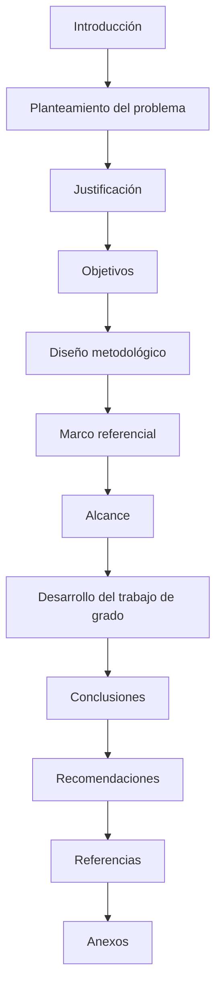

# ESCUELA PASS — ADMINISTRACIÓN Y SEGURIDAD ESCOLAR

## TRABAJO DE GRADO

**Modalidad:** Ingeniería Informática  
**Área curricular:** Programas Informáticos y Telecomunicaciones (APIT)  
**Facultad de Ingenierías**  
**Politécnico Colombiano Jaime Isaza Cadavid**  
**Medellín, 2026**

**Autor:** Jhon Kevin Murillo Martínez  
**Asesor:** Alirio Antonio Gutiérrez Quintero  
**Empresa vinculada al caso de estudio:** AlfaNetworks  

---

**[Figura 1. Portada del trabajo de grado según instructivo del Área APIT y plantilla institucional.]**

**[Figura 2. Contraportada del trabajo de grado según instructivo del Área APIT y plantilla institucional.]**

---

## DEDICATORIA Y AGRADECIMIENTOS

*Apartados opcionales conforme al instructivo del programa; se incorporan en la versión impresa definitiva.*

---

## TABLA DE CONTENIDO

*Generar en Microsoft Word mediante estilos de título y referencias cruzadas.*

1. Resumen  
2. Abstract  
3. Introducción  
4. Planteamiento del problema  
5. Justificación  
6. Objetivos  
7. Diseño metodológico  
8. Marco referencial  
9. Alcance  
10. Desarrollo del trabajo de grado  
11. Conclusiones  
12. Recomendaciones y trabajos futuros  
13. Referencias  
14. Lista de figuras y tablas  
15. Índice de anexos  

---

## RESUMEN

Las instituciones educativas privadas en México articulan seguridad física, tratamiento de datos sensibles —particularmente de niñas, niños y adolescentes— y administración escolar con presión creciente por digitalización y cumplimiento normativo. La fragmentación entre herramientas dispersas dificulta auditoría, coordinación con familias y gobernanza de datos personales alineada con el marco mexicano aplicable.

Este trabajo de grado desarrolla **Escuela Pass**, aplicación web de **AlfaNetworks** con arquitectura modular (**NestJS**, **PostgreSQL**, **TypeORM**), cliente **React/Vite**, control de acceso **QR/NFC** y circuito de recogida con apoyo de geolocalización, integrando identidad, acceso, gestión escolar, comunicación y cartera con revisión humana de comprobantes (sin pasarela bancaria automática en el alcance documentado). El **objetivo general** sigue el enunciado aprobado en la **FTG** (desarrollar la aplicación integral y optimizar procesos con apego normativo en México); el texto desarrollado articula ese objetivo frente a la **pregunta de investigación** literal de la propuesta.

En síntesis metodológica, se aplicó un proceso **iterativo e incremental** con **cinco** fases acordes a los **objetivos específicos** de la **FTG** (análisis; diseño; backend; frontend; validación), matriz de trazabilidad (**Anexo 00**) y anexos 01–10 como entregables de soporte. Los resultados muestran un producto coherente con **RF1–RF8** y **RNF1–RNF6** en los términos del **Anexo 01**, con limitaciones explícitas (**sesión en cliente**, cobertura de pruebas principalmente E2E, **RNF4** y **RNF5** sujetos a medición y piloto). Se concluye que la propuesta técnica documentada contribuye a **optimizar** procesos operativos y a **instrumentar** controles de privacidad y seguridad de aplicación acordes a un despliegue responsable en el contexto planteado para México, sin sustituir políticas institucionales ni asesoría jurídica externa.

**Palabras clave:** seguridad escolar; protección de datos personales; circuito de recogida; QR/NFC; NestJS; PostgreSQL; React; instituciones educativas privadas; México.

---

## ABSTRACT

Escuela Pass is a web platform for institutional school administration and physical security, aimed at private educational settings in Mexico where personal data protection standards must be observed. Built with NestJS, PostgreSQL, TypeORM, and a React/Vite client, it combines JWT role-based access, QR/NFC physical access, a family pickup workflow with optional geolocation support, academic and administrative modules, institutional communication, and fee management with manual review of payment evidence (no automatic payment gateway in scope). Requirements RF1–RF8 and non-functional goals RNF1–RNF6 are traced in annexed matrices and validated through reproducible backend end-to-end tests and documented CI. Residual limitations include browser token storage, test pyramid skew toward E2E, and the need for measured performance and usability evidence. The project is positioned as an engineering response to the formal thesis research question concerning scalable architecture and regulatory alignment for personal data in the Mexican institutional context.

**Keywords:** school safety; personal data protection; pickup circuit; QR/NFC; NestJS; PostgreSQL; private schools; Mexico.

---

## 1. INTRODUCCIÓN

Las instituciones educativas gestionan en paralelo formación, convivencia, seguridad en el plantel y relación con familias que demandan información oportuna por canales confiables. La digitalización puede concentrar parte de esa complejidad si se respetan límites legales y pedagógicos: tratamiento de datos personales, especialmente de menores; proporcionalidad de la recolección; y separación entre lo que el software automatiza y lo que permanece como decisión humana de la institución.

**Escuela Pass** se presenta como producto de trabajo de grado desarrollado con **AlfaNetworks**. Integra un backend **NestJS** con **PostgreSQL** y **TypeORM**, y un cliente **React** con **Vite** y **Tailwind CSS**, en configuración compatible con despliegue sobre infraestructura **tipo PaaS** (p. ej. **Railway**) para API y base de datos, y alojamiento estático para el *frontend*. Los dominios —identidad, acceso físico, circuito familiar, nómina, finanzas escolares, comunicación y analítica— se organizan en módulos registrados en `AppModule`, expuestos bajo el prefijo configurable `API_PREFIX` (documentalmente `api/v1`).

El cuerpo del documento articula el qué y el porqué académico; los **anexos 00–10** concentran inventarios técnicos (rutas HTTP, modelo relacional, diagramas, manuales, informe de pruebas). Esta división atiende la extensión máxima del texto principal y permite contrastar afirmaciones con evidencia tabular sin transcribir cada operación **REST** en el capítulo central.

La línea argumental reconoce un **alcance ampliado** respecto del texto mínimo histórico de la propuesta (multiinstitución, visitas, reuniones, anotaciones, privacidad y auditoría ampliada, entre otros). Esas capacidades complementan la numeración **RF1–RF8** y se tabulan de forma consistente en el **Anexo 00** (sección 2.1) y el **Anexo 01** (sección 3.2).

### 1.1. Contribución documental y técnica

La contribución combina **(a)** especificación trazable de requerimientos institucionales, **(b)** arquitectura modular acorde a dominios escolares y **(c)** evidencia de validación reproducible mediante compilación, **E2E** con PostgreSQL e integración continua en el repositorio. Desde ingeniería de software, el producto contextualiza patrones habituales (JWT, validación declarativa, ORM, tareas programadas, auditoría) en un dominio donde la población incluye menores y la trazabilidad de actos sensibles forma parte del valor entregado.

---

## 2. PLANTEAMIENTO DEL PROBLEMA

### 2.1. Contexto

En instituciones educativas privadas en **México**, la expectativa de calidad y transparencia convive con obligaciones en materia de **protección de datos personales** y con la necesidad de protocolos claros de **seguridad física** (ingreso, permanencia, salida coordinada con familias). Cuando procesos críticos dependen de canales informales o de archivos no integrados, crecen errores operativos, demoras informativas y dificultad para reconstruir hechos ante incidentes o reclamos, además de tensiones con el cumplimiento de principios de licitud, información y responsabilidad en el tratamiento de datos.

### 2.2. Identificación del PIN (Problema, Idea o Necesidad)

**Problema:** fragmentación operativa entre control de acceso al plantel, coordinación de salida con familias, gestión académico–administrativa y comunicación institucional, con riesgos de gobernanza débil sobre datos personales sensibles.

**Idea / necesidad:** disponer de una **aplicación web integrada**, desarrollada con **AlfaNetworks**, basada en **arquitecturas escalables** (**NestJS**, **PostgreSQL**), **QR/NFC** y trazabilidad documental, que permita **optimizar** esos procesos y alinear prácticas con **estándares normativos de protección de datos personales** aplicables al caso.

### 2.3. Análisis del problema

Dos vectores explican la persistencia del problema. **Operativamente**, la ausencia de un núcleo único de políticas y registros (identidad, accesos, circuito, académico–financiero) favorece duplicidad de datos y lagunas de auditoría. **Normativamente**, el tratamiento de datos de estudiantes y familias exige mecanismos de transparencia, minimización y control de acceso; un sistema que sólo resuelva pantallas sin gobernanza documentada reproduce riesgos de incumplimiento reputacional y legal, bajo asesoría institucional correspondiente.

Escuela Pass plantea una **plataforma única** con autorización coherente en servidor y trazas persistidas. No sustituye el criterio pedagógico ni la interpretación jurídica definitiva; **instrumenta** protocolos definidos por la institución y declara límites (p. ej. **RF6** sin pasarela automática, **degradación controlada** de FCM, SMTP o Mapbox cuando faltan credenciales).

### 2.4. Formulación del problema — pregunta de investigación

La pregunta que orienta el trabajo de grado, en los términos aprobados en la propuesta, es la siguiente:

> ¿Cómo el desarrollo de una aplicación web de AlfaNetworks basada en arquitecturas escalables con NestJS, PostgreSQL, tecnologías NFC y QR puede optimizar los procesos de seguridad física, protección de datos sensibles y administración escolar en instituciones educativas privadas de México, cumpliendo con los estándares normativos de protección de datos personales?

**Tabla 1. Problemática: causas y consecuencias**

| Causa | Consecuencia |
| --- | --- |
| Dispersión de registros y canales (hojas de cálculo, mensajería informal, sistemas inconexos). | Errores humanos, demoras, dificultad de auditoría y reconstrucción de hechos. |
| Control de acceso basado sólo en credenciales frágiles o procedimientos no correlacionados con identidad digital. | Mayor riesgo de incidentes en portería y disputas con familias. |
| Tratamiento de datos personales sin flujos explícitos de consentimiento, minimización y trazabilidad institucional. | Riesgos de incumplimiento normativo (México) y pérdida de confianza de familias. |
| Desalineación entre operación diaria (salidas, comunicación, cartera) y evidencia digital homogénea. | Sobrecarga administrativa, reclamos y opacidad frente a supervisiones internas. |

### 2.5. Alcances excluidos o diferidos (síntesis)

Quedan fuera del núcleo problemático central, salvo notas en anexos: pasarelas bancarias automáticas, biometría de alta seguridad en torniquetes, análisis forense avanzado de dispositivos y certificación formal de centros de datos. La interpretación legal definitiva sobre tratamiento transfronterizo o normativa sectorial específica corresponde a la institución y asesoría jurídica, no al software aisladamente.

---

## 3. JUSTIFICACIÓN

**Por qué el proyecto.** La digitalización responsable de procesos escolares en **México** converge en la necesidad de plataformas que integren seguridad física, administración y **protección de datos personales** sin fragmentar las fuentes de verdad. Escuela Pass aporta una implementación trazable y un paquete documental que permite evaluar esa convergencia en un caso real de empresa vinculada (**AlfaNetworks**).

**A quién beneficia.** Beneficia a instituciones educativas privadas que requieran ordenar accesos, salidas coordinadas, operación académico–administrativa y comunicación con base en roles; a familias, por visibilidad controlada de procesos; y al programador y al sector TI educativo, al disponer de arquitectura y evidencias de prueba reproducibles.

**Por qué este enfoque.** Se priorizó un ciclo **iterativo e incremental** con trazabilidad **RF/RNF→implementación→pruebas**, coherente con producto de software y con tiempo finito de grado. La separación entre cuerpo principal y **anexos** responde al instructivo de extensión y a la necesidad de no confundir narrativa académica con inventarios técnicos exhaustivos.

---

## 4. OBJETIVOS

### 4.1. Objetivo general

**Desarrollar** una aplicación web integral de **AlfaNetworks** para la **administración y seguridad escolar** en instituciones educativas privadas de **México**, mediante **NestJS**, **PostgreSQL**, **JavaScript** (cliente **React/Vite**), **NFC** y **QR**, de modo que se **optimicen** los procesos operativos, se fortalezca la seguridad en el sentido de trazabilidad y control institucional, y se **instrumente** el tratamiento de datos personales **conforme a la normativa aplicable** en el caso mexicano, con **validación técnica reproducible**. La redacción se mantiene **alineada al objetivo general aprobado en la FTG**; la pregunta de investigación (sección 2.4) orienta el alcance y el marco de datos personales sin sustituir dicho objetivo.

### 4.2. Objetivos específicos

Los **cinco** objetivos específicos siguientes reproducen el planteo de la **propuesta formal (FTG)**. Los anexos 00–10 **desagregan entregables y evidencias** bajo estos cinco objetivos; por ejemplo, el **Anexo 07** (manual técnico), la **Anexo 08** (API) y el **Anexo 02** (actas) son **productos de las fases de diseño, implementación y análisis**, no objetivos formales adicionales frente a lo aprobado.

1. **Analizar** los requerimientos funcionales y no funcionales del sistema mediante reuniones con **AlfaNetworks** y consolidación documental del dominio escolar, registrando especificaciones **RF1–RF8** y **RNF1–RNF6**, actores, reglas, **matriz de trazabilidad** (**Anexo 00**), **documento de requerimientos** (**Anexo 01**) y **actas** (**Anexo 02**).  
2. **Diseñar** la arquitectura del sistema, el modelo de base de datos relacional y las interfaces de usuario con enfoque **responsive**, documentando **Anexos 03, 04, 05 y 06** y apoyando el **manual de usuario** (**Anexo 09**) en la medida en que describe el diseño de flujos por rol.  
3. **Implementar** el **backend** con **NestJS** y **PostgreSQL**, exponiendo **APIs REST** para autenticación, control de accesos **NFC/QR**, gestión escolar, circuito con apoyo de geolocalización y administración de pagos en el alcance declarado (**sin** pasarela automática); la correspondencia contractual HTTP se consolida en el **Anexo 08**.  
4. **Desarrollar** el **frontend** con **JavaScript/TypeScript** moderno (**React**, **Vite**), interfaces por rol e integración con el backend, según inventario de rutas y prototipos (**Anexos 06 y 09**).  
5. **Validar** el funcionamiento mediante **pruebas** (incluidas **E2E** con PostgreSQL, *smokes* e integración continua), planes de **métricas** para **RNF4** y criterios de **RNF5**, y registro en el **Anexo 10**; la documentación de instalación y despliegue (**Anexo 07**, `docs/technical-setup.md**) asegura **reproducibilidad** de la validación en otro entorno.  

---

## 5. DISEÑO METODOLÓGICO

### 5.1. Enfoque general

Se adoptó ingeniería de software **iterativa e incremental**, alineada con desarrollo de producto en contexto empresa–academia. Cada incremento cerraba *backlog* con trazabilidad a **RF/RNF**, actualización de migraciones cuando el modelo persistido cambiaba y extensión de pruebas **E2E** para flujos críticos de seguridad y consistencia académico–financiera.

### 5.2. Fuentes de información y técnicas de verificación

- **Fuente normativa interna:** propuesta formal **FTG** y **Anexo 01**.  
- **Fuente técnica primaria:** repositorio (`src/modules/`, `src/database/entities/`, `frontend/src/`, `test/`, `docs/technical-setup.md`).  
- **Puente documental:** matriz **Anexo 00** entre texto de requerimientos y evidencias de código y prueba.  
- **Técnicas:** revisión de código, ejecución de suites automatizadas, inspección de OpenAPI, revisión de actas (**Anexo 02**).

### 5.3. Fases del trabajo (por objetivo específico)

En cada fase, el **objetivo específico** se expresa como **resultado esperado** (sustantivo). Las actividades se enuncian como **sustantivos** de trabajo.

**Tabla 2.** Fases, actividades y resultados documentales (alineadas a los **cinco** objetivos específicos de la FTG)

| Fase | Resultado esperado (objetivo FTG) | Actividades principales (sustantivos) | Resultados documentales |
| --- | --- | --- | --- |
| I | **Análisis de requerimientos** | Entrevistas y acuerdos con AlfaNetworks; definición RF/RNF; trazabilidad matricial; actas | Anexos 00, 01, 02 |
| II | **Diseño del sistema (arquitectura, datos, interfaz)** | Modelado arquitectónico; entidad–relación; UML; prototipos UI; bases del manual de usuario | Anexos 03, 04, 05, 06; Anexo 09 (flujos) |
| III | **Implementación del backend** | Módulos NestJS; persistencia; contratos REST; OpenAPI | Repositorio; Anexo 08 |
| IV | **Desarrollo del frontend** | SPA React/Vite; rutas por rol; integración con API | Repositorio; Anexos 06, 09 |
| V | **Validación y cierre técnico** | E2E; CI; métricas RNF4/RNF5; manual técnico y variables de despliegue | Anexos 10, 07; `technical-setup.md` |

### 5.4. Herramientas

**Node.js** ≥ 20, **TypeScript**, **NestJS 10**, **TypeORM**, **PostgreSQL 16** (CI y recomendación de producción), **Jest** (unitario y E2E), **React 18**, **Vite**, **Tailwind CSS**, **html5-qrcode**, **Mapbox** opcional, **GitHub Actions** (`Backend CI`, `working-directory: 01 - Escuela Pass`).

### 5.5. Control de calidad y riesgos

Los cambios en contratos públicos debían reflejarse coherente con **Anexos 04, 08, 06/09 y 10** según corresponda. Riesgos explícitos: deriva documento–código; integraciones opcionales para demostraciones; tiempo finito frente a ambición funcional; privacidad en capturas. Mitigaciones: matriz obligatoria, modo degradado documentado, priorización registrada en actas, datos sintéticos en evidencias.

En proyectos híbridos empresa–academia, la validación combina texto normativo (**FTG**), código ejecutable con pruebas y contexto operativo de la contraparte. Ante conflicto entre texto obsoleto y código actualizado sin anuncio, debe primar el **código contrastado con prueba** y corregirse el documento; ante conflicto entre código y norma legal externa, priman **marco legal y ética**, con ajuste de implementación o de alcance documentado.

### 5.6. Relación entre documentación y repositorio

El cuerpo principal del TDG prioriza la narrativa académica; los anexos absorben inventarios que inflarían el cap central. A la vez, el repositorio actúa como **árbitro técnico**: discrepancias entre tablas del **Anexo 04** u **08** y la implementación vigente deben resolverse actualizando la documentación o justificando excepciones explícitas. El script `npm run tdg:enrich` (definido en el *backend*) apoya la regeneración de inventarios sin sustituir la revisión académica de redacción.

### 5.7. Estructura del documento (representación gráfica)

**Figura 3.** Orden de secciones del trabajo de grado alineado al instructivo del Área APIT (diagrama de flujo; exportar a imagen para la versión Word si aplica).

### 5.8. Cronograma

El cronograma del proyecto —desde el 24/02/2026 hasta el 21/06/2026— se presenta como diagrama de **Gantt** elaborado con herramienta de gestión de proyectos.

**[Figura 4. Cronograma Gantt del proyecto Escuela Pass (24/02/2026–21/06/2026).]**

---

## 6. MARCO REFERENCIAL

Los desarrollos instrumentales extensos (inventarios HTTP, modelo relacional detallado, plan de pruebas) se amplían en **Anexos 03, 04, 08 y 10**.

### 6.1. Marco conceptual

**Seguridad física y flujos escolares.** La seguridad combina procedimiento humano y tecnología. Credenciales **QR/NFC** reducen dependencia de medios fácilmente falsificables, pero introducen riesgos de uso compartido de dispositivo; por ello la validez se ancla en servidor, roles y contexto institucional.

**Arquitecturas web cliente–servidor.** Las SPA facilitan experiencias responsivas y despliegue estático del cliente; parte de la superficie de seguridad recae en el navegador. Escuela Pass usa *tokens* en `localStorage` con *trade-off* documentado (**Anexo 03**) frente a cookies *httpOnly*.

**API y documentación.** OpenAPI/Swagger apoya auditoría de contratos; en producción la documentación interactiva permanece deshabilitada salvo configuración explícita.

**Ingeniería de requisitos multiactor.** Se priorizó trazabilidad matricial (**Anexo 00**) para limitar deriva entre intención de negocio y comportamiento desplegado. Las decisiones técnicas delicadas conservan **fuente primaria** en código y anexos, en coherencia con prácticas de documentación versionada.

**Seguridad de aplicaciones (OWASP).** Se aplicaron medidas pragmáticas: validación con `ValidationPipe`, *rate limiting* con `@nestjs/throttler`, Helmet, control de archivos privados; persisten riesgos teóricos **XSS** mientras la sesión viva en el navegador. Un modelo de amenazas simplificado **STRIDE** (suplantación, manipulación, repudio, divulgación, denegación de servicio, escalada) orienta lecturas críticas del diseño y se documenta con mayor detalle en el **Anexo 10** cuando corresponda.

**Calidad (ISO/IEC 25010, lectura aplicada).** Los atributos de adecuación funcional, fiabilidad, seguridad, mantenibilidad y portabilidad se discuten en función de evidencias del repositorio; **rendimiento** (**RNF4**) y **usabilidad** (**RNF5**) quedan sujetos a medición (**Anexo 10**).

**Gestión académico–financiera y reputación.** Inconsistencias en asistencia, calificación o cartera dañan la confianza más que defectos cosméticos; el diseño concentra reglas en servicios y pruebas de cierre sobre estados límite (**Anexo 10**, especificación `phase7-closure`).

**Digitalización y expectativas familiares.** La visibilidad operativa (salida, deudas, avisos) debe construirse con mensajes claros y permisos que eviten sobreexposición entre hogares (**Anexo 09**).

**Ética del dato escolar.** Más allá del cumplimiento, cada pantalla debe justificar finalidad y proporcionalidad. *PrivacyGate* y registros de política materializan transparencia procedimental mientras el texto jurídico y su armonización con la **LFPDPPP** son responsabilidad de la institución.

**Accesibilidad e inclusión.** No fueron objetivo explícito del MVP; se adoptaron prácticas mínimas (contraste razonable, foco, mensajes textuales). Una auditoría **WCAG** queda como línea futura alineada con **RNF5**.

### 6.2. Marco legal (México)

El ordenamiento mexicano en materia de protección de datos personales en posesión de particulares se centra en la **Ley Federal de Protección de Datos Personales en Posesión de los Particulares (LFPDPPP)** y normativa y lineamientos complementarios emitidos por el **INAI** y disposiciones aplicables según el caso (**DOF**, 2010; véase referencias). Las instituciones educativas privadas deben definir **responsable del tratamiento**, **finalidades**, medios de **derechos ARCO** o equivalentes según procedimiento vigente, y encargados o prestadores cuando aplique.

El software implementa apoyos técnicos de **gobernanza** (p. ej. aceptación de políticas, registros de auditoría); los **avisos de privacidad** y los instrumentos de consentimiento o autorización legalmente válidos para menores son responsabilidad institucional y jurídica. El tratamiento de datos sensibles exige mayor cuidado; el sistema debe operarse con **minimización** y control de acceso acorde a políticas internas validadas por la institución en México.

### 6.3. Antecedentes

En los últimos años la literatura y la industria han propuesto plataformas de gestión escolar, control de acceso desacoplado del académico, y mensajería instantánea informal. Trabajos académicos frecuentemente profundizan un subdominio; Escuela Pass distingue la **orquestación** de identidad, acceso físico, circuito familiar, operación académico–administrativa y comunicación con contrato **REST** trazable. Referencias técnicas utilizadas en implementación: **NestJS**, **PostgreSQL**, **React**, **TypeORM**, **OpenAPI**, integración **FCM/Mapbox** opcional (véase sección de referencias).

### 6.4. Limitaciones de los antecedentes y de la literatura revisada

**Tabla 3.** Limitaciones identificadas en antecedentes seleccionados

| Enfoque / familia de solución | Integración QR–NFC–backend institucional | Tratamiento de datos personales y menores | Escalabilidad práctica Node.js/PostgreSQL | Observación |
| --- | --- | --- | --- | --- |
| Plataformas comerciales cerradas | Parcial (módulos opacos) | Depende del proveedor y contratos | Alta en *SaaS*; baja transparencia de implementación | Limita auditoría académica del código |
| Trabajos académicos sectoriales (2021–2026) | Frecuente en un solo flujo | A menudo conceptual o piloto reducido | Variable | Poca replicabilidad completa |
| Mensajería genérica fuera de política | No sustituye control de acceso | Riesgo de fugas y retención informal | N/A | Desalineado con gobernanza |
| Este trabajo (Escuela Pass) | Abordaje integrado documentado | *PrivacyGate*, auditoría; aviso legal institucional requerido | Diseño modular y CI documentado | Limitaciones: sesión en cliente; RNF4 sin medición plena |

---

## 7. ALCANCE

### 7.1. Inclusiones

**Tabla 4.** Inclusiones principales

| Ámbito | Inclusión |
| --- | --- |
| Identidad y seguridad | Autenticación JWT por roles; acceso físico QR/NFC con eventos persistidos; *rate limiting* global. |
| Circuito familiar | Flujo operado por padre/tutor con apoyo de mapa/ETA; transiciones institucionales explícitas; consentimientos donde aplica. |
| Gestión escolar y académica | Nómina, grupos, asistencia, actividades y calificaciones, periodos (incl. cierre), boletines, calendario; alcance ampliado en **Anexo 01** §3.2. |
| Finanzas | Cartera, comprobantes, verificación humana (**sin** pasarela automática en alcance). |
| Comunicación y tableros | Avisos, notificaciones, paneles y exportaciones; FCM/SMTP/Mapbox **opcionales**. |
| Multiinstitución | Operación **multi–escuela** para rol de plataforma según diseño documentado. |
| Privacidad y auditoría | Políticas versionadas, aceptación, trazas de auditoría según dominios implementados. |

### 7.2. Exclusiones y supuestos

**Tabla 5.** Exclusiones / fuera de alcance

| Exclusión | Comentario |
| --- | --- |
| Pasarela bancaria automática | **RF6** se cierra con revisión humana de comprobantes. |
| Biometría de alta seguridad | No incluida en el alcance del MVP documentado. |
| Certificación formal del centro de datos / APM comercial | Fuera de alcance académico; se deja trazabilidad mínima (*health*, *logs*). |
| Interpretación jurídica sustitutiva | El responsable del tratamiento y sus asesores definen textos legales y políticas en México. |
| Cobertura completa del catálogo HTTP en E2E | Declarada honestamente en **Anexo 10**; subconjunto representativo automatizado. |

**Supuestos:** la institución define políticas de salida, autorizaciones y reglas financieras; el *frontend* en CI puede evolucionar independientemente del flujo **Backend CI** actual (**Anexo 10**).

---

## 8. DESARROLLO DEL TRABAJO DE GRADO

### 8.1. Objetivo específico 1 (FTG) — Análisis de requerimientos

Se consolidaron **RF1–RF8** y **RNF1–RNF6** con actores, reglas transversales y criterios de aceptación (**Anexo 01**). La matriz **Anexo 00** vincula cada requerimiento con módulos NestJS, rutas representativas `api/v1`, pantallas React y estado declarado. La precisión de negocio del **RF3** (operador familiar, en ajuste respecto del texto histórico de la propuesta sobre “conductor”) y el **RF6** sin pasarela quedaron explícitas. Los acuerdos de priorización con **AlfaNetworks** se registraron en **Anexo 02**.

**Tabla 6.** Actores y roles técnicos (síntesis)

| Actor | Rol `enum` | Responsabilidad macroscópica |
| --- | --- | --- |
| Administrador de plataforma | `ADMIN` | Multi–institución, escuelas, administradores, contexto transversal. |
| Personal administrativo | `ADMINISTRATIVO` | Nómina, finanzas, calendario, reportes, visitas, circuito operativo. |
| Docente | `DOCENTE` | Asistencia, actividades, notas, anotaciones, escáner, apoyo a circuito. |
| Padre o tutor | `PADRE` | Circuito familiar, consultas académicas de hijos, finanzas, comunicación. |
| Alumno | `ALUMNO` | Consultas autorizadas de horario, notas, boletines, credencial de acceso. |

### 8.2. Objetivo específico 2 (FTG) — Diseño (arquitectura, datos, interfaz)

Bajo este objetivo se agrupan los entregables de modelado y diseño de experiencia, coherentes con la fase II de la metodología:

- **Arquitectura:** *bounded contexts* en `AppModule`, **DashboardModule** y subsistemas (p. ej. reuniones vía **MeetingsModule**), integraciones opcionales, riesgos y *trade-offs* (**Anexo 03**); diagramas fuente en `docs/imagenes/*.mmd`.  
- **Modelo de datos:** **49** entidades en `buildTypeOrmConfig()`, migraciones y `ensureRuntimeSchema` (**Anexo 04**, `technical-setup.md`).  
- **UML:** casos de uso, secuencia del circuito y vistas (**Anexo 05**).  
- **Interfaz:** inventario de rutas y prototipos (**Anexo 06**); **Anexo 09** documenta flujos por rol sobre ese diseño.

### 8.3. Objetivo específico 3 (FTG) — Implementación del backend

Arranque en `main.ts` con migraciones, `ValidationPipe` global (*whitelist*, *forbidNonWhitelisted*), Swagger condicionado, prefijo `API_PREFIX`. Dominios críticos concentran reglas en servicios. Se declaran **241** rutas HTTP en `src/modules/**/*.controller.ts`, alineadas al **Anexo 08** y a OpenAPI viva. Geolocalización y archivos: circuito con apoyo a mapa y ETA; confirmación de entrega explícita; binarios privados por rutas autenticadas; en **PaaS**, volumen persistente para `UPLOADS_DIR`.

### 8.4. Objetivo específico 4 (FTG) — Desarrollo del frontend

Cliente **React/Vite** con *tokens* en `localStorage`, `PrivacyGate`, `RoleGate` en rutas sensibles, integración opcional FCM/Mapbox. La autorización efectiva permanece en servidor.

### 8.5. Objetivo específico 5 (FTG) — Validación

Estrategia **sesgada a E2E** con PostgreSQL: `npm run test:e2e` (`pretest:e2e`, `test/setup-e2e-db.js`, `test/jest-e2e.json`), *smokes* `npm run smoke:ci-local`, suites `app.e2e-spec.ts`, `phase7-closure.e2e-spec.ts`, y *throttle* opcional vía `npm run test:e2e:auth-throttle-ip`. **CI:** `.github/workflows/backend-ci.yml`, Node 20, PostgreSQL 16. **Anexo 10** documenta cobertura, riesgos y plan **RNF4**/**RNF5**. **Anexo 07** y `docs/technical-setup.md` permiten reproducir entorno de prueba y despliegue (p. ej. variables `DATABASE_URL`, JWT, integraciones).

### 8.6. Síntesis de requerimientos funcionales y trazabilidad hacia pruebas

**Tabla 7.** Síntesis de requerimientos funcionales (estado declarado; detalle en anexos)

| Código | Descripción | Estado declarado |
| --- | --- | --- |
| RF1 | Autenticación con roles JWT; *PrivacyGate* | Cumplido |
| RF2 | Control de acceso QR/NFC | Cumplido |
| RF3 | Circuito de recogida con apoyo de GPS (operador familiar) | Cumplido |
| RF4 | Gestión escolar | Ampliado |
| RF5 | Asistencia y calificaciones | Ampliado |
| RF6 | Pagos sin pasarela automática | Cumplido en alcance |
| RF7 | Avisos y notificaciones | Cumplido |
| RF8 | Panel y reportes | Ampliado |

Los **RNF** se sintetizan así: **RNF1–RNF3** y **RNF6** cuentan con soporte en implementación y configuración descritas; **RNF4** y **RNF5** exigen mediciones y/o validación con usuarios para afirmar resultados medidos más allá del diseño (**Anexo 10**).

---

## 9. CONCLUSIONES

En relación con el **primer objetivo específico** de la FTG, el trabajo establece una cadena verificable entre la propuesta, los **Anexos 00–02** y el repositorio: los requerimientos quedaron especificados y trazados con criterios de aceptación medibles.

El **segundo objetivo** se refleja en el paquete de diseño (**Anexos 03–06** y apoyo en **09**): arquitectura modular, modelo relacional de **49** entidades, diagramas de comportamiento e interfaz *responsive* alineada a roles; el costo de cambio de esquema queda acotado por migraciones y documentación.

El **tercer objetivo** se cumple en la implementación **NestJS**/**PostgreSQL** con exposición **REST** documentable (**Anexo 08**), incluyendo dominios de autenticación, acceso **QR/NFC**, gestión escolar, circuito y finanzas en el alcance declarado.

El **cuarto objetivo** se materializa en el cliente **React/Vite** integrado a la API, con flujos diferenciados por rol y controles de interfaz coherentes con la autorización en servidor.

El **quinto objetivo** queda sustentado en pruebas **E2E**, *smokes* e integración continua reproducible, con honestidad sobre límites (**RNF4**, **RNF5**, *frontend* fuera del *job* de **CI** actual) registrada en el **Anexo 10**, y en la documentación de despliegue (**Anexo 07**) que permite replicar el entorno.

En síntesis frente a la **pregunta de investigación** de la sección 2.4, el desarrollo de **Escuela Pass** con **NestJS**, **PostgreSQL** y **QR/NFC** permite **optimizar** —integrando y auditando— procesos de **seguridad física**, **administración escolar** y prácticas de **protección de datos sensibles** en instituciones educativas privadas de **México**, en la medida en que la institución acompaña el despliegue con políticas alineadas a la **LFPDPPP** y normativa conexa, y se atiendan en trabajo futuro las limitaciones declaradas (sesión en cliente, cobertura parcial de pruebas, mediciones de desempeño y usabilidad). El resultado **instrumenta** el marco normativo y operativo; no sustituye asesoría jurídica ni la definición institucional del responsable del tratamiento.

---

## 10. RECOMENDACIONES Y TRABAJOS FUTUROS

Registrar mediciones explícitas (**RNF4**) con método, entorno y tamaño de datos (**Anexo 10**). Incorporar compilación y *lint* del *frontend* al flujo de **CI** para reducir regresiones de empaquetado. Incrementar pruebas unitarias en dominios críticos (*payments*, *circuit*, *auth*) complementando **E2E**. Evaluar endurecimiento de sesión (**BFF**, cookies *httpOnly*, **CSP**) por alineación con buenas prácticas **OWASP**. Mantener disciplina **migración–Anexo 04–OpenAPI** ante cambios persistentes. Completar **RNF5** con piloto y encuesta reproducible. Archivar **OpenAPI** por versión de *release*. En implantaciones reales, diseñar pistas de auditoría y retención acordes a política mexicana y a riesgo institucional.

---

## 11. REFERENCIAS

*Formato APA 7; completar fechas exactas y detalles DOF según la edición consultada de cada norma.*

AlfaNetworks. (s. f.). *Propuesta formal de trabajo de grado — Escuela Pass* [Documento interno].  

Cámara de Diputados del H. Congreso de la Unión. (2010, 5 de julio). *Ley Federal de Protección de Datos Personales en Posesión de los Particulares*. Diario Oficial de la Federación.  

Instituto Nacional de Transparencia, Acceso a la Información y Protección de Datos Personales (INAI). (s. f.). *Normativa y guías en materia de protección de datos personales*. https://www.gob.mx/inai  

NestJS. (s. f.). *Documentation — NestJS*. https://docs.nestjs.com  

OpenJS Foundation. (s. f.). *Node.js documentation*. https://nodejs.org/docs  

OWASP Foundation. (s. f.). *OWASP Top Ten*. https://owasp.org/www-project-top-ten/  

PostgreSQL Global Development Group. (s. f.). *PostgreSQL Documentation*. https://www.postgresql.org/docs/  

React Team. (s. f.). *React*. https://react.dev  

Fielding, R. T. (2000). *Architectural Styles and the Design of Network-based Software Architectures* [Tesis doctoral, University of California, Irvine].  

Vite Team. (s. f.). *Vite*. https://vitejs.dev  

TypeORM. (s. f.). *TypeORM Documentation*. https://typeorm.io  

Mapbox. (s. f.). *Mapbox GL JS Documentation*. https://docs.mapbox.com  

Firebase. (s. f.). *Firebase Cloud Messaging — Admin SDK*. https://firebase.google.com/docs/cloud-messaging  

GitHub. (s. f.). *GitHub Actions Documentation*. https://docs.github.com/actions  

---

## 12. LISTA DE FIGURAS Y TABLAS PROPUESTAS

| Id | Descripción |
| --- | --- |
| Figura 1 | Portada institucional APIT |
| Figura 2 | Contraportada institucional APIT |
| Figura 3 | Orden de secciones del documento (diagrama Mermaid, sección 5.7; exportar PNG si aplica) |
| Figura 4 | Cronograma Gantt — Espacio reservado para imagen desde herramienta de gestión (sección 5.8) |
| Figura 5 | Vista de contexto — `01-arquitectura-contexto-lr.mmd` → PNG |
| Figura 6 | Despliegue típico — `02-arquitectura-despliegue-td.mmd` → PNG |
| Figura 7 | Modelo entidad–relación (núcleo) — `03-modelo-er-nucleo.mmd` → PNG |
| Figura 8 | Casos de uso — `04-uml-casos-de-uso.mmd` → PNG |
| Figura 9 | Secuencia circuito — `05-uml-secuencia-circuito.mmd` → PNG |
| Figura 10 | Swagger `/docs` (captura de entorno autorizado) |
| Figura 11 | Panel o *dashboard* por rol (captura) |
| Figura 12 | Evidencia E2E o GitHub Actions (**Anexo 10**) |

| Tabla | Contenido |
| --- | --- |
| Tabla 1 | Problemática: causas y consecuencias (sección 2.4) |
| Tabla 2 | Fases y resultados esperados (sección 5.3) |
| Tabla 3 | Limitaciones de antecedentes (sección 6.4) |
| Tabla 4 | Inclusiones (sección 7.1) |
| Tabla 5 | Exclusiones (sección 7.2) |
| Tabla 6 | Actores y roles (sección 8.1) |
| Tabla 7 | Síntesis de requerimientos funcionales (sección 8.6) |

---

## 13. ÍNDICE DE ANEXOS

| Anexo | Título breve | Archivo en `docs/tdg/redaccion-activa/` |
| --- | --- | --- |
| 00 | Matriz de trazabilidad | `00-matriz-trazabilidad.md` |
| 01 | Documento de requerimientos | `01-requerimientos.md` |
| 02 | Actas de reuniones | `02-actas-reuniones.md` |
| 03 | Documento de arquitectura | `03-arquitectura.md` |
| 04 | Modelo entidad–relación | `04-modelo-er.md` |
| 05 | Diagramas UML | `05-diagramas-uml.md` |
| 06 | Prototipos UI/UX | `06-prototipos-ui-ux.md` |
| 07 | Manual técnico | `07-manual-tecnico.md` |
| 08 | Documentación API | `08-documentacion-api.md` |
| 09 | Manual de usuario | `09-manual-usuario.md` |
| 10 | Informe de pruebas y métricas | `10-informe-pruebas-metricas.md` |

---

*Fin del texto principal — TDG Escuela Pass 2026.*

El número de páginas del cuerpo hasta referencias debe comprobarse en la plantilla institucional (Times New Roman, márgenes y estilos del programa). Si el material superara el tope orientado (~50 páginas), conviene trasladar detalles técnicos extensos a los anexos 00–10 ya previstos.
