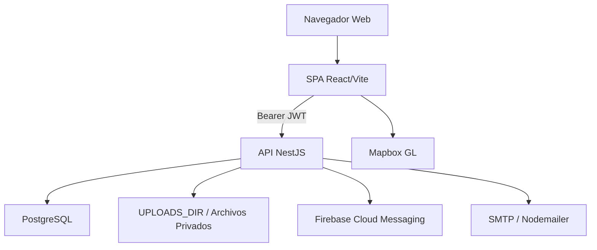

# 03. Documento De Arquitectura Escuela Pass

**Proyecto:** Escuela Pass — Administración y Seguridad Escolar  
**Autor:** Jhon Kevin Murillo Martínez  
**Programa:** Ingeniería Informática — Área de Programas Informáticos y Telecomunicaciones  
**Tipo de documento:** Arquitectura de software  
**Versión:** 1.0 documental  

Fuentes normativas usadas para estos entregables:
- Manual de estilo APIT: Times New Roman 12 pt, márgenes de 2.54 cm, espaciado sencillo,
  títulos numerados, citación autor-fecha y referencias APA 7.
- Plantilla TDG: portada, contraportada, resumen, introducción, capítulos por objetivo,
  conclusiones, recomendaciones, referencias y anexos.
- Propuesta FTG aprobada: RF1-RF8, RNF1-RNF6, objetivos, alcance y entregables.

Nota de originalidad: la redacción fue reconstruida en estilo académico propio a partir de
la propuesta, el código fuente y la documentación técnica del repositorio. El trabajo externo
de referencia solo se usó para observar estructura documental y nivel de detalle.

## 1. Visión Arquitectónica

Escuela Pass es una aplicación web institucional de AlfaNetworks orientada a la administración
y seguridad escolar. La solución combina una API NestJS con PostgreSQL, una SPA React/Vite,
control de acceso por QR/NFC, circuito de recogida iniciado por padres o tutores, comunicación
por avisos y notificaciones, gestión académica, pagos, reportes y despliegue cloud.

La interpretación oficial del RF3 es que los padres o tutores actúan como conductores del
circuito de recogida desde la aplicación web móvil; no se trata de una flota independiente de
vehículos escolares administrada por terceros. La geolocalización se usa como apoyo informativo
para el mapa y ETA, mientras las transiciones de estado relevantes son acciones explícitas.

La arquitectura sigue una separación cliente-servidor: una SPA React/Vite consume una API REST
NestJS protegida con JWT. PostgreSQL concentra la persistencia, mientras FCM, SMTP, Mapbox y
almacenamiento de archivos actúan como servicios complementarios.

## 2. Vista Lógica

El backend registra módulos de dominio en `src/app.module.ts`: HealthModule, MailModule,
AuthModule, AccessModule, CircuitModule, ClassSessionsModule, NoticesModule, PaymentsModule,
AttendanceModule, ActivitiesModule, AttentionNotesModule, AcademicPeriodsModule, ReportCardsModule,
AcademicSchedulerModule, ReportsModule, SchoolModule, ExportsModule, DashboardModule, SchedulesModule,
SchoolCalendarModule, SettingsModule, VehiclesModule, DocumentsModule, AuditModule, PrivacyModule,
SchoolsModule, UploadsModule, DepartureConsentModule, EventSchedulerModule y ExternalVisitsModule.

El frontend en `frontend/src` organiza páginas por rol y dominio: autenticación, inicio, escáner,
circuito, gestión escolar, visitas, reuniones, boletines, calificaciones, periodos académicos,
horarios, institución, perfil y panel administrativo.

[Figura 1. Arquitectura lógica Escuela Pass centrada]

## 3. Vista De Despliegue

| Componente | Tecnología | Evidencia |
| --- | --- | --- |
| Cliente web | React 18 + Vite + Tailwind | `frontend/package.json`, `frontend/src` |
| API | NestJS 10 + TypeORM | `package.json`, `src/main.ts`, `src/app.module.ts` |
| Base de datos | PostgreSQL | `src/database/entities`, migraciones, SQL v4 |
| Backend cloud | Railway | `railway.toml` |
| Frontend cloud | Vercel/hosting estático | `frontend/vercel.json` |
| Push | Firebase Cloud Messaging | `firebase-admin`, `notifications/fcm/register` |
| Correo | SMTP/Nodemailer | `src/modules/mail`, recuperación contraseña |
| Archivos | Volumen `UPLOADS_DIR` | `src/lib/uploads-path.ts`, `/uploads` |

[Figura 2. Despliegue Railway, Postgres y frontend estático centrado]

## 4. Seguridad

- `helmet` para cabeceras HTTP.
- CORS parametrizado por `CORS_ORIGIN`.
- `ValidationPipe` global con whitelist y bloqueo de propiedades no permitidas.
- `ThrottlerGuard` global para rate limiting.
- Hash de contraseñas con bcrypt.
- JWT con roles y `schoolId` para filtrado multiinstitución.
- TypeORM reduce riesgo de inyección SQL en consultas parametrizadas.

## 5. Persistencia

La persistencia se modela con entidades TypeORM y migraciones. La base incluye usuarios,
roles, escuelas, grupos, estudiantes, docentes, padres, asistencias, actividades, report cards,
pagos, circuito, visitas, reuniones, notificaciones, privacidad y auditoría.

## 6. Integraciones Externas

- FCM: envío de push web si hay token y credencial de cuenta de servicio.
- Mapbox: mapa/ETA del circuito; fallback por distancia Haversine si no hay token.
- SMTP: restablecimiento de contraseña y correos de agenda si se configura host.
- Uploads: comprobantes, avatares, logos, evidencias y excusas en volumen persistente.

## 7. Decisiones Y Justificación

La propuesta contemplaba cPanel y Google Maps como alternativas. El repositorio evidencia
Railway/Vercel y Mapbox. La decisión se justifica por despliegue cloud simple, variables de
entorno, Postgres administrado, volumen persistente y facilidad de integración con Vite.

## 8. Diagrama Mermaid De Arquitectura

## 9. Vista De Módulos Por Dominio

| Dominio | Módulos | Responsabilidad |
| --- | --- | --- |
| Identidad | `auth`, `privacy`, `audit` | Sesión, estado de cuenta, aceptación de políticas y trazabilidad. |
| Seguridad física | `access`, `circuit`, `vehicles`, `departure-consent` | Entrada/salida, QR/NFC, circuito de recogida y vehículos familiares. |
| Académico | `attendance`, `class-attendance`, `activities`, `academic-periods`, `report-cards`, `documents` | Asistencia, clases, notas, periodos, boletines y documentos PDF. |
| Gestión escolar | `school`, `schools`, `settings`, `class-sessions`, `schedules` | Escuelas, grupos, personas, horarios y configuración institucional. |
| Administración | `payments`, `reports`, `exports`, `dashboard` | Pagos, reportes, indicadores y exportables. |
| Comunicación | `notices`, `notifications`, `meetings`, `external-visits`, `attention-notes`, `mail`, `fcm` | Avisos, reuniones, visitas, anotaciones, correo y push. |

## 10. Riesgos Arquitectónicos Y Mitigaciones

| Riesgo | Mitigación implementada |
| --- | --- |
| Acceso indebido a archivos sensibles | Endpoint `/files` con autenticación, validación de bucket, nombre seguro y reglas por relación. |
| Operación multiinstitución incorrecta | Uso de `schoolId`, roles y consultas restringidas por escuela o relación. |
| Token válido de usuario inactivo | `JwtStrategy` consulta estado del usuario en cada request protegida. |
| Datos inválidos en DTO | `ValidationPipe` global y DTOs con `class-validator`. |
| Exposición de Swagger en producción | Swagger deshabilitado por defecto en producción salvo variable explícita. |
| Falta de persistencia de uploads en cloud | Uso de `UPLOADS_DIR` y volumen persistente documentado para Railway. |
