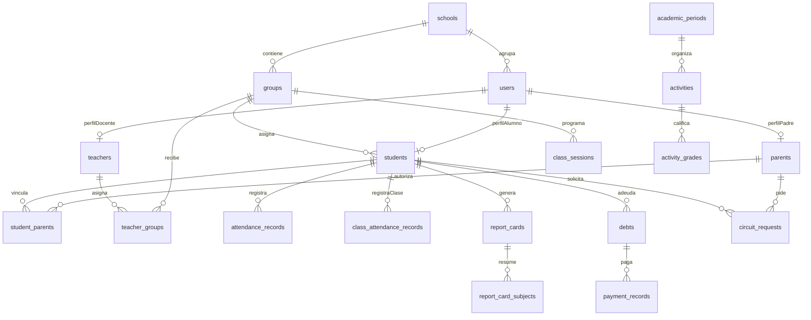

# 04. Modelo Entidad Relación Escuela Pass

**Proyecto:** Escuela Pass — Administración y Seguridad Escolar  
**Autor:** Jhon Kevin Murillo Martínez  
**Programa:** Ingeniería Informática — Área de Programas Informáticos y Telecomunicaciones  
**Tipo de documento:** Modelo de datos  
**Versión:** 1.0 documental  

Fuentes normativas usadas para estos entregables:
- Manual de estilo APIT: Times New Roman 12 pt, márgenes de 2.54 cm, espaciado sencillo,
  títulos numerados, citación autor-fecha y referencias APA 7.
- Plantilla TDG: portada, contraportada, resumen, introducción, capítulos por objetivo,
  conclusiones, recomendaciones, referencias y anexos.
- Propuesta FTG aprobada: RF1-RF8, RNF1-RNF6, objetivos, alcance y entregables.

Nota de originalidad: la redacción fue reconstruida en estilo académico propio a partir de
la propuesta, el código fuente y la documentación técnica del repositorio. El trabajo externo
de referencia solo se usó para observar estructura documental y nivel de detalle.

## 1. Propósito

El modelo entidad-relación organiza la información crítica de Escuela Pass en dominios
institucionales, académicos, financieros, de seguridad y comunicación. La fuente primaria es
`src/database/entities/` y la cadena de migraciones TypeORM.

## 2. Agrupación De Entidades

| Dominio | Entidades principales | Finalidad |
| --- | --- | --- |
| Identidad | users, refresh_tokens, privacy_policies, user_privacy_acceptances, audit_logs | Autenticación, privacidad y trazabilidad |
| Institución | schools, institution_settings, administrative_staff | Multiinstitución y perfil |
| Académico núcleo | groups, subjects, students, teachers, student_parents, teacher_groups | Gestión escolar |
| Asistencia | attendance_records, school_non_instructional_days | Asistencia y calendario |
| Evaluación | academic_periods, activities, activity_grades, report_cards, report_card_subjects | Calificaciones y boletines |
| Circuito | circuit_requests, vehicles, student_departure_consents | Recogida y permisos |
| Finanzas | payment_concepts, debts, payment_records, debt_adjustments | Cartera y comprobantes |
| Comunicación | notices, notifications, user_fcm_tokens, admin_reports, admin_report_comments | Avisos, push e informes |
| Agenda | meetings, meeting_participants, external_visits, external_visit_students, external_visit_groups | Reuniones y visitas |
| Horarios | class_sessions, class_schedule_slots | Sesiones y horario por grupo |

## 3. Relaciones Clave

- Una escuela tiene usuarios, grupos, asignaturas, estudiantes, docentes, personal administrativo y configuraciones.
- Un estudiante pertenece a una escuela y grupo; puede vincularse a uno o más padres/tutores.
- Un docente se asigna a grupos y asignaturas por `teacher_groups`/especialidades.
- Las asistencias se registran por estudiante y fecha, considerando días no lectivos.
- Las actividades se vinculan a grupo, periodo y materia; las notas alimentan reportes académicos.
- Las deudas se asocian a estudiantes y conceptos; los pagos/comprobantes modifican su estado.
- Las solicitudes de circuito se asocian a estudiante, padre solicitante, estado y datos de ubicación.
- Las notificaciones se generan para usuarios específicos y pueden vincularse con FCM.

[Figura 1. Modelo ER núcleo multiinstitución centrado]

[Figura 2. Modelo ER extendido académico, finanzas, circuito y comunicación centrado]

## 4. Observaciones Técnicas

- `pickup-authorization.entity.ts` aparece como archivo histórico, pero el modelo activo usa relaciones padre-estudiante y consentimiento de salida; una migración elimina tablas fuera de alcance.
- El SQL v4 y las migraciones deben mantenerse alineados para que el modelo académico coincida con el despliegue real.
- Los diagramas existentes en `docs/diagrams/lucidchart/03-er-nucleo.md` y `04-er-extendido.md` son la base gráfica del entregable.

## 5. Diagrama ER Resumido En Mermaid

## 6. Prompt Para Lucidchart

Crear un diagrama entidad-relación profesional para Escuela Pass con agrupación visual por dominios:
Identidad, Institución, Académico, Circuito, Finanzas, Comunicación, Agenda y Cumplimiento. Incluir
las entidades principales listadas en la sección 2, usar relaciones uno a muchos y muchos a muchos
mediante tablas puente (`student_parents`, `teacher_groups`, `meeting_participants`). Resaltar como
entidades críticas `users`, `schools`, `students`, `parents`, `teachers`, `groups`, `attendance_records`,
`activities`, `report_cards`, `debts`, `circuit_requests`, `notifications`, `privacy_policies` y
`audit_logs`. Mantener el diagrama legible, con colores suaves por dominio, sin cruzar excesivamente
líneas y con leyenda de dominios.

## 7. Reglas De Lectura Del Modelo

El modelo se debe interpretar como multiinstitución: la escuela define el alcance institucional y las
relaciones padre-estudiante, docente-grupo y usuario-escuela determinan permisos. Las entidades de
auditoría y privacidad no son accesorias; respaldan el tratamiento responsable de datos personales,
especialmente por la presencia de menores de edad.
