<!--
Escuela Pass — Proprietary Software License
Copyright (c) 2026 Murillo Martínez Jhon Kevin. All Rights Reserved.

NOTICE: This software and associated documentation files (the "Software")
constitute proprietary intellectual property. Unauthorized use is prohibited.

1. GRANT OF RIGHTS
   No license is granted to any person or entity except as expressly set
   forth in a separate written agreement signed by the copyright holder.

2. RESTRICTIONS
   Without prior written permission from the copyright holder, you may NOT:
   (a) copy, modify, adapt, translate, or create derivative works of the Software;
   (b) reverse engineer, decompile, or disassemble the Software, except as
       permitted by applicable law;
   (c) distribute, sublicense, lease, rent, sell, or otherwise transfer the
       Software or any portion thereof;
   (d) use the Software for commercial purposes, including offering it as a
       hosted service to third parties;
   (e) remove or alter any proprietary notices, labels, or marks.

3. THIRD-PARTY COMPONENTS
   The Software may include or depend on third-party open-source components
   licensed under their own terms (see package manifests and NOTICE files).
   Those components remain governed by their respective licenses. This license
   applies only to the original work of the copyright holder.

4. ACADEMIC REPOSITORY (POLI JIC)
   A non-exclusive, royalty-free, limited license is granted to Politécnico
   Colombiano Jaime Isaza Cadavid solely to archive, reproduce, and make
   available the version of the Software submitted as part of the author's
   degree thesis for academic, educational, and non-commercial public
   consultation purposes, in accordance with institutional publication
   authorization. This does not grant commercial exploitation rights to
   the institution or to third parties.

5. NO WARRANTY
   THE SOFTWARE IS PROVIDED "AS IS", WITHOUT WARRANTY OF ANY KIND, EXPRESS OR
   IMPLIED, INCLUDING BUT NOT LIMITED TO WARRANTIES OF MERCHANTABILITY,
   FITNESS FOR A PARTICULAR PURPOSE, AND NON-INFRINGEMENT. IN NO EVENT SHALL
   THE COPYRIGHT HOLDER BE LIABLE FOR ANY CLAIM, DAMAGES, OR OTHER LIABILITY.

6. GOVERNING LAW
   This license shall be governed by the laws of the Republic of Colombia,
   without regard to conflict-of-law principles.

7. CONTACT
   For licensing inquiries: jhonkevinmurillom@gmail.com

---

Resumen en español:
Software propietario de Murillo Martínez Jhon Kevin (2026). Queda prohibida la
copia, modificación, distribución o explotación comercial sin autorización
escrita. El POLI JIC cuenta con autorización limitada, no exclusiva y sin
fines de lucro, para archivo y consulta académica de la versión entregada
como Trabajo de Grado. Los componentes de terceros se rigen por sus propias
licencias.
-->

# Figuras TDG‑2 Escuela Pass — Mermaid / draw.io / dbdiagram.io

**Fuente normativa.** [TDG-2_Escuela_Pass_borrador_maestro_v2.md](TDG-2_Escuela_Pass_borrador_maestro_v2.md). Ante colisión de numeración entre anexos y cuerpo, usar en Word **numeración global** o **Figura X — Anexo YY** según APIT.

**Tres vías de producción (elige una por figura).**

| Vía | Herramienta | Exportación típica |
| --- | --- | --- |
| **A** | [Mermaid Live Editor](https://mermaid.live) | SVG/PNG; CLI `npx @mermaid-js/mermaid-cli -i archivo.mmd -o fig.png` |
| **B** | [draw.io / diagrams.net](https://app.diagrams.net) | `.drawio` + PNG/PDF (600 dpi si el programa lo permite) |
| **C** | [dbdiagram.io](https://dbdiagram.io) / ChartDB | Pegar DBML; export PNG/PDF |

**Normas generales.**

- Pie de figura: **copiar del maestro v2** (no improvisar pies legales).  
- Fondo **claro**; tipografía legible impresa (evitar franjas horizontales ilegibles).  
- Datos **sintéticos** en capturas; sin menores reales ni marcas ajenas.  
- No inventar tablas, rutas ni módulos: contrastar con el maestro v2, [`navConfig.ts`](../../frontend/src/navigation/navConfig.ts), [`App.tsx`](../../frontend/src/App.tsx), `AppShell` / `NotificationsBadge` y los controladores del servicio.  
- **Comunicación (RF7):** bandeja en `/app/modulos/comunicacion`; acceso habitual por **campana** en cabecera, tarjetas de **Inicio** según rol y `linkPath` de notificaciones (la campana es panel desplegable, no la pantalla completa).  
- **Figuras 1–2 y 10:** plantillas APIT + asset **AlfaNetworks** (sin IA generativa).

**Flujo de trabajo recomendado.**

1. Localizar placeholder y pie en el maestro v2.  
2. Abrir la sección homónima en este archivo.  
3. Generar con la vía A/B/C indicada.  
4. Exportar PNG/SVG y pegar en Word con el **pie literal** del maestro.  
5. Verificar criterios de aceptación de la sección.

---

## Inventario (cuerpo principal — maestro v2, cap. 1)

| ID | § TDG | Vía preferida | Sección en este archivo |
| --- | --- | --- | --- |
| Fig. 1 | Preliminares | Plantilla APIT | § Figura 1–2 |
| Fig. 2 | Preliminares | Plantilla APIT | § Figura 1–2 |
| Fig. 3 | § 3.6 | A + B | § Figura 3 |
| Fig. 4 | § 3.7 | A + B | § Figura 4 |
| Fig. M1 | § 4.1 | A | § Figura M1 |
| Fig. 5 | § 4.1 | **A** (Mermaid) + B | § Figura 5 |
| Fig. 6 | § 4.1 | **C** (DBML macro) + B/C | § Figura 6 |
| Fig. M2 | § 4.1 | A | § Figura M2 |
| Fig. 7-Índice | § 4.1 | A + B | § Figura 7 (índice) |
| Fig. 7-RF1 … RF8 | § 4.1 | B | § Figura 7-RF1 … RF8 |
| Fig. M3 | § 4.3 | A | § Figura M3 + Fig. 9 |
| Fig. 9 | § 4.3 | B (UML formal) | § Figura M3 + Fig. 9 |
| Fig. M4 | § 4.3–4.4 | A | § Figura M4 + Fig. 8 |
| Fig. 8 | § 4.3 | B (UML formal) | § Figura M4 + Fig. 8 |
| Fig. 10 | § 9 | Asset legal | § Figura 10 |

### Anexos (resumen)

| Anexo | Figuras | Sección |
| --- | --- | --- |
| 03 | Vista lógica, despliegue | § Anexo 03 |
| 04 | ER ×5 dominios (detalle FK) | § Anexo 04 |
| 05 | UML CU, secuencias, clases | § Anexo 05 |
| 06 | Prototipos UI ×8 | § Anexo 06 |
| 07 | Despliegue, CI | § Anexo 07 |
| 08 | Swagger ×3, seguridad | § Anexo 08 |
| 09 | Capturas rutas ×8 | § Anexo 09 |
| 10 | SUS, ISO 25010, evidencias ×6 | § Anexo 10 |

---

## Matriz de numeración (cuerpo ↔ anexos)

Usar IDs globales en Word si el programa exige unicidad (colisiones frecuentes en anexos 05 y 06).

| ID sugerido | Cuerpo TDG | Anexo / nota | Reutilización |
| --- | --- | --- | --- |
| — | Fig. 1–2 portada | — | Solo APIT |
| — | Fig. 3 orden documento | Mermaid § Fig. 3 (misma referencia que el pie del maestro v2 §3.6) |
| — | Fig. 4 Gantt | Mermaid § Fig. 4 (misma referencia que el pie del maestro v2 §2.7) |
| — | Fig. M1 capas | Complementa Fig. 5 | Verbatim maestro |
| — | Fig. 5 capas ilustrada | Anexo 03 contexto | Mermaid § Fig. 5 |
| — | Fig. 6 ER macro | Anexo 04 detalle | DBML macro § Fig. 6 |
| — | Fig. M2 actores | — | Verbatim maestro |
| A05-UC-Índice | Fig. 7-Índice | Anexo 05 (opc.) | Vista macro 5 actores × 8 RF |
| A05-UC-RF1 … RF8 | Fig. 7-RF1 … RF8 | Anexo 05 Fig. 1 (8 págs.) | Desglose por requerimiento |
| A05-SEQ-1 | Fig. 8 circuito | Anexo 05 Fig. 2 | Paralelo M4 |
| A05-SEQ-2 | Fig. 9 escaneo | Anexo 05 Fig. 3 | Paralelo M3 |
| A05-SEQ-3 | — | Anexo 05 Fig. 4 pago | Solo anexo |
| A05-SEQ-4 | — | Anexo 05 Fig. 5 actividad | Solo anexo |
| A05-CLS-1 | — | Anexo 05 §4 «Fig. 3» clases | Renombrar en Word |
| — | Fig. 10 licencia | — | Asset AlfaNetworks |
| A03-1 | — | Anexo 03 Fig. 1 lógica | AppModule real |
| A03-2 | — | Anexo 03 Fig. 2 despliegue | ≈ Fig. 5 despliegue |
| A04-ER-1…5 | — | Anexo 04 ER ×5 | Con FK |
| A06-UI-1…8 | — | Anexo 06 prototipos | Capturas/Figma |

**Criterios transversales de calidad**

- Pies literales del maestro; notas al pie solo para `typeorm_migrations`, remisión Anexo 04, o ADMIN documentado.  
- Impresión: probar zoom 100 % en Word antes de entregar.  
- Coherencia Fig. 5 / M1: **SPA → Mapbox** (cliente); **API → FCM, SMTP, volumen uploads**; NestJS + PostgreSQL/TypeORM.  
- Fig. 6 cuerpo: **sin aristas FK** (resumido); Anexo 04: **con FK**.

---
## Figura 1 — Portada / Figura 2 — Contraportada

**Pies maestro v2.** *Figura 1. Portada del trabajo de grado según instructivo del Área APIT y plantilla institucional.* / *Figura 2. Contraportada…*

**Sin diagrama generativo.** Plantilla **Área APIT** (placeholders L24–26 del maestro).

**Checklist.** Título Escuela Pass; autor **Jhon Kevin Murillo Martínez** (grafía oficial del programa); empresa **AlfaNetworks**; institución, asesor, **mayo 2026**.

**Criterios de aceptación.** Formato APIT vigente; sin logos no autorizados; PDF final con metadatos institucionales si el programa lo exige.

---

## Figura 3 — Orden del documento y anexos (§ 3.6)

**Pie maestro v2.** *Diagrama orientativo del orden del documento y su relación con los anexos. Representación conforme a los diagramas Mermaid de la guía de figuras (§ Fig. 3) u organigrama documental equivalente aprobado.*

**Fuente Mermaid:** diagrama siguiente (homónimo al pie del maestro v2 §3.6).
### A) Mermaid (mermaid.live)

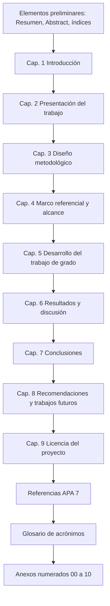

**CLI PNG:** `npx @mermaid-js/mermaid-cli -i Figura-3.mmd -o Figura-3.png`

### B) draw.io

1. **Archivo → Nuevo → Blank** (orientación vertical).  
2. Insertar **Rectángulos redondeados** en columna; copiar textos del flujo anterior.  
3. Conectores **Flecha** de arriba hacia abajo.  
4. **Ajustar → Ajustar a la página**; exportar PNG ancho ~1200 px mínimo.

**Criterios de aceptación.** Incluye capítulos 1–9, Referencias, Glosario, Anexos 00–10; leyenda opcional «Anexo 02» si se usa organigrama alternativo.

---

## Figura 4 — Cronograma Gantt (§ 3.7)

**Pie maestro v2.** *Cronograma Gantt del proyecto Escuela Pass (24/02/2026–21/06/2026). Representación conforme a los diagramas Mermaid de la guía de figuras (§ Fig. 4) o figura institucional equivalente.*

Alinear barras a **Tabla 2b** (siete fases FTG). Fuente Mermaid: diagrama siguiente (homónimo al pie del maestro v2 §2.7).

### A) Mermaid (`gantt`)

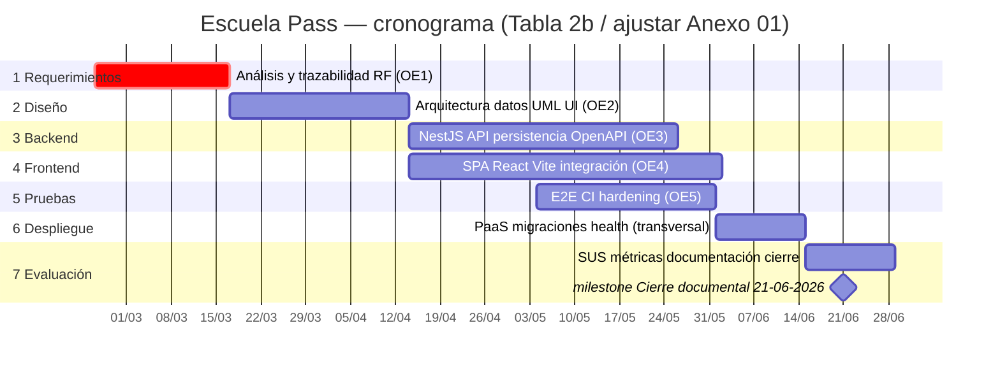

### B) draw.io

Menú **+ Más figuras → Gantt**. Replicar las **siete secciones** anteriores. Incluir en leyenda el intervalo **24/02/2026–21/06/2026**.

**Criterios de aceptación.** Fecha fin visible **21/06/2026**; fases legibles al imprimir; coherencia narrativa con Tabla 2 del capítulo 3.
---

## Figura M1 — Arquitectura lógica por capas (§ 4.1)

**Texto TDG.** Complemento de la **Figura 5**.

### Mermaid (pegar verbatim del maestro v2)

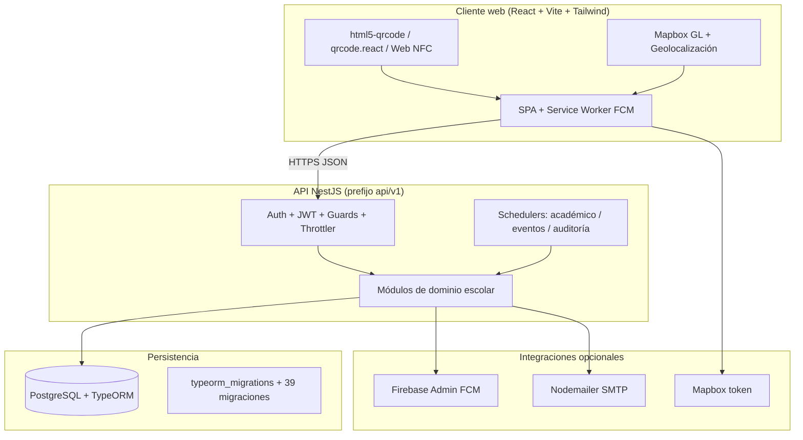

**CLI:** `npx @mermaid-js/mermaid-cli -i Figura-M1.mmd -o Figura-M1.png`

**Nota.** `typeorm_migrations` **sí** aparece en **M1** (detalle técnico de persistencia). **No** va en **Figura 6** (macro por dominios). El cliente usa **service worker FCM**; no se afirma PWA instalable sin `manifest.json` en el repositorio.

---

## Figura 5 — Arquitectura general por capas (ilustración)

**Pie maestro v2.** *Arquitectura general por capas: cliente web, NestJS, PostgreSQL e integraciones opcionales (FCM, Mapbox, SMTP). Conforme **Anexo 03** y diagrama M1.*

**Alineación semántica con M1.** Cinco roles; **NestJS** (no Express); **SPA → Mapbox**; **API → FCM, SMTP, volumen uploads**.

### A) Mermaid (preferido para exportación rápida)

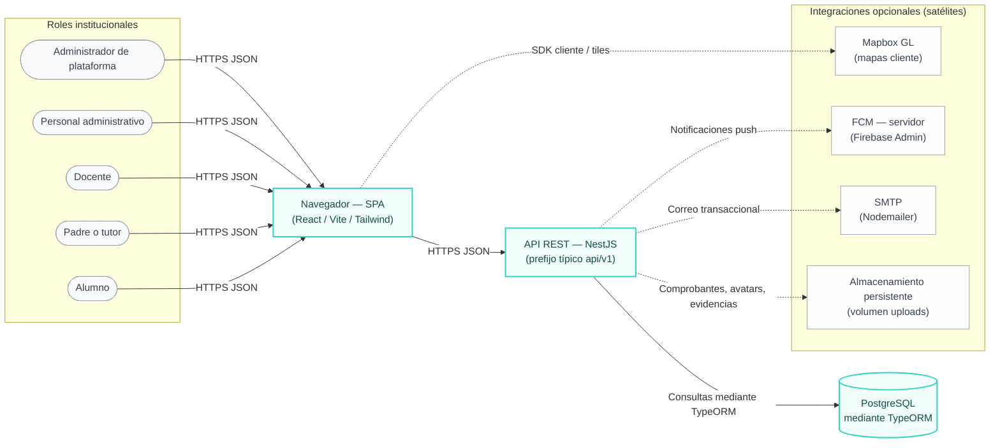

### B) draw.io (guía detallada)
1. **Página** vertical A4; cuadrícula opcional.  
2. **Izquierda:** cinco figuras humanas (icono “User” de la paleta *General*) apiladas, etiquetas en español:  
   - Administrador de plataforma  
   - Personal administrativo  
   - Docente  
   - Padre o tutor  
   - Alumno  
3. Flechas **HTTPS JSON** de cada icono (o un **arco de fan-in** a una sola flecha) hacia rectángulo **Navegador — SPA React / Vite**.  
4. Rectángulo central-derecha: **API REST — NestJS** (subtexto `prefijo api/v1`).  
5. Forma **Cilindro** (base de datos): **PostgreSQL**; caja pequeña o nota pegada: *Persistencia mediante TypeORM*.  
6. Cajas **punteadas** alrededor (“Opcional — integraciones”): **FCM**, **SMTP**, **Mapbox** (tokens); **Almacenamiento volumen uploads** (comprobantes/avatares).  
7. Conector **punteado SPA → Mapbox**; **punteados API ↔ FCM**, **API ↔ SMTP** (coherente con M1).  
8. Conector firme **SPA → API** etiquetado **HTTPS JSON**.  
9. **Distribución vertical** prioritaria para impresión; evitar lámina ultra-ancha.

**Criterios de aceptación (Fig. 5).**

- Cinco actores en español; **HTTPS JSON** hacia SPA y SPA → API.  
- **No** flecha API → Mapbox (Mapbox solo desde navegador).  
- PostgreSQL + TypeORM; satélites opcionales coherentes con capítulo 4.

---

## Figura 6 — Modelo ER resumido por dominios

**Pie literal del maestro v2.**

> *[Figura 6. Modelo entidad–relación **resumido** por dominios funcionales (**núcleo institucional, académico, seguridad física, finanzas, comunicación y agenda**). **Detalle tabular en Anexo 04.**]*

**Interpretación.**

- **Fig. 6** = mapa por dominios (nombres de tabla); **Anexo 04** = ER con FK/columnas.  
- **No** declarar `Ref` en la Fig. 6 del cuerpo (evita grafo ilegible).  
- **49** tablas modelo en `src/database/entities/`; excluir `typeorm_migrations`.

**Notas de pie en Word.**

1. *La tabla `typeorm_migrations` gestiona el versionado del esquema y no se incluye en esta figura macro.*  
2. *Las FK, cardinalidades y columnas figuran en el **Anexo 04**.*  
3. El quinto dominio del pie agrupa también gobernanza operativa (privacidad, auditoría, tokens, importaciones, settings).

### Prompt IA — reordenar dominios (ChartDB / Lucid / dbdiagram)

Copiar en el asistente del diagrama:

```text
Reorganiza este diagrama para Figura 6 TDG Escuela Pass (PostgreSQL, macro resumido).

REGLAS: 49 tablas modelo; EXCLUIR typeorm_migrations. Sin líneas FK. Cada tabla solo en UN dominio. snake_case exacto. PK: id uuid salvo external_visit_groups (visit_id+group_id), external_visit_students (visit_id+student_id), user_privacy_acceptances (user_id+policy_version), institution_settings (setting_key).

Dominio 1 — Núcleo: schools, users, academic_periods, groups, subjects, students, teachers, parents, student_parents, teacher_groups, teacher_subjects, administrative_staff

Dominio 2 — Académico: class_sessions, class_schedule_slots, attendance_records, class_attendance_records, school_non_instructional_days, activities, activity_grades, report_cards, report_card_subjects

Dominio 3 — Seguridad física y circuito: access_credentials, access_events, circuit_requests, vehicles, student_departure_consents, student_lifecycle_events, teacher_lifecycle_events

Dominio 4 — Finanzas: payment_concepts, debts, payments, debt_adjustments

Dominio 5 — Comunicación, agenda y gobierno operativo: notices, notifications, user_fcm_tokens, meetings, meeting_participants, external_visits, external_visit_groups, external_visit_students, student_attention_notes, admin_reports, admin_report_comments, privacy_policies, user_privacy_acceptances, audit_logs, refresh_tokens, import_jobs, institution_settings

Maquetación: cinco bandas verticales legibles; export PNG para tesis.
```

---
### A) dbdiagram.io — **versión oficial para Fig. 6 (**sin aristas FK**)**

> **Motivo.** Cumple con **«resumido por dominios»** y con el texto del pie: agrupa las entidades donde el lector encuentra después el detalle. **Sin declarar `Ref`**: no aparece espagueti; cada caja muestra sólo **`id`** (las tablas puente/compuestas conservan PK compuesta textual). Si dbdiagram muestra errores por `indexes`/`Indexes`, abre ayuda emergente del editor — el bloque puede escribirse como `indexes` en minúsculas según revisión UI.  
> **Colores** en `TableGroup [color]` separan dominios en pantalla/export.

```dbml
// TDG-2 Escuela Pass — Fig. 6 MACRO (solo dominios).
// Omitida: typeorm_migrations. Sin Ref: detalle FK en Anexo 04.

Project EscuelaPass_Fig6_Resumen {
  database_type: 'PostgreSQL'
}

TableGroup "Dominio 1 — Núcleo institucional" [color: #dbeafe] {
  schools
  users
  academic_periods
  groups
  subjects
  students
  teachers
  parents
  student_parents
  teacher_groups
  teacher_subjects
  administrative_staff
}

TableGroup "Dominio 2 — Académico" [color: #d1fae5] {
  class_sessions
  class_schedule_slots
  attendance_records
  class_attendance_records
  school_non_instructional_days
  activities
  activity_grades
  report_cards
  report_card_subjects
}

TableGroup "Dominio 3 — Seguridad física y circuito" [color: #fef9c3] {
  access_credentials
  access_events
  circuit_requests
  vehicles
  student_departure_consents
  student_lifecycle_events
  teacher_lifecycle_events
}

TableGroup "Dominio 4 — Finanzas" [color: #ffedd5] {
  payment_concepts
  debts
  payments
  debt_adjustments
}

TableGroup "Dominio 5 — Comunicación, agenda (+ gobierno del dato operativo)" [color: #ede9fe] {
  notices
  notifications
  user_fcm_tokens
  meetings
  meeting_participants
  external_visits
  external_visit_groups
  external_visit_students
  student_attention_notes
  admin_reports
  admin_report_comments
  privacy_policies
  user_privacy_acceptances
  audit_logs
  refresh_tokens
  import_jobs
  institution_settings
}

Table schools { id uuid [pk] }

Table users { id uuid [pk] }

Table academic_periods { id uuid [pk] }

Table groups { id uuid [pk] }

Table subjects { id uuid [pk] }

Table teachers { id uuid [pk] }

Table parents { id uuid [pk] }

Table students { id uuid [pk] }

Table student_parents { id uuid [pk] }

Table administrative_staff { id uuid [pk] }

Table teacher_groups { id uuid [pk] }

Table teacher_subjects { id uuid [pk] }

Table class_sessions { id uuid [pk] }

Table class_schedule_slots { id uuid [pk] }

Table attendance_records { id uuid [pk] }

Table class_attendance_records { id uuid [pk] }

Table school_non_instructional_days { id uuid [pk] }

Table activities { id uuid [pk] }

Table activity_grades { id uuid [pk] }

Table report_cards { id uuid [pk] }

Table report_card_subjects { id uuid [pk] }

Table access_credentials { id uuid [pk] }

Table access_events { id uuid [pk] }

Table vehicles { id uuid [pk] }

Table circuit_requests { id uuid [pk] }

Table student_departure_consents { id uuid [pk] }

Table student_lifecycle_events { id uuid [pk] }

Table teacher_lifecycle_events { id uuid [pk] }

Table payment_concepts { id uuid [pk] }

Table debts { id uuid [pk] }

Table payments { id uuid [pk] }

Table debt_adjustments { id uuid [pk] }

Table notices { id uuid [pk] }

Table notifications { id uuid [pk] }

Table user_fcm_tokens { id uuid [pk] }

Table meetings { id uuid [pk] }

Table meeting_participants { id uuid [pk] }

Table external_visits { id uuid [pk] }

Table external_visit_groups {
  visit_id uuid [note: 'parte PK compuesta']
  group_id uuid [note: 'parte PK compuesta']
  Indexes { (visit_id, group_id) [pk] }
}

Table external_visit_students {
  visit_id uuid [note: 'parte PK compuesta']
  student_id uuid [note: 'parte PK compuesta']
  Indexes { (visit_id, student_id) [pk] }
}

Table student_attention_notes { id uuid [pk] }

Table admin_reports { id uuid [pk] }

Table admin_report_comments { id uuid [pk] }

Table privacy_policies { id uuid [pk] }

Table user_privacy_acceptances {
  user_id uuid [note: 'parte PK compuesta']
  policy_version varchar(32) [note: 'parte PK compuesta']
  Indexes { (user_id, policy_version) [pk] }
}

Table audit_logs { id uuid [pk] }

Table refresh_tokens { id uuid [pk] }

Table import_jobs { id uuid [pk] }

Table institution_settings {
  setting_key varchar(64) [pk]
}
```

**Pasos prácticos en dbdiagram.io**

1. **Pega** sólo esta variante macro → espera compilación ✓  
2. **Arrastra los cinco bloques coloridos** a una hilera horizontal o pila vertical (Dominio 1 arriba, … 5 abajo); **zoom** antes de Export.  
3. **Export PNG** ancho suficiente; en Word suele mejor **una página apaisada** o **dos figuras** (Dominios 1‑3 | 4‑5) si programa lo permite — **sigues cumpliendo** el pie porque el mensaje es *resumido por dominios*.

---

### A.bis) dbdiagram.io — grafo técnico con **todas** las FK (no para Fig. 6 del cuerpo)

Si sólo necesitas ingeniería inversa rápida, **dbdiagram Import → PostgreSQL DDL** desde tu base desarrollo (tras `migrate`) genera aristas coherentes sin mantener otro archivo en el TDG.

Si insiste literalmente tu director en líneas reproducibles desde DBML pero **manteniendo** el pie «resumido»: usa **esta misma vista macro §A** como **Figura 6** documental y deja cualquier dibujo FK denso sólo como **Anexo** (numeración separada) con leyenda *“diagrama técnico de referencia, no modelo resumido”*.

### B) draw.io (sin motor SQL)

1. Insertar **cinco contenedores** (swimlanes o rectángulos agrupados) con títulos en español = dominios anteriores.  
2. Dentro, **un rectángulo por tabla**; texto = nombre `snake_case` **sin columnas**.  
3. **Tres o cuatro** conectores **Crow’s foot** (o flechas) solo entre *hubs* (`schools`, `students`, `users`) para no saturar.  
4. Leyenda al pie con la nota de **typeorm_migrations**.

### C) Mermaid — alternativa **sin** notación Crow’s-foot (solo agrupación)

Útil si no puedes usar dbdiagram.io; mejor impresión con **orientación TD** y **fontSize** tema claro:

```mermaid
flowchart TB
  subgraph D1 ["1 — Núcleo institucional"]
    direction TB
    schools
    users
    academic_periods
    groups
    subjects
    students
    teachers
    parents
    student_parents
    teacher_groups
    teacher_subjects
    administrative_staff
  end

  subgraph D2 ["2 — Académico"]
    direction TB
    class_sessions
    class_schedule_slots
    attendance_records
    class_attendance_records
    school_non_instructional_days
    activities
    activity_grades
    report_cards
    report_card_subjects
  end

  subgraph D3 ["3 — Seguridad física y circuito"]
    direction TB
    access_credentials
    access_events
    circuit_requests
    vehicles
    student_departure_consents
    student_lifecycle_events
    teacher_lifecycle_events
  end

  subgraph D4 ["4 — Finanzas"]
    direction TB
    payment_concepts
    debts
    payments
    debt_adjustments
  end

  subgraph D5 ["5 — Comunicación y agenda"]
    direction TB
    notices
    notifications
    user_fcm_tokens
    meetings
    meeting_participants
    external_visits
    external_visit_groups
    external_visit_students
    student_attention_notes
    admin_reports
    admin_report_comments
    privacy_policies
    user_privacy_acceptances
    audit_logs
    refresh_tokens
    import_jobs
    institution_settings
  end
```

*(Sin aristas entre subgrafos; nota al pie: gobierno operativo del dato en dominio 5.)*

**Criterios de aceptación (Fig. 6).** Cinco dominios visibles; 49 tablas; sin spaghetti FK; PK compuestas correctas; `student_departure_consents` (no nombres inventados).

---

## Figura M2 — Actores ↔ módulos (§ 4.1)

### Mermaid (maestro v2)

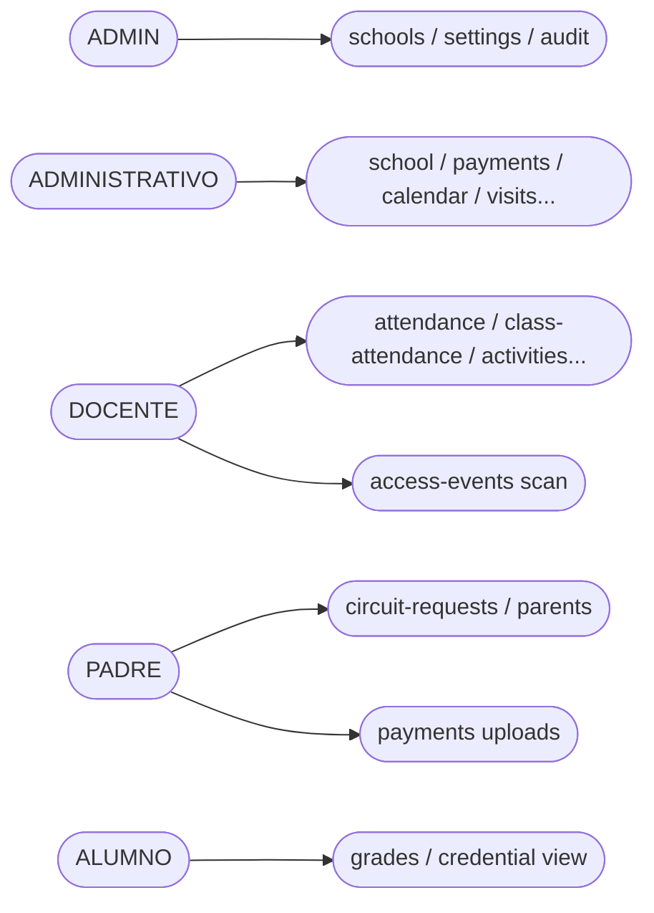

---

## Figura 7 — Casos de uso UML (estrategia por RF1–RF8)

**Pie literal del maestro v2 (solo en la primera lámina: 7-Índice o 7-RF1).**

> *[Figura 7. Diagrama UML de casos de uso del sistema Escuela Pass agrupado por los cinco actores institucionales, conforme a la notación UML 2.5.1 (OMG, 2017). Representación conforme **Anexo 05**.]*

**Producción.** Nueve exportaciones draw.io/Lucid: **7-Índice** + **7-RF1** … **7-RF8**. En Word sustituyen el placeholder del maestro §4.1 (L500) **sin editar** el borrador v2.

**Referencias.** Maestro §4.1 (Tabla 6, Fig. M2, reglas L498); **Anexo 01** (matriz RF L832–839); **Anexo 05 §2.1–2.5** (inventario exhaustivo).

### Inserción en Word (hueco §4.1 L500)

**Orden recomendado:** texto puente → 7-Índice (pie literal maestro) → 7-RF1 … 7-RF8.

**Texto puente (copiar una vez, encima de la primera imagen):**

> *La Figura 7 del presente capítulo se presenta desglosada en las láminas 7-Índice y 7-RF1 a 7-RF8, organizadas por requerimiento funcional (RF1–RF8), conservando los cinco actores institucionales y el inventario exhaustivo de casos de uso del **Anexo 05**, sección 2.*

**Pies en láminas RF2–RF8:** *Figura 7 (continuación) — RFx: [nombre]. UML 2.5.1 (OMG, 2017). Conforme Anexo 05 §2.*

**Archivos sugeridos:** `fig-7-indice.drawio`, `fig-7-rf1-identidad.drawio`, … `fig-7-rf8-tableros.drawio`.

### Contexto del sistema

**Escuela Pass** (AlfaNetworks): SPA React + API NestJS (`api/v1`) + PostgreSQL; roles `ADMIN`, `ADMINISTRATIVO`, `DOCENTE`, `PADRE`, `ALUMNO`. Circuito RF3 operado por **padre o tutor** (no flota escolar). Finanzas RF6 con **verificación humana** y **sin pasarela bancaria**. ADMIN: soporte multi-institución documentado.

### Actores (etiquetas exactas — Tabla 6 maestro)

| Actor en diagrama | Rol | Aparece en láminas |
| --- | --- | --- |
| Administrador de plataforma | `ADMIN` | Índice, RF1, RF2, RF3, RF4, RF6, RF8 |
| Personal administrativo | `ADMINISTRATIVO` | Índice, RF1, **RF2**, RF3–RF8 |
| Docente | `DOCENTE` | Índice, RF1, RF2, RF3, RF4, RF5, RF7, RF8 |
| Padre o tutor | `PADRE` | Índice, RF1, RF3–RF7 (**sin RF2** — no escanea en portería ni opera escáner) |
| Alumno | `ALUMNO` | Índice, RF1, RF3, RF5, **RF6**, RF7 (**sin RF2 en índice**; credencial QR en **Mi perfil**, lámina RF2) |

### Requerimientos funcionales (etiquetas de lámina)

| RF | Nombre en diagrama |
| --- | --- |
| RF1 | Identidad, sesión y privacidad |
| RF2 | Control de acceso QR/NFC |
| RF3 | Circuito de recogida familiar |
| RF4 | Gestión escolar e importaciones |
| RF5 | Asistencia, actividades y calificaciones |
| RF6 | Finanzas y comprobantes |
| RF7 | Avisos, notificaciones y reportes |
| RF8 | Tableros, reportes y exportaciones |

### Matriz de cobertura Anexo 05 §2 → lámina

Cada fila de las tablas del maestro L1740–1827 se representa en **exactamente una** lámina RF (elipses). La lámina **7-RF1** concentra identidad/privacidad compartida; RF2–RF8 llevan nota *«Requiere sesión (Fig. 7-RF1)»* sin redibujar autenticación.

| §2 maestro | Filas | Láminas donde van las elipses |
| --- | --- | --- |
| §2.1 Administrador plataforma | 11 | RF1 (6), RF2 (1), RF4 (3), RF8 (2) |
| §2.2 Personal administrativo | 20 | RF1 (2), RF2 (2), RF3 (1), RF4 (9), RF5 (2), RF6 (2), RF7 (1), RF8 (1) |
| §2.3 Docente | 13 | RF1 (2), RF2 (1), RF3 (1), RF4 (1), RF5 (6), RF7 (1), RF8 (1) |
| §2.4 Padre o tutor | 16 | RF1 (2), RF3 (8), RF4 (2), RF5 (2), RF6 (1), RF7 (1) |
| §2.5 Alumno | 8 | RF1 (2), RF2 (1), RF3 (1), RF5 (2), RF7 (2) |
| **Total filas inventario** | **68** (11+20+13+16+8 en maestro §2.1–2.5) | **8 láminas RF + índice** |

### Reglas de negocio (maestro L498) → nota en lámina

| Regla | Lámina |
| --- | --- |
| Antiduplicación escaneo (~10 s) | 7-RF2 |
| Una solicitud activa de circuito / estudiante / día | 7-RF3 |
| Verificación humana de pagos; sin pasarela | 7-RF6 |
| Lifecycle personas (sesiones) | Nota en hub; detalle Anexo 01 §7 |

### Inventario consolidado por actor (referencia — Anexo 05 §2)

**Administrador de plataforma**

| Elipse | RF | §2 |
| --- | --- | --- |
| Autenticarse, cerrar sesión, recuperar contraseña y renovar token | RF1 | §2.1 |
| Aceptar y consultar políticas de privacidad | RF1 | §2.1 |
| Gestionar instituciones (escuelas) | RF4 | §2.1 |
| Asignar usuarios a institución y reasignar contextos | RF4 | §2.1 |
| Restablecer contraseñas de usuarios institucionales | RF1 | §2.1 |
| Configurar parámetros institucionales y del circuito | RF4 | §2.1 |
| Consultar tableros y reportes consolidados de plataforma | RF8 | §2.1 |
| Exportar reportes (finanzas, asistencia, calificaciones, boletines) | RF8 | §2.1 |
| Consultar bitácora de auditoría | RF1 | §2.1 |
| Gestionar políticas de privacidad versionadas | RF1 | §2.1 |
| Configurar credenciales NFC para usuarios | RF2 | §2.1 |
| Escanear credencial QR/NFC en plantel | RF2 | §2.1 (API `POST access-events/scan`; menú **Escáner de acceso**) |

**Personal administrativo** — veinte filas §2.2; escaneo y credenciales NFC en lámina **7-RF2** (misma API que administrador de plataforma).

**Docente, Padre o tutor, Alumno** — tablas §2.3–§2.5 (13 + 16 + 8 filas).

### Checklist coherencia TDG (antes de exportar)

- [ ] Texto puente pegado en Word sobre la primera lámina.
- [ ] Pie literal maestro solo en **7-Índice** (o 7-RF1 si no hay índice).
- [ ] Los cinco actores visibles en **7-Índice**.
- [ ] 68/68 filas §2 cubiertas en RF1–RF8.
- [ ] RF2 índice: **A2→RF2** (administrativo); **sin A4→RF2** (padre); **sin A5→RF2** (alumno solo en lámina RF2).
- [ ] RF2 lámina: actores escaneo = Admin + Administrativo + Docente; NFC = Admin + Administrativo.
- [ ] RF3: padre/tutor inicia; sin conductor escolar.
- [ ] RF6: sin pasarela en nota y elipses; menú **Finanzas** visible para `ALUMNO` y `PADRE`.
- [ ] RF7 UI: campana + Inicio por rol + `linkPath`; matriz § RF7.
- [ ] Cada PNG legible al 100 % zoom impresión Word.

---

### Figura 7-Índice — Vista macro (5 actores × 8 RF)

**Actores:** los cinco de Tabla 6. **Sin elipses** — solo cajas RF1–RF8 dentro de «Sistema Escuela Pass».

#### Mermaid (vía A — referencia rápida)

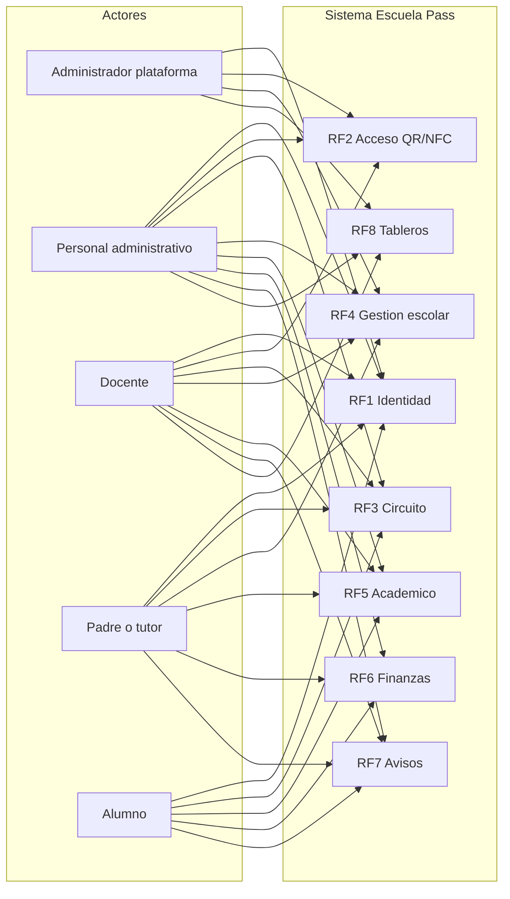

#### draw.io

1. UML o cajas; A4 apaisado.  
2. Columna izquierda: cinco actores.  
3. Derecha: rectángulo sistema con 8 subcajas RF (solo títulos).  
4. Líneas actor → RF según matriz «Actores en lámina» del hub.  
5. Export PNG; **pie literal completo del maestro** (bloque inicial de esta sección).

#### Prompt IA (índice)

```text
Diagrama UML índice Escuela Pass. Sin casos de uso (sin elipses). Izquierda: cinco actores. Derecha: «Sistema Escuela Pass» con RF1–RF8. Asociaciones macro (producto real): Admin→RF1,RF2,RF3,RF4,RF6,RF8; Personal administrativo→RF1,RF2,RF3–RF8; Docente→RF1,RF2,RF3–RF5,RF7,RF8; Padre→RF1,RF3–RF7 (NO RF2); Alumno→RF1,RF3,RF5,RF6,RF7 (NO RF2 en índice; QR en Mi perfil). Fondo blanco. Nota: láminas 7-RF1…RF8 con elipses.
```

**Criterios.** Cinco actores; ocho RF visibles; sin elipses; pie literal maestro.

---

### Figura 7-RF1 — Identidad, sesión y privacidad

**Actores:** los cinco. **Cubre §2.1–2.5** filas de autenticación y privacidad (10 elipses compartidas + 3 solo ADMIN).

| Elipse | Actor(es) | §2 |
| --- | --- | --- |
| Autenticarse, cerrar sesión, recuperar contraseña y renovar token | Los 5 | §2.1–2.5 |
| Aceptar y consultar políticas de privacidad | Los 5 | §2.1–2.5 |
| Restablecer contraseñas de usuarios institucionales | Administrador plataforma | §2.1 |
| Consultar bitácora de auditoría | Administrador plataforma | §2.1 |
| Gestionar políticas de privacidad versionadas | Administrador plataforma | §2.1 |

**Relaciones:** `Aceptar política` `<<include>>` `Autenticarse` (RF1).

**Nota lámina:** Base JWT; módulos `auth`, `privacy`, `audit` (Anexo 01 RF1).

#### draw.io

Límite: `«Sistema Escuela Pass — RF1»`. Máx. 5–7 elipses; asociaciones desde cada actor. Leyenda UML 2.5.1.

#### Prompt IA (RF1)

```text
Diagrama casos de uso UML 2.5.1 RF1 Identidad sesion y privacidad, Escuela Pass. Actores: Administrador de plataforma, Personal administrativo, Docente, Padre o tutor, Alumno (stick figures izquierda). Sistema derecha: RF1. Elipses: Autenticarse cerrar sesion recuperar contrasena renovar token (los 5 actores); Aceptar y consultar politicas de privacidad (los 5); Restablecer contrasenas usuarios institucionales (solo Admin plataforma); Consultar bitacora de auditoria (solo Admin plataforma); Gestionar politicas de privacidad versionadas (solo Admin plataforma). Include: Aceptar politica include Autenticarse. Fondo blanco, >=10 pt. Pie: Figura 7 (continuacion) RF1 Identidad sesion y privacidad. UML 2.5.1. Anexo 05.
```

**Criterios.** Cinco actores; RF1 completo; sin casos de otros RF.

---

### Figura 7-RF2 — Control de acceso QR/NFC

**Actores en lámina:** Administrador de plataforma, **Personal administrativo**, Docente, Alumno. **Excluido:** Padre o tutor (no escanea en portería; su flujo es RF3 circuito). **Nota:** antiduplicación ~10 s (mismo usuario/escuela); respuesta **201** + `duplicate=true` (maestro L498). **API:** `POST /api/v1/access-events/scan` → `@Roles(ADMIN, ADMINISTRATIVO, DOCENTE)`; NFC → `ADMIN` y `ADMINISTRATIVO`. **UI:** `/app/acceso/escaner` (menú **Escáner de acceso**); QR del alumno en `/app/perfil` (`GET my-qr`).

| Elipse | Actor(es) | §2 / código |
| --- | --- | --- |
| Configurar credenciales NFC para usuarios | Administrador plataforma, Personal administrativo | §2.1, §2.2 + API `credentials/nfc` |
| Escanear credencial QR/NFC en plantel o clase | Administrador plataforma, Personal administrativo, Docente | §2.1, §2.2, §2.3 + menú escáner |
| Consultar credencial QR personal | Alumno | §2.5 — pantalla **Mi perfil**, no escáner |

**Relación opcional:** `Escanear QR/NFC` `<<extend>>` asistencia docente (solo si legible; detalle en RF5).

**Nota:** *Requiere sesión (Fig. 7-RF1).*

#### Prompt IA (RF2)

```text
UML RF2 Control acceso QR/NFC Escuela Pass. Actores: Administrador de plataforma, Personal administrativo, Docente, Alumno. SIN Padre o tutor. Sistema RF2 Acceso. Elipses: Configurar credenciales NFC (Admin y Administrativo); Escanear credencial QR/NFC en plantel o clase (Admin, Administrativo, Docente); Consultar credencial QR personal (Alumno, via Mi perfil). Nota antiduplicacion ~10 s respuesta 201 duplicate=true. Ruta UI escaner /app/acceso/escaner. Requiere sesion RF1. Fondo blanco. Pie continuacion RF2.
```

**Criterios.** Cuatro actores; tres elipses; coherente `access.controller.ts`, `navConfig` y E2E scan.

---

### Figura 7-RF3 — Circuito de recogida familiar

**Actores:** Padre o tutor (operador), Personal administrativo, Docente, Alumno. **Sin conductor escolar ni flota** (caja RF3 maestro L473).

| Elipse | Actor | §2 |
| --- | --- | --- |
| Consultar hijos vinculados con autorización de recogida | Padre o tutor | §2.4 |
| Iniciar solicitud de circuito por hijo y día | Padre o tutor | §2.4 |
| Actualizar ubicación GPS del trayecto | Padre o tutor | §2.4 |
| Avanzar estado del circuito | Padre o tutor | §2.4 |
| Confirmar entrega del estudiante | Padre o tutor | §2.4 |
| Cancelar solicitud de circuito | Padre o tutor | §2.4 |
| Registrar y administrar vehículos familiares | Padre o tutor | §2.4 |
| Registrar consentimiento de salida diario | Padre o tutor | §2.4 |
| Enviar señal docente al circuito activo | Docente | §2.3 |
| Operar circuito lado escuela (autorizar, confirmar entrega, cancelar) | Personal administrativo | §2.2 |
| Consultar consentimiento de salida del día | Alumno | §2.5 |

**Nota:** Una solicitud activa por estudiante por día.

#### Prompt IA (RF3)

```text
UML RF3 Circuito recogida familiar Escuela Pass. Actores: Padre o tutor (OPERADOR inicia circuito, NO conductor escolar), Personal administrativo, Docente, Alumno. Elipses padre: consultar hijos vinculados; iniciar solicitud circuito por hijo y dia; actualizar GPS; avanzar estado; confirmar entrega; cancelar solicitud; registrar vehiculos familiares; registrar consentimiento salida diario. Docente: enviar senal docente al circuito activo. Administrativo: operar circuito lado escuela autorizar confirmar cancelar. Alumno: consultar consentimiento salida del dia. Nota: 1 circuito activo por estudiante por dia. Requiere sesion RF1. Pie continuacion RF3.
```

**Criterios.** Padre inicia; escuela autoriza; alineado Fig. 8 / M4.

---

### Figura 7-RF4 — Gestión escolar e importaciones

**Actores:** Administrador plataforma, Personal administrativo, Docente, Padre o tutor.

| Elipse | Actor | §2 |
| --- | --- | --- |
| Gestionar instituciones (escuelas) | Administrador plataforma | §2.1 |
| Asignar usuarios a institución y reasignar contextos | Administrador plataforma | §2.1 |
| Configurar parámetros institucionales y del circuito | Administrador plataforma | §2.1 |
| Gestionar grupos, materias, estudiantes, docentes y padres | Personal administrativo | §2.2 |
| Vincular padre–estudiante con autorización de recogida | Personal administrativo | §2.2 |
| Importar nóminas y asignaciones vía Excel | Personal administrativo | §2.2 |
| Consultar historial de importaciones | Personal administrativo | §2.2 |
| Configurar calendario y días no lectivos | Personal administrativo | §2.2 |
| Gestionar horarios y franjas por grupo | Personal administrativo | §2.2 |
| Gestionar visitas externas | Personal administrativo | §2.2 |
| Crear reuniones y gestionar RSVP | Personal administrativo | §2.2 |
| Subir logos y administrar archivos | Personal administrativo | §2.2 |
| Registrar anotaciones de atención al estudiante | Docente | §2.3 |
| Solicitar reuniones o visitas; responder convocatorias | Padre o tutor | §2.4 |
| Consultar anotaciones de atención del hijo | Padre o tutor | §2.4 |

#### Prompt IA (RF4)

```text
UML RF4 Gestion escolar e importaciones Escuela Pass. Actores: Administrador plataforma, Personal administrativo, Docente, Padre o tutor. Elipses Admin: gestionar instituciones; asignar usuarios institucion; configurar parametros institucional y circuito. Administrativo: gestionar grupos materias estudiantes docentes padres; vincular padre-estudiante autorizacion recogida; importar nominas Excel; historial importaciones; calendario dias no lectivos; horarios franjas; visitas externas; reuniones RSVP; logos archivos. Docente: anotaciones atencion estudiante. Padre: solicitar reuniones visitas RSVP; consultar anotaciones hijo. Requiere sesion RF1. Pie continuacion RF4.
```

**Criterios.** 15 elipses; import Excel e visitas incluidas.

---

### Figura 7-RF5 — Asistencia, actividades y calificaciones

**Actores:** Personal administrativo, Docente, Padre o tutor, Alumno.

| Elipse | Actor | §2 |
| --- | --- | --- |
| Configurar periodos académicos (abrir, cerrar, reabrir) | Personal administrativo | §2.2 |
| Generar y consolidar boletines (PDF) | Personal administrativo | §2.2 |
| Consultar asignaciones y horario | Docente | §2.3 |
| Registrar asistencia diaria por grupo | Docente | §2.3 |
| Registrar asistencia por sesión de clase | Docente | §2.3 |
| Crear, editar y cerrar actividades académicas | Docente | §2.3 |
| Registrar y editar calificaciones por actividad | Docente | §2.3 |
| Reabrir actividad cerrada (justificación auditada) | Docente | §2.3 |
| Justificar inasistencia con excusa adjunta | Padre o tutor | §2.4 |
| Consultar asistencia, calificaciones, boletines y horario del hijo | Padre o tutor | §2.4 |
| Consultar horario y calendario académico | Alumno | §2.5 |
| Consultar calificaciones y boletines propios | Alumno | §2.5 |

#### Prompt IA (RF5)

```text
UML RF5 Asistencia actividades calificaciones Escuela Pass. Actores: Personal administrativo, Docente, Padre o tutor, Alumno. Administrativo: periodos academicos; boletines PDF. Docente: consultar asignaciones horario; asistencia diaria grupo; asistencia sesion clase; actividades academicas; calificaciones; reabrir actividad justificada. Padre: justificar inasistencia excusa; consultar asistencia calificaciones boletines horario hijo (Academico). Alumno: horario calendario; calificaciones boletines. Requiere sesion RF1. Pie continuacion RF5.
```

**Criterios.** Asistencia dual docente; boletines administrativo.

---

### Figura 7-RF6 — Finanzas y comprobantes

**Actores:** Personal administrativo, Padre o tutor. **Sin pasarela bancaria automática** (maestro L498, RF6 L837).

| Elipse | Actor | §2 |
| --- | --- | --- |
| Verificar o rechazar comprobantes; gestionar deudas y conceptos | Personal administrativo | §2.2 |
| Ejecutar políticas automatizadas de cartera | Personal administrativo | §2.2 |
| Cargar comprobante y consultar estado de deuda | Padre o tutor | §2.4 |

#### Prompt IA (RF6)

```text
UML RF6 Finanzas y comprobantes Escuela Pass SIN pasarela bancaria automatica. Actores: Personal administrativo, Padre o tutor. Elipses: verificar o rechazar comprobantes gestionar deudas conceptos (Administrativo); politicas automatizadas cartera (Administrativo); cargar comprobante consultar deuda (Padre). Nota: verificacion humana obligatoria. Requiere sesion RF1. Pie continuacion RF6.
```

**Criterios.** Tres elipses §2; nota sin pasarela visible.

---

### Figura 7-RF7 — Avisos, notificaciones y reportes

**Actores:** Personal administrativo, Docente, Padre o tutor, Alumno.

| Elipse | Actor | §2 |
| --- | --- | --- |
| Atender reportes administrativos (SLA) | Personal administrativo | §2.2 |
| Consultar avisos y notificaciones | Docente | §2.3 |
| Recibir avisos y notificaciones (push opcional) | Padre o tutor | §2.4 |
| Consultar avisos institucionales | Alumno | §2.5 |
| Recibir notificaciones personales | Alumno | §2.5 |

**Nota:** FCM opcional (degradación controlada si no hay credenciales).

**UI — matriz de descubrimiento:**

| Vía | Componente | Roles | Comportamiento |
| --- | --- | --- | --- |
| Campana (header) | `NotificationsBadge` en `AppShell` | Todos autenticados | Panel con no leídas; al pulsar ítem con `linkPath` → `navigate(linkPath)` (FCM/eventos suelen usar `/app/modulos/comunicacion?notification=…`; académicas → calificaciones/boletines; pagos → finanzas). **Sin** botón «Ver bandeja completa» en el panel. |
| Inicio — tarjetas | `AppHomePage` | `ALUMNO` | Card «Notificaciones recientes» → comunicación |
| Inicio — tarjetas | `AppHomePage` | `PADRE` | Cards «Anotaciones recientes» y «Notificaciones recientes»; modal anotación → «Ir a comunicación» |
| Inicio — tarjetas | `AppHomePage` | `DOCENTE` | Card «Notificaciones recientes» |
| Inicio — atajo | `AppHomePage` | `ADMIN` (`HomePlatformAdmin`) | «Comunicación institucional» en accesos rápidos |
| Inicio — panel escuela | `AdminDashboardPanel` | `ADMINISTRATIVO` | **Sin** enlace directo a comunicación (solo circuito del día / informes); staff llega por campana, URL o publicación si ya está en la ruta |
| Menú lateral | `navConfig.ts` | — | Comunicación no figura como ítem del sidebar |
| Ruta directa | `App.tsx` | Todos | `/app/modulos/comunicacion` → `ComunicacionPage` (bandeja + publicar avisos si staff) |
| Horario | `StudentSchedulePage` | Quien use `/app/horario` | Lista avisos **en la misma página** (no redirige a comunicación) |

#### Prompt IA (RF7)

```text
UML RF7 Avisos notificaciones reportes Escuela Pass. Actores: Personal administrativo, Docente, Padre o tutor, Alumno. Elipses segun maestro Anexo 05 §2. Nota UI: bandeja /app/modulos/comunicacion; acceso por campana NotificationsBadge (panel y linkPath), tarjetas en Inicio por rol y deep links FCM. FCM opcional. Requiere sesion RF1. Pie continuacion RF7.
```

**Criterios.** SLA administrativo; capturas: campana abierta + tarjeta Inicio + pantalla Comunicación.

---

### Figura 7-RF8 — Tableros, reportes y exportaciones

**Actores:** Administrador plataforma, Personal administrativo, Docente.

| Elipse | Actor | §2 |
| --- | --- | --- |
| Consultar tableros y reportes consolidados de plataforma | Administrador plataforma | §2.1 |
| Exportar reportes (finanzas, asistencia, calificaciones, boletines) | Administrador plataforma | §2.1 |
| Consultar tablero institucional y exportaciones | Personal administrativo | §2.2 |
| Generar reportes de asistencia y calificaciones | Docente | §2.3 |

#### Prompt IA (RF8)

```text
UML RF8 Tableros reportes exportaciones Escuela Pass. Actores: Administrador plataforma, Personal administrativo, Docente. Elipses Admin: tableros reportes plataforma; exportar reportes Excel PDF. Administrativo: tablero institucional exportaciones. Docente: reportes asistencia calificaciones grupos. Requiere sesion RF1. Pie continuacion RF8.
```

**Criterios.** Cuatro elipses; exportaciones Excel/PDF citadas.

### Criterios de aceptación (conjunto Figura 7)

- Nueve láminas en orden: Índice → RF1 … RF8.  
- **68/68** filas Anexo 05 §2 representadas en RF1–RF8.  
- Cinco actores (Tabla 6); RF3 padre/tutor; RF6 sin pasarela.  
- UML 2.5.1; pies según convención hub.  
- Coherencia matriz RF maestro L832–839 y texto §4.1 L469–500.

---

## Figura M3 + Figura 9 — Secuencia escaneo QR/NFC

### Mermaid (= maestro; Fig. 9 = versión UML paralela recomendada con mismos mensajes)

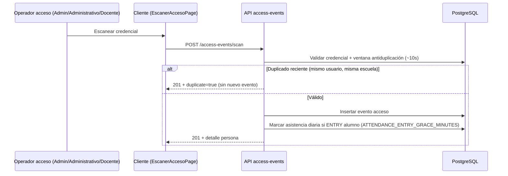

### draw.io (Fig. 9 formal — `A05-SEQ-2`)

Lifelines: *Operador acceso* (`ADMIN` | `ADMINISTRATIVO` | `DOCENTE` — **no** `PADRE` ni `ALUMNO`), *EscanerAccesoPage*, *AccessEvents*, *PostgreSQL*. Mensajes: `POST /access-events/scan`; **alt** 201 + `duplicate=true` (~10 s, mismo usuario/escuela) vs 201 + evento nuevo; asistencia automática solo en `attendance_records` (ENTRY alumno); nota `ATTENDANCE_ENTRY_GRACE_MINUTES`.

**Criterios de aceptación.** Endpoint y códigos HTTP alineados al maestro §4.3.

---

## Figura M4 + Figura 8 — Secuencia circuito familiar
### Mermaid (= maestro)

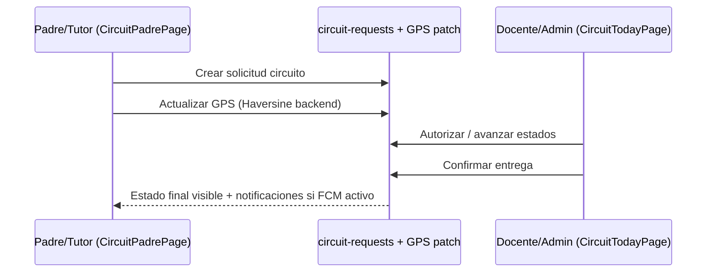

### draw.io (Fig. 8 formal — `A05-SEQ-1`)

**Pie maestro.** Complemento gráfico de **M4**; RF3 padre/tutor como operador móvil.

**Lifelines:** *Padre/Tutor (CircuitPadrePage)*, *API circuit-requests*, *Personal (CircuitTodayPage)*, *PostgreSQL*.

**Mensajes mínimos:**

1. `POST` crear solicitud circuito (una activa por estudiante/día).  
2. `PATCH` actualizar GPS → validación Haversine en servidor.  
3. Personal: autorizar / avanzar estados (`PENDIENTE` → … → `ENTREGADO`).  
4. Confirmar entrega; acuse padre si aplica.  
5. Fragmento **opt** notificación FCM si credenciales activas.  
6. Rama **opt** cancelación (`CANCELADO`) en nota o subflujo.

**Criterios de aceptación.** Coherente con entidad `circuit_requests` y texto §4.3–4.4; no modelo “conductor interno” de flota.

---

## Figura 10 — Licencia

**Pie maestro v2.** *Licencia del proyecto conforme instructivo institucional y acuerdo empresa–institución tras homologación con AlfaNetworks* (L638).

**Sin generador IA.** Incrustar PDF/imagen homologado **AlfaNetworks** + formato APIT.
---

## Anexo 03 — Arquitectura de software

### A03-1 — Vista lógica (`[Figura 1. Arquitectura lógica…]`)

**Pie maestro.** Contexto del sistema; módulos reales de [`src/app.module.ts`](../../src/app.module.ts).

### A) Mermaid

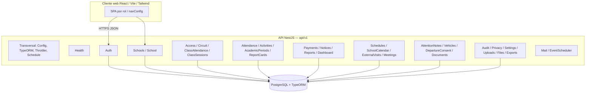

**Nota draw.io.** Pie: excepción **ADMIN** documentada en RolesGuard (Anexo 03 §4.1).

### A03-2 — Despliegue (`[Figura 2. Vista de despliegue…]`)

Reutilizar semántica de **Figura 5** / § Figura 5 Mermaid. Verificar antes de capturar: `railway.toml`, `frontend/vercel.json`, `UPLOADS_DIR`, PostgreSQL gestionado.

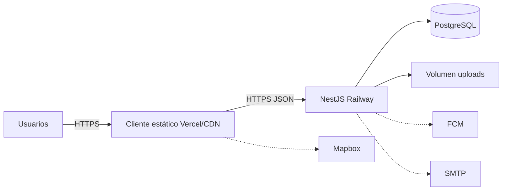

---

## Anexo 04 — ER detallado por dominio (5 figuras)

**Diferencia con Fig. 6 cuerpo:** aquí **sí** hay `Ref` y columnas FK principales (`uuid`). Incluir `administrative_staff` en núcleo aunque el placeholder L1529 del maestro no lo liste (coherencia código).

### A04-ER-1 — Núcleo multi-institución

**Pie maestro L1529.** `schools`, `users`, `groups`, `subjects`, `students`, `teachers`, `parents`, `student_parents`, `teacher_groups`, `teacher_subjects`, `academic_periods` + `administrative_staff`.

```dbml
Project A04_ER1 { database_type: 'PostgreSQL' }
TableGroup nucleo { schools users academic_periods groups subjects students teachers parents student_parents teacher_groups teacher_subjects administrative_staff }
Table schools { id uuid [pk] }
Table users { id uuid [pk] school_id uuid [ref: > schools.id, null] }
Table students { id uuid [pk] user_id uuid [ref: > users.id] school_id uuid [ref: > schools.id] group_id uuid [ref: > groups.id, null] }
Table groups { id uuid [pk] school_id uuid [ref: > schools.id] }
Table teachers { id uuid [pk] user_id uuid [ref: > users.id] }
Table parents { id uuid [pk] user_id uuid [ref: > users.id] }
Table student_parents { id uuid [pk] student_id uuid [ref: > students.id] parent_id uuid [ref: > parents.id] }
Table administrative_staff { id uuid [pk] user_id uuid [ref: > users.id] }
Ref: academic_periods.school_id > schools.id
Ref: subjects.school_id > schools.id
```

### A04-ER-2 — Académico (L1531)

**Pie maestro L1531.** Nueve tablas; FK hacia núcleo (`schools`, `students`, `groups`, `teachers`, `subjects`, `academic_periods`).

```dbml
Project A04_ER2 { database_type: 'PostgreSQL' }
TableGroup academico [color: #d1fae5] {
  class_sessions class_schedule_slots attendance_records class_attendance_records
  school_non_instructional_days activities activity_grades report_cards report_card_subjects
}
Table class_sessions {
  id uuid [pk]
  school_id uuid [ref: > schools.id]
  academic_period_id uuid [ref: > academic_periods.id]
  group_id uuid [ref: > groups.id]
  subject_id uuid [ref: > subjects.id]
  teacher_id uuid [ref: > teachers.id]
}
Table class_schedule_slots { id uuid [pk] class_session_id uuid [ref: > class_sessions.id] }
Table attendance_records { id uuid [pk] student_id uuid [ref: > students.id] }
Table class_attendance_records { id uuid [pk] class_session_id uuid [ref: > class_sessions.id] student_id uuid [ref: > students.id] }
Table school_non_instructional_days { id uuid [pk] school_id uuid [ref: > schools.id] }
Table activities { id uuid [pk] teacher_id uuid [ref: > teachers.id] group_id uuid [ref: > groups.id, null] }
Table activity_grades { id uuid [pk] activity_id uuid [ref: > activities.id] student_id uuid [ref: > students.id] }
Table report_cards { id uuid [pk] student_id uuid [ref: > students.id] academic_period_id uuid [ref: > academic_periods.id] }
Table report_card_subjects { id uuid [pk] report_card_id uuid [ref: > report_cards.id] subject_id uuid [ref: > subjects.id] }
```

**Criterios.** Nueve tablas del placeholder; `uuid` en FK; no `bigint`.

### A04-ER-3 — Seguridad física (L1533)

**Pie maestro L1533.** Hub `access_events` y `circuit_requests`.

```dbml
Project A04_ER3 { database_type: 'PostgreSQL' }
TableGroup seguridad [color: #fef9c3] {
  access_credentials access_events circuit_requests vehicles
  student_departure_consents student_lifecycle_events teacher_lifecycle_events
}
Table access_credentials { id uuid [pk] user_id uuid [ref: > users.id] student_id uuid [ref: > students.id, null] }
Table access_events { id uuid [pk] user_id uuid [ref: > users.id] credential_id uuid [ref: > access_credentials.id, null] }
Table circuit_requests {
  id uuid [pk]
  student_id uuid [ref: > students.id]
  requested_by_parent_id uuid [ref: > parents.id]
  vehicle_id uuid [ref: > vehicles.id, null]
}
Table vehicles { id uuid [pk] parent_id uuid [ref: > parents.id] }
Table student_departure_consents { id uuid [pk] student_id uuid [ref: > students.id] parent_id uuid [ref: > parents.id] }
Table student_lifecycle_events { id uuid [pk] student_id uuid [ref: > students.id] }
Table teacher_lifecycle_events { id uuid [pk] teacher_id uuid [ref: > teachers.id] }
```

### A04-ER-4 — Finanzas (L1535)

**Pie maestro L1535.** Tabla de pagos = **`payments`** (entidad `payment-record.entity.ts`). `verified_by_admin_id` → `users` (rol administrativo; personal operativo en `administrative_staff`).

```dbml
Project A04_ER4 { database_type: 'PostgreSQL' }
TableGroup finanzas [color: #ffedd5] { payment_concepts debts payments debt_adjustments }
Table payment_concepts { id uuid [pk] school_id uuid [ref: > schools.id] }
Table debts {
  id uuid [pk]
  student_id uuid [ref: > students.id]
  concept_id uuid [ref: > payment_concepts.id]
  verified_by_admin_id uuid [ref: > users.id, null]
  uploaded_by_parent_id uuid [ref: > parents.id, null]
}
Table payments {
  id uuid [pk]
  debt_id uuid [ref: > debts.id]
  verified_by_admin_id uuid [ref: > users.id, null]
}
Table debt_adjustments { id uuid [pk] debt_id uuid [ref: > debts.id] adjusted_by_user_id uuid [ref: > users.id] }
```

**Nota pie.** Arista opcional draw.io «personal administrativo verifica» → `administrative_staff` vía `users.id`.

### A04-ER-5 — Comunicación, agenda, privacidad (L1537)

**Pie maestro L1537.** PK compuestas en puente; `institution_settings` sin `id` uuid.

```dbml
Project A04_ER5 { database_type: 'PostgreSQL' }
TableGroup comunicacion [color: #ede9fe] {
  notices notifications user_fcm_tokens admin_reports admin_report_comments
  meetings meeting_participants external_visits external_visit_groups external_visit_students
  student_attention_notes privacy_policies user_privacy_acceptances audit_logs
  refresh_tokens import_jobs institution_settings
}
Table notices { id uuid [pk] school_id uuid [ref: > schools.id] }
Table notifications { id uuid [pk] user_id uuid [ref: > users.id] }
Table user_fcm_tokens { id uuid [pk] user_id uuid [ref: > users.id] }
Table meetings { id uuid [pk] school_id uuid [ref: > schools.id] organizer_user_id uuid [ref: > users.id] }
Table meeting_participants { id uuid [pk] meeting_id uuid [ref: > meetings.id] user_id uuid [ref: > users.id] }
Table external_visits { id uuid [pk] school_id uuid [ref: > schools.id] }
Table external_visit_groups {
  visit_id uuid [ref: > external_visits.id]
  group_id uuid [ref: > groups.id]
  indexes { (visit_id, group_id) [pk] }
}
Table external_visit_students {
  visit_id uuid [ref: > external_visits.id]
  student_id uuid [ref: > students.id]
  indexes { (visit_id, student_id) [pk] }
}
Table user_privacy_acceptances {
  user_id uuid [ref: > users.id]
  policy_version varchar
  indexes { (user_id, policy_version) [pk] }
}
Table institution_settings {
  setting_key varchar [pk]
  school_id uuid [ref: > schools.id, null]
}
Table refresh_tokens { id uuid [pk] user_id uuid [ref: > users.id] }
Table audit_logs { id uuid [pk] user_id uuid [ref: > users.id, null] }
Table import_jobs { id uuid [pk] school_id uuid [ref: > schools.id] }
```

**draw.io.** Cinco láminas o cinco páginas; Crow's foot en aristas principales; no mezclar con macro Fig. 6.

**Criterios Anexo 04.** Cinco figuras = cinco exports; `uuid` en FK; ER-4 con `students` + verificación admin; ER-5 con PK compuestas documentadas.

---

## Anexo 05 — UML y secuencias

**Matriz cuerpo ↔ anexo**

| Cuerpo | Anexo 05 | Artefacto |
| --- | --- | --- |
| Fig. 7-Índice + RF1…RF8 | Fig. 1 casos de uso (8 págs. o PDF) | Mismas exportaciones que § Figura 7 |
| Fig. 8 | Fig. 2 circuito | Paralelo M4 |
| Fig. 9 | Fig. 3 escaneo | Paralelo M3 |
| — | Fig. 4 pago | Solo anexo |
| — | Fig. 5 cierre actividad | Solo anexo |
| — | §4 «Fig. 3» clases | `A05-CLS-1` |

**Prompt maestro §7 (Lucid).** Ocho diagramas de casos de uso (RF1–RF8) + índice opcional; secuencia circuito; componentes/despliegue con nombres reales del repo.

### Secuencias adicionales (pago / actividades)

#### Mermaid — comprobante de pago (orientativo)

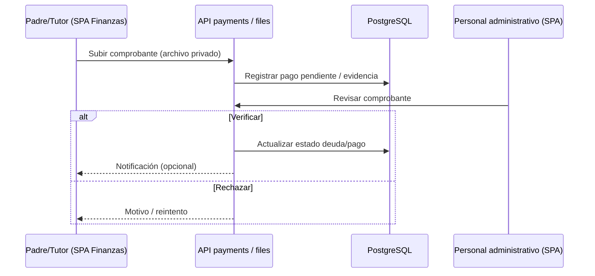

#### Mermaid — cierre de actividad (orientativo)

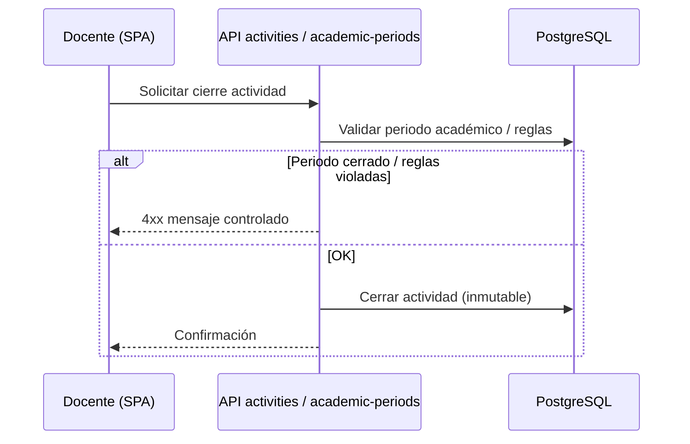

*(Ajustar endpoints al contrato OpenAPI / Anexo 08.)*

#### draw.io — pago (Anexo 05 Fig. 4)

Padre (Finanzas) → API `payments`/`files` → DB; Personal verifica/rechaza; sin pasarela.

#### draw.io — cierre actividad (Anexo 05 Fig. 5)

Docente → API `activities` → validar periodo → cierre inmutable o 4xx.

### Diagrama de clases (`A05-CLS-1`)

**draw.io:** torre **Controller → Service → Repository → Entity** (`circuit-requests`, `access-events`). Pie: *patrón repetido en todos los dominios*.

---

## Anexo 06 — Prototipos UI (8 figuras)

**Menú lateral real** (`frontend/src/navigation/navConfig.ts`, filtrado por `navVisibleForRole`). Orden de captura recomendado: sidebar completo + pantalla de Inicio (tarjetas RF7).

| Rol | Etiquetas visibles en sidebar (orden del código) |
| --- | --- |
| `ALUMNO` | Inicio · Mi perfil · Reuniones · Visitas externas · Finanzas · Mis calificaciones · Boletines · Horario · Institución |
| `PADRE` | Inicio · Mi perfil · Reuniones · Visitas externas · Finanzas · Académico · Calificaciones · Boletines · Circuito (familia) · Institución |
| `DOCENTE` | Inicio · Mi perfil · Reuniones · Visitas externas · Anotaciones (docente) · Académico · Actividades y notas · Boletines · Horario · Escáner de acceso · Circuito del día · Institución |
| `ADMINISTRATIVO` | Inicio · Mi perfil · Reuniones · Visitas externas · Anotaciones (docente) · Finanzas · Académico · Periodos académicos · Actividades y notas · Boletines · Horario · Administración e informes · Institución · Grupos y personas · Importar y exportar · Escáner de acceso · Circuito del día |
| `ADMIN` | Inicio · Mi perfil · Reuniones · Visitas externas · Anotaciones (docente) · Finanzas · Periodos académicos · Actividades y notas · Boletines · Horario · Administración e informes · Institución · Grupos y personas · **Escuelas** · Importar y exportar · Escáner de acceso · Circuito del día |

**Notas para prototipos / capturas**

- **RF7:** capturar **campana** (header) + tarjetas de Inicio hacia `/app/modulos/comunicacion` (ALUMNO, PADRE, DOCENTE, ADMIN); **ADMINISTRATIVO** suele entrar por campana o URL directa.
- **RF2:** escáner solo en Admin, Administrativo y Docente; alumno muestra QR en **Mi perfil** (`PerfilPage`).
- **Importar:** menú solo Admin/Administrativo; `RoleGate` también permite `DOCENTE` en ruta — no mostrar en sidebar docente salvo que el producto cambie.

| ID | Pie maestro (resumen) | Herramienta | Ruta / nota |
| --- | --- | --- | --- |
| A06-1 | Login + recuperar contraseña | Captura o Figma | `/login` |
| A06-2 | Tablero ADMIN plataforma | Captura | `/app` + sidebar tabla `ADMIN`; `/app/escuelas` |
| A06-3 | Tablero administrativo | Captura | `/app` + sidebar `ADMINISTRATIVO`; gestión escolar/finanzas |
| A06-4 | Tablero docente | Captura | `/app` + sidebar `DOCENTE`; actividades, escáner |
| A06-5 | Vista padre/tutor | Captura móvil | `/app/circuito`; sidebar `PADRE` (sin escáner) |
| A06-6 | Vista alumno | Captura | `/app/perfil` (QR); sidebar `ALUMNO` |
| A06-7 | Escáner QR/NFC (*Figura 7 del Anexo 06*) | Captura móvil | `/app/acceso/escaner` — **Admin, Administrativo o Docente** |
| A06-8 | Mapa circuito Mapbox | Captura móvil | circuito activo; datos sintéticos |

**Inicio alumno (`HomeAlumno`).** Tarjetas visibles: «Últimas calificaciones» → `/app/modulos/mis-calificaciones`; «Mis boletines» → `/app/modulos/boletines`; «Notificaciones recientes» → `/app/modulos/comunicacion`. Capturar sidebar `ALUMNO` + Inicio con las tres tarjetas.

### Capturas complementarias (maestro Anexo 06 §6)

Además de **A06-1…8** (§4 del anexo), el maestro lista pantallas para el anexo maquetado. Pueden numerarse como figuras locales del Anexo 06 o reutilizarse en **Anexo 09 §14**.

| ID | Pantalla (maestro §6) | Ruta / nota |
| --- | --- | --- |
| A06-9 | Gestión escolar | `/app/gestion-escolar` |
| A06-10 | Calificaciones docente | `/app/modulos/calificaciones-docente` |
| A06-11 | Mis calificaciones (padre/alumno) | `/app/modulos/mis-calificaciones` |
| A06-12 | Finanzas | `/app/modulos/finanzas` (padre: deudas; alumno: conceptos) |
| A06-13 | Boletines | `/app/modulos/boletines` |
| A06-14 | Comunicación | Campana en cabecera + `/app/modulos/comunicacion` |
| A06-15 | Inicio por rol | `/app` — tarjetas RF7 según rol (ver notas RF7 arriba) |
| A06-16 | Circuito del día (staff) | `/app/circuito/hoy` |

**Criterios.** UI español; datos ficticios; sin menores reales; sidebar idéntico a `navConfig.ts`.

---

## Anexo 07 — Despliegue y CI

### A07-1 — Despliegue

Ver **§ Anexo 03 A03-2** y pie maestro L2228.

### A07-2 — CI (workflow real)

Archivo: `.github/workflows/backend-ci.yml` — job **`build-and-e2e`**, servicio **`postgres:16`**, directorio **`01 - Escuela Pass`**.

```mermaid
flowchart LR
  T[push/PR main] --> J[build-and-e2e ubuntu-latest]
  J --> CO[checkout@v4]
  CO --> N[setup-node 20 + npm ci]
  N --> B[npm run build]
  B --> E[npm run test:e2e]
  PG[(postgres:16 service)] -.-> E
```

**Captura.** GitHub Actions en verde; secretos redactados.

---

## Anexo 08 — Swagger y seguridad API

**Orden PDF:** **A08-A** resumen → **A08-B** tags + Bearer → **A08-C** capas seguridad.

Las **241 operaciones** del inventario están en el **maestro Anexo 08 §10** (tabla textual al copiar el TDG a Word). Las figuras **A08-A** y **A08-B** ilustran la UI de Swagger (`/docs`); **no** se requiere una captura por endpoint.

| ID | Contenido | Entrega |
| --- | --- | --- |
| A08-A | Swagger módulos (pie maestro Fig. 1 Anexo 08) | Captura `/docs` |
| A08-B | Todas las etiquetas de dominio expandidas (pie maestro Fig. 2 Anexo 08) | Captura scroll o mosaico |
| A08-C | Seguridad por capas (pie maestro Fig. 3 Anexo 08) | Mermaid + draw.io |

**Checklist.** Dev/staging; Bearer; datos sintéticos; tags alineados a `AppModule`; catálogo §10 del maestro como fuente de las 241 rutas.

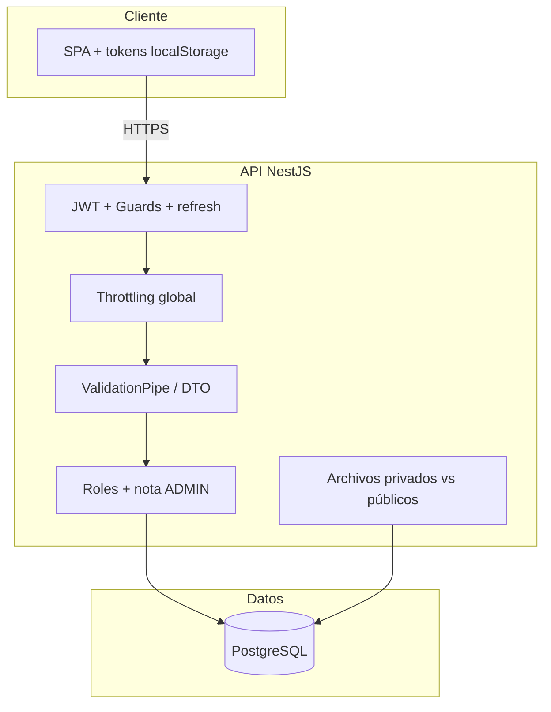

---

## Anexo 09 — Guía de pantallas (8 figuras)

| Fig. | Ruta maestro | Rol (producto) |
| --- | --- | --- |
| 1 | `/login` | todos |
| 2 | shell autenticado + sidebar | ver tabla Anexo 06 por rol |
| 3 | `/app/circuito` | `PADRE` |
| 4 | `/app/acceso/escaner` | `ADMIN`, `ADMINISTRATIVO`, `DOCENTE` |
| 5 | `/app/modulos/calificaciones-docente` | `DOCENTE` (+ Admin/Administrativo en menú) |
| 6 | `/app/modulos/finanzas` | `PADRE`, `ALUMNO`, `ADMIN`, `ADMINISTRATIVO` |
| 7 | `/app/modulos/administracion` | `ADMIN`, `ADMINISTRATIVO` |
| 8 | `/app/modulos/comunicacion` | Todos (ruta directa). Descubrimiento: **campana** + Inicio (ALUMNO/PADRE/DOCENTE/ADMIN) — ver matriz RF7 en § Figura 7-RF7 |

**Prioridad:** capturas del cliente en ejecución, con sidebar e Inicio coherentes con `navConfig.ts` y el maestro v2 (Anexo 06 / 09).

---

## Anexo 10 — Método y evidencias

### Plantillas (Fig. 7–8 maestro)

- **SUS:** 10 ítems, Likert 1–5 español, pie Brooke 1996 / Lewis & Sauro 2018.  
- **ISO 25010:** tabla *Flujo, Método, Entorno, n, Umbral, Resultado, Observaciones*.

### Evidencias (L3514–3519)

| Fig. | Captura | Comando |
| --- | --- | --- |
| 1 | E2E verde | `npm run test:e2e` |
| 2 | Build backend | `npm run build` |
| 3 | Build frontend | `npm run build` (frontend) |
| 4 | Swagger health | `/api/v1/health` |
| 5 | Circuito UI/E2E | traza o pantalla circuito |
| 6 | Archivo privado OK/403 | GET comprobante |

---

## Coherencia numérica y verificación QA

| Métrica | Maestro | Repo |
| --- | --- | --- |
| Entidades | 49 | **49** (`src/database/entities/*.entity.ts`) |
| Controladores | 32 | **32** (`@Controller` en `src/modules`) |
| E2E | 47 | **46 passed, 1 skipped, 47 total** — `npm run test:e2e` |
| Rutas REST | 241 | Anexo 08 / Swagger |
| Módulos dominio | 37 | 32 imports directos en `AppModule` + módulos anidados (Anexo 03) |

**Coherencia con el maestro:** escaneo **201** + `duplicate=true` (~10 s); RF2 índice sin padre/alumno; RF7 por campana, Inicio y deep links; Fig. 3–4 desde § Fig. 3 y § Fig. 4 de esta guía.

**Comandos sugeridos (PowerShell, raíz `01 - Escuela Pass`):**

```powershell
(Get-ChildItem src/database/entities -Filter *.entity.ts).Count
(Get-ChildItem src -Recurse -Filter *.ts | Select-String -Pattern '@Controller\(').Count
npm run test:e2e
```

**Fig. 6:** 12+9+7+4+17 = **49** tablas en DBML macro (excl. `typeorm_migrations`).

**Mermaid cuerpo:** diff manual M1–M4 contra bloques ```mermaid del maestro v2 §4.1 y §5.3–5.4.

**Visual:** Fig. 5 SPA→Mapbox; Fig. 6 sin FK en cuerpo; pies literales del maestro.

**Checklist final antes de entregar TDG**

**Documentación (repo) — listo para exportar figuras:**

- [x] M3/M9 y RF2: **201** + `duplicate=true` (~10 s).  
- [x] Fig. 6 DBML macro y Anexo 04 ER-5: `organizer_user_id` en `meetings`.  
- [x] Fig. 3–4: Mermaid en § Fig. 3 y § Fig. 4 (pies del maestro v2 §3.6 y §2.7).  
- [x] E2E: 46 passed / 1 skipped.  
- [x] Fig. 7-Índice / RF2 / RF5 alumno / Anexo 06 menús: coherentes con maestro v2 y `navConfig.ts`.

**Maquetación Word (manual):**

- [ ] Matriz de numeración global (IDs `A05-*`, `A04-ER-*`, `A06-*`) — ver § Matriz de numeración.  
- [ ] Exportar Mermaid/draw.io/dbdiagram a PNG e incrustar con **pie literal** del maestro.  
- [ ] Fig. 4 milestone **2026-06-21** y siete fases Tabla 2b.  
- [ ] Fig. 5 sin Express; sin flecha API→Mapbox.  
- [ ] **Fig. 7:** texto puente + 7-Índice + 7-RF1…RF8; 68/68 filas Anexo 05 §2.  
- [ ] Anexo 04: cinco PNG con FK; Anexo 10: seis capturas (comandos § Anexo 10).
