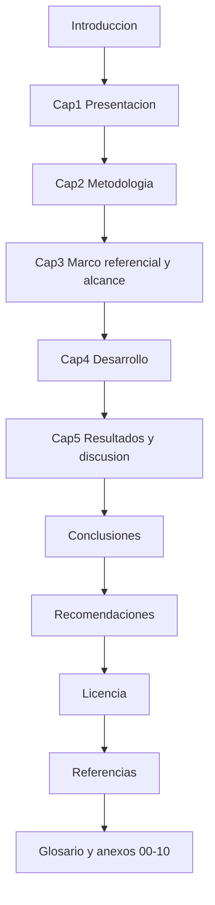

# Prompts para figuras — TDG Escuela Pass

**Instrucciones de uso.** Cada bloque va separado por la línea `|||||||||||||||||||||`. Para herramientas con IA integrada (Lucidchart Lucid AI, Figma AI, Eraser, Whimsical), copiar el prompt indicado en inglés. Para Mermaid CLI (`mmdc`), pegar el bloque `.mmd` en un archivo y exportar PNG con `npx @mermaid-js/mermaid-cli -i archivo.mmd -o salida.png`. Estilo institucional: limpio, monocromático o dos colores, tipografía sans legible, fondo blanco, etiquetas en español.

|||||||||||||||||||||

## TDG cuerpo — Figura 3. Estructura del documento y vínculo con anexos

**Herramienta recomendada:** Lucidchart con Lucid AI (o Mermaid + `mmdc`).

**Prompt Lucid AI:** Create a clean academic flowchart of a thesis document structure for a software engineering project. Top-to-bottom rounded rectangles in Spanish with minimal monochromatic palette: Introduccion, Cap. 1 Presentacion, Cap. 2 Metodologia, Cap. 3 Marco referencial y alcance, Cap. 4 Desarrollo, Cap. 5 Resultados y discusion, Conclusiones, Recomendaciones, Licencia, Referencias, Glosario y anexos 00 a 10. White background, no clipart.

|||||||||||||||||||||

## TDG cuerpo — Figura 4. Cronograma Gantt 24/02/2026 – 21/06/2026

**Herramienta recomendada:** Microsoft Planner, ClickUp o Monday (sin IA generativa); Microsoft Project; Excel; o Lucidchart Gantt.

**Prompt:** Generate a Gantt chart from February 24 to June 21, 2026 for a software thesis project named Escuela Pass. Phases in Spanish labels with five swimlanes: Analisis de requerimientos, Diseno (arquitectura, datos, interfaz), Implementacion del backend, Desarrollo del frontend, Validacion y cierre tecnico. Add milestones at phase ends; weekends shaded lightly; minimalist palette of blue and gray; legend in Spanish.

|||||||||||||||||||||

## TDG cuerpo — Figura 5. Arquitectura general por capas

**Herramienta recomendada:** Lucidchart con Lucid AI (también compatible con FigJam AI o Eraser AI).

**Prompt:** Draw a layered architecture diagram for a school administration web product called Escuela Pass. Left column "Usuarios" with five personas: Administrador de plataforma, Personal administrativo, Docente, Padre o tutor, Alumno. Center "Cliente web" SPA in browser using React and Vite. Arrow to "Servicio web" labeled NestJS modular API exposing REST contracts. Arrow to PostgreSQL cylinder with TypeORM ORM. Auxiliary services as dashed satellites: Mapbox maps, Firebase Cloud Messaging push, SMTP email, Volume for uploads. Spanish labels minimal. Clean academic monochrome plus one accent color.

|||||||||||||||||||||

## TDG cuerpo — Figura 6. Modelo entidad-relación resumido por dominios

**Herramienta recomendada:** Lucidchart con Lucid AI ERD.

**Prompt:** High-level conceptual ER diagram grouped by domains (clusters labeled in Spanish): Nucleo institucional (schools, users, groups, students, teachers, parents, student_parents, teacher_groups, academic_periods), Academico (class_sessions, attendance_records, activities, activity_grades, report_cards), Seguridad fisica (access_credentials, access_events, circuit_requests, vehicles, departure_consents), Finanzas (payment_concepts, debts, payments, debt_adjustments), Comunicacion y agenda (notices, notifications, meetings, external_visits, attention_notes), Privacidad y auditoria (privacy_policies, user_privacy_acceptances, audit_logs, refresh_tokens). Crow's foot notation, light gray backgrounds per cluster, no exhaustive column lists.

|||||||||||||||||||||

## TDG cuerpo — Figura 7. Casos de uso por actor (resumen)

**Herramienta recomendada:** Lucidchart con Lucid AI (UML Use Case).

**Prompt:** UML 2.5.1 use case diagram for school web app Escuela Pass. Five stick-figure actors left to right: Administrador de plataforma, Personal administrativo, Docente, Padre o tutor, Alumno. Use case ovals clustered by packages in Spanish: Autenticacion y privacidad, Acceso fisico QR y NFC, Circuito de recogida familiar, Gestion escolar, Academico (asistencias, actividades, calificaciones, boletines), Finanzas, Comunicacion y agenda, Reportes y tableros. Include `<<include>>` and `<<extend>>` relationships where sensible. Layout A4 portrait, monochrome.

|||||||||||||||||||||

## TDG cuerpo — Figura 8. Secuencia del circuito de recogida familiar

**Herramienta recomendada:** Lucidchart con Lucid AI (UML Sequence).

**Prompt:** UML 2.5.1 sequence diagram of the family pickup circuit. Lifelines: PadreCliente (SPA), ApiNestJS, PostgreSQL, FcmOpcional, DocenteCliente (SPA), PorteriaCliente. Messages in Spanish: iniciarSesion(), crearSolicitudCircuito(estudianteId), validarVinculoFamiliar(), validarReglaUnaSolicitudPorDia(), persistirSolicitud(), notificarDocenteYPorteria(), padreActualizaUbicacionGPS(), autoTransicionAlEntrarRadioPlantel(), docenteAutorizaSalida(), padreConfirmaEntrega(). Async messages dashed for push notifications. Note about geolocation as fallback if Mapbox token missing.

|||||||||||||||||||||

## TDG cuerpo — Figura 9. Secuencia de escaneo QR/NFC

**Herramienta recomendada:** Lucidchart con Lucid AI.

**Prompt:** UML 2.5.1 sequence diagram for QR/NFC credential scan at school gate. Lifelines: PersonalCliente (Scanner), ApiNestJS, AccessService, PostgreSQL. Messages in Spanish: leerCredencial(QR o NFC), validarFormatoYContexto(escuela, rol), aplicarVentanaAntiduplicacion(10s), persistirEventoAcceso(), siCorrespondeMarcarAsistenciaDiaria(), responderResultadoAlOperador(). Highlight duplicate detection branch with note. Monochrome.

|||||||||||||||||||||

## TDG cuerpo — Figura 10. Licencia del proyecto

**Herramienta recomendada:** Imagen aportada por el autor cuando exista el archivo LICENSE o badge homologado con AlfaNetworks. Sin generación por IA.

**Prompt:** No genera. Insertar imagen oficial de la licencia del proyecto Escuela Pass en formato PNG.

|||||||||||||||||||||

## Anexo 03 — Figuras de arquitectura (vistas lógica, despliegue, seguridad, persistencia, integraciones)

**Herramienta recomendada:** Lucidchart con Lucid AI o draw.io (para vistas más densas, FigJam con FigJam AI).

**Prompt vista lógica:** Draw a logical architecture view grouping NestJS bounded contexts by domain in Spanish: Identidad y privacidad, Seguridad fisica (acceso, circuito, vehiculos, consentimiento), Academico (asistencia, actividades, calificaciones, boletines, periodos), Gestion escolar (escuelas, grupos, materias, personas, importaciones, configuracion), Finanzas (conceptos, deudas, pagos, ajustes), Comunicacion y agenda (avisos, notificaciones, reuniones, visitas, anotaciones), Soporte transversal (auditoria, archivos, tareas programadas). Show ConfigModule, ThrottlerModule and ScheduleModule as global building blocks. Spanish labels, monochrome.

**Prompt vista de despliegue:** Cloud deployment diagram. Internet users connect via HTTPS to static SPA hosted on Vercel labeled Cliente estatico (React + Vite); arrows to API subdomain on Railway labeled Servicio NestJS; Railway connects to managed PostgreSQL; dashed box Volumen de archivos attached to API for uploads (avatars, comprobantes, evidencias). Optional dashed lines to Mapbox, FCM and SMTP. Legend in Spanish bottom right; palette gray and teal.

**Prompt vista de seguridad:** Layered defense-in-depth diagram for the API. Inbound layers labeled in Spanish: TLS y CDN, Helmet (cabeceras), CORS, ThrottlerGuard, ValidationPipe global, JwtAuthGuard, RolesGuard, Logica de dominio, ORM con consultas parametrizadas, PostgreSQL. Side notes referencing OWASP Top 10 risks A01-A10 mapped to mitigations.

**Prompt vista de persistencia:** Diagram showing the relation between TypeORM entities, migrations chain in src/database/migrations, runtime schema sanity check ensureRuntimeSchema, and PostgreSQL physical instance. Arrow from CI job to migration:run command. Spanish labels.

**Prompt vista de integraciones:** Integration view showing optional external services with feature toggles in Spanish: Mapbox (mapas y ETA), Firebase Cloud Messaging (push web), SMTP (correo transaccional), almacenamiento de archivos. Each shows fallback strategy when credentials are missing.

|||||||||||||||||||||

## Anexo 04 — Cinco modelos ER por dominio

**Herramienta recomendada:** Lucidchart con Lucid AI ERD (también dbdiagram.io o pgAdmin ER tool).

**Prompt núcleo (Figura 1):** ER diagram core multi-institution Escuela Pass: schools, users (role enum), groups, subjects, students, teachers, parents, student_parents (with can_pickup), teacher_groups, teacher_subjects, academic_periods. Crow's foot notation, FK labels minimal, Spanish.

**Prompt académico extendido (Figura 2):** ER diagram academic extension: class_sessions, class_schedule_slots, attendance_records (one-per-day per student), class_attendance_records (per session), school_non_instructional_days, activities, activity_grades, report_cards, report_card_subjects. Show FKs to students, teachers, groups, subjects, academic_periods.

**Prompt seguridad física (Figura 3):** ER diagram security domain: access_credentials (QR or NFC) with status enum, access_events linked to credential and user, circuit_requests linked to student and parent and vehicle, vehicles owned by parent, student_departure_consents per day, student_lifecycle_events, teacher_lifecycle_events.

**Prompt finanzas (Figura 4):** ER diagram finance domain: payment_concepts (per school), debts (per student and concept), payments (per debt), debt_adjustments (audit trail), uploaded_by_parent and verified_by_admin links to parents and administrative_staff.

**Prompt comunicación, agenda, privacidad y auditoría (Figura 5):** ER diagram communication and audit domain: notices, notifications (per user, optional notice link), user_fcm_tokens, admin_reports, admin_report_comments, meetings, meeting_participants, external_visits, external_visit_groups, external_visit_students, student_attention_notes, privacy_policies, user_privacy_acceptances (PK user+version), audit_logs, refresh_tokens, import_jobs, institution_settings.

|||||||||||||||||||||

## Anexo 05 — Casos de uso por actor (cinco diagramas), secuencias clave (cuatro), clases y componentes

**Herramienta recomendada:** Lucidchart con Lucid AI (UML Use Case y Sequence).

**Prompt caso de uso Administrador de plataforma:** UML use case diagram with stick-figure actor "Administrador de plataforma" connected to ovals in Spanish: iniciarSesion, recuperarContrasena, aceptarPoliticasPrivacidad, gestionarInstituciones, asignarUsuariosAEscuelas, restablecerContrasenasInstitucionales, configurarParametrosGlobales, consultarTablerosConsolidados, exportarReportesGlobales, consultarBitacoraAuditoria, gestionarPoliticasVersionadas, configurarCredencialesNFC.

**Prompt caso de uso Personal administrativo:** UML use case diagram with stick-figure actor "Personal administrativo" connected to ovals: gestionarGrupos, gestionarMaterias, gestionarEstudiantes, gestionarDocentes, gestionarPadres, vincularPadreEstudiante, importarNominaXLSX, consultarHistorialImportaciones, gestionarPeriodosAcademicos, generarBoletines, configurarCalendarioInstitucional, gestionarHorarios, gestionarVisitasExternas, crearReuniones, verificarComprobantesPago, ejecutarPoliticasCartera, atenderReportesAdministrativos, consultarTableroInstitucional, operarCircuitoDelDia.

**Prompt caso de uso Docente:** UML use case diagram with actor "Docente" connected to ovals: iniciarSesion, consultarHorarioYAsignaciones, registrarAsistenciaDiaria, registrarAsistenciaPorClase, crearActividadAcademica, registrarCalificaciones, cerrarActividad, reabrirActividadConJustificacion, registrarAnotacionesEstudiante, escanearCredencialQRNFC, apoyarCircuitoDelDia, consultarAvisosYNotificaciones.

**Prompt caso de uso Padre o tutor:** UML use case diagram with actor "Padre o tutor" connected to ovals: iniciarSesion, recuperarContrasena, aceptarPoliticasPrivacidad, consultarHijosVinculados, iniciarSolicitudCircuito, actualizarUbicacionGPS, avanzarEstadoCircuito, confirmarEntregaCircuito, cancelarSolicitudCircuito, gestionarVehiculos, registrarConsentimientoSalida, justificarInasistencia, consultarAcademicoDeHijos, cargarComprobantePago, consultarDeudas, recibirAvisos, solicitarReuniones, responderRSVP.

**Prompt caso de uso Alumno:** UML use case diagram with actor "Alumno" connected to ovals: iniciarSesion, aceptarPoliticasPrivacidad, consultarCredencialQR, consultarHorario, consultarCalendario, consultarMisCalificaciones, consultarMisBoletines, consultarMiAsistencia, consultarAvisos, recibirNotificaciones, consultarConsentimientoSalida.

**Prompt secuencia circuito (ya descrita en TDG cuerpo Figura 8):** reusar misma especificación.

**Prompt secuencia QR/NFC (ya descrita en TDG cuerpo Figura 9):** reusar misma especificación.

**Prompt secuencia pago con comprobante:** UML 2.5.1 sequence diagram with lifelines PadreCliente, ApiNestJS, PaymentsService, FilesService, PostgreSQL, AdministrativoCliente. Messages in Spanish: consultarMisDeudas(), seleccionarDeuda(), adjuntarComprobantePDFoImagen(), validarFormatoYTamano(), almacenarArchivoEnAreaPrivada(), marcarDeudaPendienteRevision(), administrativoConsultaBandeja(), administrativoVerificaOrechaza(), siVerificaActualizarSaldo(), notificarPadre(). Note: no automatic banking gateway in scope.

**Prompt secuencia cierre de actividad:** UML 2.5.1 sequence diagram with lifelines DocenteCliente, ApiNestJS, ActivitiesService, AcademicPeriodsService, ReportCardsService, PostgreSQL. Messages: registrarCalificacionesPorEstudiante(), cerrarActividad(), validarPeriodoAbierto(), persistirEstadoCerrado(), bloquearEdicionesFuturas(), opcionalmenteReabrirConJustificacion(audit), generarBoletinAlCierreDelPeriodo().

**Prompt clases de contexto:** UML class context diagram showing controller-service-repository-entity pattern in NestJS. Show one canonical domain (e.g., Circuit) with classes CircuitController, CircuitService, CircuitRepository (TypeORM), and entity CircuitRequest with attributes summarized. Indicate dependencies with arrows. Note that the same pattern repeats across all domains.

**Prompt componentes y despliegue lógico:** UML deployment diagram with nodes Browser (SPA React), Application Server (Node.js with NestJS), Database Server (PostgreSQL), External Services (Mapbox, FCM, SMTP), CDN for static assets. Show artifacts deployed on each node and HTTPS communication.

|||||||||||||||||||||

## Anexo 06 — Pantallas representativas por rol y flujo (ocho figuras)

**Herramienta recomendada:** Figma con Figma AI (o capturas reales del cliente con datos sintéticos).

**Prompt común:** Modern minimal academic UI mock kit for Escuela Pass, Spanish only labels, indigo and white palette with WCAG-friendly contrast, no real minor data, no logos, no copyrighted images. Generate one screen per prompt below at high-polish wireframe fidelity.

- **Figura 1 (login):** Login form with email and password fields, "Recuperar contrasena" link, Escuela Pass header, language Spanish.
- **Figura 2 (Administrador de plataforma):** Multi-school dashboard with KPI cards (numero de escuelas, usuarios activos, eventos de acceso del dia), table of schools with quick actions.
- **Figura 3 (Personal administrativo):** Sidebar with sections Gestion escolar, Importaciones, Finanzas, Calendario, Reuniones, Visitas, Reportes; main area with KPIs of the school.
- **Figura 4 (Docente):** Class schedule for the day, attendance table for one group, list of recent activities with status (open, closed).
- **Figura 5 (Padre o tutor):** Mobile view with primary CTA "Iniciar circuito de hoy", list of children, quick access to Calificaciones, Boletines, Finanzas.
- **Figura 6 (Alumno):** Mobile view with credential QR card, horario semanal, calificaciones recientes, avisos.
- **Figura 7 (Escáner QR/NFC):** Camera viewport with QR alignment guide, success and error toast variants in Spanish, privacy notice "Solo personal autorizado".
- **Figura 8 (Mapa del circuito):** Mapbox-style map placeholder with route line from parent location to school marker, ETA badge, status chips.

|||||||||||||||||||||

## Anexo 07 — Despliegue real e integración continua (dos figuras)

**Herramienta recomendada:** Lucidchart con Lucid AI (alternativa: Eraser AI).

**Prompt despliegue real:** Production-style deployment diagram. Show Vercel CDN delivering static SPA, Railway hosting NestJS API and PostgreSQL managed instance, persistent volume for uploads. External integrations Mapbox, Firebase Cloud Messaging, SMTP shown as dashed boxes with notes "opcional". Spanish labels.

**Prompt CI:** Diagram of GitHub Actions workflow `backend-ci.yml`: trigger on push and pull_request, runner Ubuntu, services postgres:16, steps checkout - setup-node@v4 with Node 20 - npm ci - npm run build - npm run test:e2e. Working directory `01 - Escuela Pass`. Spanish labels.

|||||||||||||||||||||

## Anexo 08 — Captura Swagger y diagrama de seguridad de API (dos figuras)

**Herramienta recomendada:** Captura del entorno de desarrollo o staging para Swagger; Lucidchart con Lucid AI para el diagrama de seguridad.

**Prompt Swagger (sin IA):** Tomar captura del navegador en `/docs` con Bearer token configurado y todas las etiquetas de dominio expandidas. Datos sintéticos. Resolución mínima 1920x1080.

**Prompt seguridad API:** Layered API security diagram with arrows from client to server. Layers labeled in Spanish: Cliente (token JWT en almacenamiento del navegador), TLS, ThrottlerGuard (limite global), ValidationPipe (DTO whitelist), JwtAuthGuard, RolesGuard, Servicio (regla de negocio), ORM con consultas parametrizadas, PostgreSQL. Side notes mapping to OWASP API Security Top 10 (Broken Object Level Authorization, Broken Authentication, Excessive Data Exposure, Lack of Resources & Rate Limiting, Broken Function Level Authorization, Mass Assignment, Security Misconfiguration, Injection, Improper Assets Management, Insufficient Logging & Monitoring).

|||||||||||||||||||||

## Anexo 09 — Capturas guía por rol y flujo

**Herramienta recomendada:** Capturas reales del cliente en staging con cuentas y datos sintéticos. Sin IA generativa para no falsear evidencia.

**Prompt operativo:** Tomar capturas para los nueve flujos: inicio de sesion, panel por rol, escaner QR/NFC, circuito padre y staff, calificaciones, finanzas, boletines, comunicacion, perfil con QR. Tachar cualquier dato real, usar nombres ficticios.

|||||||||||||||||||||

## Anexo 10 — Plantilla SUS, plan de medición y evidencias E2E/CI (cuatro figuras)

**Herramienta recomendada:** Word, Google Forms o Typeform para SUS; Excel o tabla en el documento maquetado para el plan de medición; capturas reales para evidencias E2E y CI.

**Prompt plantilla SUS:** Generate a one-page Spanish translation of the System Usability Scale (SUS) by Brooke (1996), with 10 statements alternating positive and negative wording, Likert scale 1 to 5 (Muy en desacuerdo - Muy de acuerdo). Include header "Cuestionario SUS — Escuela Pass" and footer with score formula and benchmark scale (Lewis & Sauro, 2018).

**Prompt plan de medición de tiempos:** Tabla con columnas: Flujo, Metodo de medicion, Entorno, Tamano de muestra, Umbral esperado, Resultado obtenido, Observaciones. Filas para autenticacion, escaneo QR/NFC, exportacion XLSX, generacion de boletines PDF, paginacion de listados grandes.

**Prompt captura E2E:** Captura de consola con `npm run test:e2e` exitoso mostrando los 47 casos pasando, fecha y commit hash visibles.

**Prompt captura CI:** Captura de GitHub Actions con job `backend-ci` en verde, servicio postgres:16, pasos build y test:e2e visibles.

|||||||||||||||||||||

## Notas finales

- Todas las figuras se rotulan con el formato del manual de estilo APIT: número y título descriptivo, Times New Roman 10 pt en pie de figura.
- Los prompts en inglés están redactados así porque las IA generativas (Lucid AI, Figma AI, Eraser AI, Whimsical AI) suelen interpretar mejor las instrucciones en inglés, pero las **etiquetas y leyendas internas de cada figura deben quedar en español**.
- Donde se indica "captura del cliente en ejecución", el autor debe asegurar el uso de datos sintéticos para preservar la privacidad de menores conforme a la LFPDPPP.
