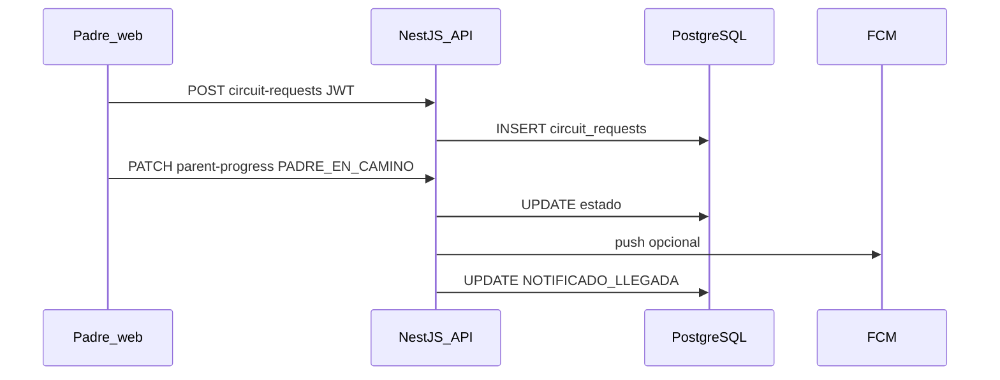

# Escuela Pass: administración y seguridad escolar

**Desarrollo de aplicación web para AlfaNetworks con NestJS, PostgreSQL, tecnologías NFC y QR para la administración y seguridad escolar: Escuela Pass**

**Autor:** Murillo Martínez Jhon Kevin

**Programa:** Ingeniería Informática — Área de Programas Informáticos y Telecomunicaciones (APIT)  
**Institución:** Politécnico Colombiano Jaime Isaza Cadavid

**Asesor:** Alirio Antonio Gutiérrez Quintero

**Ciudad, fecha:** [Completar mes y año al pasar a Word]

---

<!-- Bloques siguientes: generar en Word con "Referencias > Tabla de contenido / Tabla de figuras" según Manual APIT -->

### Guía de organización y preliminares (buenas prácticas)

Este borrador sigue la **guía TDG del Politécnico** y toma como referencia de **presentación profesional** trabajos de grado del mismo área (estructura de tabla de contenido, densidad de figuras técnicas, anexos de evidencia y manuales), **sin replicar numeraciones ni textos ajenos**.

**Orden sugerido al pasar a Word (revisar siempre la plantilla oficial vigente):** portada; contraportada; agradecimientos; dedicatoria; **Resumen** y **Abstract**; **Tabla de contenido** (generada automáticamente); **Lista de figuras** y **Lista de tablas** (generadas automáticamente); **Introducción**; cuerpo por capítulos; **Conclusiones**; **Recomendaciones y trabajos futuros**; **Referencias**; **Anexos**.

**Índice analítico del contenido** (mapa del documento; la numeración final la define Word según estilos de título):

| Bloque | Contenido académico-técnico principal |
|--------|----------------------------------------|
| Introducción | Contexto, motivación, objeto del estudio, organización del texto |
| Cap. 1 | Planteamiento del problema, justificación (límite de extensión en Word), objetivos |
| Cap. 2 | Metodología (Scrum), fases ligadas a objetivos, cronograma, pruebas, herramientas |
| Cap. 3 | Marco conceptual, legal, antecedentes, limitaciones; **alcance** (§3.5) |
| Caps. 4–8 | Desarrollo por objetivos específicos: análisis, diseño, backend, frontend, validación |
| Cierre | Conclusiones, recomendaciones, referencias APA 7, anexos |

**Nota para el pegado en plantilla Word (TDG):** Este Markdown conserva la jerarquía de secciones para copiar por bloques. Las **tablas de contenido, figuras y numeración de páginas** deben regenerarse en el procesador según el *Manual de estilo trabajos de grado – Adaptación APA*. Portada, contraportada, márgenes (2,54 cm), Times New Roman 12 y espaciado sencillo se aplican en Word, no en el archivo `.md`.

**Extensión (~60 páginas):** el cuerpo textual en Markdown ronda las **9 000–10 000 palabras**; al migrar a Word, la meta de **unas 60 páginas** suele alcanzarse sumando **figuras insertadas** (diagramas, capturas de UI, Swagger, Gantt), **índices automáticos**, **anexos PDF** (actas, bitácoras, manuales) y el **marco referencial** ampliado hasta el máximo permitido por el TDG (**10 hojas**). Véanse **Anexo K** (ampliación) y **Anexo L** (paquete de anexos técnicos sugerido).

---

## Contraportada (texto sugerido)

Mismo título que portada. *Trabajo de grado presentado como requisito para optar al título de Ingeniero Informático.* Asesor: Alirio Antonio Gutiérrez Quintero. [Mes y año de entrega].

---

## Agradecimientos

[ Espacio reservado para redacción personal del autor. ]

---

## Dedicatoria

[ Opcional — espacio reservado. ]

---

## Resumen

La gestión escolar contemporánea exige integrar seguridad física, protección de datos personales —en especial de niños, niñas y adolescentes— y procesos administrativos digitalizados. En instituciones educativas de México y Latinoamérica persisten fragmentación de sistemas, procesos manuales y rezagos en el control ordenado de ingresos, salidas y recogida de estudiantes. El presente trabajo de grado describe el diseño e implementación de **Escuela Pass**, aplicación web desarrollada en el marco de la práctica profesional con **AlfaNetworks**, orientada a instituciones educativas privadas. La solución combina un **backend** en **NestJS 10** con **TypeORM** y **PostgreSQL**, y un **frontend** **React 18** con **Vite 6**, accesible desde navegadores en escritorio y móvil. Se implementan autenticación basada en **JWT**, control de accesos con **credenciales QR y NFC** simuladas vía web, circuito de recogida con estados coordinados entre padres y personal, módulos académicos (asistencia, calificaciones, boletines, periodos), finanzas con carga manual de comprobantes, comunicación con **notificaciones** y **Firebase Cloud Messaging**, reportes, exportación a Excel, configuración institucional y despliegue en la nube (**Railway** para la API documentada). La metodología fue ágil (**Scrum** con iteraciones semanales). Los resultados incluyen una API **REST** documentada con **Swagger**, pruebas **end-to-end** automatizadas y un cliente web alineado a los requisitos funcionales y no funcionales aprobados en la propuesta de trabajo de grado, con matices documentados —por ejemplo, el circuito vial operado desde el rol **padre** con geolocalización opcional informativa, coherente con el uso real del vehículo particular en la recogida.

**Palabras clave:** seguridad escolar; NestJS; PostgreSQL; React; control de accesos; datos personales; circuito de recogida.

---

## Abstract

Contemporary school management must combine physical safety, protection of personal data —especially for children and adolescents— and efficient administrative workflows. Across Latin America, many institutions still rely on disconnected tools and manual records, which weakens access control, slows family–school communication, and complicates accountability. This degree project presents **Escuela Pass**, a web application produced during professional practice with **AlfaNetworks** for private schools. The solution delivers a **NestJS 10** backend with **TypeORM** and **PostgreSQL**, and a **React 18** SPA built with **Vite 6**. Features include **JWT** authentication with role-based access, **QR/NFC-style** scanning via browser, a **pick-up circuit** coordinated between parents and staff with optional **informative GPS** (no automatic state changes by proximity), academic modules (attendance, grades, report cards, periods), finance with **manual voucher upload**, **notices** with **Firebase Cloud Messaging** push, reporting, **Excel** exports, institutional settings, and **cloud deployment** (API on **Railway** as documented in the repository). The methodology followed **Scrum** with weekly iterations. Results include an **OpenAPI/Swagger** surface, automated **end-to-end** tests, and a frontend aligned to the approved functional scope, explicitly reconciling **RF3** with the real-world case where **parents** drive the vehicle entering the pickup lane. The work contributes a reproducible engineering reference for AlfaNetworks’ institutional deployments.

**Keywords:** school safety; NestJS; PostgreSQL; React; access control; personal data; pickup circuit.

---

## Lista de figuras y lista de tablas

En Word: **Referencias → Insertar tabla de figuras** y **Insertar tabla de tablas** (etiquetas *Figura* / *Tabla* coherentes con el Manual APIT). En este Markdown, las figuras se citan con corchetes `[archivo]` hasta insertar la imagen.

**Esquema sugerido para la lista de figuras (agrupar mentalmente al numerar):**

| Bloque temático | Ejemplos de figuras / ilustraciones |
|-----------------|--------------------------------------|
| Metodología y planificación | Diagrama de Gantt; organigrama del equipo o del flujo de práctica |
| Marco y alcance | Esquema de estructura del documento (guía TDG); tabla resumen visual opcional |
| Análisis y requerimientos | Casos de uso; diagrama causa–efecto del problema institucional; matriz RF |
| Diseño | Diagrama C4 o de contenedores; modelo entidad–relación; secuencias UML |
| Construcción (backend/frontend) | Capturas de Swagger por módulo; UI por rol (circuito, escáner, finanzas) |
| Validación y despliegue | Evidencias de pruebas e2e; panel Railway o variables (sin secretos) |

Las tablas numeradas en el cuerpo del texto deben citarse al usarse (p. ej. “véase Tabla 1”) y figurar en la **lista de tablas** al compilar.

---

## Introducción

La digitalización de los procesos educativos y de convivencia en el plantel constituye una línea de política pública y una demanda de las familias en múltiples países. En México, estudios diagnósticos muestran brechas en conectividad y equipamiento en educación básica; en Colombia, el sistema atiende a millones de estudiantes con retos de permanencia y mejora continua de la gestión (CONEVAL, 2024; Ministerio de Educación Nacional de Colombia, 2024). La movilidad asociada a la entrada y salida del plantel concentra fricción y tiempo: informes locales sobre rutas escolares ilustran duraciones elevadas en horas pico (OnTrack School, 2024). La UNESCO enfatiza marcos de transformación digital centrados en las personas y en la integralidad del cambio institucional (UNESCO, 2025).

En ese contexto, **AlfaNetworks** identificó la necesidad de una plataforma que unifique administración escolar, comunicación con padres y madres de familia, control de acceso por identificadores digitales y apoyo al flujo de **recogida** de menores, alineada a obligaciones de protección de datos —por ejemplo, la Ley 1581 de 2012 en Colombia y la Ley Federal de Protección de Datos Personales en Posesión de los Particulares en México— (Congreso de Colombia, 2012; Diario Oficial de la Federación, 2010).

**Escuela Pass** es la respuesta técnica construida en el transcurso de este trabajo: una aplicación web cuyo alcance funcional fue acordado con el empleador y formalizado en la propuesta de trabajo de grado (formato FTG). El desarrollo prioriza **seguridad de la información** (cifrado de contraseñas, HTTPS, validación de entradas, límites de petición), **trazabilidad** de accesos y **roles** diferenciados para administradores de plataforma, personal administrativo escolar, docentes, padres o madres y alumnos.

La motivación académica es aplicar arquitectura de software empresarial moderna (API REST con NestJS, persistencia relacional, SPA con React) en un caso real, documentando decisiones y verificando el sistema mediante pruebas automatizadas y revisión de cumplimiento de requisitos.

Desde la perspectiva de **ingeniería de software**, Escuela Pass materializa principios de **separación de responsabilidades**: la lógica de negocio reside en servicios NestJS injectables, las reglas de acceso en guards por rol, y la presentación en componentes React desacoplados de la forma exacta de almacenamiento. Desde la perspectiva de **operación**, el sistema contempla despliegue en contenedor cloud con **migraciones** al arranque y volumen persistente para archivos, de modo que las actualizaciones no destruyan comprobantes o fotografías institucionales.

El lector encontrará referencias cruzadas entre la **propuesta FTG** y el **código fuente** versionado en Git. Cuando el texto menciona un archivo —por ejemplo `src/app.module.ts`— la intención es facilitar la **replicabilidad** de la verificación: un jurado o un revisor técnico puede localizar exactamente dónde se registra un módulo o una política de seguridad.

**Organización del documento.** Después de esta introducción, el **capítulo 1** presenta el planteamiento del problema, la justificación (en el volumen máximo permitido por la guía institucional al volcar a Word) y los objetivos. El **capítulo 2** describe el diseño metodológico, las fases alineadas a los objetivos específicos, el cronograma y los artefactos de apoyo. El **capítulo 3** desarrolla el marco referencial (conceptual, legal, antecedentes y limitaciones) y cierra con el **alcance** (§3.5), que delimita módulos incluidos y exclusiones. Los **capítulos 4 a 8** constituyen el **desarrollo** (uno por objetivo específico: análisis de requerimientos, diseño, implementación backend, implementación frontend y validación). Cierran las **conclusiones**, las **recomendaciones y trabajos futuros**, las **referencias** en norma APA séptima edición y los **anexos**.

---

## CAPÍTULO 1. PRESENTACIÓN DEL TRABAJO

### 1.1 Planteamiento del problema

#### 1.1.1 Contexto

Los centros educativos deben articular enseñanza, convivencia, seguridad física y cumplimiento normativo. Los modelos basados en registros dispersos y herramientas no integradas dificultan tener una visión única de asistencia, accesos al campus, comunicaciones y obligaciones económicas. La propuesta FTG caracterizó este contexto para instituciones privadas en México con proyección regional, incorporando datos comparativos sobre conectividad escolar y tiempos de desplazamiento (CONEVAL, 2024; OnTrack School, 2024; UNESCO, 2025).

#### 1.1.2 Identificación del PIN (problema, idea o necesidad)

La **necesidad** identificada es disponer de un **sistema integrado y auditable** que permita: (a) autenticar y autorizar acciones según rol; (b) registrar entradas y salidas con tecnologías de lectura rápida (QR y NFC); (c) gestionar el **circuito de recogida** con visibilidad para familias y personal; (d) soportar procesos académicos y administrativos centralizados; (e) tratar datos personales con criterios de finalidad, proporcionalidad y seguridad.

#### 1.1.3 Análisis del problema

La **gestión escolar tradicional**, cuando permanece apoyada en formatos físicos y hojas de cálculo no conectadas, dificulta la reconciliación de la información en tiempo casi real. Documentos de política educativa y estudios sectoriales citados en la propuesta FTG convergen en señalar que la **fragmentación de sistemas** —utilizar una herramienta para mensajería, otra para contabilidad y ninguna para el perímetro de acceso— incrementa la probabilidad de inconsistencia y obliga al personal a **transcribir** datos entre canales, con el costo de errores y demoras (MetaRed, 2024, citado en FTG en el contexto de no estandarización en instituciones de educación superior).

A continuación, las **causas** y **consecuencias** se presentan **alineadas por dimensión** en una sola tabla para facilitar la lectura del encadenamiento lógico (causa → efecto).

**Tabla 1**  
*Relación entre causas y consecuencias del problema central*

| Dimensión | Causas | Consecuencias |
|-----------|--------|---------------|
| Operativa / sistemas | Fragmentación de sistemas; uso de múltiples plataformas no integradas; transcripción manual de datos entre canales | Inconsistencia de la información, errores de conciliación y demoras en la toma de decisiones |
| Procesos | Procesos manuales en asistencia, control de accesos y seguimiento de pagos | Mayor carga operativa sobre el personal administrativo y menos tiempo disponible para acompañamiento estudiantil |
| Tecnológica | Falta de integración en una sola plataforma de lectores QR, credenciales NFC y servicios de ubicación aplicables al circuito | Dificultad para correlacionar de forma fiable quién ingresa y sale, quién autoriza la salida y en qué orden llegan los acudientes |
| Movilidad y recogida | Escasa digitalización del circuito vial de entrega y recogida en la zona perimetral | Colas perceptibles, tiempos de espera elevados, ansiedad familiar y fricción con personal de seguridad del plantel |
| Gobernanza de datos | Brecha digital institucional; ausencia de estándares comunes de datos y flujos transversales | Dificultad para auditar el cumplimiento de políticas de protección de datos personales |
| Cumplimiento normativo | Ausencia relativa de controles técnicos y organizacionales explícitos alineados con la normativa de datos personales | Mayor probabilidad de incidentes de seguridad de la información y posición reactiva frente a fuga o uso indebido de datos, en particular de menores |
| Comunicación institucional | Canales de comunicación con las familias no integrados al resto de procesos | Retraso en la información oportuna y percepción de comunicación ineficiente con los hogares |

*Nota.* En Word, aplicar formato de tabla según Manual APIT (título en cursiva, líneas horizontales permitidas según guía).

#### 1.1.4 Formulación

La **pregunta orientadora** aprobada en la propuesta es: *¿Cómo el desarrollo de una aplicación web de AlfaNetworks basada en arquitecturas escalables con NestJS, PostgreSQL, tecnologías NFC y QR puede optimizar los procesos de seguridad física, protección de datos sensibles y administración escolar en instituciones educativas privadas de México, cumpliendo con los estándares normativos de protección de datos personales?*

El problema central puede sintetizarse así: la gestión escolar tradicional insuficientemente digitalizada genera fricción operativa y exposición de información sensible; se requiere una solución web integrada, segura y trazable, alineada al marco legal y a las necesidades de los actores institucionales.

### 1.2 Justificación

*Nota: En el documento Word final, este apartado debe ajustarse a **máximo una hoja** según TDG. El texto siguiente condensa las cuatro vertientes de la FTG.*

El proyecto se justifica **tecnológicamente** al aplicar patrones actuales de API modular (NestJS), base transaccional ACID (PostgreSQL) y cliente web responsive (React/Vite), con documentación OpenAPI y controles de seguridad HTTP. **Socialmente**, se busca reducir incertidumbre en recogida y reforzar controles de acceso institucional. **Económicamente**, la automatización reduce retrabajo y errores en registros repetitivos. **Académicamente**, integra competencias de ingeniería de software en un entorno de práctica profesional con entregables verificables (código, pruebas, despliegue).

### 1.3 Objetivos

#### 1.3.1 Objetivo general

Desarrollar una aplicación web integral de AlfaNetworks para la administración y seguridad escolar en instituciones educativas privadas de México, mediante **NestJS**, **PostgreSQL**, **JavaScript/TypeScript**, **NFC** y **QR**, que optimice procesos operativos, fortalezca la seguridad estudiantil y garantice la protección de datos personales conforme a la normativa vigente.

#### 1.3.2 Objetivos específicos

1. **Analizar** los requerimientos funcionales y no funcionales mediante trabajo con AlfaNetworks y revisión de criterios institucionales, documentando especificaciones que guíen el desarrollo.
2. **Diseñar** la arquitectura del sistema, el modelo de datos relacional y las interfaces de usuario con enfoque **responsive** y usabilidad.
3. **Implementar** el backend con **NestJS** y **PostgreSQL**, exponiendo APIs REST para autenticación, accesos QR/NFC, gestión escolar, circuito vial con soporte de ubicación y administración de pagos y notificaciones.
4. **Desarrollar** el frontend web con **React**, integrando vistas para administración, docentes, padres y alumnos con control de rutas por rol.
5. **Validar** el funcionamiento mediante pruebas funcionales, de integración y **e2e**, comprobando desempeño y cumplimiento de lineamientos de seguridad.

---

## CAPÍTULO 2. DISEÑO METODOLÓGICO

### 2.1 Enfoque metodológico general

Se adoptó **Scrum** como marco ágil de gestión, con **iteraciones semanales** (sprints) alineadas al tiempo disponible del trabajo de grado (Drumond, 2026). Scrum facilita priorización por valor, entregas incrementales y retrospectiva continua. Roles: **Product Owner** (representación del negocio — AlfaNetworks), **equipo de desarrollo** (el autor, con asesoría académica) y ** Scrum Master** implícito en la planificación semanal.

En cada **sprint** se acordaron **objetivos de sprint** derivados del backlog: por ejemplo, cerrar el flujo mínimo de autenticación y escaneo, luego circuito y notificaciones. La **definición de terminado** (*Definition of Done*) incluyó: código fusionado en rama principal, pruebas manuales documentadas en `technical-setup.md` cuando aplica, y ausencia de errores de compilación. La **reunión de retrospectiva** —aunque informal en un equipo de una persona— sirvió para ajustar alcance cuando surgen riesgos (permisos de base para migraciones, configuración FCM, etc.).

### 2.2 Fuentes y técnicas de recolección de información

**Fuentes primarias:** reuniones con el empleador, validación de historias de uso, revisión de políticas de datos y necesidades de despliegue. **Fuentes secundarias:** documentación de NestJS, PostgreSQL, React, Firebase, documentación legal de protección de datos y literatura sobre sistemas de información educativa. **Técnicas:** entrevistas y revisiones iterativas, comparación con productos de referencia citados en la FTG, inspección de requisitos y prototipado implícito en la propia aplicación.

### 2.3 Metodología por fases (objetivos específicos como fases)

De acuerdo con la guía del TDG, cada **objetivo específico** se convierte en una **fase** denominada con **sustantivos**; las **actividades** también se enuncian en sustantivos.

| Fase | Derivada del objetivo | Actividades sustantivas (ejemplos) | Resultados esperados |
|------|------------------------|--------------------------------------|----------------------|
| **Fase 1 — Análisis de requerimientos** | Objetivo 1 | Levantamiento documental; matriz de trazabilidad RF/RNF; definición de actores | Documento de especificación consistente con FTG y código |
| **Fase 2 — Diseño de la solución** | Objetivo 2 | Arquitectura lógica; modelo entidad-relación; definición de contratos API; criterios UX | Diagramas y decisiones registradas en repositorio |
| **Fase 3 — Construcción del backend** | Objetivo 3 | Implementación de módulos NestJS; migraciones; seguridad transversal | API en producción documentada en `/docs` |
| **Fase 4 — Construcción del frontend** | Objetivo 4 | Rutas SPA; componentes por rol; integración HTTP; FCM web | Cliente web desplegable (p. ej. Vercel o estático) |
| **Fase 5 — Validación y cierre** | Objetivo 5 | Pruebas e2e; checklist humo; ajustes de seguridad | Evidencias de prueba y conclusiones fundamentadas |

### 2.4 Cronograma

El TDG solicita un **cronograma** con apoyo de herramienta de gestión (diagrama de **Gantt**). En paralelo, la **EDT** (*Estructura de Desglose del Trabajo*, WBS) explicita **paquetes de trabajo**, entregables y **duraciones** estimadas en días, alineadas a las fases del proyecto **Escuela Pass** y a la propuesta FTG. La suma de paquetes y el calendario resultante pueden modelarse en Project, Merlin, Monday o equivalente; el **total de duración planificada** del calendario de referencia es de **123,25 días** (unidades de tiempo del software de planificación).

La **Tabla 2** resume el cronograma por EDT. Las filas en negrita corresponden a **fases** o hitos; el detalle lista tareas ejecutables. Las duraciones de fase son coherentes con la suma lógica de paquetes en el plan base (ajustar en la herramienta si se refinan dependencias o recursos).

**Tabla 2**  
*Cronograma del proyecto Escuela Pass — EDT y duraciones (días)*

| EDT | Nombre de tarea | Duración (días) |
|-----|-----------------|-----------------|
| — | **Inicio** (hito) | 0 |
| **01** | **Fase 1 — Análisis** | **14** |
| 01.01 | Reuniones con AlfaNetworks | 5 |
| 01.02 | Levantamiento de requerimientos | 7 |
| 01.03 | Documento de especificaciones | 6 |
| **02** | **Fase 2 — Diseño** | **14** |
| 02.01 | Arquitectura del sistema | 7 |
| 02.02 | Modelado de base de datos | 7 |
| 02.03 | Prototipado UI/UX | 7 |
| **03** | **Fase 3 — Backend** | **35** |
| 03.01 | Configuración NestJS / PostgreSQL | 7 |
| 03.02 | Módulo de autenticación | 14 |
| 03.03 | API de accesos NFC/QR | 14 |
| 03.04 | API de gestión escolar | 14 |
| 03.05 | API de circuito vial / GPS | 14 |
| **04** | **Fase 4 — Frontend** | **21** |
| 04.01 | Desarrollo interfaz de inicio de sesión | 7 |
| 04.02 | Dashboard administrativo | 14 |
| 04.03 | Panel docentes | 14 |
| 04.04 | Interfaz padres de familia (web responsive) | 7 |
| **05** | **Fase 5 — Pruebas** | **14** |
| 05.01 | Integración frontend–backend | 7 |
| 05.02 | Pruebas unitarias | 7 |
| 05.03 | Pruebas de usabilidad | 14 |
| 05.04 | Corrección de errores | 7 |
| **06** | **Fase 6 — Despliegue** | **14** |
| 06.01 | Configuración del servidor | 7 |
| 06.02 | Migración a producción | 7 |
| 06.03 | Capacitación de usuarios | 7 |
| **07** | **Fase 7 — Evaluación** | **7** |
| 07.01 | Pruebas de usabilidad con usuarios piloto | 7 |
| 07.02 | Métricas de rendimiento | 7 |
| 07.03 | Encuestas de satisfacción | 7 |
| — | **Fin** (hito) | 0 |

*Nota.* En el software de planificación, varias tareas de la fase 3 (*backend*) y otras pueden **superponerse** (trabajo en paralelo); por ello la **duración del calendario** (123,25 días) no es la suma aritmética simple de la columna anterior, sino el resultado del **camino crítico** y las dependencias definidas en el Gantt. Al pegar en Word, conviene insertar además la **figura** exportada del cronograma.

[ `cronograma_escuela_pass_edt.png` ]  
*Figura (cronograma). Vista tabular o Gantt del proyecto Escuela Pass — insertar la captura de alta resolución generada en la herramienta de gestión; en el repositorio del proyecto también puede conservarse una copia bajo `assets/` para el PDF anexo.*

Para el **diagrama de Gantt** a pantalla completa, exporte desde la herramienta utilizada (Planner, Project, ClickUp, etc.) y sustituya o complemente la figura anterior por: [ `diagrama_gantt_escuela_pass.png` ].

### 2.5 Plan de pruebas y control de calidad

- **Pruebas unitarias y de contrato:** disponibles con `npm test` en el backend (Jest).  
- **Pruebas end-to-end:** `npm run test:e2e` tras `pretest:e2e` (configuración de BD de prueba). El archivo `test/app.e2e-spec.ts` cubre flujos de autenticación, circuito, asistencia, importaciones Excel, exportaciones y reglas por rol.  
- **Smoke CI:** script `npm run smoke:ci-local` (build + e2e) según README del backend.  
- **Pruebas manuales:** Swagger en `/docs`, flujos de padre y docente documentados en `technical-setup.md`.

### 2.6 Herramientas

**Backend:** Node.js ≥ 20, NestJS 10, TypeORM 0.3, PostgreSQL, Swagger, Helmet, Throttler. **Frontend:** Node.js, Vite 6, React 18, React Router 7, Tailwind CSS 3, Axios, Mapbox GL, html5-qrcode, Firebase JS SDK. **DevOps:** Git/GitHub, Railway (`railway.toml`), variables de entorno validadas en `env.validation.ts`. **Editores y soporte:** Cursor u otros IDEs.

### 2.7 Artefactos complementarios de documentación (opcionales y recomendados)

Más allá del texto principal, proyectos de grado con **alta densidad de evidencia técnica** suelen incluir, como apoyo al jurado y a la trazabilidad: **diagrama de Gantt** exportado de software de gestión; **diagrama de flujo** del proceso de recogida o del registro de acceso (actual vs. propuesto); **diagrama de Ishikawa** (causa–efecto) si se desea visualizar el problema operativo en la institución; **bitácora de reuniones** o actas resumidas con el empleador; y **plantillas** descargadas del sistema (Excel de importación) como prueba del *baseline* de datos. En este repositorio, el lugar natural para ubicar versiones editables es la carpeta `docs/` o anexos del Word final, señalando `[diagrama_flujo_recogida.png]`, `[diagrama_causa_efecto_pin.png]` según corresponda.

---

## CAPÍTULO 3. MARCO REFERENCIAL

*Nota: El TDG limita este capítulo a **máximo diez (10) hojas** en Word; densidad y citas deben ajustarse al pegar en plantilla.*

### 3.1 Marco conceptual

Los **sistemas de información** para gestión educativa permiten integrar procesos académicos y administrativos (Ortiz et al., 2021). La **arquitectura REST** facilita interoperabilidad y escalabilidad en aplicaciones web empresariales (Hernández et al., 2021). **NestJS** formaliza módulos, inyección de dependencias y patrones alineados con aplicaciones servidor en TypeScript (Kamil Myśliwiec, 2023). **PostgreSQL** ofrece integridad referencial y transacciones ACID, relevantes para datos sensibles (PostgreSQL Global Development Group, 2024). Las **APIs de geolocalización** y mapas permiten visualizar posiciones en aplicaciones web; en Escuela Pass la ubicación del padre o madre en el circuito es **opcional** y **no altera estados por proximidad** (comportamiento descrito en documentación técnica interna). **NFC** y **QR** estandarizan intercambio de identificadores de corto alcance (ISO/IEC 18092, 2013). **JWT** concentra afirmaciones de sesión en tokens firmados; en el producto se combina con **refresh tokens** persistidos y revocación en cierre de sesión.

#### 3.1.1 Sistemas de información educativa y gobierno de datos

Los **SIGED** en la región muestran una trayectoria hacia la **digitalización integral** de la gestión: matrícula, evaluación, infraestructura y, cada vez más, trazabilidad de asistencia (Ortiz et al., 2021). Escuela Pass se sitúa en el subdominio de **operación diaria del plantel** y **relación con familia**, más que en la planificación macro de políticas públicas. El gobierno de datos exige definir **quién** puede leer o escribir cada entidad; en la aplicación, ello se traduce en políticas por rol sobre estudiantes, grupos y archivos.

#### 3.1.2 NestJS, capas y API REST

**NestJS** organiza el código en **módulos** con fronteras claras; cada módulo declara **controladores** (adaptadores HTTP), **servicios** (casos de uso) y **proveedores** inyectables. Este estilo favorece pruebas unitarias y evolución incremental: un nuevo requisito —como el registro de visitas externas— puede añadirse sin colapsar el resto del monolito. Los controladores exponen **verificación sintáctica** mediante **DTOs** con `class-validator`, alineado con la recomendación de no confiar en datos de entrada (Pila et al., 2025).

#### 3.1.3 PostgreSQL, integridad y migraciones

El modelo relacional permite **constraints** de integridad referencial entre padres, estudiantes, grupos y sedes. **TypeORM** mapea entidades a tablas y ofrece **migraciones** versionadas, esenciales cuando el producto ya está desplegado: el servidor aplica cambios incrementales sin reinstalar la base completa. El repositorio documenta dos caminos: esquema **v4** idempotente para prototipos y cadena de **migraciones** para entornos de larga vida.

#### 3.1.4 React, SPA y experiencia móvil

**React** descompone la interfaz en **componentes** con estado local y efectos controlados. La elección de **Vite** reduce tiempos de arranque en desarrollo y produce *bundles* optimizados para producción. Para el circuito de recogida, la experiencia móvil del **padre** es crítica: solicitudes, mapa y notificaciones deben funcionar en **navegadores** de Android e iOS, sin depender de instalación desde tienda de apps en la versión descrita.

#### 3.1.5 Geolocalización, mapas y FCM en el navegador

La **Geolocation API** del navegador proporciona coordenadas con consentimiento explícito del usuario. Escuela Pass puede mostrar la posición en **Mapbox GL** y calcular distancias respecto a la institución **sólo como apoyo visual**; la **máquina de estados** del circuito avanza por acciones explícitas del padre o del personal, evitando ambigüedades legales y de privacidad derivadas de geovallas automáticas. **Firebase Cloud Messaging** habilita **notificaciones push** web cuando el usuario acepta permisos; el backend usa **firebase-admin** con credenciales de cuenta de servicio reservadas al servidor.

#### 3.1.6 Ciberseguridad aplicada al sector educativo

La literatura reciente enfatiza integrar prácticas de **ciberseguridad** en ecosistemas educativos latinoamericanos frente a phishing, ransomware y exposición de datos (Pila et al., 2025). Escuela Pass adopta **HTTPS**, **Helmet**, **rate limiting** y validación estricta como capas básicas; la **auditoría** y **privacidad** se modularizan para permitir endurecimiento gradual.

### 3.2 Marco legal

En **Colombia**, la **Ley 1581 de 2012** regula el tratamiento de datos personales y principios como legalidad, finalidad y seguridad (Congreso de Colombia, 2012). En **México**, la **LFPDPPP** establece obligaciones para responsables del tratamiento (Diario Oficial de la Federación, 2010). El tratamiento de datos de menores exige mayor diligencia: minimización, consentimiento de titulares, políticas claras y medidas técnicas. El sistema registra datos de contacto, académicos y de desplazamiento potencialmente sensibles; por ello se documentan controles (HTTPS, autenticación, límites de tasa, cifrado de contraseñas).

El **principio de finalidad** implica que cada dato recolectado tenga un propósito explícito vinculado a la prestación del servicio educativo o a la seguridad del plantel. La **proporcionalidad** aconseja no almacenar coordenadas GPS históricas si el modelo de negocio sólo requiere la posición actual para una pantalla informativa; el diseño actual privilegia **transparencia funcional**: el padre envía ubicación cuando el flujo lo amerita, sin cambiar estados automáticamente por distancia. La **seguridad** se traduce en controles de acceso por rol, contraseñas fuertemente transformadas (**bcrypt**) y segregación entre administrador de plataforma y administrador de sede (**ADMIN** vs. **ADMINISTRATIVO**).

Para efectos de documentación académica, debe distinguirse **responsable** del tratamiento (la institución educativa que contrata el servicio) del **encargado** o proveedor tecnológico (AlfaNetworks / quien opera el despliegue). El software facilita **minimización** —p. ej. exponer al docente sólo los datos de alumnos de sus grupos— y **trazas** mediante tablas de auditoría donde el módulo correspondiente está activo.

### 3.3 Antecedentes

| Producto / trabajo | Problema abordado | Ventajas observadas | Limitaciones / observaciones |
|--------------------|-------------------|----------------------|------------------------------|
| Skolable (2026) | Plataforma de gestión y salidas escolares | Integración comunicación-control | Modelo comercial cerrado; personalización limitada para integradores |
| Kinderpedia / sector SaaS (Manciu, 2025) | Migración a software de gestión | Enfoque UX | No cubre específicamente el stack acordado con AlfaNetworks |
| Referencias FTG (Cloudi5, 2025) | Tendencias 2025 en software escolar | Panorama de funciones | Genéricas; no sustituyen el detalle del producto propio |

[Completar con artículos académicos recientes, con preferencia por fuentes de los últimos cinco años, según bibliografía final.]

### 3.4 Limitaciones de la literatura y antecedentes

Los productos públicos describen capacidades de alto nivel, no el detalle de interoperabilidad con NFC web, políticas de refresh único por usuario o circuito de recogida con **estados explícitos del padre**. Los papers académicos suelen retrasarse respecto a la pila **NestJS + React + FCM** usada aquí. Por ello, parte de la evidencia es **ingenieril** (repositorio, Swagger, e2e).

**Tabla 3**  
*Limitaciones identificadas en antecedentes y cómo se abordan en Escuela Pass*

| Limitación en literatura / mercado | Manifestación | Abordaje en el trabajo |
|------------------------------------|---------------|------------------------|
| Fragmentación de funciones | Distintos proveedores para CMS, pagos y acceso | Módulos integrados en una sola API y SPA |
| Poca transparencia en tratamiento de datos | Términos genéricos | Separación de roles, auditoría y documentación de endpoints |
| Escasa referencia a recogida con mapa + estados | Flujos opacos | Máquina de estados del circuito documentada y push FCM |

### 3.5 Alcance

Tras el marco referencial y el análisis de limitaciones, corresponde **delimitar** de forma explícita el producto software: qué capacidades quedan incluidas en la versión sustentada, bajo qué condiciones no funcionales opera y qué queda **fuera de alcance** (por decisión de la propuesta FTG o por priorización en el tiempo del proyecto). Esta secuencia (*teoría → criterios de recorte → construcción*) es habitual en documentación de proyectos de ingeniería y facilita la defensa ante jurados.

#### Inclusión funcional (resumen por RF de la FTG)

| Código (FTG) | Descripción resumida | Estado en el producto |
|--------------|------------------------|------------------------|
| RF1 | Autenticación y roles con JWT | Implementado: login, refresh, logout; roles `ADMIN`, `ADMINISTRATIVO`, `DOCENTE`, `PADRE`, `ALUMNO` |
| RF2 | Accesos QR/NFC | Implementado: escaneo en web, reglas de entrada/salida, amarre opcional con asistencia |
| RF3 | Circuito vial con GPS | Implementado con matiz: **quien opera el flujo en móvil es el padre/madre**; GPS **informativo** (no cambia estado por radio); la FTG mencionaba “conductor de transporte escolar” — en la práctica de recogida particular el **conductor suele ser el familiar**; el texto de propuesta y el código se alinean interpretando el **vehículo** como el del **acudiente** en el circuito institucional |
| RF4 | Gestión escolar | Implementado: grupos, materias, estudiantes, docentes, asignaciones, importación Excel |
| RF5 | Asistencia y calificaciones | Implementado con periodos, boletines/consolidados y exportación |
| RF6 | Pagos / colegiaturas | Implementado: deudas, comprobante subido por padre, verificación staff — **sin pasarela automática** |
| RF7 | Avisos y notificaciones | Implementado: avisos segmentados, bandeja, FCM push |
| RF8 | Dashboard / reportes | Implementado: resumen KPI y reportes parciales |

#### Alcance no funcional

Cifrado de contraseñas (**bcrypt**), **HTTPS** en despliegue, validación con **class-validator**, **Throttler**, **Helmet**, tiempos de respuesta acotados en condiciones normales, interfaz responsive.

#### Exclusiones explícitas (FTG y producto)

- Aplicaciones móviles **nativas** (se usa web responsive).  
- **Pasarela bancaria** automática para colegiaturas.  
- Reconocimiento facial para accesos.  
- Multi-idioma (español en la versión descrita).  
- Dashboards de analítica avanzada con IA.

#### Figuras de contexto

Figura 1. *Estructura general del documento de trabajo de grado (según guía institucional; renumerar en Word si hay otras figuras previas).*

---

## Transición al desarrollo

Con el **planteamiento** (capítulo 1), la **metodología** (capítulo 2) y el **marco más el alcance** (capítulo 3) quedan fijados el problema, el procedimiento y los límites del sistema. A partir del **capítulo 4** se documenta el **producto real**: trazabilidad de requisitos, decisiones de diseño, implementación y evidencias de validación, organizados según los **objetivos específicos** aprobados.

---

## CAPÍTULO 4. DESARROLLO I — ANÁLISIS DE REQUERIMIENTOS Y ESPECIFICACIÓN

*Este capítulo da cuenta del **Objetivo específico 1**: analizar y documentar requerimientos.*

### 4.1 Actores y roles del sistema

El modelo de usuario incluye el enum `UserRole` con valores: **ADMIN** (plataforma multi-escuela), **ADMINISTRATIVO** (personal de la sede), **DOCENTE**, **PADRE**, **ALUMNO**. Cada rol determina rutas HTTP en el backend (decoradores `@Roles`) y vistas en el frontend mediante `RoleGate` y `ProtectedRoute` (`frontend/src/App.tsx`). El **ADMIN** puede operar sobre varias instituciones (`schoolId` opcional en cabeceras o alcance global); el **ADMINISTRATIVO** queda acotado a `schoolId` del usuario.

### 4.2 Matriz de trazabilidad RF → subsistemas (implementación)

| RF | Módulos backend (NestJS) | Páginas / áreas frontend representativas |
|----|---------------------------|----------------------------------------|
| RF1 | `auth`, `mail` (recuperación), `health` | `LoginPage`, `ForgotPasswordPage`, `ResetPasswordPage`, `AuthProvider` |
| RF2 | `access` | `EscanerAccesoPage`, credenciales en BD |
| RF3 | `circuit`, `settings` (toggle circuito), `vehicles` (opcional padre) | `CircuitPadrePage`, `CircuitTodayPage`, `CircuitDetailPage`, mapa Mapbox |
| RF4 | `school`, `schools`, `imports` dentro de school | `SchoolRosterPage`, `SchoolsAdminPage`, `InstitutionPage` |
| RF5 | `attendance`, `activities`, `report-cards`, `class-sessions`, `academic-periods`, `academic-scheduler`, `exports` | `AcademicoPage`, `CalificacionesDocentePage`, `MisCalificacionesPage`, `BoletinesPage`, `PeriodosAcademicosPage`, `ImportExportPage` |
| RF6 | `payments`, `uploads` | `FinanzasPage`, comprobantes en `/uploads/comprobantes` |
| RF7 | `notices`, notificaciones, `fcm` | `ComunicacionPage`, `FcmBootstrap`, bandeja |
| RF8 | `dashboard`, `reports` | Tarjetas KPI en `AppHomePage` / módulos operativos |

### 4.3 Requisitos no funcionales verificables

| RNF | Evidencia en código / despliegue |
|-----|-----------------------------------|
| RNF1 NestJS + PostgreSQL | `AppModule`, TypeORM, `package.json` |
| RNF2 Responsive | Tailwind, vistas móvil-first en `frontend/src` |
| RNF3 Seguridad | `helmet`, `bcrypt`, `ValidationPipe`, Throttler, CORS |
| RNF4 Latencia | Objetivo de diseño; sin garantía formal de SLA en MVP |
| RNF5 Usabilidad | Flujo por rol, mensajes de error HTTP consistentes |
| RNF6 Hosting | Railway (`railway.toml`), variables `DATABASE_URL`, `UPLOADS_DIR` |

### 4.4 Reglas de negocio destacadas

- **Accesos:** un **alumno** puede tener una **ENTRADA** y una **SALIDA** por día; el escaneo puede generar asistencia **PRESENTE** salvo día no lectivo (`school_non_instructional_days`).  
- **Circuito:** el padre avanza **PENDIENTE → PADRE_EN_CAMINO → NOTIFICADO_LLEGADA**; staff avanza estados posteriores; **GPS** no dispara cambios automáticos.  
- **Pagos:** el padre carga archivo; staff **verifica** para marcar pago.  
- **Docente:** muchas operaciones requieren fila en `teacher_groups`.

### 4.5 Casos de uso narrados (extracto)

**CU-01 Iniciar sesión.** Actor: cualquier usuario. Flujo: envío email/contraseña → API valida hash → emisión `accessToken` y `refreshToken` → cliente almacena y adjunta *Bearer*.

**CU-02 Registrar acceso por QR.** Actor: docente o administración. Flujo: lector obtiene cadena → `POST /access-events/scan` → persistencia en `access_events` → reglas de duplicidad y permisos de campus (`canAccessCampus`).

**CU-03 Solicitar recogida.** Actor: padre. Flujo: `POST /circuit-requests` si circuito habilitado en `settings` → notificaciones opcionales vía FCM en cambios de estado.

**CU-04 Cargar comprobante de pago.** Actor: padre. Flujo: multipart a `/payments/debts/:id/voucher/file` → almacenamiento bajo `uploads/comprobantes` → revisión por administración.

**CU-05 Ver bandeja de notificaciones.** Actor: cualquier usuario autenticado. Flujo: `GET /notifications/me` con paginación; `PATCH` para marcar leídas; push FCM en paralelo cuando el navegador mantiene permiso.

**CU-06 Exportar asistencia a Excel.** Actor: administración o docente con grupo. Flujo: `GET /exports/attendance.xlsx` con parámetros `groupId` y `date` → archivo binario con marca institucional.

### 4.6 Historias de usuario priorizadas (resumen para trazabilidad)

| ID | Como… | Quiero… | Para… | RF |
|----|-------|---------|-------|-----|
| HU-01 | Administrador | Dar de alta grupos y alumnos masivamente | Reducir tiempo de matrícula | RF4 |
| HU-02 | Docente | Registrar entrada del alumno con QR | Validar presencia en portería | RF2 |
| HU-03 | Padre | Indicar que voy en camino al colegio | Que el aula coordine la salida | RF3 |
| HU-04 | Padre | Subir comprobante de pago | Acelerar validación financiera | RF6 |
| HU-05 | Personal | Ver tablero del día | Detectar retrasos y cuellos de botella | RF8 |

### 4.7 Matriz de riesgos técnicos y mitigaciones

| Riesgo | Probabilidad / impacto | Mitigación aplicada en el proyecto |
|--------|------------------------|-----------------------------------|
| Migración fallida por permisos de tipo enum en PostgreSQL | Media / Alto | Scripts auxiliares documentados; ejecución con superusuario en staging |
| Exposición de JWT en cliente | Media / Alto | Almacenamiento acotado; HTTPS obligatorio en prod; refresh rotatorio |
| Pérdida de archivos en redeploy | Alta / Medio | Volumen persistente + migración `migrateUploadsToVolume` |
| FCM sin credenciales | Alta / Bajo | Sistema funciona sin push; avisos persisten en BD |
| Carga maliciosa en import Excel | Media / Medio | dryRun, validación de columnas, límites de tamaño |

### 4.8 Lineamientos de datos personales en el modelo de implementación

Se distingue entre **dato identificativo** (nombre, documento), **dato académico** (notas, asistencia), **dato de ubicación aproximada** (coordenadas enviadas por el padre) y **dato económico** (referencias de pago). Cada categoría queda sujeta al **principio de necesidad**: un rol sólo accede al subconjunto mínimo — p. ej., un docente sin `teacher_groups` no lista alumnos de terceros; un padre sólo ve notas de hijos ligados en `student_parents`.

### 4.9 Supuestos y dependencias

Supuestos: disponibilidad de **PostgreSQL 14+**, **Node.js 20+**, conectividad HTTPS estable; existencia de **cuenta Firebase** y credenciales de servicio para push pleno. Dependencias: continuidad del repositorio Git y variables de entorno en Railway/Vercel sin rotar secretos en demostraciones públicas.

[ `caso_uso_acceso.png` ] Figura 2. *Diagrama de caso de uso — acceso al campus (elaboración propia).*

---

## CAPÍTULO 5. DESARROLLO II — DISEÑO DE LA SOLUCIÓN

*Objetivo específico 2 — arquitectura, datos e interfaces.*

### 5.1 Vista lógica C4 (nivel contenedor)

[ `diagrama_c4_contenedores.png` ]

El **navegador** ejecuta la SPA React que consume **HTTPS JSON** sobre la API NestJS. La API valida JWT, aplica políticas por rol, ejecuta lógica de dominio y persiste en **PostgreSQL**. Servicios externos: **Firebase Admin** (push), **Mapbox** (mantas / ETA opcional), **SMTP** (correo vía `mail`).

### 5.2 Módulos de aplicación (backend)

`AppModule` importa de forma agregada: salud, correo, autenticación, accesos, circuito, sesiones de clase, avisos, pagos, asistencia, actividades, notas de atención, periodos académicos, boletines, planificador académico, reportes, escuela, exportaciones, tablero, horarios, calendario escolar, ajustes, vehículos, documentos, auditoría, privacidad, sedes multi-escuela (`schools`), carga de archivos, consentimientos de salida, programador de eventos, visitas externas. Esta modularidad acota el acoplamiento y facilita pruebas aisladas.

Cada módulo Nest encapsula **persistencia** mediante repositorios TypeORM y **contratos HTTP** mediante DTOs. La convención del proyecto favorece **un controller por bounded context** salvo subdivisiones internas (p. ej. notificaciones anidadas bajo notices). Los **pipes de validación** globales rechazan cuerpos JSON con propiedades adicionales no declaradas, reduciendo vectores de **mass assignment**.

### 5.3 Modelo de datos

El esquema de referencia `escuela_pass_schema_v4.sql` consolida el DDL descriptivo. **Migraciones TypeORM** evolucionan el esquema en instalaciones largas (`src/database/migrations`). Entidades representativas: `users`, `students`, `teachers`, `groups`, `subjects`, `teacher_groups`, `attendance_records`, `grades`, `access_credentials`, `access_events`, `circuit_requests`, `payment_debts`, `notifications`, `notices`, `institution_settings`, entre otras.

Desde la perspectiva de **normalización**, las tablas pivotan en torno a **students** y **groups**; las **relaciones de parentesco** se modelan vía tablas asociativas (p. ej. padre–estudiante). Los **enumerados SQL** (`circuit_status`, etc.) encapsulan estados válidos del circuito; su evolución requiere migraciones cuidadosas cuando PostgreSQL exige propiedad del tipo (véase nota en `technical-setup.md`). Los **índices** recomendados en el DDL de referencia apoyan consultas frecuentes por `school_id`, `group_id`, fechas de asistencia y estado de solicitudes.

[ `diagrama_entidad_relacion_escuela_pass.png` ] Figura 3. *Modelo entidad-relación (versión sustentación — completar en herramienta CASE).*

### 5.4 Contratos API y documentación

- Prefijo global `API_PREFIX` por defecto `api/v1`.  
- **Swagger UI** montado en `/docs` con esquema de seguridad **Bearer**.  
- Archivo `main.ts`: `ValidationPipe` global con `whitelist` y `forbidNonWhitelisted` para reducir inyección de propiedades no declaradas.

### 5.5 Diseño de interfaz (frontend)

- **`AppShell`**: layout autenticado con navegación lateral / superior según diseño del proyecto.  
- **Tailwind CSS** para utilidades responsivas.  
- **Mapbox GL** en detalle de circuito para capas de mapa.  
- **html5-qrcode** para lectura de códigos en el navegador.

### 5.6 Despliegue

- **Railway:** build Nixpacks, comando `npm run start:prod`, migraciones al arranque.  
- **Volúmenes:** recomendación `UPLOADS_DIR=/data` para persistir comprobantes y avatares.  
- **Frontend:** frecuentemente alojado aparte (p. ej. Vercel) con `CORS_ORIGIN` apuntando al dominio.

### 5.7 Diagrama de secuencia (recogida — síntesis)



### 5.8 Fiabilidad del despliegue y continuidad

El archivo `railway.toml` fija **Nixpacks** como builder y comando `npm run start:prod`. Al iniciar, el backend ejecuta migraciones y `ensureRuntimeSchema` para converger esquema y datos legacy. El **health check** HTTP (`GET /api/v1/health`) permite reinicios automáticos ante procesos colgados. Los **volúmenes** se documentan como práctica recomendada para `UPLOADS_DIR` porque los contenedores efímeros pierden el sistema de archivos local salvo montaje persistente.

### 5.9 Observabilidad y trazas (estado actual)

En la versión descrita, la observabilidad se apoya en **logs** de Nest y en respuestas HTTP estructuradas. Una evolución natural —fuera del núcleo del TDG— sería integrar **OpenTelemetry** o un *APM* comercial para métricas de latencia por endpoint. La **auditoría** funcional parcial existe en módulos `audit` y políticas de acceso; su exposición operativa depende de la configuración institucional.

---

## CAPÍTULO 6. DESARROLLO III — IMPLEMENTACIÓN DEL BACKEND

*Objetivo específico 3.*

### 6.1 Arranque, configuración y seguridad transversal

El archivo `src/main.ts` crea `NestFactory`, ejecuta **migraciones** TypeORM, invoca `ensureRuntimeSchema` para ajustes de esquema en runtime, sirve estáticos `/uploads`, aplica `ValidationPipe`, **Helmet**, **CORS** con orígenes desde `CORS_ORIGIN`, prefijo API, **Swagger** y escucha `PORT`. Los subdirectorios de uploads (`comprobantes`, `avatars`, `school-logos`, `excuses`) se aseguran al iniciar.

### 6.2 Autenticación (`auth`)

El módulo de autenticación centraliza la emisión y revocación de tokens. El flujo **login** (`POST /auth/login`) valida credenciales contra `password_hash` usando **bcrypt**, descarta cuentas inactivas (`status`) y construye un par **access + refresh**. La política vigente deja **un refresh activo** por usuario en base de datos, invalidando intentos previos de sesión; ello simplifica revocación pero limita sesiones paralelas en distintos dispositivos — limitación reconocida para evolución futura. El endpoint **refresh** rota el par cuando el refresh es válido; **logout** revoca todos los refresh del usuario. Los JWT transportan `userId` y rol para **Guards** posteriores.

La **recuperación de contraseña** integra `MailModule` (Nodemailer) para enviar enlaces con token de un solo uso almacenado temporalmente en `UserEntity`. Los endpoints de restablecimiento se corresponden con las páginas React `ForgotPasswordPage` y `ResetPasswordPage`. Esta pieza satisface el requisito de operación institucional sin conservar contraseñas en claro.

### 6.3 Accesos (`access`)

El subsistema de accesos transforma **cadenas leídas** —desde QR impreso o NFC/WebNFC según capacidad del dispositivo— en **eventos auditables**. `POST /access-events/scan` comprueba que la credencial exista en `access_credentials`, que el titular tenga permiso de campus cuando aplica (`canAccessCampus`), y aplica reglas de **frecuencia diaria** para alumnos (una entrada y una salida). Cuando el evento es entrada por alumno y la fecha no es **no lectiva**, el servicio puede marcar **asistencia PRESENTE** automáticamente, enlazando dos RF: **RF2** y **RF5**. El controlador también expone rutas administrativas para dar de alta credenciales y consultar históricos según permisos.

### 6.4 Circuito (`circuit`)

El módulo **circuit** es el núcleo del **RF3** en su interpretación operativa: el **padre o madre** crea solicitudes de recogida cuando la institución habilita el circuito en `settings`. La máquina de estados incluye —entre otros— **PENDIENTE**, **PADRE_EN_CAMINO**, **NOTIFICADO_LLEGADA**, **AUTORIZADO_SALIR**, **EN_CAMINO**, **ENTREGADO** y el modo **CONSENTIDO_SOLO** cuando el método es sólo consentimiento sin vehículo. Las transiciones críticas del padre se canalizan por `parent-progress`; el personal autorizado avanza estados posteriores. La ruta **GPS** persiste coordenadas y calcula **distancia/ETA** vía Mapbox o Haversine para **visualización** en `GET` de mapa contextual — sin promover cambios automáticos por radio. Al cambiar estado, se disparan notificaciones FCM a actores vinculados. Esta separación diseña la privacidad y la previsibilidad jurídica: el sistema no “vigila” sin acción explícita del usuario.

### 6.5 Gestión escolar (`school`, `schools`)

`school` concentra el **RF4** en interfaces HTTP para grupos, materias, estudiantes, docentes y **asignaciones** `teacher_groups` con banderas `isMainTeacher` y `canAuthorizeDepartures` — esta última habilita decisiones de salida coordinadas con el circuito. Las **importaciones Excel** reducen tiempo de alta masiva: grupos, alumnos, docentes y asignaciones; el modo **dryRun** permite validar hojas sin comprometer la base. El módulo `schools` eleva la operación a **multi-institución** para el rol **ADMIN** de plataforma: creación y administración de sedes, en coherencia con el campo `schoolId` en usuarios y estudiantes.

### 6.6 Asistencia, horarios y calendario (`attendance`, `schedules`, `school-calendar`)

`attendance` implementa registro **idempotente** por día y estudiante; al consultar por grupo, la API anexa metadatos de **día no instructivo** para que el cliente muestre leyendas sin registrar falsos positivos. `school-calendar` modela suspensiones y feriados **globales o por grupo**, alineado a reglas contables de asistencia. `schedules` guarda **franjas horarias** semanales por grupo — soporte pedagógico para docentes y familias (`ScheduleHubPage`).

### 6.7 Académico extendido (`activities`, `class-sessions`, `academic-periods`, `academic-scheduler`, `report-cards`, `attention-notes`, `academic-notifications`)

Estos módulos materializan el **RF5** más allá del mínimo: **actividades** y **sesiones** estructuran el trabajo en aula; **periodos académicos** con estados (activo, cerrado, etc.) permiten cerrar ciclos de evaluación; **planificador** enlaza calendario académico con entregas; **report-cards** produce **boletines** y consolidados exportables; **attention-notes** permite registrar observaciones de convivencia o apoyo; **academic-notifications** refuerza comunicación académica donde esté habilitado.

### 6.8 Finanzas (`payments`, `uploads`)

`payments` gestiona **conceptos** de cobro y **deudas** por estudiante. El padre adjunta comprobante mediante **multipart** hacia `uploads/comprobantes`; el personal **verifica** y marca la obligación como satisfecha — en línea con el RF6 sin pasarela bancaria. `uploads` generaliza almacenamiento para otros casos (avatares, logos, justificantes). En producción, **Railway Volume** bajo `UPLOADS_DIR` evita pérdida de archivos ante redespliegue.

### 6.9 Comunicación (`notices`, notificaciones, `fcm`)

`notices` crea avisos institucionales o docentes, segmentando por **todo el plantel**, **grupo** o **usuario**. Las filas en `notifications` alimentan la bandeja; **FCM** entrega **push** si existen tokens en `user_fcm_tokens`. Reglas adicionales impiden que un docente destine masivamente fuera de sus grupos asignados — coherente con privacidad mínima. El módulo **fcm** encapsula integración **firebase-admin** y aisla fallos de push sin bloquear la creación del aviso en base.

### 6.10 Reportes y tablero (`dashboard`, `reports`)

`dashboard` consolida KPI del día: población activa, asistencia agregada, deudas, circuito y accesos — **RF8**. `reports` ofrece vistas filtradas reutilizadas por la UI administrativa sin sobrecargar al cliente con cálculos pesados en el navegador.

### 6.11 Exportación (`exports`)

`exports` genera archivos **Excel** con **ExcelJS**, incluyendo encabezados institucionales desde `settings`. Los informes respetan la misma lógica de **días no instructivos** que la asistencia en línea. Los docentes sólo obtienen grupos donde aparecen en `teacher_groups`.

### 6.12 Módulos transversales y de extensión

- **`vehicles`:** registro de datos de vehículo por parte del padre para contextualizar recogida.  
- **`documents`:** gestión documental asociada a expedientes o circulares internas según despliegue.  
- **`departure-consent`:** formaliza consentimientos de salida sin acompañante cuando políticas lo permiten.  
- **`event-scheduler`:** tareas programadas (p. ej. recordatorios) usando `@nestjs/schedule`.  
- **`external-visits`:** citas de visitantes externos al plantel, distinguible de reuniones pedagógicas.  
- **`meetings`:** solicitudes de reunión padre–docente con estados **PENDIENTE → CONFIRMADA → REALIZADA / CANCELADA**.  
- **`privacy` y `audit`:** soporte a principios de tratamiento y trazabilidad de acciones sensibles.  
- **`health`:** endpoint superficial para balanceadores y monitoreo.

### 6.13 Contratos abiertos y documentación Swagger

La lista exacta de rutas HTTP por controlador debe consultarse en el código y en `/docs` — recomendación para sustentación: proyectar capturas de Swagger agrupadas por *tag* (`[swagger_circuit_rutas.png]`, `[swagger_school_rutas.png]`, `[swagger_pagos_rutas.png]`). Para citas breves en el cuerpo del texto académico, basta método y ruta sin pegar listados completos.

[ `swagger_circuit_rutas.png` ] Figura 4. *Documentación OpenAPI — módulo circuito.*

---

## CAPÍTULO 7. DESARROLLO IV — IMPLEMENTACIÓN DEL FRONTEND

*Objetivo específico 4.*

### 7.1 Stack y arranque

- **Vite 6** + **React 18** + **TypeScript**.  
- **`sync:fcm-sw`** regenera el service worker de Firebase antes de `dev` y `build`.  
- Variables `VITE_*` para Firebase y Mapbox.

### 7.2 Enrutamiento y protección

`App.tsx` define rutas públicas `/`, `/login`, recuperación de contraseña y árbol `/app/*` con `ProtectedRoute`. Subrutas con `RoleGate` para **horario**, **gestión escolar**, **escuelas** (solo ADMIN), **importación**, **escáner**, **circuito** (padre vs. personal), **calificaciones docente**, **periodos**, **administración**, etc.

### 7.3 Autenticación en cliente

`AuthProvider` mantiene sesión; tokens en almacenamiento para Axios (interceptores en la capa de API del frontend, si aplica). Renovación de *refresh* ante **401**.

### 7.4 Experiencia por rol (síntesis)

| Rol | Superficies principales |
|-----|-------------------------|
| ADMIN | Multi-escuela, informes globales, SLA de reportes en notices (según permisos) |
| ADMINISTRATIVO | `SchoolRosterPage`, finanzas, circuito hoy, institución |
| DOCENTE | Escáner, asistencia, calificaciones, tablero actividades, reuniones |
| PADRE | Circuito, pagos, comunicación, hijos, reuniones |
| ALUMNO | Horario, calificaciones propias, avisos |

### 7.5 Integración Mapbox y QR

- **CircuitDetailPage** consume contexto de mapa desde API.  
- **EscanerAccesoPage** usa **html5-qrcode** para decodificar QR y enviar cadena al backend.

### 7.6 Notificaciones web

`FcmBootstrap` solicita permiso, obtiene token y registra en backend; con la pestaña activa, los pushes en primer plano actualizan la bandeja (campana) vía `onMessage`, y en segundo plano interviene el service worker de Firebase.

### 7.7 Páginas modulares y navegación operativa

El archivo `frontend/src/pages/modulos/Operativos.tsx` (y derivados como `ComunicacionPage`, `FinanzasPage`, `AcademicoPage`, `AdministracionPage`) concentra **tarjetas de acceso** a funciones frecuentes: comunicación, finanzas, módulos académicos y administración. Esta organización reduce la carga cognitiva en usuarios no técnicos y refleja el mapa mental de la FTG (administración, comunicación, académico).

### 7.8 Perfil, institución y herramientas de datos

`PerfilPage` permite mantener datos de contacto y avatar cuando la política institucional lo autoriza. `InstitutionPage` muestra y, según rol, edita **datos de cabecera** replicados en PDF/Excel. `ImportExportPage` conecta administradores y docentes con **plantillas** y cargas masivas coherentes con el backend `school/import`.

### 7.9 Circuito: vistas padre vs. personal

- **Padre:** `CircuitPadrePage` para crear y seguir solicitudes; `CircuitDetailPage` combina línea de tiempo de estados con mapa.  
- **Personal:** `CircuitTodayPage` lista solicitudes del día con filtros alineados a `GET /reports/circuit/today`.

### 7.10 Consideraciones de accesibilidad y desempeño

El uso de **Tailwind** favorece contrastes configurables; **react-window** en listas largas reduce nodos DOM. Para **sustentación**, preparar capturas en **320px** y **768px** de ancho que demuestren usabilidad responsive (`[ui_responsive_grid.png]`).

[ `ui_circuito_padre.png` ] Figura 5. *Vista circuito — rol padre (captura de sustentación).*

---

## CAPÍTULO 8. DESARROLLO V — VALIDACIÓN, PRUEBAS Y RESULTADOS

*Objetivo específico 5.*

### 8.1 Estrategia de pruebas

1. **E2E** con **Supertest** sobre `AppModule` completo.  
2. **Casos** que cubren login, importación Excel, pagos, circuito completo, asistencia ligada a circuito, exportaciones binarias, y reglas por rol (fragmento significativo en `test/app.e2e-spec.ts` — más de 1200 líneas).  
3. **Humo local:** README recomienda `npm run smoke:ci-local` antes de entregas.

#### 8.1.1 Matriz orientativa de escenarios e2e (no exhaustiva)

| Área | Idea verificada | Resultado esperado |
|------|------------------|-------------------|
| Auth | Login válido / refresh / logout | Tokens coherentes; 401 tras logout en refresh |
| School import | Carga Excel grupos + asignaciones | Filas persistidas; `dryRun` sin escritura |
| Access | Escaneo duplicado salvo reglas | 400 cuando viola política de campus o repetición |
| Circuit | Progresión padre + confirmación | Estados consistentes; FCM opcional sin error |
| Attendance | Registro + día no lectivo | Bloqueo o anotación correcta según calendario |
| Payments | Subida archivo + verificación | Deuda pasa a verificada |
| Exports | Descarga XLSX | `Content-Type` binario; tamaño mínimo > umbral |

**Tabla 4.** *Escenarios de prueba e2e orientativos.*

### 8.2 Resultados frente a objetivos específicos

| Objetivo | Indicador de logro | Evidencia |
|----------|-------------------|-----------|
| OE1 | Matriz RF y actores | Capítulo 4 y §3.5 (alcance) |
| OE2 | Diseño documentado | Capítulo 5 + diagramas |
| OE3 | Backend desplegable | Swagger, Railway, módulos listados |
| OE4 | Frontend operativo | Rutas `App.tsx`, build Vite |
| OE5 | Pruebas e2e verdes | CI / logs locales |

### 8.3 Limitaciones del MVP

- Un solo **refresh token** activo por usuario (sesión única simplificada).  
- **Archivos públicos** bajo `/uploads` — en endurecimiento futuro conviene autorizar por token o URLs firmadas.  
- **Auditoría npm:** deuda técnica reconocida en documentación.

### 8.4 Comparación con la propuesta FTG (infraestructura)

La FTG mencionaba **cPanel** como despliegue; la implementación operativa priorizó **Railway** por integración con PostgreSQL y despliegue continuo desde Git. La argumentación para el jurado es **equivalencia funcional** de hosting cloud con HTTPS.

---

## CONCLUSIONES

1. **Con respecto al planteamiento del problema**, la plataforma **Escuela Pass** concentra en una sola aplicación web los procesos críticos de autenticación, acceso físico, comunicación y acompañamiento del circuito de recogida, respondiendo a la fragmentación descrita en la FTG mediante módulos coordinados en una API y una SPA única.

2. **Respecto a la pregunta orientadora**, se demostró —mediante diseño e implementación— que una arquitectura **NestJS + PostgreSQL + React**, complementada con **JWT**, **QR/NFC web**, **notificaciones FCM** y **mapas**, es **aplicable** a la administración y seguridad escolar en el segmento privado, manteniendo el tratamiento de datos bajo criterios de seguridad técnica y gobernanza por roles.

3. **Objetivo específico 1 (análisis):** se documentaron actores, RF/RNF y reglas de negocio alineados al código y a la FTG, incluyendo la precisión del **circuito operado por padres** frente al redactado original del RF3.

4. **Objetivo específico 2 (diseño):** la descomposición en módulos NestJS, el esquema relacional y la estrategia de despliegue constituyen un diseño coherente con prácticas actuales de ingeniería web.

5. **Objetivo específico 3 (backend):** la API cumple los flujos prioritarios con documentación **Swagger** y controles transversales (**Helmet**, validación, **Throttler**).

6. **Objetivo específico 4 (frontend):** el cliente React implementa segregación por rol y flujos de recogida, pagos y comunicación de forma usable en navegador móvil.

7. **Objetivo específico 5 (validación):** la batería **e2e** automatizada aporta evidencia repetible de corrección funcional en regresiones.

**Aporte principal:** un sistema de referencia **open-source en el repositorio de la práctica** que puede servir de base a despliegues institucionales de AlfaNetworks con mínima duplicación de herramientas.

---

## RECOMENDACIONES Y TRABAJOS FUTUROS

1. Implementar **sesiones multi-dispositivo** con identificador de sesión y rotación de refresh por dispositivo.  
2. Integrar **pasarela de pagos** certificada y conciliación automática, manteniendo comprobante como respaldo.  
3. Publicar **aplicaciones nativas** solo si el costo/ROI lo justifica; mientras tanto, instalar Escuela Pass como **PWA** para mejor experiencia iOS con FCM.  
4. Endurecer **privacidad de archivos** (URLs firmadas, antivirus en ingesta).  
5. Ampliar **observabilidad** (OpenTelemetry, métricas Nest).  
6. Continuar **auditoría de dependencias** (`npm audit`) y pruebas de carga controladas.

---

## REFERENCIAS

Congreso de Colombia. (2012). *Ley 1581 de 2012 — Por la cual se dictan disposiciones generales para la protección de datos personales*. Diario Oficial No. 48.587. https://www.funcionpublica.gov.co/eva/gestornormativo/norma.php?i=49981

CONEVAL. (2024). *Estudio Diagnóstico del Derecho a la Educación 2024*. Consejo Nacional de Evaluación de la Política de Desarrollo Social de México. https://www.coneval.org.mx/

Diario Oficial de la Federación. (2010). *Ley Federal de Protección de Datos Personales en Posesión de los Particulares*. México. https://www.dof.gob.mx/

Drumond, C. (2026). *¿Qué es scrum? Una guía para el marco de trabajo ágil*. Atlassian. https://www.atlassian.com/es/agile/scrum

Firebase. (2026). *Firebase Cloud Messaging*. Google. https://firebase.google.com/docs/cloud-messaging

Hernández, L. M. A., Romero, V. A. P., González, S. A. S., & Rodríguez, J. A. V. (2021). Arquitectura REST para el desarrollo de aplicaciones web empresariales. *Revista Electrónica sobre Tecnología, Educación y Sociedad*, *8*(15). https://www.ctes.org.mx/

ISO/IEC. (2013). *ISO/IEC 18092:2013 — Information technology — Telecommunications and information exchange between systems — Near Field Communication*. International Organization for Standardization.

Kamil Myśliwiec. (2023). *NestJS Documentation — A progressive Node.js framework*. https://docs.nestjs.com/

Mapbox. (2026). *Maps SDK for the web*. Mapbox. https://www.mapbox.com/

Manciu, I. (2025). Best practices when migrating to a new school management software. *Kinderpedia* (blog). https://www.kinderpedia.co/

Meta Platforms, Inc. (2026). *React — A JavaScript library for building user interfaces*. https://react.dev/

Ministerio de Educación Nacional de Colombia. (2024). *Informe de Gestión 2024*. https://www.mineducacion.gov.co/

OnTrack School. (2024). *Movilidad escolar en Bogotá* [Informe]. https://drive.google.com/

OpenJS Foundation & collaborators. (2026). *Vite — Next generation frontend tooling*. https://vitejs.dev/

Ortiz, E. A., Eusebio, J., Alfaro, M. P., Vásquez, M., & Zoido, P. (2021). *Los Sistemas de Información y Gestión Educativa (SIGED) de América Latina y el Caribe: La ruta hacia la transformación digital de la gestión educativa*. BID. https://doi.org/10.18235/0003345

Pila, K. M. P., Calvache, J. O. B., Castro, J. Y. B., Osorio, P. G. V., & Erazo, P. E. O. (2025). Ciberseguridad y su integración en los sistemas educativos de Latinoamérica. *Arandu UTIC*, *12*(2), 1208–1217. https://doi.org/10.69639/arandu.v12i2.985

PostgreSQL Global Development Group. (2024). *PostgreSQL 16 Documentation*. https://www.postgresql.org/docs/16/

Santhosh, K. (2025, mayo 5). Best school management software in 2025: Top features & tools. *Cloudi5 Technologies* (blog). https://www.cloudi5.com/

Skolable. (2026). *Skolable: La transformación digital para un colegio seguro y eficiente* [Sitio corporativo]. https://skolable.com/

TypeORM. (2025). *TypeORM 0.3 documentation*. https://typeorm.io/

UNESCO. (2025). *Seis pilares para la transformación digital de la educación: Un marco común*. UNESCO. https://unesdoc.unesco.org/

---

## ANEXOS

### Anexo A. Variables de entorno relevantes (extracto)

Ver `.env.example` en el repositorio: credenciales de base de datos, JWT, CORS, Firebase, Mapbox, institución, límites de Throttler.

### Anexo B. Comandos de verificación rápida

```text
npm install
npm run start:dev
GET http://localhost:3000/api/v1/health
http://localhost:3000/docs
cd frontend && npm install && npm run dev
```

### Anexo C. Tabla resumida de prefijos API (implícito `api/v1`)

| Prefijo recurso | Propósito |
|-----------------|-----------|
| /auth | Autenticación |
| /access-events | Escaneos |
| /circuit-requests | Circuito |
| /school | Gestión escolar |
| /attendance | Asistencia |
| /grades | Calificaciones |
| /payments | Pagos |
| /notices, /notifications | Comunicación |
| /dashboard, /reports | Tablero e informes |
| /exports | Excel |
| /settings | Institución y circuito |

### Anexo D. Evidencia de prueba e2e (referencia)

Ubicación: `test/app.e2e-spec.ts`. Describir al jurado el alcance (login, circuito, importaciones, exportaciones binarias).

### Anexo E. Glosario de siglas y términos

| Término | Definición breve |
|---------|------------------|
| ACID | Atomicidad, consistencia, aislamiento y durabilidad — propiedades transaccionales buscadas en PostgreSQL. |
| API | Interfaz de programación de aplicaciones; aquí REST sobre HTTPS/JSON. |
| CRUD | Crear, leer, actualizar y eliminar — operaciones típicas sobre entidades. |
| DTO | *Data transfer object* — objeto que delimita campos admitidos en HTTP. |
| FCM | Firebase Cloud Messaging — servicio de notificaciones push de Google. |
| JWT | JSON Web Token — token firmado que porta afirmaciones de sesión. |
| NFC | Near Field Communication — comunicación inalámbrica de corto alcance. |
| ORM | *Object-relational mapping* — capa TypeORM entre entidades TS y tablas SQL. |
| PWA | *Progressive Web App* — sitio instalable con capacidades offline/push mejoradas. |
| QR | Quick Response — matriz bidimensional de datos legible por cámara. |
| REST | Estilo arquitectónico HTTP orientado a recursos. |
| RF / RNF | Requisito funcional / no funcional — taxonomía de la FTG. |
| SPA | Single Page Application — cliente que navega sin recargar HTML completo. |
| SSL/TLS | Protocolos que habilitan HTTPS. |
| Swagger | Herramienta OpenAPI integrada en `/docs` del backend. |

### Anexo F. Inventario de módulos NestJS (versión de archivo revisada)

Los nombres exactos aparecen en `src/app.module.ts`: **Health**, **Mail**, **Auth**, **Access**, **Circuit**, **ClassSessions**, **Notices**, **Payments**, **Attendance**, **Activities**, **AttentionNotes**, **AcademicPeriods**, **ReportCards**, **AcademicScheduler**, **Reports**, **School**, **Exports**, **Dashboard**, **Schedules**, **SchoolCalendar**, **Settings**, **Vehicles**, **Documents**, **Audit**, **Privacy**, **Schools**, **Uploads**, **DepartureConsent**, **EventScheduler**, **ExternalVisits**. Módulos internos o satellites pueden existir bajo `src/modules` para soporte (p. ej. **FCM**, **AcademicNotifications**, **EventsCore**).

### Anexo G. Mensaje para el jurado sobre RF3 y redacción de propuesta

La propuesta FTG describe el RF3 en términos de **vehículo de transporte escolar** y **conductor**; en la práctica educativa privada analizada, la recogida frecuente es efectuada por **padres o madres** en vehículo particular. El código y la documentación técnica interna (`technical-setup.md`) implementan el circuito centrado en el **acudiente** que usa la aplicación móvil en navegador. La interpretación defendible ante jurado es: (a) el **conductor-atendido-por-RF3** es el **familiar autorizado**; (b) el **GPS** cumple función **informativa** y de proximidad visual, no de automatismo de estados; (c) la trazabilidad legal y de privacidad mejora al no inferir llegada sin consentimiento explícito de toque en la app.

### Anexo H. Lista sugerida de capturas para insertar en Word

1. `[portada_word_completada.png]` — no generada desde Markdown.  
2. `[logo_apit_politecnico.png]` — según instructivo TDG.  
3. `[figura_estructura_documento_tdg.png]` — tomada de la guía.  
4. `[diagrama_gantt_escuela_pass.png]` — exportación Planner/Monday/ClickUp.  
5. `[diagrama_c4_contenedores.png]` — C4 container.  
6. `[diagrama_entidad_relacion_escuela_pass.png]` — ER.  
7. `[swagger_circuit_rutas.png]` — OpenAPI.  
8. `[ui_circuito_padre.png]` — UI circuito.  
9. `[ui_escaner_acceso.png]` — Escáner QR.  
10. `[railway_variables_entorno.png]` — **sin secretos** visibles.

### Anexo I. Plantilla de declaración de originalidad (rellenar en Word institucional)

[Texto según formato APIT — incluir si el programa lo exige como página aparte.]

### Anexo J. Catálogo narrativo de rutas del frontend (`frontend/src/App.tsx`)

A continuación se describe el propósito de cada ruta declarada en el enrutador principal. Sirve como **guion de capturas de pantalla** para el documento Word final y como mapa de pruebas de aceptación por rol.

**Públicas.** `HomePage` (`/`): landing institucional o de producto según diseño. `LoginPage` (`/login`): credenciales y derivación a `/app`. `ForgotPasswordPage` y `ResetPasswordPage` cierran el ciclo de recuperación coordinado con el backend `MailModule`.

**Aplicación autenticada (`/app`).** `AppHomePage` (índice): tablero de entrada con accesos rápidos a módulos y resumen de avisos. `PerfilPage`: datos del usuario, avatar y teléfono cuando aplique. `ScheduleHubPage` (`/app/horario`): horario semanal para alumno, docente o administración según `RoleGate`. `InstitutionPage`: ficha de la institución y parámetros visibles. `SchoolRosterPage` (`/app/gestion-escolar`): nómina y estructura escolar para administración. `SchoolsAdminPage` (`/app/escuelas`): **solo ADMIN** de plataforma — lista y edición de sedes. `ComunicacionPage` (`/app/modulos/comunicacion`): avisos y bandeja. `ReunionesPage` y `VisitasPage`: flujos de coordinación con docentes y visitas externas. `AnotacionesDocentePage`: registro cualitativo de seguimiento. `FinanzasPage`: deudas, comprobantes y verificación para roles autorizados. `AcademicoPage`: agregador de herramientas de asistencia/actividades. `CalificacionesDocentePage` y `MisCalificacionesPage`: entrada y consulta de notas según rol. `BoletinesPage` y `PeriodosAcademicosPage`: cierre de periodos y reportes consolidados. `AdministracionPage`: parámetros operativos restringidos. `ImportExportPage` (`/app/importaciones`): cargas Excel. `EscanerAccesoPage` (`/app/acceso/escaner`): cámara para QR. `CircuitTodayPage` (`/app/circuito/hoy`): operaciones del día para staff. `CircuitDetailPage` (`/app/circuito/:id`): detalle con mapa. `CircuitPadrePage` (`/app/circuito`): experiencia mobile-first del padre. `NotFoundPage` captura rutas indefinidas.

### Anexo K. Guía de ampliación hasta ~60 páginas en Word

El volumen en páginas depende del procesador, márgenes, tamaño de figuras y tablas generadas automáticamente. Para acercarse a **sesenta páginas** sin sacrificar rigor: (1) insertar **diagramas** acordes a los placeholders (`Gantt`, `ER`, `C4`, secuencias UML adicionales, **flujo de proceso**, **causa–efecto** del PIN); (2) añadir **capturas** a escala legible (una figura por vista principal del Anexo J); (3) exportar desde **Swagger** fragmentos de esquemas JSON por recurso; (4) incluir **actas** o **bitácora de sprints** como anexo probatorio; (5) ampliar **marco referencial** hasta el tope de **10 hojas** permitido por TDG con más artículos recientes (APA 7); (6) transcribir **resultados** cualitativos si se realizó prueba con usuarios piloto.

### Anexo L. Paquete de anexos técnicos sugeridos (entrega ingeniería)

Muchos trabajos del área combinan cuerpo narrativo con **anexos sustentadores** (sin imponer una numeración única). Para **Escuela Pass**, vale la pena evaluar incluir: evidencias de **reuniones** con el empleador (sin datos personales de terceros); **matriz RF/RNF** extendida; **diagramas** de diseño a tamaño legible; **plan y resultados de pruebas** (incluyendo e2e); **manual técnico de API** (p. ej. impresión o PDF desde Swagger en `/docs`); **manual de usuario** resumido por rol. Cualquier anexo voluminoso debe **citarse** desde el capítulo correspondiente y titularse de forma homogénea en Word.

---

*Fin del borrador Markdown — ajustar numeración final, márgenes y tablas en plantilla Word TDG.*
